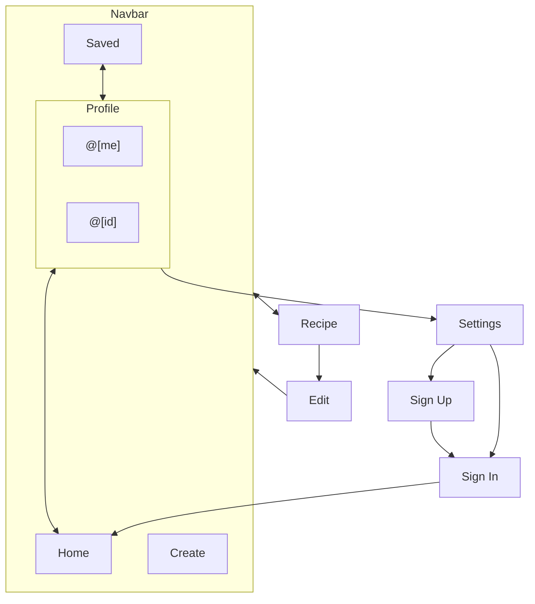

<h1 style="font-size: 3rem; font-weight: 900; text-align: center">Appetized</h1>

<div style="page-break-after: always; break-after: page;"></div>

# Analysis

## Problem Identification

Lots of young people aren't cooking for themselves. Home cooking has many
benefits like being able to choose your own ingredients to meet your dietary
requirements or being able to easily make more healthy meal choices. A possible
reason young adults aren't cooking at home is because they don’t know many
recipes that are really tasty, but also easy to make and don’t take several
hours to cook. A solution to this would be to create a recipe sharing platform
that is tailored to younger people.

I think that this problem would ideally be solved using computers because it
fits really well into the client-server topology. Recipes can be stored easily
in a database, which can then be accessed remotely over the internet. A client
could be also developed to display the recipes and provide the user a simple way
of viewing and creating recipes to be uploaded back to the server.

## Computational Methods

The problem is best solved using computational methods because any physical data
repositories can only be accessed in person. The use of an online data
repository allows anybody in the world to access the data stored in it almost
instantly. There are a number of protocols governing traffic over a network that
can be used to create an application that takes HTTP requests and responds to
them with the requested data or action, this is called a _web API_. The solution
requires a user to be able to upload and download recipes quickly and easily, to
achieve this, I will develop a website alongside the server that interacts with
the backend. The client will provide a user interface (UI) which will make
uploading and reading recipes fast and easy.

This is a better solution than a physical repository of recipes, such as a
library filled with recipe books, because of there being no physical limitations
on how many recipes can be stored, and they can be searched for, filtered and
sorted in milliseconds. The use of a database allows storage of millions of
recipes without much overhead. An 8 TB hard drive takes up 3.5 inches of space
inside a computer, but can store billions of books worth of data.

Another problem with a physical solution would be that young people tend to be
less interested in going to a library to get information, seeking it online
instead. Having the recipes be accessible on a website would allow them to do
this and the use of a native mobile wrapper would allow users to be able to
download the client from their phone’s app store.

## Target Audience

The platform would be created for young people who are seeking recipes, so they
can cook for themselves. As a result, the solution would need to be engaging for
young people. If the site does not have any recipes, people won't want to use
it, so encouraging users to upload their own recipes is essential. This can be
achieved by adding social features to the site, which will potentially drive
users to want to create the best recipes on the site, so they can get
recognition from other users. This will also help to bring users higher quality
recipes, because the best ones will be able to be more easily identified because
they have more interactions (saves, likes, follows etc.)

When tailoring a product to young people, there are several factors to consider
that may pose challenges to the adoption of the product by the target audience.
Primarily, young people almost exclusively access the internet with their
phones. As a result, I think adopting a mobile-first design philosophy would
greatly benefit the usability and quality of the application. Furthermore, the
target audience tend to use apps on their phone rather than a web browser, this
makes the capability for the product to be released on mobile app stores an
essential feature of a solution to this problem.

To summarise, the target audience of the application is young people learning to
cook for themselves.

## Existing Solutions

There are already a number of different ways young people get their recipes, and
they all seem to have unique strengths and weaknesses. To create an ideal
solution to the problem, it will be important to implement each of their
benefits, while avoiding whatever pitfalls of the existing solutions.

### Cookbooks

Recipe books are the traditional way to find recipes. They are often written
informally which can make the actual process of reading them more inviting and
engaging. Cookbooks also tend to be beginner-friendly, and the ingredients and
utensils needed are fairly accessible, this allows for people on a lower budget
to produce great food. They also contain a range of information about each
recipe, such as nutritional information, or how long it takes to prep and cook
that helps the reader pick out recipes.

Cookbooks have been around for long enough that they have a perfect balance
between readability and detail. They tend to be made up of the same elements:

- Title
- Description
- Metadata such as time of writing
- Categories the recipe falls into (e.g. cuisine, starter or main)
- Cooking and prep time
- Ingredients
- Steps and tips in chronological order

Implementing these will allow the users of the application to represent any
recipe. Additionally, allowing users to be able to search for recipes with these
categories will make it easier to find the perfect recipe.

However, young people aren’t reading physical books as much as they used to, so
even though recipe books might have the perfect format for young people, the
fact that it's a product you have to go and buy might be a deal-breaker for a
lot of the target audience. Convenience is an important thing to have in a
potential solution and having access to the recipes on a mobile phone is the
best to implement it.

Additionally, unless you go to the library, cookbooks can be quite expensive. I
think anybody should have free access to recipes, so I don’t plan to monetise
access to the recipes themselves.

### Social Media

Some people get their recipes from existing social media apps, I think this is
quite a flawed solution to the problem, however, each of the different social
media platforms have their own disadvantages.

- Instagram is a photo/video sharing app that is sometimes used to share
  recipes. The video player is limited in functionality, making it a frustrating
  experience when cooking. The length of videos on Instagram is between 3 and 60
  seconds, which means that intricate recipes are usually rushed through and
  missing vital details. There is also no way to pause or rewind, which means if
  you missed something, you have to start the video again. The discoverability
  of the recipes on Instagram is great, with the use of hashtags. I think
  hashtags aren’t the best way to categorise recipes, though, so I am going to
  be implementing more specific parameters to search for recipes. This will
  include things like cuisine, and the type of meal.

- Facebook is a more traditional social media site, where you can post text
  alongside some images. Some people also get their recipes from Facebook recipe
  pages. These pages usually post images or videos like those on Instagram
  linking to an external recipe website that they run for more detailed
  instructions. However, there isn’t a way to save or pin a recipe for later.
  Saving is an essential feature because it can be hard to find a post again. I
  am going to give users the ability to save recipes, which can be used offline
  too.

People may be using social media because it is convenient to use it on their
phone, through an app store. This, again, shows why it is important to give the
website have the capability to be deployed onto those stores.

### Recipe Blogs

Recipe blogs are another popular way to get recipes, they are usually ran by a
chef and have just their recipes. These are great for the same reasons as a
cookbook, having a personal touch.

A lot of blogs are built with a [WYSIWYG][wysiwyg] (_What You See Is What You
Get_, pronounced: “wiz-e-wig”) website editor, these can be good for beginners
because they are easy to use, and you can make a website relatively fast. There
are however, a large number of drawbacks to these editors. Primarily, WYSIWYG
sites often have terrible performance, SEO and user experience on mobile. The
slow speed results from sharing the server with a ton of other websites and the
generated code itself being poorly optimised. WYSIWYG editors also tend to not
encourage mobile-first design, making the user build the desktop site, and then
rearrange the elements to better fit mobile. Most of the time, people using
WYSIWYG editors don’t teach their users about UX, resulting in a poor
experience, especially on phones or tablets. Due to the poor performance and
layout, the SEO on generated sites is already going to be low, but there also
isn’t a way to implement advanced SEO. Google Search allows websites to give
[structured data][structured data] which allows web developers to have their
sites appear in Google’s Rich results, this is an important way to drive traffic
to a recipe blog. However, on website builders, there isn’t a way to
automatically have this data appear on your sites. On Wix, you have to
individually add structured data for each page even though its already in the
websites CMS, this is an obscure feature and most recipe bloggers won't pay
attention to it.

The blogs are also not centralised, which makes it unfeasible to implement
certain features like recipe downloading or social interactions.

Building a recipe blog from scratch can be an expensive and time-consuming
process and isn’t accessible to a lot of people. This could be solved with a
recipe sharing website that is focused on great SEO and ease of use.

---

To summarise, all the current ways that are used to get recipes have their own
unique disadvantages, which make them all not a great solution to the problem.
Recipe books can’t be used anywhere and are costly. Existing social media are
not tailored to this purpose, so they lack the specific features needed for a
good solution. Recipe blogs aren’t centralised and the tools to create a great
user experience aren’t accessible in the context of recipes. My application will
incorporate positives from existing solutions while avoiding the disadvantages
that they each have.

## Solution

The solution will be a mixture of all the great features of the existing
solutions. To achieve this, it will need to be made up of two separate
applications, a client and server. The client will provide a user interface to
create and interact with the solution’s content. The server will consist of a
database and an API which will allow the client to perform CRUD operations on
the database, given they are authorised to do so.

Development of the client will focus on accessibility and user experience (UX).
Accessibility is a key element of creating a good application, because it makes
the solution easier to use for people, especially those who are disabled. The
A11Y project provide guidelines to create a more inclusive and representative
application. Making accommodations for people who need them will allow a larger
group of people to be able to use the solution. It is also important to design a
great user experience (UX). Creating an application that is beautiful and
natural to use is an important because it will make the site more usable. To
ensure that the UX is good, when designing the user interface (UI), I will
employ mobile-first design, as I assume that the majority of the applications
users will be visiting from a phone. This ensures that the largest group of
users gets the best possible experience.

The backend will consist of a GraphQL API, as it allows me flexibility in
creating the frontend application. It will give the client the ability to
request any data from it, with filtering, sorting and searching capabilities.
This will be where the bulk of the site's authorization will go, therefore I
will also be implementing its authentication here as well.

I will create the project using the Agile software development methodology, and
therefore will be splitting the process of creating the application into
individual sprints. I will decompose the different parts of the application to
make more manageable, self-contained sections of the app. I plan to have 5
sprints:

1. Database Schema - Design and implement a database schema that is capable of
   meeting the success criteria of the project.
2. GraphQL API - Create a GraphQL API with authentication to allow creating read
   update and delete items in the database, given they are authorized to do so.
3. CDN - Implement a content delivery network to serve images to the client.
4. Email - Give the server the ability to send emails for account creation and
   recovery.
5. Client - Build out the frontend of the application

## Limitations

- The project will cost a bit of money to run, I plan to use a cloud services
  provider, like AWS, to host the project. Most cloud providers have a free
  tier, however, in the long term, there will be some minor costs associated
  with hosting the solution.
- The project is going to use some tools that I have limited experience using,
  so this may increase the amount of time that the project will take to
  complete. I plan to mitigate this by reading the documentation for the tools I
  am planning to use. This will allow me to have a good understanding of the
  different dependencies of the project, which allow me to create an optimal
  solution.
- The scope of the project is fairly large, so it may be unfeasible to finish it
  within the time constraints. By implementing the core features first, I can
  ensure that I have a minimum viable product finished before the deadline. I
  can then iterate on it to build out a more complete solution.
- I will not be able to implement some nice-to-haves, such as a recommendation
  algorithm, because alone they are similar in scope to the rest of the project.
  However, there are libraries available that implement these features that can
  be used, which can make creating a project of this size possible in the
  timeframe given.

## Requirements

### Software

**Development dependencies:** The solution will be developed in TypeScript. The
backend will be using Express, with Apollo Server, to create the API, and
Prisma, to access the database. The client will use Svelte, with the SvelteKit
meta-framework. An Amazon AWS account will be required for parts of the solution
to be able to work, like the CDN or email service. I am going to use an IDE
called WebStorm to develop the solution because of its great refactoring tools,
which will make the project easier to develop and maintain.

**Runtime dependencies:** Typescript is a superset of JavaScript, so the source
code can be transpiled into JS, which will allow the client to be hosted on a
web server and run in any browser. The backend can be run using Node.js, a
JavaScript runtime. A database will also be needed, and I am going to use MySQL
because of its full-text search capabilities.

### Hardware

I am going to be developing the solution on two different systems, my desktop
and laptop. I will be using a version control system, Git to ensure that there
aren’t conflicts when merging the code between the two systems. My desktop has a
3.6GHz processor and 16 GB of RAM. My laptop also has a 3.6GHz processor but has
8 GB of RAM.

The project won't require any specific hardware to host, due to it relying on
cloud providers. However, a user of the site will need a smartphone or computer
with a web browser to access the client. The API on its own has the same
features, but requires someone to send requests in the terminal or API client,
which is a lot less user-friendly.

### Success Criteria

| Module   | Reference | Criteria                                                                                   | Justification                                                                        | Testing                                                                                                                              |
| -------- | --------- | ------------------------------------------------------------------------------------------ | ------------------------------------------------------------------------------------ | ------------------------------------------------------------------------------------------------------------------------------------ |
| Database | 1.1.1     | Database has a table containing recipes.                                                   | Allows the storage of recipes so they can be accessed by other users.                | Can check with SQL if the table has been created.                                                                                    |
|          | 1.1.2     | The database contains a users table.                                                       | Allows for authentication to be developed.                                           | Can check with SQL if the table has been created.                                                                                    |
|          | 1.1.3     | There is a table containing ratings for recipes.                                           | Makes it so the recipes can be better sorted to make users receive better recipes.   | Can check with SQL if the table has been created.                                                                                    |
|          | 1.1.4     | A table containing users following other users exists.                                     | Avoids many to many relationships.                                                   | Can check with SQL if the table has been created.                                                                                    |
|          | 1.1.5     | A table containing users saving a recipe exists.                                           | Avoids many to many relationships.                                                   | Can check with SQL if the table has been created.                                                                                    |
|          | 1.1.6     | A table containing ingredients exists.                                                     | Avoids having duplicate values in the recipes table.                                 | Can check with SQL if the table has been created.                                                                                    |
|          | 1.1.7     | There is a table containing images.                                                        | Allows images to be owned by a user, and more easily accessible.                     | Can check with SQL if the table has been created.                                                                                    |
|          | 1.1.8     | There is a table including steps of a recipe.                                              | Avoids storing plain JSON in the database.                                           | Can check with SQL if the table has been created.                                                                                    |
| API      | 1.2.1     | Allow the user to create, read, update, and delete their own recipes on the site.          | So users can create and view their own content on the site.                          | Can query the server for these features.                                                                                             |
|          | 1.2.2     | Allow anyone to read, save and unsaved recipes on the site.                                | So users can access recipes by other users to discover new recipes to cook.          | Can query the server for these features.                                                                                             |
|          | 1.2.3     | Allow the user to create, read, update and delete their own account and profile.           | In the case that users want to change something about their profile.                 | Can query the server for these features.                                                                                             |
|          | 1.2.4     | Allow users to access other user’s profiles.                                               | So users can find recipes based on the author more easily.                           | Can query the server for these features.                                                                                             |
| Email    | 1.4.1     | A confirmation email is sent to a user on creation of their account.                       | To make sure that the user has entered their email correctly and that it exists.     | Create an account and check emails, then click the link, check the database to see if the email is verified.                         |
|          | 1.4.2     | Users can request an email containing a link that will allow them to reset their password. | If the user forgets their password or wants to reset it.                             | Can click the reset password button, and see if the email is sent, then change the password, attempt to login with the new password. |
| Client   | 2.1.1     | Recipes can be displayed.                                                                  | Essential feature of the client.                                                     | Try to load a recipe.                                                                                                                |
|          | 2.1.2     | Recipes can be edited.                                                                     | Maybe the user wants to make their recipe more detailed or tastier.                  | Try to edit a recipe, then load it to see if it has changed.                                                                         |
|          | 2.1.3     | User account can be displayed.                                                             | To make finding recipes by a certain person easier.                                  | Try to load a user’s profile.                                                                                                        |
|          | 2.1.4     | User profile can be edited.                                                                | If the user wants to change their details.                                           | Try to edit my profile and see if it changes.                                                                                        |
|          | 2.1.5     | Website is accessible.                                                                     | So a wider range of people can easily use the site.                                  | Use Google Chrome Lighthouse to see the accessibility score.                                                                         |
|          | 2.1.6     | Website has good SEO.                                                                      | To make the recipes discoverable.                                                    | Use Google Chrome Lighthouse to see the SEO score.                                                                                   |
|          | 2.1.7     | Website is performant.                                                                     | To make the site work well on mobile, ensuring it has good performance is important. | Use Google Chrome Lighthouse to see the performance score.                                                                           |
| CDN      | 2.2.1     | Users can upload images to the site                                                        | Images make the recipes more easy to follow.                                         | Try to upload an image and see if it shows up in the cloud storage providers GUI.                                                    |
|          | 2.2.2     | The location of uploaded images are stored in the site’s database.                         | So the client can get all of a recipes images.                                       | Can check if the uploaded image is in the images table with SQL.                                                                     |
|          | 2.2.3     | Images uploaded can be accessed by the client.                                             | So they can be displayed conveniently to the user.                                   | Can try to load a recipe containing an image.                                                                                        |

# Sprint 1

This first sprint will consist of designing and then creating the database for
the application. The database is the backbone of the solution, so it will need
to be thoughtfully designed. I am going to make sure that the database follows
normalization rules, to ensure that create, read, update and delete (CRUD)
operations can take place without breaking other parts of the database.

I am going to create the schema and perform CRUD operations on the database with
an object relational mapper (ORM). This will allow me to access the database in
a type-safe way, which will decrease the potential risk of bugs. The data put
into the database will also be sanitised, which will reduce the risk of critical
vulnerabilities like SQL injection. The ORM I am going to be using is called
Prisma.

## Design

<figure>
	
	<!--suppress HtmlUnknownAttribute -->
    <figcaption align="center"><b>Figure 1</b>: Entity relationship diagram of the database</figcaption>
</figure>

This is an entity relationship diagram of what the database will look like. I am
going to use join tables to make sure that the database is normalised, so CRUD
operations can take place without creating redundancies. There are a lot of
different types of data needed for the solution, so I used decomposition to
ensure that the data is appropriately linked together and split up logically
into tables.

### Initializing the project

The first step in creating the database schema is to initialise the project.

```bash
$ npm init -y
$ pnpm install -D prisma typescript prettier ts-node @types/node
$ tsc --init
$ npx prisma init
```

This will initialise the project in the current directory, and create a
`package.json` and a `tsconfig.json`, as well as install the necessary
dependencies for this sprint. A directoryUser will also be created called prisma
`prisma` which will contain a file called `schema.prisma`. This is where I will
be writing the schema for the database.

```prisma
generator client {
  provider        = "prisma-client-js"
  previewFeatures = ["fullTextSearch", "fullTextIndex"]
}

datasource db {
  provider = "mysql"
  url      = env("DATABASE_URL")
}
```

This is the contents of `schema.prisma`, generated by the `$ npx prisma init`
command. By adding different types of data to the file, a model can be created
which Prisma can use to generate a database. Prisma will also create a database
client that can be used to perform type safe CRUD operations. The client
generated by Prisma can be used by the GraphQL API to fetch and store data for
use in the client like this:

```ts
const myProfile = prisma.users.findUnique({ where: { id: "123" } }); // Gets user with ID "123"
```

The code above would get the user with the ID of ‘123’ by executing the SQL
statement:

```sql
SELECT * FROM users WHERE id = "123"
```

### Decomposition

The database will need to be split into different tables, so that the data can
have relationships and to maintain the normalisation of the database.

There will need to be a table for each user, a table for each recipe, a table
for each ingredient, step and image.

An example of a relationship is that a user can have many recipes, and a recipe
can have many ingredients, steps and images.

## Algorithms

Sprint 1 is very focussed on storage and as a result, the sprint doesn't have
any notable algorithms.

### Important Variables and Data Structures

There will only be one variable created in this whole sprint, `prisma`, it will
be the database client. This variable will be exported, so it can be accessed in
other file.

The schema itself also falls under this header. There will be quite a few
tables:

- `users`: This table will contain all the users that are registered in the
  application.
  - `id`: This is the primary key for the table. (Unique string)
  - `name`: This is the name of the user. (Optional string)
  - `email`: This is the email of the user. (Unique string)
  - `password`: This is a hash of the user's password. (String)
  - `profilePicture`: This is the URL of the user's profile picture. (Optional
    Image)
  - `createdAt`: This is the date the user was created. (Date)
  - `emailVerified`: This is a boolean that indicates whether the user has
    verified their email. (Boolean)
  - `recipes`: This is a list of recipes that the user has created. (List of
    Recipe)
  - `saved`: This is a list of recipes that the user has saved. (List of Recipe)
  - `following`: This is a list of users that the user is following. (List of
    User)
  - `followers`: This is a list of users that are following the user. (List of
    User)
  - `iat`: This is the date that the most recent valid authentication token was
    issued. (Date)
- `recipes`: This table will contain all the recipes that are uploaded by the
  users.
  - `id` This is the primary key for the table. (Unique string)
  - `name` This is the title of the recipe. (String)
  - `author` This is the account that created the recipe. (User)
  - `authorId` This is the ID of the account that created the recipe. (String)
  - `description` This is the description of the recipe. (Optional string)
  - `image` This is an image of the recipe. (Optional Image)
  - `imageId` This is the ID of the image. (Unique string)
  - `createdAt` This is the date the recipe was created. (Date)
  - `steps` This is a list of steps that make up the recipe. (List of Step)
  - `category` This is the category (For example: breakfast, starter, etc.).
    (Optional string)
  - `cuisine` This is the cuisine of the recipe. (Optional string)
  - `ingredients` This is a list of ingredients that are used in the recipe.
    (List of Ingredient)
  - `cookTime` This is the amount of time it takes to cook the recipe. (Optional
    integer)
  - `prepTime` This is the amount of time it takes to prepare the recipe.
    (Optional integer)
  - `savedBy` This is a list of users that have saved the recipe. (List of User)
- `ingredients`: This table will contain all the ingredients that are used in
  the recipes.
  - `id` This is the primary key for the table. (Unique string)
  - `name` This is the name of the ingredient. (String)
  - `quantity` This is the quantity of the ingredient. (String)
  - `recipe` This is the recipe that the ingredient is used in. (Recipe)
  - `recipeId` This is the ID of the recipe that the ingredient is used in.
    (String)
- `images`: This table will contain all the images that are used across the
  solution.
  - `id` This is the primary key for the table. (Unique string)
  - `url` This is the URL of the image. (String)
  - `recipe` This is the recipe that the image is used in. (Optional recipe)
  - `step` This is the step that the image is used in. (Optional step)
  - `profile` This is the profile that the image is used in. (Optional User)
  - `userId` This is the ID of the user's profile that the image is used in.
    (Optional string)
- `steps`: This table will contain each step of the recipe.
  - `id` This is the primary key for the table. (Unique string)
  - `name` This is the name of the step. (Optional string)
  - `createdAt` This is the date the step was created. (Date)
  - `content` This is the content of the step. (String)
  - `image` This is an image of the step. (Optional Image)
  - `imageId` This is the ID of the image. (Optional string)
  - `recipe` This is the recipe that the step is used in. (Recipe)
  - `recipeId` This is the ID of the recipe that the step is used in. (String)

### Validation

The database won't be public facing because it contains sensitive information,
which is why I am developing the API in the first place. As a result validation
is not strictly necessary, however, I will add some basic validation, such as
unique and required constraints. This is because they are easier to implement on
the data layer than on the application layer.

In Prisma, constrains are added in the schema by writing attributes. Attributes
sit at the end of the field definition. For example, unique constraints are
added by writing `@unique` after the field.

### Testing

This sprint's testing is going to be limited relative to the other sprints. This
is because the database on its own can't do that much other than basic CRUD
operations. As a result, I will create some basic integration tests to make sure
that the database is working as expected. This will use Docker Compose to spin
up a local database and then run a suite of tests against it.

The test suite will consist of a few users and recipes being created. These can
then have some different operations run on them to ensure that the database is
working as expected.

## Development

I ran the previously mentioned commands, and it outputted the following:

```bash
$ npm init -y
```

```bash
$ pnpm install -D prisma typescript prettier ts-node @types/node

```

```bash
$ tsc --init
```

```bash
$ npx prisma init

✔ Your Prisma schema was created at prisma/schema.prisma
  You can now open it in your favorite editor.

Next steps:
1. Set the DATABASE_URL in the .env file to point to your existing database. If your database has no tables yet, read https://pris.ly/d/getting-started
2. Set the provider of the datasource block in schema.prisma to match your database: postgresql, mysql, sqlite, sqlserver or mongodb (Preview).
3. Run prisma db pull to turn your database schema into a Prisma schema.
4. Run prisma generate to generate the Prisma Client. You can then start querying your database.

More information in our documentation:
https://pris.ly/d/getting-started
```

As you can see, `npx prisma init` has outputted the next steps to follow when
creating the schema. It has also created a file named `.env`. A `.env` file
contains environmental variables, such as API keys, or in this case, the
database’s connection URL. I also created a file named `.gitignore`, which tells
the version control system, git, to ignore the specified files. I included
`.env` in the `.gitignore` because the database URL needs to stay private
because publicising it could lead to the database being compromised.
Accidentally committing the file to the version history could make it easier to
leak sensitive information. I also included the `.idea/` and `node_modules/`
directories in the `.gitignore` file. `.idea/` contains configuration files
specific to the local instance of the IDE I’m using. `node_modules/` contains
the dependencies of the project, the reason I am telling git to ignore them is
because they will be built locally from the source code when first getting the
project running locally, so including them is unnecessary.

I also needed to import the prisma client the TypeScript project:

```ts
export const prisma = new PrismaClient();
```

Next, I set the database provider in the `schema.prisma`, I set this to “mysql”.
I also added the line `previewFeatures = ["fullTextSearch", "fullTextIndex"]` to
enable the use of full text search within Prisma.

Finally, I wrote the schema in the same file, here it what I wrote:

```prisma
generator client {
  provider        = "prisma-client-js"
  previewFeatures = ["fullTextSearch", "fullTextIndex"]
}

datasource db {
  provider = "mysql"
  url      = env("DATABASE_URL")
}

model User {
  id             String   @id @default(uuid())
  name           String?
  username       String   @unique
  email          String   @unique
  password       String
  profilePicture Image?
  createdAt      DateTime @default(now())
  emailVerified  Boolean
  recipes        Recipe[] @relation("author")
  saved          Recipe[] @relation("save")
  following      User[]   @relation("follow")
  followers      User[]   @relation("follow")
  iat            Int?     @default(0)

  @@fulltext([username])
  @@fulltext([username, name])
}

model Image {
  id      String  @id @default(uuid())
  url     String
  recipe  Recipe?
  step    Step?
  profile User?   @relation(fields: [userId], references: [id])
  userId  String?
}

model Recipe {
  id          String       @id @default(uuid())
  name        String
  author      User         @relation("author", fields: [authorId], references: [id])
  authorId    String
  description String?
  image       Image?       @relation(fields: [imageId], references: [id])
  imageId     String?      @unique
  createdAt   DateTime     @default(now())
  steps       Step[]
  category    String?
  cuisine     String?
  ingredients Ingredient[]
  cookTime    Int?
  prepTime    Int?
  savedBy     User[]       @relation("save")

  @@fulltext([name, description])
  @@fulltext([name, description, cuisine, category])
}

model Step {
  id        String   @id @default(uuid())
  name      String?
  createdAt DateTime @default(now())
  content   String
  image     Image?   @relation(fields: [imageId], references: [id])
  imageId   String?  @unique
  recipe    Recipe?  @relation(fields: [recipeId], references: [id])
  recipeId  String?

  @@fulltext([name, content])
}

model Ingredient {
  id       String  @id @default(uuid())
  name     String
  quantity String
  recipe   Recipe? @relation(fields: [recipeId], references: [id])
  recipeId String  @unique

  @@fulltext([name])
}

```

When the command `npx prisma db push` is run, Prisma will generate the SQL
needed to implement this schema in MySQL. Next, it will execute the SQL and
generate the database client:

```bash
✔ Generated Prisma Client (3.8.1 | library) to ./node_modules/@prisma/client in 224ms
```

## Testing

Initially, I wanted to check that the real database had been successfully
created. I connected to the database using the `mysql` command line tool, and I
checked that the database had been created:

```bash
$ mysql
mysql> show databases;
+--------------------+
| Database           |
+--------------------+
| information_schema |
| mysql              |
| performance_schema |
| railway            |
| sys                |
+--------------------+
5 rows in set (0.18 sec)
```

Now that I knew the database was successfully created, it was now a good time to
write the integration tests. As mentioned, I am going to be using Docker Compose
to run a local database, which will then be tested against. To do this, we will
need to create a Docker Compose file. This will be named `docker-compose.yml`
and will be located in the root of the project. The file will look like this:

```yml
version: "3"

services:
  db:
    image: mysql:5.7
    environment:
      MYSQL_ROOT_PASSWORD: test
      MYSQL_DATABASE: test
    ports:
      - "3306:3306"
    volumes:
      - ./db:/var/lib/mysql
    restart: always
    networks:
      - default
```

Then I needed to start the database using `docker-compose up -d`. After it
starts I need to get the ID of the container by running `docker ps`. Then I can
finally connect to the database with:

```bash
$ sudo docker exec -it ecf3bb60f406 mysql -p
```

I then enter the password for the database (`test`) and I can run the command
`show databases;` to check that the database has been created.

```bash
mysql> show databases;
+--------------------+
| Database           |
+--------------------+
| information_schema |
| mysql              |
| performance_schema |
| sys                |
| test               |
+--------------------+
5 rows in set (0.00 sec)
```

Now I know that the database for testing and development are both working, I
need to write a script that will run the tests. This can be placed in the
`scripts` section of the `package.json` file. The script will look like this:

```json
{
  "scripts": {
    "test": "docker-compose up -d && pnpm migrate:test && dotenv -e .env.test nyc --include=['src/schema/*.ts'] ts-mocha ./test/**.test.ts  && docker-compose down",
    "migrate:test": "dotenv -e .env.test -- npx prisma migrate dev --name test"
  }
}
```

I then need to create a `.env.test` file. This file will contain the database
connection information.

Now I can create the file `test/prisma.test.ts` and start writing the tests.
This file will contain tests written with the mocha framework, alongside chai
assertions. To install mocha, I can run:

```bash
$ pnpm i -D mocha chai @types/mocha @types/chai ts-node dotenv-cli nyc
```

The `ts-node` and `dotenv-cli` packages are used to run the tests. The
`dotenv-cli` package is used to load the `.env.test` and `.env` files, depending
on if the test is being run in a development or test environment. The `ts-node`
package is used to run the tests in TypeScript. The `nyc` package is used to
report the coverage of the tests.

Now to the tests themselves, they will each execute a CRUD operation on the
database, 3 for each model. Here they are:

```ts
import prisma from "../src/prisma";
import { expect } from "chai";

describe("Prisma", function () {
  describe("user", function () {
    beforeEach(async () => {
      // Clear the database
      await prisma.image.deleteMany({});
      await prisma.ingredient.deleteMany({});
      await prisma.step.deleteMany({});
      await prisma.recipe.deleteMany({});
      await prisma.user.deleteMany({});

      // Create a test suite
      await prisma.user.createMany({
        data: [
          {
            email: "lu@developer.lu",
            password: "password",
            name: "Lu",
            username: "hiluw",
            emailVerified: false,
          },
          {
            email: "heidi@developer.lu",
            password: "password",
            name: "Heidi",
            username: "dee",
            emailVerified: true,
          },
        ],
      });
    });

    afterEach(async () => {
      await prisma.image.deleteMany({});
      await prisma.ingredient.deleteMany({});
      await prisma.step.deleteMany({});
      await prisma.recipe.deleteMany({});
      await prisma.user.deleteMany({});
    });

    it("should create a new user", async function () {
      await prisma.user.create({
        data: {
          name: "John",
          username: "xXJohnXx",
          email: "john@example.com",
          password: "password",
          emailVerified: true,
        },
      });

      const users = await prisma.user.findMany({});

      expect(users).to.have.length(3);
    });

    it("should edit a user", async function () {
      const user = await prisma.user.findUnique({
        where: {
          username: "hiluw",
        },
      });

      const { id } = await prisma.user.update({
        where: {
          id: user?.id,
        },
        data: {
          username: "aoeu",
        },
      });

      const updatedUser = await prisma.user.findUnique({
        where: {
          id,
        },
      });

      expect(updatedUser?.username).to.equal("aoeu");
    });
    it("should delete a user", async function () {
      const user = await prisma.user.findUnique({
        where: {
          username: "hiluw",
        },
      });

      await prisma.user.delete({
        where: {
          id: user?.id,
        },
      });

      const users = await prisma.user.findMany({});

      expect(users).to.have.length(1);
    });
  });
  describe("recipe", function () {
    beforeEach(async () => {
      // Clear the database
      await prisma.image.deleteMany({});
      await prisma.ingredient.deleteMany({});
      await prisma.step.deleteMany({});
      await prisma.recipe.deleteMany({});
      await prisma.user.deleteMany({});

      // Create a test suite
      await prisma.user.createMany({
        data: [
          {
            email: "lu@developer.lu",
            password: "password",
            name: "Lu",
            username: "hiluw",
            emailVerified: false,
          },
          {
            email: "heidi@developer.lu",
            password: "password",
            name: "Heidi",
            username: "dee",
            emailVerified: true,
          },
        ],
      });

      await prisma.recipe.create({
        data: {
          name: "Bacon and Eggs",
          description: "A classic",
          author: {
            connect: {
              username: "hiluw",
            },
          },
        },
      });
      await prisma.recipe.create({
        data: {
          name: "Sausage and Beans",
          description: "Another classic",
          author: {
            connect: {
              username: "dee",
            },
          },
        },
      });
    });

    afterEach(async () => {
      await prisma.image.deleteMany({});
      await prisma.ingredient.deleteMany({});
      await prisma.step.deleteMany({});
      await prisma.recipe.deleteMany({});
      await prisma.user.deleteMany({});
    });

    it("should create a new recipe", async function () {
      await prisma.recipe.create({
        data: {
          name: "Bacon and Eggs",
          description: "A classic",
          author: {
            connect: {
              username: "hiluw",
            },
          },
        },
      });

      const recipes = await prisma.recipe.findMany({});
      expect(recipes).to.have.length(3);
    });
    it("should edit a recipe", async function () {
      const recipe = await prisma.recipe.findFirst({});

      const { id } = await prisma.recipe.update({
        where: {
          id: recipe?.id,
        },
        data: {
          name: "Bacon and Beans",
        },
      });

      const updatedRecipe = await prisma.recipe.findUnique({
        where: {
          id,
        },
      });

      expect(updatedRecipe?.name).to.equal("Bacon and Beans");
    });
    it("should delete a recipe", async function () {
      const recipe = await prisma.recipe.findFirst({});

      await prisma.recipe.delete({
        where: {
          id: recipe?.id,
        },
      });

      const recipes = await prisma.recipe.findMany({});

      expect(recipes).to.have.length(1);
    });
  });
  describe("step", function () {
    beforeEach(async () => {
      // Clear the database
      await prisma.image.deleteMany({});
      await prisma.ingredient.deleteMany({});
      await prisma.step.deleteMany({});
      await prisma.recipe.deleteMany({});
      await prisma.user.deleteMany({});

      // Create a test suite
      await prisma.user.createMany({
        data: [
          {
            email: "lu@developer.lu",
            password: "password",
            name: "Lu",
            username: "hiluw",
            emailVerified: false,
          },
          {
            email: "heidi@developer.lu",
            password: "password",
            name: "Heidi",
            username: "dee",
            emailVerified: true,
          },
        ],
      });

      await prisma.recipe.create({
        data: {
          name: "Bacon and Eggs",
          description: "A classic",
          author: {
            connect: {
              username: "hiluw",
            },
          },
        },
      });
      await prisma.recipe.create({
        data: {
          name: "Sausage and Beans",
          description: "Another classic",
          author: {
            connect: {
              username: "dee",
            },
          },
        },
      });
    });

    afterEach(async () => {
      await prisma.image.deleteMany({});
      await prisma.ingredient.deleteMany({});
      await prisma.step.deleteMany({});
      await prisma.recipe.deleteMany({});
      await prisma.user.deleteMany({});
    });

    it("should create a new step", async function () {
      const [{ id }] = await prisma.recipe.findMany({});

      await prisma.step.create({
        data: {
          content: "Step 1",
          recipe: {
            connect: { id },
          },
        },
      });

      const steps = await prisma.step.findMany({});
      expect(steps).to.have.length(1);
    });

    it("should edit a step", async function () {
      const [{ id: recipeId }] = await prisma.recipe.findMany({});

      // create the step
      const step = await prisma.step.create({
        data: {
          content: "Step 1",
          recipe: {
            connect: {
              id: recipeId,
            },
          },
        },
      });

      const { id: stepId } = await prisma.step.update({
        where: {
          id: step?.id,
        },
        data: {
          content: "Step 2",
        },
      });

      const updatedStep = await prisma.step.findUnique({
        where: {
          id: stepId,
        },
      });

      expect(updatedStep?.content).to.equal("Step 2");
    });
    it("should delete a step", async function () {
      const [{ id: recipeId }] = await prisma.recipe.findMany({});

      // create the step
      const step = await prisma.step.create({
        data: {
          content: "Step 1",
          recipe: {
            connect: {
              id: recipeId,
            },
          },
        },
      });

      await prisma.step.delete({
        where: {
          id: step?.id,
        },
      });

      const steps = await prisma.step.findMany({});
      expect(steps).to.have.length(0);
    });
  });
  describe("ingredient", function () {
    beforeEach(async () => {
      // Clear the database
      await prisma.image.deleteMany({});
      await prisma.ingredient.deleteMany({});
      await prisma.step.deleteMany({});
      await prisma.recipe.deleteMany({});
      await prisma.user.deleteMany({});

      // Create a test suite
      await prisma.user.createMany({
        data: [
          {
            email: "lu@developer.lu",
            password: "password",
            name: "Lu",
            username: "hiluw",
            emailVerified: false,
          },
          {
            email: "heidi@developer.lu",
            password: "password",
            name: "Heidi",
            username: "dee",
            emailVerified: true,
          },
        ],
      });

      await prisma.recipe.create({
        data: {
          name: "Bacon and Eggs",
          description: "A classic",
          author: {
            connect: {
              username: "hiluw",
            },
          },
        },
      });
      await prisma.recipe.create({
        data: {
          name: "Sausage and Beans",
          description: "Another classic",
          author: {
            connect: {
              username: "dee",
            },
          },
        },
      });
    });

    afterEach(async () => {
      await prisma.image.deleteMany({});
      await prisma.ingredient.deleteMany({});
      await prisma.step.deleteMany({});
      await prisma.recipe.deleteMany({});
      await prisma.user.deleteMany({});
    });

    it("should create a new ingredient", async function () {
      const [{ id }] = await prisma.recipe.findMany({});

      await prisma.ingredient.create({
        data: {
          name: "Bacon",
          quantity: "1",
          recipe: {
            connect: { id },
          },
        },
      });

      const ingredient = await prisma.ingredient.findMany({});
      expect(ingredient).to.have.length(1);
    });

    it("should edit an ingredient", async function () {
      const [{ id: recipeId }] = await prisma.recipe.findMany({});

      // create the step
      const ingredient = await prisma.ingredient.create({
        data: {
          name: "Bacon",
          quantity: "1",
          recipe: {
            connect: {
              id: recipeId,
            },
          },
        },
      });

      const { id: ingredientId } = await prisma.ingredient.update({
        where: {
          id: ingredient?.id,
        },
        data: {
          name: "Crispy Bacon",
        },
      });

      const updatedStep = await prisma.step.findUnique({
        where: {
          id: ingredientId,
        },
      });

      expect(updatedStep?.content).to.equal("Crispy Bacon");
    });
    it("should delete an ingredient", async function () {
      const [{ id: recipeId }] = await prisma.recipe.findMany({});

      // create the step
      const ingredient = await prisma.ingredient.create({
        data: {
          name: "Bacon",
          quantity: "1",
          recipe: {
            connect: {
              id: recipeId,
            },
          },
        },
      });

      await prisma.ingredient.delete({
        where: {
          id: ingredient?.id,
        },
      });

      const ingredients = await prisma.ingredient.findMany({});
      expect(ingredients).to.have.length(0);
    });
  });
});
```

Now I can run the tests to see if everything works.

```bash
$ sudo pnpm test
```

The reason I used the `sudo` command is because starting up the database
requires superuser privileges. The result of that command looks like this.

```bash
  Prisma
    user
      ✔ should create a new user
      ✔ should edit a user
      ✔ should delete a user
    recipe
      ✔ should create a new recipe
      ✔ should edit a recipe
      ✔ should delete a recipe
    step
      ✔ should create a new step
      ✔ should edit a step
      ✔ should delete a step
    ingredient
      ✔ should create a new ingredient
      1) should edit an ingredient
      ✔ should delete an ingredient


  11 passing (575ms)
  1 failing

  1) Prisma
       ingredient
         should edit an ingredient:
     AssertionError: expected undefined to equal 'Crispy Bacon'
      at Context.<anonymous> (test/prisma.test.ts:455:36)


-----------|---------|----------|---------|---------|-------------------
File       | % Stmts | % Branch | % Funcs | % Lines | Uncovered Line #s
-----------|---------|----------|---------|---------|-------------------
All files  |     100 |      100 |     100 |     100 |
 prisma.ts |     100 |      100 |     100 |     100 |
-----------|---------|----------|---------|---------|-------------------
 ELIFECYCLE  Test failed. See above for more details.

```

As you can see, one of the tests failed. I can see that the
`should edit an ingredient` test failed because the test case was written
incorrectly. I have updated a part of that test case to make it pass:

```ts
const updatedIngredient = await prisma.ingredient.findUnique({
  where: {
    id: ingredientId,
  },
});

expect(updatedIngredient?.name).to.equal("Crispy Bacon");
```

Now if I run the tests again, I can see that the test case passed. All the tests
have now passed meaning that the code is working as expected, as a result, the
sprint is complete, so the code can be committed to the repository.

## Evaluation

This sprint has been successfully completed, here are the success criteria that
have been finished:

| Reference | Criteria                                                           |     Testing      | Completion |
| :-------: | ------------------------------------------------------------------ | :--------------: | :--------: |
|   1.1.1   | Database has a table containing recipes.                           | All tests passed |     ✅     |
|   1.1.2   | The database contains a users table.                               | All tests passed |     ✅     |
|   1.1.3   | There is a table containing ratings for recipes.                   | All tests passed |     ✅     |
|   1.1.4   | A table containing users following other users exists.             | All tests passed |     ✅     |
|   1.1.5   | A table containing ingredients exists.                             | All tests passed |     ✅     |
|   1.1.6   | A table containing users saving a recipe exists.                   | All tests passed |     ✅     |
|   1.1.7   | There is a table containing images.                                | All tests passed |     ✅     |
|   1.1.8   | There is a table including steps of a recipe.                      | All tests passed |     ✅     |
|   2.2.2   | The location of uploaded images are stored in the site’s database. |       N/A        |     ❎     |

All of this sprint’s finished success criteria are similar, so I will discuss
them as one. They have been successful, as the database is now up and running
along with the database client. Now the database has been created, it will be
possible to start creating the GraphQL API. 2.2.2 is now able to be completed,
however I want to implement this later on, because it will be more appropriate
to develop alongside the other parts of the CDN.

### Maintainability

The database has been created in a way where performing CRUD operations won't
break dependent columns. Tables and rows can also be added or deleted without
having to reset the database, so it is maintainable to a reasonable extent. If
the database is further normalised, it would be more maintainable, however, it
would make it more difficult to use, so I think that I have struck a good
balance between usability and maintainability.

### Limitations

From my testing the database seems quite slow and more advanced Postgres
features like indexes are not yet possible with Prisma. I may have to later
create migration files to be able to speed up the database to a more acceptable
level. Additionally, the database on its own is not a good solution to the
problem, it has no authorization or authentication, and its validation is very
limited, because I plan to implement those on the application tier, rather than
the data tier.

# Sprint 2

I am going to spend the second sprint developing the API. I will need to develop
authentication and authorization, as well as make important decisions
surrounding the structure of the client, as it will rely on this sprints work
heavily.

## Design

An application programming interface (API) is a set of methods and protocols
that allow two applications to interact with each other. As the solution is
using the client-server architecture, the API will be used to allow the two
different sides to communicate with each other. This is an essential part of the
solution, because it gives the client access to read or edit the information
stored in the database. It also allows authorization to be more easily
implemented, because the API will be able to issue tokens to the client, and the
client will be able to use these tokens to authenticate.

There are two main ways to implement an API, one is using GraphQL, and the other
is using REST. A key difference between REST and GraphQL is that REST is bade up
of several distinct endpoints, each serving a different purpose. GraphQL is
instead designed to be a single endpoint, which is a combination of multiple
queries and mutations. These queries and mutations are then accessed by the
client with the GraphQL query language. A good analogy I use to describe them is
that REST is a restaurant with a strict menu and GraphQL is a buffet. Therefore,
GraphQL a very powerful way to access data from the database, as it allows for
more complex queries to be made, and allows for the client to be more flexible.
The main advantages of REST over GraphQL are that it is easier to implement, and
has better error handling. However, I am going to go with GraphQL, as it is more
flexible, giving the client more control over the data it is accessing. This
will ensure that unneeded data is not being sent to the client, which will
reduce the bandwidth used. It also ensures that loading times on the client are
reduced, and the database is not being accessed too often.

A GraphQL API is made up of a schema, which contains different types of data
available to the client. The schema is made up of two parts the type definitions
and the resolvers. The type definitions describe the different fields which are
available to the client, and the resolvers are functions that process the
requests made for those fields.

There are two different ways GraphQL is being implemented in TypeScript, one is
using the schema-first approach, and the other is using a code-first approach.
Schema driven development is the first way GraphQL was implemented, and is more
easily readable and writable. Code-first development is more difficult to read
and write, but tends to be more type safe. I am going to go with the
schema-first approach, because the extra time spent on writing the more type
safe code-first schema could instead be used on writing type declarations, which
achieves the same purpose, but is more readable.

The GraphQL server I am going to use is Apollo, which is a schema-first
implementation of GraphQL in JavaScript. Apollo Server has the added benefit of
being able to be used with Express.js, a popular Node.js framework. This will
allow me to manage the requests and responses sent through the API more easily,
allowing for me to use cookies for authentication.

In Apollo, there is the option to pass an object to the context parameter, which
is used to pass data to the resolvers. I will use this to give resolvers the
authentication status of the user, as well as the status of the request and the
response. This will allow the solution a more flexible way of handling different
kinds of requests like authentication, and I will use this to great effect.

### Schema

The schema is a very important part of the solution. The whole client will rely
on it to hydrate the page with data, and make edits. As a result, I am going to
be very careful with the planning of it because making breaking changes to it
later down the line will cause the client to need to be updated in several
places. Additionally, the schema won't match the database exactly because the
database contains sensitive information, such as password hashes. Therefore, I
am going to have to design a schema and consider each field carefully.

#### Type Definitions

The type definitions are the different types of data that are available to the
client. I will need to create a type for each table in the database.
Additionally, I will need to add two extra types, `Query` and `Mutation`. The
query and mutation types define the actual requests and responses that the API
will be able to make. A query is a request for data, which doesn't change any
data stored on the server. A mutation, on the other hand, is a request to change
data on the server.

The first type definition I am going to write is the `User` type. This type will
contain publicly available information pertaining to a user of the site. As I
mentioned, certain database columns will not be included in the API, such as the
user's password hash, their email address, and the expiration date of their
tokens. This is private information, and therefore, I am not going to include it
in the API. The columns that I am going to include are:

- `id`: The ID of the user. This will be useful for requesting data about the
  user in other queries.
- `username`: The username of the user. This will be used to log in to the site,
  and can be used in place of the ID to request data about the user.
- `name`: The name of the user. This is an optional field and is used to display
  the user's name in a more personal way.
- `profilePicture`: This will contain the image used as their profile picture.
  This is also an optional field.
- `createdAt`: The date and time that the user was created. This can be used to
  sort users by their creation date.
- `recipes`: This will contain the recipes that the user has created.
- `savedRecipes`: This will contain the recipes that the user has saved. This
  will be used on the client to download recipes in local storage. Having this
  information in the database will make it easier to sync this across devices.
- `following`: This will contain the users that the user is following.
- `followers`: This will contain the users that are following the user.

The fields that return an array of data, `recipes`, `savedRecipes`, `following`
and `followers` will take parameters when they are called. These parameters will
be used to perform cursor based pagination on the data that is returned. The
parameters will be `take`, `from`, and `sort`. The `take` parameter will be used
to specify how many items to return. The `from` parameter will take the ID that
the data returned should start from. The `sort` parameter will take an object
that tells the server how to sort the data. Cursor based pagination is a very
common way of paginating data, and I am going to use it because it is easy to
implement, and for the number of records being used in this solution, it is the
most efficient way of paginating. The `recipes` and `savedRecipes` will return
the type `RecipeResponse`, which is a union of `Recipe` and `Error`. The
`following` and `followers` will return the type `UserResponse`, which is a
union of `User` and `Error`.

The next type definition is going to be `Image`. This will contain the
information needed to display an image on the client. The fields that I am going
to include are:

- `id`: The ID of the image. This will be used to request data about the image
  in other queries.
- `url`: The URL of the image. This will be used to display the image on the
  client.
- `uploader`: The user that uploaded the image. This is only used when the image
  is a profile picture.
- `recipe`: The recipe that the image is associated with. This is only used when
  the image is used in a recipe.
- `step`: The step that the image is associated with. This is only used when the
  image is used in a specific step in a recipe.

The resolvers for `Image` will not be implemented in this sprint. This is
because image handling is being implemented later on in the project. However, I
think that creating the type definition for `Image` should be done now, so that
I don't have to implement breaking changes in the schema later on.

The next type definition is going to be `Recipe`. This will contain the
information about a recipe on the site. The fields that I am going to include
are:

- `id`: The ID of the recipe. This will be used to request data about the recipe
  in other queries.
- `name`: This is going to be the title of the recipe.
- `author`: The user that created the recipe.
- `description`: This is going to be the description of the recipe.
- `image`: This will contain the image that is display with the recipe.
- `createdAt`: The date and time that the recipe was created. This can be used
  to sort recipes by their creation date.
- `steps`: This will contain the steps that the recipe has.
- `category`: This will contain the category that the recipe belongs to (e.g.
  "Dinner", "Starter").
- `cuisine`: This will contain the cuisine that the recipe belongs to (e.g.
  "Italian", "American").
- `ingredients`: This will contain the ingredients that the recipe uses.
- `cookTime`: This will contain the amount of time it takes to cook the recipe.
- `prepTime`: This will contain the amount of time it takes to prepare the
  recipe.
- `savedBy`: This will contain the users that have saved the recipe.

The recipe type also has some fields that return an array, `savedBy`,
`ingredients` and `steps`. These fields will take parameters when they are
called. These parameters will be `take`, `from`, and `sort`. These parameters
act in the same way as in the `User` type. The `savedBy` field will return a
`UserResponse` type, which is a union of `User` and `Error` . The `ingredients`
will return a `IngredientResponse` type, which is a union of `Ingredient` and
`Error`. The `steps` will return a `StepResponse` type, which is a union of
`Step` and `Error`.

The next type definition will be `Step`. This will contain the data used in each
step of a recipe. The fields that I am going to include are:

- `id`: The ID of the step. This will be used to request data about the step in
  other queries.
- `name`: This will be the name of the step.
- `createdAt`: The date and time that the step was created. This can be used to
  sort steps by their creation date.
- `content`: This will contain the content of the step.
- `image`: This will contain the image that is associated with the step.
- `recipe`: This will contain the recipe that the step is associated with.

The next type definition will be `Ingredient`. This will contain the data used
in each ingredient of a recipe. The fields that I am going to create are:

- `id`: The ID of the ingredient. This will be used to request data about the
  ingredient in other queries.
- `name`: This will be the name of the ingredient.
- `quantity`: This will be the quantity of the ingredient.
- `recipe`: This will contain the recipe that the ingredient is associated with.

Next, I will create the `Error` type. This will be used to return errors to the
client. The fields that I am going to include are:

- `code`: This will contain the error code.
- `message`: This will contain the error message.

Next, I will create the `Query` type. This will contain all the queries that the
client can make. The fields that I am going to include are:

- `user`: given an ID or username, this will return the user with that ID or
  username. If neither of these parameters are given, this will return the
  currently logged-in user. This will return a `UserResponse` type, which is a
  union of `User` and `Error`.
- `image`: given an ID, this will return the image with that ID. This will
  return a `ImageResponse` type, which is a union of `Image` and `Error`.
- `recipe`: given an ID, this will return the recipe with that ID. This will
  return a `RecipeResponse` type, which is a union of `Recipe` and `Error`.
- `step`: given an ID, this will return the step with that ID. This will return
  a `StepResponse` type, which is a union of `Step` and `Error`.
- `ingredient`: given an ID, this will return the ingredient with that ID. This
  will return a `IngredientResponse` type, which is a union of `Ingredient` and
  `Error`.

- `users`: this will return all the users in the database if no parameters are
  given. The parameters will be `query`, `take`, `from`, and `sort`. These allow
  the client to search for users by their name or username, and perform
  pagination.
- `recipes`: this will return all the recipes in the database if no parameters
  are given. The parameters will be `query`, `take`, `from`, and `sort`. These
  allow the client to search for recipes, and perform pagination.
- `steps`: this will return all the steps in the database if no parameters are
  given. The parameters will be `query`, `take`, `from`, and `sort`. These allow
  the client to search for steps, and perform pagination.
- `ingredients`: this will return all the ingredients in the database if no
  parameters are given. The parameters will be `query`, `take`, `from`, and
  `sort`. These allow the client to search for ingredients, and perform
  pagination.

Next, I will create the `Mutation` type. This will contain all the mutations
that the client can make. The fields that I am going to include are:

- `createUser`: this will create a new user. The parameters will be `user`,
  which will be the type `CreateUserInput`, and `image` which will be of the
  type `ImageInput`. This will return a `UserResponse` type, which is a union of
  `User` and `Error`.
- `loginUser`: this will log in a user. The parameters will be `usernameOrEmail`
  and`password`. This will return a `UserResponse` type, which is a union of
  `User` and `Error`.
- `logoutUser`: this will log out the currently logged-in user. This will return
  a bool.
- `editUser`: this will edit the currently logged-in user. The parameters will
  be `user`, which will be the type `EditUserInput`, and `image` which will be
  of the type `ImageInput`. This will return a `UserResponse` type, which is a
  union of `User` and `Error`.
- `deleteUser`: this will delete the currently logged-in user. This will return
  a bool.
- `followUser`: this will follow the user with the given ID. The parameters will
  be `id`. This will return a `UserResponse` type, which is a union of `User`
  and `Error`.
- `unfollowUser`: this will unfollow the user with the given ID. The parameters
  will be `id`. This will return a `UserResponse` type, which is a union of
  `User` and `Error`.
- `createRecipe`: this will create a new recipe. The parameters will be
  `recipe`, which will be the type `CreateRecipeInput`, and `image` which will
  be of the type `ImageInput`. This will return a `RecipeResponse` type, which
  is a union of `Recipe` and `Error`.
- `editRecipe`: this will edit the recipe with the given ID. The parameters will
  be `id`, `recipe`, which will be the type `EditRecipeInput`, and `image` which
  will be of the type `ImageInput`. This will return a `RecipeResponse` type,
  which is a union of `Recipe` and `Error`.
- `deleteRecipe`: this will delete the recipe with the given ID. The parameters
  will be `id`. This will return a bool.
- `saveRecipe`: this will save the recipe with the given ID. The parameters will
  be `id`. This will return a bool.
- `unsaveRecipe`: this will un save the recipe with the given ID. The parameters
  will be `id`. This will return a bool.
- `createStep`: this will create a new step. The parameters will be `step`,
  which will be the type `StepInput`, and `image` which will be of the type
  `ImageInput`. This will return a `StepResponse` type, which is a union of
  `Step` and `Error`.
- `editStep`: this will edit the step with the given ID. The parameters will be
  `id`, `step`, which will be the type `StepInput`, and `image` which will be of
  the type `ImageInput`. This will return a `StepResponse` type, which is a
  union of `Step` and `Error`.
- `deleteStep`: this will delete the step with the given ID. The parameters will
  be `id`. This will return a bool.
- `createIngredient`: this will create a new ingredient. The parameters will be
  `ingredient`, which will be the type `IngredientInput`. This will return a
  `IngredientResponse` type, which is a union of `Ingredient` and `Error`.
- `editIngredient`: this will edit the ingredient with the given ID. The
  parameters will be `id`, `ingredient`, which will be the type
  `IngredientInput`. This will return a `IngredientResponse` type, which is a
  union of `Ingredient` and `Error`.
- `deleteIngredient`: this will delete the ingredient with the given ID. The
  parameters will be `id`. This will return a bool.

In some GraphQL APIs, there is an additional `Subscription` type. These allow
the client to make websocket connections to the server. I will not be
implementing this in this project, because the real-time functionality is not
needed for this project.

Next in the type definitions are the different input types, these are used to
define the input parameters for the other type definitions.

- `CreateUserInput`: this is the input type for the `createUser` mutation. It
  has the following fields:
  - `name`: this is the name of the user.
  - `email`: this is the email of the user.
  - `username`: this is the username of the user.
  - `password`: this is the password of the user.
- `EditUserInput`: The username and password will not be editable by the user at
  this stage of the project. I am going to add the ability to do this when
  adding the email functionality.
  - `name`: this is the name of the user.
  - `username`: this is the username of the user.
- `CreateRecipeInput`: this is the input type for the `createRecipe` mutation.
  It has the following fields:
  - `name`: this is the title of the recipe.
  - `description`: this is the description of the recipe.
  - `category`: this is the category of the recipe.
  - `cuisine`: this is the cuisine of the recipe.
  - `cookTime`: this is the cook time of the recipe.
  - `prepTime`: this is the prep time of the recipe.
- `EditRecipeInput`: this is the input type for the `editRecipe` mutation. It
  has the following fields:
  - `name`: this is the title of the recipe.
  - `description`: this is the description of the recipe.
  - `category`: this is the category of the recipe.
  - `cuisine`: this is the cuisine of the recipe.
  - `cookTime`: this is the cook time of the recipe.
  - `prepTime`: this is the prep time of the recipe.
- `StepInput`: this is the input type for the `createStep` mutation. It has the
  following fields:
  - `name`: this is the name of the step.
  - `content`: this is the actual message of the step.
- `IngredientInput`: this is the input type for the `createIngredient` mutation.
  It has the following fields:
  - `name`: this is the name of the ingredient.
  - `quantity`: this is the quantity of the ingredient.
- `UserSort`: this is used to sort an array of users. It will contain all the
  fields in the `User` type with an additional `_count` field. Each of the
  fields will either be of the type `Direction` or a different kind of sorting
  input.
- `RecipeSort`: this is used to sort an array of recipes. It will contain all
  the fields in the `Recipe` type with an additional `_count` field. Each of the
  fields will either be of the type `Direction` or a different kind of sorting
  input.
- `StepSort`: this is used to sort an array of steps. It will contain all the
  fields in the `Step` type with an additional `_count` field. Each of the
  fields will either be of the type `Direction` or a different kind of sorting
  input.
- `IngredientSort`: this is used to sort an array of ingredients. It will
  contain all the fields in the `Ingredient` type with an additional `_count`
  field. Each of the fields will either be of the type `Direction` or a
  different kind of sorting input.

Next are in the type definitions the different union types created:

- `UserResponse`: this is the union type for the `User` type. It will contain
  either the `User` type or the `Error` type.
- `RecipeResponse`: this is the union type for the `Recipe` type. It will
  contain either the `Recipe` type or the `Error` type.
- `StepResponse`: this is the union type for the `Step` type. It will contain
  either the `Step` type or the `Error` type.
- `IngredientResponse`: this is the union type for the `Ingredient` type. It
  will contain either the `Ingredient` type or the `Error` type.

Finally, the `Direction` enum will be created, it will have a value of `ASC` and
`DESC`.

#### The resolvers

Resolvers are functions that are run when a request is made to the API. They are
passed the arguments in the request as parameters, as well as the user's
authentication information. This information can then be used to resolve any
requests that the user sends.

The resolvers for authentication are important to get right, as they are the
ones that the whole project's security rely on. Here are the mutations used on
the site:

`loginUser` (takes a username or email, and password as parameters) will firstly
check weather the user is trying to log in with an email or a username. It will
do this by checking their input against a simple regular expression that checks
for characters that are not allowed in usernames, but are allowed in emails. The
result of this check will be used to determine what will be passed into the
database query. This query will then find a user with that email or username. If
no user is found, or their email isn't verified, an error will be returned. If
the user is found, the password attempt will be verified against the hash in the
database. If the password is correct, the user will be issued two tokens, an
access token and a refresh token, these can be used to authenticate future
requests by them. If the password is incorrect, an error will be returned.

`logoutUser` will first, calculate the current number of seconds since the
epoch, a UNIX timestamp. This will then be added to the database as the new
value for `iat`. This will ensure that the token is no longer valid. Next, the
user's access token and refresh token will be cleared, and then the function
will return true.

`createUser` will run a number of checks on the user's input. Returning an error
if the data provided is invalid. Next, the database will be checked to see if
the username or email already exists. If it does, an error will be returned to
the client. The user's password will then be hashed using argon2, and then the
user is stored in the database. This will be changed a lot in future sprints to
add email verification and image upload.

`editUser` will take the user's input and check that its valid and won't break
any unique constants. This data will then be added to the database.

`deleteUser` will delete the logged-in user from the database. When adding email
verification, I may require the user to verify their email before they can
delete their account.

`followUser` will take the user's input and check that the user is logged in. If
they are, and they are not trying to follow themselves, the user will be added
to the database as a follower of the user they are trying to follow.

`unfollowUser` will take the user's input and check that the user is logged in.
If they are, they will be removed from the database as a follower of the user
they are trying to unfollow.

`createRecipe` will take a user's input of a recipe, check that they are
logged-in, and if they are, it will create the recipe in the database.

`editRecipe` will take a recipe's ID and what changes they want to make to the
recipe. If they are logged in and own the recipe, it will edit the recipe in the
database.

`deleteRecipe` will take a recipe's ID and check that the user is logged in. If
they are, and they own the recipe, it will be deleted from the database.

`saveRecipe` will take a recipe's ID and check that the user is logged in. If
they are, they will save the recipe. This will allow user's to save their own
recipes, because saving a recipe has the utility of downloading it, so allowing
them to add to the save counter is a good idea.

`unsaveRecipe` will take a recipe's ID and check that the user is logged in. If
they are, they will un save the recipe from the user in the database.

`createStep` will take a recipe's ID and a step's content. If the user is logged
in and owns the recipe, it will add that step to the database.

`editStep` will take a step's ID and what changes they want to make to the step.
If the user is logged in and owns the step, it will edit the step in the
database.

`deleteStep` will take a step's ID and check that the user is logged in. If they
are, and they own the step, it will be deleted from the database.

`createIngredient` will take a recipe's ID and an ingredient's content. If the
user is logged in and owns the recipe, it will add that ingredient to the
database.

`editIngredient` will take an ingredient's ID and what changes they want to make
to the ingredient. If the user is logged in and owns the ingredient, it will
edit the ingredient in the database.

`deleteIngredient` will take an ingredient's ID and check that the user is
logged in. If they are, and they own the ingredient, it will be deleted from the
database.

The different queries discussed in the type definitions are self-explanatory. As
a result, I have not included a description of their function here.

There are also some miscellaneous resolvers that don't resolve a field:

- `UserResponse` will determine weather a response is of the type `User` or
  `Error`.
- `RecipeResponse` will determine weather a response is of the type `Recipe` or
  `Error`.
- `StepResponse` will determine weather a response is of the type `Step` or
  `Error`.
- `IngredientResponse` will determine weather a response is of the type
  `Ingredient` or `Error`.
- `Direction` will turn the directions from an enum into a string, which can
  then be read by the database.

### Context

As previously mentioned, the context is the object that is passed to every
resolver. It contains the user's ID, if they are logged in, and Express's
request and response objects. The context is created with a function that I am
going to create called `context`. This function will be run each time a request
is received. The first thing it will do is check the user's access token. If the
user has an access token, the context will check the database to see if it is
expired. If the access token is still valid, the context will return the user's
ID. If the access token is expired, the context will check the refresh token. If
the refresh token is valid, the context will refresh the access and refresh
tokens, and then return the user's ID. If the refresh token is invalid, the
context will return a null user ID. This will give the resolvers the ability to
know if the user is logged in or not.

### Validation

The validation of the user's input is done in the resolvers. Each resolver will
have different validation rules, so they are implemented on a case-by-case
basis. The bulk of the validation will go in the `createUser` and `editUser`
resolvers. They will both have the same rules, here they are:

1. The username must be between 3 and 20 characters long.
2. The username must only contain letters, or hyphens.
3. The username must not start or end with a hyphen.
4. The username must not contain two consecutive hyphens.
5. The email must contain an @ symbol.
6. The email must not be greater than 100 characters long.
7. The password must be greater than 8 characters long.
8. The password must be less than 100 characters long.
9. The username must be supplied.
10. The email must be supplied.
11. The password must be supplied.
12. The email must be unique.
13. The username must be unique.

### Testing

I will test this sprint with a combination of unit tests and integration tests.
The unit tests will take place in the same way as the database client, in the
`test/index.test.ts` file. The integration tests will be done by hand using
Apollo Studio, a GraphQL client.

## Development

The first thing to do was to create a new branch for the development of the
project. I will name it `dev`.

```bash
$ git checkout -b dev
```

This will ensure that changes can be made to the project without affecting the
master branch.

Next, I am going to install the dependencies relevant to this sprint. These are:

- `apollo-server-express` - The GraphQL server.
- `jsonwebtoken` - The library that will be used to create and verify access
  tokens.
- `argon2` - The library that will be used to hash the password.
- `cookie-parser` - The library that will be used to populate the request object
  with an object containing the user's cookies.
- `cors` - The library that will allow me to create a CORS policy.
- `dotenv` - The library that will be used to read the environment variables.
- `express` - A web framework for Node.js.
- `graphql` - The JavaScript implementation of GraphQL.
- `graphql-tag` - A library that will be used to parse GraphQL typedefs.

I install these dependencies using the command:

```bash
$ pnpm install apollo-server-express jsonwebtoken argon2 cookie-parser cors dotenv express graphql graphql-tag
```

Next, I am going to flesh out the `src/app.ts` file. It needs to initialize the
Apollo server. I am going to do this with a function called `startApolloServer`.
This function will be called in the `src/app.ts` file, but will reside in a new
file called `src/server.ts`.

Now `src/app.ts` will look like this:

```ts
import { startApolloServer } from "./server";
import { config } from "dotenv";
import { PrismaClient } from "@prisma/client";
import resolvers from "./schema/resolvers";
import typeDefs from "./schema/typeDefs";

// Sets .env config as default.
config();

// Connects to database.
export const prisma = new PrismaClient();

// Starts Apollo server.
startApolloServer(typeDefs, resolvers).then((server) => {
  // Console message.
  console.log(
    `${process.env.NODE_ENV?.charAt(
      0
    ).toUpperCase()}${process.env.NODE_ENV?.slice(
      1
    )} server ready.\nGraphQL explorer at: http://localhost:4000${
      server.graphqlPath
    }`
  );
});
```

Inside the callback function, I am logging the URL for Apollo Studio, this will
be used for integration testing, so having the URL will be helpful. `NODE_ENV`
is a variable that will be set to either `development` or `production`,
depending on the circumstances the server was started under. Production will
have strict security rules, while development will have more lax rules that
allow for easier testing.

`src/server.ts` will look like this:

```ts
// Stars Apollo Server.
import { DocumentNode } from "graphql";
import express from "express";
import http from "http";
import cookieParser from "cookie-parser";
import { ApolloServer } from "apollo-server-express";
import { ApolloServerPluginDrainHttpServer } from "apollo-server-core";
import { context } from "./context";
import { prisma } from "./app";

export async function startApolloServer(
  typeDefs: DocumentNode,
  resolvers: any
) {
  // Required logic for integrating with Express.
  const app = express();
  const httpServer = http.createServer(app);

  // This creates req.cookies
  app.use(cookieParser());

  app.use(express.json({ limit: "11mb" }));

  app.use((res, req, next) => {
    // This is required for Apollo Server to work with Express.
    // @ts-ignore
    req.context = {};
    next();
  });

  // Same ApolloServer initialization as before, plus the drain plugin.
  const server = new ApolloServer({
    typeDefs: typeDefs,
    resolvers: resolvers,
    plugins: [ApolloServerPluginDrainHttpServer({ httpServer })],
    context,
  });

  // More required logic for integrating with Express
  await server.start();
  server.applyMiddleware({
    app,
    path: "/",
    cors: {
      origin:
        process.env.NODE_ENV === "development"
          ? "https://studio.apollographql.com"
          : "http://localhost:3000",
      credentials: true,
    },
  });

  // Modified server startup
  await httpServer.listen({ port: 4000 });

  return server;
}
```

This starts up the server and applies the necessary middleware and
configuration. The `cors` property is used to allow the server to communicate
with the GraphQL explorer, or the client, depending on the value of `NODE_ENV`.

The file references a function, `context()`, that does not yet exist, so I will
create that in `src/context.ts`. Here is the contents of the file.

```ts
import jwt, { JwtPayload } from "jsonwebtoken";
import { cookies } from "./cookies";
import { prisma } from "./app";

export async function context({ req, res }: any): Promise<Object> {
  try {
    // Access Token
    const { id, iat } = jwt.verify(
      req.cookies["accessToken"] ?? null,
      process.env.ACCESS_TOKEN as string
    ) as JwtPayload;

    // If the amount of logins is valid.
    const user = await prisma.user.findFirst({
      where: { id, iat: { lt: iat } },
    });

    // If the user is logged in hydrate context.
    if (user) return { req, res, id };
    else {
      // User has been logged out on different device.
      // Clears the user's cookies.
      res.clearCookie("accessToken");
      res.clearCookie("refreshToken");
      return { req, res, id: null, logouts: null };
    }
  } catch (e) {
    // Refresh Token
    // If the user's access token is expired.
    try {
      const { id, iat } = jwt.verify(
        req.cookies["refreshToken"] ?? null,
        process.env.REFRESH_TOKEN as string
      ) as JwtPayload;

      // If the amount of logins is valid.
      const user = await prisma.user.findFirst({
        where: { id, iat: { lt: iat } },
      });

      // If the user is logged in hydrate context.
      if (user) {
        // User's access token has expired, needs to be reissued.
        cookies(res, id);
        return { req, res, id };
      } else {
        // User has been logged out on different device.
        // Clears the user's cookies.
        res.clearCookie("accessToken");
        res.clearCookie("refreshToken");
        return { req, res, id: null };
      }
    } catch (e) {
      res.clearCookie("accessToken");
      res.clearCookie("refreshToken");
      return { req, res, id: null };
    }
  }
}
```

This function is called each time a request is made to the server. It is the
basis for the sites' authentication because it provides the resolvers with the
user's id, which abstracts the cookies away from the resolvers.

The function `cookies()` also needs to be created. It resides in the file
`src/cookies.ts`. Here it is:

```ts
import { Secret, sign } from "jsonwebtoken";
import { CookieOptions } from "express";

export function cookies(res: any, id: string) {
  // Clear old cookies
  res.clearCookie("accessToken");
  res.clearCookie("refreshToken");

  // Access token expires in an hour, used for authentication.
  res.cookie(
    "accessToken",
    sign({ id: id }, process.env.ACCESS_TOKEN as Secret),
    {
      expires: new Date(Date.now() + 60 * 60 * 1000),
      httpOnly: true,
      sameSite: process.env.NODE_ENV === "production" ? "lax" : "none",
      secure: true,
    } as CookieOptions
  );
  // Refresh token expires in a week, used to generate new access tokens
  res.cookie(
    "refreshToken",
    sign({ id: id }, process.env.REFRESH_TOKEN as Secret),
    {
      expires: new Date(Date.now() + 28 * 24 * 60 * 60 * 1000),
      httpOnly: true,
      sameSite: process.env.NODE_ENV === "production" ? "lax" : "none",
      secure: true,
    } as CookieOptions
  );
}
```

This is a great example of the `NODE_ENV` property. The `sameSite` property is
used to determine whether the cookie should be sent to different domains. If the
`NODE_ENV` is set to `production`, the cookie will be sent to different domains.
If the `NODE_ENV` is set to `development`, the cookie will be sent to the same
domain. This allows the cookies to be easily tested, because the GraphQL
explorer sits on a different domain than the actual server, so it wil be able to
see the cookies, when the `sameSite` property is set to `lax`.

Now that the groundwork for the schema to be implemented has been laid out, the
next step is to implement the type definitions in the GraphQL schema language. I
will do this in the file `src/schema/typeDefs.ts`.

```ts
import gql from "graphql-tag";

export default gql`
  type User {
    id: ID!
    name: String
    username: String!
    profilePicture: Image
    createdAt: String!
    recipes(take: Int, from: ID, sort: RecipeSort): [Recipe]
    savedRecipes(take: Int, from: ID, sort: RecipeSort): [Recipe]
    following(take: Int, from: ID, sort: UserSort): [User]
    followers(take: Int, from: ID, sort: UserSort): [User]
  }

  type Image {
    id: ID!
    uploader: User!
    url: String!
    recipe: Recipe
    Step: Step
  }

  type Recipe {
    id: ID!
    name: String!
    author: User!
    description: String
    image: Image
    createdAt: String!
    steps(take: Int, from: ID, sort: StepSort): [Step]
    category: String
    cuisine: String
    ingredients(take: Int, from: ID, sort: IngredientSort): [Ingredient]
    cookTime: Int
    prepTime: Int
    savedBy(take: Int, from: ID, sort: UserSort): [User]
  }

  type Step {
    id: ID!
    name: String
    createdAt: String
    content: String!
    image: Image
    recipe: Recipe!
  }

  type Ingredient {
    id: ID!
    name: String!
    quantity: String!
    recipe: Recipe
  }

  type Error {
    code: Int!
    message: String!
  }

  type Query {
    user(id: ID, username: String): UserResponse!
    image(id: ID!): ImageResponse!
    recipe(id: ID!): RecipeResponse!
    step(id: ID!): StepResponse!
    ingredient(id: ID!): IngredientResponse!

    users(query: String, take: Int, from: ID, sort: UserSort): [User]
    recipes(query: String, take: Int, from: ID, sort: RecipeSort): [Recipe]
    steps(query: String, take: Int, from: ID, sort: StepSort): [Step]
    ingredients(
      query: String
      take: Int
      from: ID
      sort: IngredientSort
    ): [Ingredient]
  }

  type Mutation {
    createUser(user: CreateUserInput!, image: ImageInput): UserResponse!
    loginUser(usernameOrEmail: String!, password: String!): UserResponse!
    logoutUser: Boolean!
    editUser(user: EditUserInput, image: ImageInput): UserResponse!
    deleteUser: Boolean!
    followUser(id: ID!): UserResponse!
    unfollowUser(id: ID!): UserResponse!

    createRecipe(recipe: CreateRecipeInput!, image: ImageInput): RecipeResponse!
    editRecipe(
      id: ID!
      recipe: EditRecipeInput
      image: ImageInput
    ): RecipeResponse!
    deleteRecipe(id: ID!): Boolean!
    saveRecipe(id: ID!): RecipeResponse!
    unsaveRecipe(id: ID!): RecipeResponse!

    createStep(recipe: ID!, step: StepInput, image: ImageInput): StepResponse!
    editStep(id: ID!, step: StepInput, image: ImageInput): StepResponse!
    deleteStep(id: ID!): Boolean!

    createIngredient(
      recipe: ID!
      ingredient: IngredientInput
    ): IngredientResponse!
    editIngredient(id: ID!, ingredient: IngredientInput): IngredientResponse!
    deleteIngredient(id: ID!): Boolean!
  }

  input CreateUserInput {
    name: String
    email: String!
    password: String!
    username: String!
  }

  input EditUserInput {
    name: String
    username: String
  }

  input ImageInput {
    base64: String!
  }

  input CreateRecipeInput {
    name: String!
    description: String
    category: String
    cuisine: String
    cookTime: Int
    prepTime: Int
  }

  input EditRecipeInput {
    name: String
    description: String
    category: String
    cuisine: String
    cookTime: Int
    prepTime: Int
  }

  input StepInput {
    name: String
    content: String!
  }

  input IngredientInput {
    name: String!
    quantity: String!
  }

  input UserSort {
    _count: Direction
    id: Direction
    name: Direction
    username: Direction
    createdAt: Direction
    recipes: RecipeSort
    savedRecipes: RecipeSort
    following: UserSort
    followers: UserSort
  }

  input RecipeSort {
    _count: Direction
    id: Direction
    name: Direction
    author: UserSort
    description: Direction
    createdAt: Direction
    steps: StepSort
    category: Direction
    cuisine: Direction
    ingredients: IngredientSort
    cookTime: Direction
    prepTime: Direction
    savedBy: UserSort
  }

  input StepSort {
    _count: Direction
    id: Direction
    name: Direction
    createdAt: Direction
    content: Direction
    recipe: RecipeSort
  }

  input IngredientSort {
    _count: Direction
    id: Direction
    name: Direction
    quantity: Direction
    recipe: Direction
  }

  union UserResponse = User | Error
  union ImageResponse = Image | Error
  union RecipeResponse = Recipe | Error
  union StepResponse = Step | Error
  union IngredientResponse = Ingredient | Error

  enum Direction {
    ASC
    DESC
  }
`;
```

Now if I start the server and open the Apollo Playground, I can see the schema I
just created. However, there is currently no script created to start the server.
I am going to modify the `package.json` file to add two scripts to start the
server in development mode and production mode. For development purposes, two
small scripts are required, `cross-env` and `nodemon`. The `cross-env` script
will set the `NODE_ENV` environment variable and the `nodemon` script will
restart the server whenever the source code changes. This is useful in
development because it allows me to rapidly prototype the server without having
to manually type a command each time I save a change to the source code.

I can install these scripts by running the following command in the terminal:

```bash
$ pnpm install -D cross-env nodemon
```

Now I can edit the `package.json` file and change the `scripts` section to this:

```json
{
  "scripts": {
    "start": "cross-env NODE_ENV=production ts-node src/app.ts",
    "dev": "cross-env NODE_ENV=development nodemon --exec ts-node src/app.ts",
    "build": "tsc --build",
    "test": "mocha -r ts-node/register test/index.test.ts"
  }
}
```

Now I can start the server by running the following command in the terminal:

```bash
$ npm run dev
```

This will output:

```
[nodemon] 2.0.13
[nodemon] to restart at any time, enter `rs`
[nodemon] watching path(s): *.*
[nodemon] watching extensions: ts,json
[nodemon] starting `ts-node src/app.ts`
Development server ready.
GraphQL explorer at: http://localhost:4000/
```

By clicking the link, I get bought to this page:


The button leads to the GraphQL explorer. I can now see the schema I just
created.


The type definitions have now been successfully created! However, I still need
to create the resolvers. The typedefs on their own don't do much, but the
resolvers are the heart of the Apollo server.

I created a new file called `src/schema/resolvers.ts` and added the following
code:

```ts
import query from "./query";
import mutation from "./mutations";
import user from "./user";
import recipe from "./recipe";

export default {
  Query: {
    ...query,
  },
  Mutation: {
    ...mutation,
  },
  User: {
    ...user,
  },
  Recipe: {
    ...recipe,
  },
  UserResponse: {
    __resolveType(user: { code: number }) {
      if (user.code) {
        return "Error";
      } else {
        return "User";
      }
    },
  },
  ImageResponse: {
    __resolveType(image: { code: number }) {
      if (image.code) {
        return "Error";
      } else {
        return "Image";
      }
    },
  },
  RecipeResponse: {
    __resolveType(recipe: { code: number }) {
      if (recipe.code) {
        return "Error";
      } else {
        return "Recipe";
      }
    },
  },
  IngredientResponse: {
    __resolveType(recipe: { code: number }) {
      if (recipe.code) {
        return "Error";
      } else {
        return "Ingredient";
      }
    },
  },
  StepResponse: {
    __resolveType(recipe: { code: number }) {
      if (recipe.code) {
        return "Error";
      } else {
        return "Step";
      }
    },
  },
  Direction: {
    ASC: "asc",
    DESC: "desc",
  },
};
```

This file imports the resolvers from the other files and exports them as one
object. This is so `src/app.ts` can pass them to the `startApolloServer()`
function.

There are also some basic resolvers in the file I have already created. They are
very short and simple, so it's not worth extracting them into their own file.

The next file I am going to create is `src/schema/query/index.ts`. This file
will export all the queries in the `src/schema/query` directory.

```ts
import singular from "./singular";
import plural from "./plural";

export default {
  ...singular,
  ...plural,
};
```

This file calls the `singular` and `plural` files and exports them as one
object. Here is the code for the `singular`:

```ts
import { prisma } from "../../app";

export default {
  user: async (
    _ = null,
    { id, username }: { id: string; username: string },
    { id: uuid }: { id: string }
  ) => {
    if (id) {
      return (
        (await prisma.user.findUnique({
          where: { id: id },
        })) ?? {
          // Id is not found
          code: 404,
          message: "User not found",
        }
      );
    } else if (username) {
      return (
        (await prisma.user.findUnique({
          where: { username: username },
        })) ?? {
          // Username is not found
          code: 404,
          message: "User not found",
        }
      );
    } else if (uuid) {
      return (
        (await prisma.user.findUnique({
          where: { id: uuid },
        })) ?? {
          // Something is very broken
          code: 500,
          message: "Something is very broken",
        }
      );
    } else {
      return {
        // Not logged in and no user provided.
        code: 401,
        message: "Not logged in and no user provided.",
      };
    }
  },
  recipe: async (_ = null, { id }: { id: string }) => {
    return (
      (await prisma.recipe.findUnique({
        where: { id: id },
      })) ?? {
        // Id is not found
        code: 404,
        message: "Recipe not found",
      }
    );
  },
  image: async (_ = null, { id }: { id: string }) => {
    return (
      (await prisma.image.findUnique({ where: { id: id } })) ?? {
        // Id is not found
        code: 404,
        message: "Image not found",
      }
    );
  },
  step: async (_ = null, { id }: { id: string }) => {
    return (
      (await prisma.step.findUnique({ where: { id: id } })) ?? {
        // Id is not found
        code: 404,
        message: "Step not found",
      }
    );
  },
  ingredient: async (_ = null, { id }: { id: string }) => {
    return (
      (await prisma.ingredient.findUnique({ where: { id: id } })) ?? {
        // Id is not found
        code: 404,
        message: "Ingredient not found",
      }
    );
  },
};
```

And here is the code for `plural`:

```ts
import { prisma } from "../../app";

export default {
  users: async (
    _ = null,
    {
      query,
      take,
      from,
      sort,
    }: { query: string; take: number; from: string; sort: any },
    { req, res, id }: { req: any; res: any; id: string }
  ) => {
    return await prisma.user.findMany({
      where: {
        OR: [
          {
            name: {
              search: query,
            },
          },
          {
            username: {
              search: query,
            },
          },
        ],
      },
      take,
      cursor: from ? { id: from } : undefined,
      orderBy: sort,
    });
  },
  recipes: async (
    _ = null,
    {
      query,
      take,
      from,
      sort,
    }: { query: string; take: number; from: string; sort: any },
    { req, res, id }: { req: any; res: any; id: string }
  ) => {
    return await prisma.recipe.findMany({
      where: {
        OR: [
          {
            name: {
              search: query,
            },
          },
          {
            description: {
              search: query,
            },
          },
          {
            cuisine: {
              search: query,
            },
          },
          {
            category: {
              search: query,
            },
          },
        ],
      },
      take,
      cursor: from ? { id: from } : undefined,
      orderBy: sort,
    });
  },
  steps: async (
    _ = null,
    {
      query,
      take,
      from,
      sort,
    }: { query: string; take: number; from: string; sort: any },
    { req, res, id }: { req: any; res: any; id: string }
  ) => {
    return await prisma.step.findMany({
      where: {
        OR: [
          {
            name: {
              search: query,
            },
          },
          {
            content: {
              search: query,
            },
          },
        ],
      },
      take,
      cursor: from ? { id: from } : undefined,
      orderBy: sort,
    });
  },
  ingredients: async (
    _ = null,
    {
      query,
      take,
      from,
      sort,
    }: { query: string; take: number; from: string; sort: any },
    { req, res, id }: { req: any; res: any; id: string }
  ) => {
    return await prisma.ingredient.findMany({
      where: {
        name: {
          search: query,
        },
      },
      take,
      cursor: from ? { id: from } : undefined,
      orderBy: sort,
    });
  },
};
```

These are simple queries and don't require explanation outside their own
comments.

Next, I am going to add the `src/schema/mutations/index.ts` file. This is also a
file that just imports and exports objects for use in the `src/app.ts` file.
Here it is:

```ts
import auth from "./auth";
import user from "./user";
import recipe from "./recipe";
import ingredient from "./ingredient";
import step from "./step";

export default {
  ...auth,
  ...user,
  ...recipe,
  ...ingredient,
  ...step,
};
```

This file also just imports and export other files that are in the same
directory. Here is the code for `auth`:

```ts
import { prisma } from "../../app";
import argon2 from "argon2";
import { cookies } from "../../cookies";

export default {
  loginUser: async (
    _ = null,
    {
      usernameOrEmail,
      password,
    }: { usernameOrEmail: string; password: string },
    { __, res }: any
  ) => {
    //Check if usernameOrEmail is an email or username
    const where = usernameOrEmail.includes("@")
      ? { email: usernameOrEmail }
      : { username: usernameOrEmail };

    const user = await prisma.user.findUnique({ where });

    if (!user) {
      return {
        code: 400,
        message: "Email or username is incorrect",
      };
    }

    if (!user.emailVerified) {
      return {
        code: 400,
        message: "Email is not verified",
      };
    }

    if (await argon2.verify(user.password, password)) {
      cookies(res, user.id);

      return user;
    } else {
      return {
        code: 400,
        message: "Password is incorrect",
      };
    }
  },
  logoutUser: async (_ = null, __: any, { res, id }: any) => {
    //seconds since epoch
    const iat = Math.floor(Date.now() / 1000);

    await prisma.user.update({
      where: { id },
      data: {
        iat,
      },
    });

    res.clearCookie("accessToken");
    res.clearCookie("refreshToken");

    return true;
  },
};
```

Here is the code for `user`:

```ts
import { prisma, s3 } from "../../app";
import argon2 from "argon2";

export default {
  createUser: async (
    _ = null,
    {
      user,
    }: {
      user: {
        name?: string;
        username: string;
        email: string;
        password: string;
      };
    }
  ) => {
    //Check username is valid
    if (user.username.length < 3) {
      return {
        code: 400,
        message: "Username must be at least 3 characters long",
      };
    }

    if (user.username.length > 20) {
      return {
        code: 400,
        message: "Username must be less than 20 characters long",
      };
    }

    if (user.username.match(/^[a-z-]+$/) === null) {
      return {
        code: 400,
        message: "Username must only contain lowercase letters and dashes",
      };
    }

    if (user.username.match(/^[a-z][a-z-]+[a-z]$/) === null) {
      return {
        code: 400,
        message: "Username must start and end with a lowercase letter",
      };
    }

    //Check email is valid
    if (user.email.indexOf("@") === -1) {
      return {
        code: 400,
        message: "Email is invalid",
      };
    }

    if (user.email.length > 100) {
      return {
        code: 400,
        message: "Email must be less than 100 characters long",
      };
    }

    //Check password is valid
    if (user.password.length < 8) {
      return {
        code: 400,
        message: "Password must be at least 8 characters long",
      };
    }

    if (user.password.length > 100) {
      return {
        code: 400,
        message: "Password must be less than 100 characters long",
      };
    }

    // Check all required fields are present
    if (!user.username) {
      return {
        code: 400,
        message: "Username is required",
      };
    }

    if (!user.email) {
      return {
        code: 400,
        message: "Email is required",
      };
    }

    if (!user.password) {
      return {
        code: 400,
        message: "Password is required",
      };
    }

    // Check if user already exists
    const userExists = await prisma.user.findFirst({
      where: {
        OR: [
          {
            username: user.username,
          },
          {
            email: user.email,
          },
        ],
      },
    });

    if (userExists) {
      if (
        userExists.username === user.username &&
        userExists.email === user.email
      ) {
        return {
          code: 400,
          message: "Username and email already exists",
        };
      }
      if (userExists.email === user.email) {
        return {
          code: 400,
          message: "Email already exists",
        };
      }
      if (userExists.username === user.username) {
        return {
          code: 400,
          message: "Username already exists",
        };
      }
    }

    user.password = await argon2.hash(user.password);

    return await prisma.user.create({
      data: {
        ...user,
        emailVerified: true,
      },
    });
  },
  editUser: async (
    _ = null,
    {
      user: { name, username },
    }: {
      user: {
        name: string;
        username: string;
      };
    },
    { id }: { id: string }
  ) => {
    if (!id) {
      return {
        // Not logged in
        code: 401,
        message: "Not logged in",
      };
    }

    if (username) {
      //Check username is valid
      if (username.length < 3) {
        return {
          code: 400,
          message: "Username must be at least 3 characters long",
        };
      }

      if (username.length > 20) {
        return {
          code: 400,
          message: "Username must be less than 20 characters long",
        };
      }

      if (username.match(/^[a-z-]+$/) === null) {
        return {
          code: 400,
          message: "Username must only contain lowercase letters and dashes",
        };
      }

      if (username.match(/^[a-z][a-z-]+[a-z]$/) === null) {
        return {
          code: 400,
          message: "Username must start and end with a lowercase letter",
        };
      }

      // Check if username is taken
      if (
        await prisma.user.findFirst({
          where: {
            username,
          },
        })
      ) {
        return {
          code: 400,
          message: "Username is taken",
        };
      }
    }

    return prisma.user.update({
      where: {
        id,
      },
      data: {
        name: name,
        username: username,
      },
    });
  },
  deleteUser: async (_ = null, __ = null, { id }: { id: string }) => {
    if (!id) {
      return {
        code: 401,
        message: "Not logged in",
      };
    }

    // Delete user's images
    const images = await prisma.image.deleteMany({
      where: {
        OR: [
          {
            profile: {
              id,
            },
          },
          {
            recipe: {
              author: {
                id,
              },
            },
          },
          {
            step: {
              recipe: {
                author: {
                  id,
                },
              },
            },
          },
        ],
      },
    });

    // Delete user's ingredients
    const ingredients = await prisma.ingredient.deleteMany({
      where: {
        recipe: {
          author: {
            id,
          },
        },
      },
    });

    // Delete user's steps
    const steps = await prisma.step.deleteMany({
      where: {
        recipe: {
          author: {
            id,
          },
        },
      },
    });

    // Delete user's recipes
    const recipes = await prisma.recipe.deleteMany({
      where: {
        author: {
          id,
        },
      },
    });

    await prisma.user.delete({ where: { id } });

    return true;
  },
  followUser: async (
    _ = null,
    args: { id: string },
    { id }: { id: string }
  ) => {
    if (!id) {
      return {
        code: 401,
        message: "Not logged in",
      };
    }
    if (args.id === id) {
      return {
        code: 400,
        message: "You cannot follow yourself",
      };
    }
    return await prisma.user.update({
      where: {
        id,
      },
      data: {
        following: {
          connect: {
            id: args.id,
          },
        },
      },
    });
  },
  unfollowUser: async (
    _ = null,
    args: { id: string },
    { id }: { id: string }
  ) => {
    if (!id) {
      return {
        code: 401,
        message: "Not logged in",
      };
    }
    if (args.id === id) {
      return {
        code: 400,
        message: "You cannot unfollow yourself",
      };
    }
    return await prisma.user.update({
      where: {
        id,
      },
      data: {
        following: {
          disconnect: {
            id: args.id,
          },
        },
      },
    });
  },
};
```

Here are the functions in `recipe`:

```ts
import { prisma } from "../../app";

export default {
  createRecipe: async (
    _ = null,
    {
      recipe,
    }: {
      recipe: {
        name: string;
        description?: string;
        category?: string;
        cuisine?: string;
        cookTime?: number;
        prepTime?: number;
      };
    },
    args: { id: string }
  ) => {
    // Check if user is authenticated
    if (!args.id) {
      return {
        code: 401,
        message: "You must be logged in to perform this action",
      };
    }

    // Create recipe
    return await prisma.recipe.create({
      data: {
        ...recipe,
        author: {
          connect: {
            id: args.id,
          },
        },
      },
    });
  },
  editRecipe: async (
    _ = null,
    {
      id,
      recipe,
    }: {
      id: string;
      recipe: {
        name: string;
        description?: string;
        category?: string;
        cuisine?: string;
        cookTime?: number;
        prepTime?: number;
      };
    },
    args: { id: string }
  ) => {
    // Check if user is authenticated
    if (!args.id) {
      return {
        code: 401,
        message: "You must be logged in to perform this action",
      };
    }

    // Check if recipe exists
    const recipeExists = await prisma.recipe.findUnique({
      where: {
        id: id,
      },
    });

    if (!recipeExists) {
      return {
        code: 404,
        message: "Recipe not found",
      };
    }

    if (recipeExists?.authorId !== args?.id) {
      return {
        code: 403,
        message: "You are not authorized to edit this recipe",
      };
    }

    if (recipeExists?.authorId !== args?.id) {
      return {};
    }

    // Update recipe
    return await prisma.recipe.update({
      where: {
        id,
      },
      data: {
        ...recipe,
      },
    });
  },
  deleteRecipe: async (
    _ = null,
    { id }: { id: string },
    args: { id: string }
  ) => {
    // Check if user is authenticated
    if (!args.id) {
      return {
        code: 401,
        message: "You must be logged in to perform this action",
      };
    }

    // Check if recipe exists
    const recipeExists = await prisma.recipe.findUnique({
      where: {
        id: id,
      },
      select: {
        authorId: true,
      },
    });

    if (!recipeExists) {
      return {
        code: 404,
        message: "Recipe not found",
      };
    }

    if (recipeExists?.authorId !== args?.id) {
      return {
        code: 403,
        message: "You are not authorized to edit this recipe",
      };
    }

    // Update recipe
    return await prisma.recipe.delete({
      where: {
        id,
      },
    });
  },
  saveRecipe: async (
    _ = null,
    { id }: { id: string },
    args: { id: string }
  ) => {
    // Check if user is authenticated
    if (!args.id) {
      return {
        code: 401,
        message: "You must be logged in to perform this action",
      };
    }

    // Check if recipe exists
    const recipeExists = await prisma.recipe.findUnique({
      where: {
        id: id,
      },
    });

    if (!recipeExists) {
      return {
        code: 404,
        message: "Recipe not found",
      };
    }

    await prisma.user.update({
      where: {
        id: args.id,
      },
      data: {
        saved: {
          connect: {
            id: id,
          },
        },
      },
    });
    return recipeExists;
  },
  unsaveRecipe: async (
    _ = null,
    { id }: { id: string },
    args: { id: string }
  ) => {
    // Check if user is authenticated
    if (!args.id) {
      return {
        code: 401,
        message: "You must be logged in to perform this action",
      };
    }

    // Check if recipe exists
    const recipeExists = await prisma.recipe.findUnique({
      where: {
        id: id,
      },
    });

    if (!recipeExists) {
      return {
        code: 404,
        message: "Recipe not found",
      };
    }

    await prisma.user.update({
      where: {
        id: args.id,
      },
      data: {
        saved: {
          disconnect: {
            id: id,
          },
        },
      },
    });
    return recipeExists;
  },
};
```

Here is the code in `step`:

```ts
import { prisma } from "../../app";

export default {
  createStep: async (
    _ = null,
    {
      recipe,
      step,
    }: { recipe: string; step: { name?: string; content: string } },
    args: { id: string }
  ) => {
    // Check if user is authenticated
    if (!args.id) {
      return {
        code: 401,
        message: "You must be logged in to perform this action",
      };
    }

    // Check if recipe exists
    const recipeExists = await prisma.recipe.findMany({
      where: {
        id: recipe,
        author: {
          id: args.id,
        },
      },
    });

    if (recipeExists.length === 0) {
      return {
        code: 404,
        message: "Recipe not found",
      };
    }

    // Create step
    return await prisma.step.create({
      data: {
        ...step,
        recipe: {
          connect: {
            id: recipe,
          },
        },
      },
    });
  },
  editStep: async (
    _ = null,
    { id, step }: { id: string; step: { name?: string; content: string } },
    args: { id: string }
  ) => {
    // Check if user is authenticated
    if (!args.id) {
      return {
        code: 401,
        message: "You must be logged in to perform this action",
      };
    }

    // Check if step exists
    const recipeExists = await prisma.step.findUnique({
      where: {
        id: id,
      },
      select: {
        recipe: {
          select: {
            authorId: true,
          },
        },
      },
    });

    if (!recipeExists) {
      return {
        code: 404,
        message: "Step not found",
      };
    }

    if (recipeExists?.recipe?.authorId !== args?.id) {
      return {
        code: 403,
        message: "You are not authorized to edit this step",
      };
    }

    // Update step
    return await prisma.step.update({
      where: {
        id,
      },
      data: {
        ...step,
      },
    });
  },
  deleteStep: async (
    _ = null,
    { id }: { id: string },
    args: { id: string }
  ) => {
    // Check if user is authenticated
    if (!args.id) {
      return {
        code: 401,
        message: "You must be logged in to perform this action",
      };
    }

    // Check if step exists
    const recipeExists = await prisma.step.findUnique({
      where: {
        id: id,
      },
      select: {
        recipe: {
          select: {
            authorId: true,
          },
        },
      },
    });

    if (!recipeExists) {
      return {
        code: 404,
        message: "Step not found",
      };
    }

    if (recipeExists?.recipe?.authorId !== args?.id) {
      return {
        code: 403,
        message: "You are not authorized to edit this step",
      };
    }

    // Update step
    return await prisma.step.delete({
      where: {
        id,
      },
    });
  },
};
```

Here is `ingredient`:

```ts
import { prisma } from "../../app";

export default {
  createIngredient: async (
    _ = null,
    {
      recipe,
      ingredient,
    }: { recipe: string; ingredient: { name: string; quantity: string } },
    args: { id: string }
  ) => {
    // Check if user is authenticated
    if (!args.id) {
      return {
        code: 401,
        message: "You must be logged in to perform this action",
      };
    }

    // Check if recipe exists
    const recipeExists = await prisma.recipe.findMany({
      where: {
        id: recipe,
        author: {
          id: args.id,
        },
      },
    });

    if (recipeExists.length === 0) {
      return {
        code: 404,
        message: "Recipe not found",
      };
    }

    // Create ingredient
    return await prisma.ingredient.create({
      data: {
        ...ingredient,
        recipe: {
          connect: {
            id: recipe,
          },
        },
      },
    });
  },
  editIngredient: async (
    _ = null,
    {
      id,
      ingredient,
    }: { id: string; ingredient: { name: string; quantity: string } },
    args: { id: string }
  ) => {
    // Check if user is authenticated
    if (!args.id) {
      return {
        code: 401,
        message: "You must be logged in to perform this action",
      };
    }

    // Check if ingredient exists
    const recipeExists = await prisma.ingredient.findUnique({
      where: {
        id: id,
      },
      select: {
        recipe: {
          select: {
            authorId: true,
          },
        },
      },
    });

    if (!recipeExists) {
      return {
        code: 404,
        message: "Ingredient not found",
      };
    }

    if (recipeExists?.recipe?.authorId !== args?.id) {
      return {
        code: 403,
        message: "You are not authorized to edit this ingredient",
      };
    }

    // Update ingredient
    return await prisma.ingredient.update({
      where: {
        id,
      },
      data: {
        ...ingredient,
      },
    });
  },
  deleteIngredient: async (
    _ = null,
    { id }: { id: string },
    args: { id: string }
  ) => {
    // Check if user is authenticated
    if (!args.id) {
      return {
        code: 401,
        message: "You must be logged in to perform this action",
      };
    }

    // Check if ingredient exists
    const recipeExists = await prisma.ingredient.findUnique({
      where: {
        id: id,
      },
      select: {
        recipe: {
          select: {
            authorId: true,
          },
        },
      },
    });

    if (!recipeExists) {
      return {
        code: 404,
        message: "Ingredient not found",
      };
    }

    if (recipeExists?.recipe?.authorId !== args?.id) {
      return {
        code: 403,
        message: "You are not authorized to edit this ingredient",
      };
    }

    // Update ingredient
    return await prisma.ingredient.delete({
      where: {
        id,
      },
    });
  },
};
```

There are also resolvers for individual fields, they sit in the `src/schema/`
folder. There are two files `recipe. ts` and `user.ts`. Here is the `recipe.ts`:

```ts
import { prisma } from "../app";

export default {
  steps: async (
    parent: any,
    { take, from, sort }: { take: number; from: string; sort: any }
  ) => {
    return await prisma.step.findMany({
      where: {
        recipe: {
          id: parent.id,
        },
      },
      take,
      cursor: from ? { id: from } : undefined,
      orderBy: sort,
    });
  },
  ingredients: async (
    parent: any,
    { take, from, sort }: { take: number; from: string; sort: any }
  ) => {
    return await prisma.ingredient.findMany({
      where: {
        recipe: {
          id: parent.id,
        },
      },
      take,
      cursor: from ? { id: from } : undefined,
      orderBy: sort,
    });
  },
  savedBy: async (
    parent: any,
    { take, from, sort }: { take: number; from: string; sort: any }
  ) => {
    return await prisma.user.findMany({
      where: {
        saved: {
          some: {
            id: parent.id,
          },
        },
      },
      take,
      cursor: from ? { id: from } : undefined,
      orderBy: sort,
    });
  },
};
```

And here is the `user.ts`:

```ts
import { prisma } from "../app";

export default {
  recipes: async (
    parent: any,
    { take, from, sort }: { take: number; from: string; sort: any }
  ) => {
    return await prisma.recipe.findMany({
      where: {
        authorId: parent.id,
      },
      take,
      cursor: from ? { id: from } : undefined,
      orderBy: sort,
    });
  },

  savedRecipes: async (
    parent: any,
    { take, from, sort }: { take: number; from: string; sort: any }
  ) => {
    return await prisma.recipe.findMany({
      where: {
        savedBy: {
          some: {
            id: parent.id,
          },
        },
      },
      take,
      cursor: from ? { id: from } : undefined,
      orderBy: sort,
    });
  },

  followers: async (
    parent: any,
    { take, from, sort }: { take: number; from: string; sort: any }
  ) => {
    return await prisma.user.findMany({
      where: {
        following: {
          some: {
            id: parent.id,
          },
        },
      },
      take,
      cursor: from ? { id: from } : undefined,
      orderBy: sort,
    });
  },

  following: async (
    parent: any,
    { take, from, sort }: { take: number; from: string; sort: any }
  ) => {
    return await prisma.user.findMany({
      where: {
        followers: {
          some: {
            id: parent.id,
          },
        },
      },
      take,
      cursor: from ? { id: from } : undefined,
      orderBy: sort,
    });
  },
};
```

Now that the schema has been created, I can write the unit tests.

## Testing

The tests for the schema will be placed in the `test/apollo.test.ts` file. This
will work in the same way as `test/prisma.test.ts` and will be run with
`pnpm test`. Here is the file's contents:

```ts
import prisma from "../src/prisma";
import { expect } from "chai";
import resolvers from "../src/schema/resolvers";

describe("Resolvers", function () {
  beforeEach(async () => {
    // Clear the database
    await prisma.image.deleteMany({});
    await prisma.ingredient.deleteMany({});
    await prisma.step.deleteMany({});
    await prisma.recipe.deleteMany({});
    await prisma.user.deleteMany({});

    // Create a test suite
    await prisma.user.createMany({
      data: [
        {
          email: "lu@developer.lu",
          password: "password",
          name: "Lu",
          username: "hiluw",
          emailVerified: false,
        },
        {
          email: "heidi@developer.lu",
          password: "password",
          name: "Heidi",
          username: "dee",
          emailVerified: true,
        },
      ],
    });

    await prisma.recipe.create({
      data: {
        name: "Bacon and Eggs",
        description: "A classic",
        author: {
          connect: {
            username: "hiluw",
          },
        },
      },
    });
    await prisma.recipe.create({
      data: {
        name: "Sausage and Beans",
        description: "Another classic",
        author: {
          connect: {
            username: "dee",
          },
        },
      },
    });
  });

  afterEach(async () => {
    await prisma.image.deleteMany({});
    await prisma.ingredient.deleteMany({});
    await prisma.step.deleteMany({});
    await prisma.recipe.deleteMany({});
    await prisma.user.deleteMany({});
  });
  describe("Mutation", function () {
    describe("user", function () {
      describe("createUser", function () {
        it("should create user", async function () {
          await resolvers.Mutation.createUser(null, {
            user: {
              name: "John",
              username: "x-john-x",
              email: "john@example.com",
              password: "password1",
            },
          });

          expect(await prisma.user.findMany({})).to.have.length(3);
        });
        it("should fail if username and email are both taken", async function () {
          expect(
            await resolvers.Mutation.createUser(null, {
              user: {
                name: "John",
                username: "hiluw",
                email: "lu@developer.lu",
                password: "password1",
              },
            })
          ).to.have.property("message", "Username and email already exists");
        });
        describe("username", function () {
          it("should fail if no username is entered", async function () {
            await expect(
              await resolvers.Mutation.createUser(null, {
                user: {
                  name: "John",
                  username: "",
                  email: "john@example.com",
                  password: "password1",
                },
              })
            ).to.have.property("message", "Username is required");
          });
          // unique
          it("should fail if username is not unique", async function () {
            await expect(
              await resolvers.Mutation.createUser(null, {
                user: {
                  name: "John",
                  username: "hiluw",
                  email: "john@example.com",
                  password: "password1",
                },
              })
            ).to.have.property("message", "Username already exists");
          });

          // length
          it("should fail if the username is less than 3 characters long", async function () {
            await expect(
              await resolvers.Mutation.createUser(null, {
                user: {
                  name: "John",
                  username: "ab",
                  email: "john@example.com",
                  password: "password1",
                },
              })
            ).to.have.property(
              "message",
              "Username must be at least 3 characters long"
            );
          });

          it("should fail if the username is greater than 20 characters long", async function () {
            await expect(
              await resolvers.Mutation.createUser(null, {
                user: {
                  name: "John",
                  username: "abcdefghijklmnopqrstuvwxyz",
                  email: "john@example.com",
                  password: "password1",
                },
              })
            ).to.have.property(
              "message",
              "Username must be less than 20 characters long"
            );
          });

          it("should fail if the username contains a capital letter", async function () {
            await expect(
              await resolvers.Mutation.createUser(null, {
                user: {
                  name: "John",
                  username: "John",
                  email: "john@example.com",
                  password: "password1",
                },
              })
            ).to.have.property(
              "message",
              "Username must only contain lowercase letters, numbers and dashes"
            );
          });
          it("should fail if the username contains something other than a lowercase letter, number or dash", async function () {
            await expect(
              await resolvers.Mutation.createUser(null, {
                user: {
                  name: "John",
                  username: "$$richJohn$$",
                  email: "john@example.com",
                  password: "password1",
                },
              })
            ).to.have.property(
              "message",
              "Username must only contain lowercase letters, numbers and dashes"
            );
          });
          it("should fail if the username starts or ends with a dash", async function () {
            await expect(
              await resolvers.Mutation.createUser(null, {
                user: {
                  name: "John",
                  username: "-john-",
                  email: "john@example.com",
                  password: "password1",
                },
              })
            ).to.have.property(
              "message",
              "Username must start and end with an lowercase letter or number"
            );
          });
        });
        describe("email", function () {
          // unique
          it("should fail if email is not unique", async function () {
            await expect(
              await resolvers.Mutation.createUser(null, {
                user: {
                  name: "John",
                  username: "john",
                  email: "lu@developer.lu",
                  password: "password1",
                },
              })
            ).to.have.property("message", "Email already exists");
          });
          it("should fail if email is not valid", async function () {
            await expect(
              await resolvers.Mutation.createUser(null, {
                user: {
                  name: "John",
                  username: "john",
                  email: "lu.developer",
                  password: "password1",
                },
              })
            ).to.have.property("message", "Email is invalid");
          });
          it("should fail if email is empty", async function () {
            await expect(
              await resolvers.Mutation.createUser(null, {
                user: {
                  name: "John",
                  username: "john",
                  email: "",
                  password: "password1",
                },
              })
            ).to.have.property("message", "Email is required");
          });
          it("should fail if email is greater than 100 characters", async function () {
            await expect(
              await resolvers.Mutation.createUser(null, {
                user: {
                  name: "John",
                  username: "john",
                  email:
                    "12345678901234567890123456789012345678901234p5678901234567890123456789012345678901234567890123456789012345678901234p56789012345678901234567890@gmail.com",
                  password: "password1",
                },
              })
            ).to.have.property(
              "message",
              "Email must be less than 100 characters long"
            );
          });
        });
        describe("password", function () {
          it("should fail if password is empty", async function () {
            await expect(
              await resolvers.Mutation.createUser(null, {
                user: {
                  name: "John",
                  username: "john",
                  email: "john@example.com",
                  password: "",
                },
              })
            ).to.have.property("message", "Password is required");
          });
          it("should fail if password is less than 8 characters long", async function () {
            await expect(
              await resolvers.Mutation.createUser(null, {
                user: {
                  name: "John",
                  username: "john",
                  email: "john@example.com",
                  password: "aoeu",
                },
              })
            ).to.have.property(
              "message",
              "Password must be at least 8 characters long"
            );
          });
          it("should fail if password is greater than 100 characters long", async function () {
            await expect(
              await resolvers.Mutation.createUser(null, {
                user: {
                  name: "John",
                  username: "john",
                  email: "john@example.com",
                  password:
                    "12345678901234567890123456789012345678901234p56789012345678901234567890123456789012345678901234567890123456789012345678901234p56789012345678901234567890",
                },
              })
            ).to.have.property(
              "message",
              "Password must be less than 100 characters long"
            );
          });
        });
      });
      describe("editUser", function () {
        it("should edit the user", async function () {
          const { id: userId } = (await prisma.user.findUnique({
            where: { username: "hiluw" },
          })) ?? { id: "" };

          await expect(
            await resolvers.Mutation.editUser(
              null,
              {
                user: {
                  name: "John",
                  username: "john",
                },
              },
              {
                id: userId,
              }
            )
          ).to.have.property("name", "John");
        });
        it("should fail if user is not logged in", async function () {
          await expect(
            await resolvers.Mutation.editUser(
              null,
              {
                user: {
                  name: "John",
                  username: "john",
                },
              },
              { id: "" }
            )
          ).to.have.property("message", "Not logged in");
        });
        describe("username", function () {
          // unique
          it("should fail if username is not unique", async function () {
            // find user
            const [{ id }] = await prisma.user.findMany({});

            await expect(
              await resolvers.Mutation.editUser(
                null,
                {
                  user: {
                    name: "John",
                    username: "hiluw",
                  },
                },
                { id }
              )
            ).to.have.property("message", "Username is taken");
          });

          // length
          it("should fail if the username is less than 3 characters long", async function () {
            const [{ id }] = await prisma.user.findMany({});

            await expect(
              await resolvers.Mutation.editUser(
                null,
                {
                  user: {
                    name: "John",
                    username: "ab",
                  },
                },
                { id }
              )
            ).to.have.property(
              "message",
              "Username must be at least 3 characters long"
            );
          });

          it("should fail if the username is greater than 20 characters long", async function () {
            const [{ id }] = await prisma.user.findMany({});

            await expect(
              await resolvers.Mutation.editUser(
                null,
                {
                  user: {
                    name: "John",
                    username: "abcdefghijklmnopqrstuvwxyz",
                  },
                },
                { id }
              )
            ).to.have.property(
              "message",
              "Username must be less than 20 characters long"
            );
          });

          it("should fail if the username contains a capital letter", async function () {
            const [{ id }] = await prisma.user.findMany({});

            await expect(
              await resolvers.Mutation.editUser(
                null,
                {
                  user: {
                    name: "John",
                    username: "John",
                  },
                },
                { id }
              )
            ).to.have.property(
              "message",
              "Username must only contain lowercase letters, numbers and dashes"
            );
          });
          it("should fail if the username contains something other than a lowercase letter, number or dash", async function () {
            const [{ id }] = await prisma.user.findMany({});
            await expect(
              await resolvers.Mutation.editUser(
                null,
                {
                  user: {
                    name: "John",
                    username: "$$richJohn$$",
                  },
                },
                { id }
              )
            ).to.have.property(
              "message",
              "Username must only contain lowercase letters, numbers and dashes"
            );
          });
          it("should fail if the username starts or ends with a dash", async function () {
            const [{ id }] = await prisma.user.findMany({});
            await expect(
              await resolvers.Mutation.editUser(
                null,
                {
                  user: {
                    name: "John",
                    username: "-john-",
                  },
                },
                { id }
              )
            ).to.have.property(
              "message",
              "Username must start and end with an lowercase letter or number"
            );
          });
        });
      });
      describe("deleteUser", function () {
        it("should delete a user", async function () {
          const [{ id }] = await prisma.user.findMany({});
          await resolvers.Mutation.deleteUser(null, null, { id });
          expect(await prisma.user.findMany({})).to.have.length(1);
        });
        it("should fail if the user is not logged in", async function () {
          await expect(
            await resolvers.Mutation.deleteUser(null, null, { id: "" })
          ).to.have.property("message", "Not logged in");
        });
      });
      describe("followUser", function () {
        it("should follow a user", async function () {
          const [{ id: followerId }, { id: userId }] =
            await prisma.user.findMany({});
          await resolvers.Mutation.followUser(
            null,
            { id: userId },
            { id: followerId }
          );
          expect(
            await prisma.user.findUnique({
              where: { id: userId },
              include: { followers: true },
            }).followers
          ).to.have.length(1);
        });
        it("should fail if the user is not logged in", async function () {
          await expect(
            await resolvers.Mutation.followUser(null, { id: "" }, { id: "" })
          ).to.have.property("message", "Not logged in");
        });
        it("should not let the user follow themself", async function () {
          const [{ id: userId }] = await prisma.user.findMany({});
          await expect(
            await resolvers.Mutation.followUser(
              null,
              { id: userId },
              { id: userId }
            )
          ).to.have.property("message", "You cannot follow yourself");
        });
      });
      describe("unfollowUser", function () {
        beforeEach(async function () {
          const { id: userId } = (await prisma.user.findUnique({
            where: { username: "hiluw" },
          })) ?? { id: "" };
          const { id: followerId } = (await prisma.user.findUnique({
            where: { username: "dee" },
          })) ?? { id: "" };
          await resolvers.Mutation.followUser(
            null,
            { id: userId },
            { id: followerId }
          );
        });
        it("should unfollow a user", async function () {
          const { id: userId } = (await prisma.user.findUnique({
            where: { username: "hiluw" },
          })) ?? { id: "" };
          const { id: followerId } = (await prisma.user.findUnique({
            where: { username: "dee" },
          })) ?? { id: "" };
          await resolvers.Mutation.unfollowUser(
            null,
            { id: userId },
            { id: followerId }
          );

          const user = await prisma.user.findUnique({
            where: { id: userId },
            select: { followers: true },
          });

          expect(user?.followers).to.have.length(0);
        });
        it("should fail if the user is not logged in", async function () {
          await expect(
            await resolvers.Mutation.unfollowUser(null, { id: "" }, { id: "" })
          ).to.have.property("message", "Not logged in");
        });
        it("should not let the user unfollow themself", async function () {
          const [{ id: userId }] = await prisma.user.findMany({});
          await expect(
            await resolvers.Mutation.unfollowUser(
              null,
              { id: userId },
              { id: userId }
            )
          ).to.have.property("message", "You cannot unfollow yourself");
        });
      });
    });
    describe("recipe", function () {
      describe("createRecipe", function () {
        it("should create a recipe", async function () {
          const [{ id: userId }] = await prisma.user.findMany({});
          await resolvers.Mutation.createRecipe(
            null,
            {
              recipe: {
                name: "test",
                description: "test",
              },
            },
            { id: userId }
          );
          expect(await prisma.recipe.findMany({})).to.have.length(3);
        });
        it("should fail if the user is not logged in", async function () {
          await expect(
            await resolvers.Mutation.createRecipe(
              null,
              { recipe: { name: "test", description: "test" } },
              { id: "" }
            )
          ).to.have.property(
            "message",
            "You must be logged in to perform this action"
          );
        });
      });
      describe("editRecipe", function () {
        it("should edit a recipe", async function () {
          const [{ id: userId }] = await prisma.user.findMany({});
          const [{ id: recipeId }] = await prisma.recipe.findMany({});
          await resolvers.Mutation.editRecipe(
            null,
            {
              id: recipeId,
              recipe: {
                name: "Bacon and Beans",
              },
            },
            { id: userId }
          );
          const recipe = await prisma.recipe.findUnique({
            where: { id: recipeId },
          });
          expect(recipe).to.have.property("name", "Bacon and Beans");
        });
        it("should fail if the recipe is not found", async function () {
          const [{ id: userId }] = await prisma.user.findMany({});
          await expect(
            await resolvers.Mutation.editRecipe(
              null,
              {
                id: "",
                recipe: {
                  name: "Bacon and Beans",
                },
              },
              { id: userId }
            )
          ).to.have.property("message", "Recipe not found");
        });
        it("should fail if the user is not logged in", async function () {
          return expect(
            await resolvers.Mutation.editRecipe(
              null,
              { id: "", recipe: { name: "test" } },
              { id: "" }
            )
          ).to.have.property(
            "message",
            "You must be logged in to perform this action"
          );
        });
        it("should fail if the user does not own the recipe", async function () {
          const [{ id: authorId }, { id: editorId }] =
            await prisma.user.findMany({});
          const [{ id: recipeId }] = await prisma.recipe.findMany({
            where: { author: { id: authorId } },
          });
          return expect(
            await resolvers.Mutation.editRecipe(
              null,
              { id: recipeId, recipe: { name: "test" } },
              { id: editorId }
            )
          ).to.have.property(
            "message",
            "You are not authorized to edit this recipe"
          );
        });
      });
      describe("deleteRecipe", function () {
        it("should delete a recipe", async function () {
          const [{ id: userId }] = await prisma.user.findMany({});
          const [{ id: recipeId }] = await prisma.recipe.findMany({});
          await resolvers.Mutation.deleteRecipe(
            null,
            { id: recipeId },
            { id: userId }
          );
          expect(await prisma.recipe.findMany({})).to.have.length(1);
        });
        it("should fail if the recipe is not found", async function () {
          const [{ id: userId }] = await prisma.user.findMany({});
          await expect(
            await resolvers.Mutation.deleteRecipe(
              null,
              { id: "" },
              { id: userId }
            )
          ).to.have.property("message", "Recipe not found");
        });
        it("should fail if the user is not logged in", async function () {
          const [{ id: recipeId }] = await prisma.recipe.findMany({});
          return expect(
            await resolvers.Mutation.deleteRecipe(
              null,
              { id: recipeId },
              { id: "" }
            )
          ).to.have.property(
            "message",
            "You must be logged in to perform this action"
          );
        });
        it("should fail if the user does not own the recipe", async function () {
          const [{ id: authorId }, { id: deleterId }] =
            await prisma.user.findMany({});
          const [{ id: recipeId }] = await prisma.recipe.findMany({
            where: { author: { id: authorId } },
          });
          return expect(
            await resolvers.Mutation.deleteRecipe(
              null,
              { id: recipeId },
              { id: deleterId }
            )
          ).to.have.property(
            "message",
            "You are not authorized to edit this recipe"
          );
        });
      });
      describe("saveRecipe", function () {
        it("should save a recipe", async function () {
          const [{ id: userId }] = await prisma.user.findMany({});
          const [{ id: recipeId }] = await prisma.recipe.findMany({});
          await resolvers.Mutation.saveRecipe(
            null,
            { id: recipeId },
            { id: userId }
          );
          const user = (await prisma.user.findUnique({
            where: { id: userId },
            include: { saved: true },
          })) as any;
          expect(user.saved.map((r: { id: any }) => r.id).includes(recipeId)).to
            .be.true;
        });
        it("should fail if the recipe is not found", async function () {
          const [{ id: userId }] = await prisma.user.findMany({});
          await expect(
            await resolvers.Mutation.saveRecipe(
              null,
              { id: "" },
              { id: userId }
            )
          ).to.have.property("message", "Recipe not found");
        });
        it("should fail if the user is not logged in", async function () {
          const [{ id: recipeId }] = await prisma.recipe.findMany({});
          return expect(
            await resolvers.Mutation.saveRecipe(
              null,
              { id: recipeId },
              { id: "" }
            )
          ).to.have.property(
            "message",
            "You must be logged in to perform this action"
          );
        });
      });
      describe("unsaveRecipe", async function () {
        it("should unsave a recipe", async function () {
          const [{ id: userId }] = await prisma.user.findMany({});
          const [{ id: recipeId }] = await prisma.recipe.findMany({});
          await resolvers.Mutation.unsaveRecipe(
            null,
            { id: recipeId },
            { id: userId }
          );
          const user = (await prisma.user.findUnique({
            where: { id: userId },
            include: { saved: true },
          })) as any;
          expect(user.saved.map((r: { id: any }) => r.id).includes(recipeId)).to
            .be.false;
        });
        it("should fail if the recipe is not found", async function () {
          const [{ id: userId }] = await prisma.user.findMany({});
          return expect(
            await resolvers.Mutation.unsaveRecipe(
              null,
              { id: "" },
              { id: userId }
            )
          ).to.have.property("message", "Recipe not found");
        });
        it("should fail if the user is not logged in", async function () {
          const [{ id: recipeId }] = await prisma.recipe.findMany({});
          return expect(
            await resolvers.Mutation.unsaveRecipe(
              null,
              { id: recipeId },
              { id: "" }
            )
          ).to.have.property(
            "message",
            "You must be logged in to perform this action"
          );
        });
      });
    });
    describe("step", function () {
      describe("createStep", function () {
        it("should create a step", async function () {
          const [{ id: userId }] = await prisma.user.findMany({});
          const [{ id: recipeId }] = await prisma.recipe.findMany({});
          const step = await resolvers.Mutation.createStep(
            null,
            {
              recipe: recipeId,
              step: { content: "step" },
            },
            { id: userId }
          );
          expect(step).to.have.property("content", "step");
        });
        it("should fail if the user is not logged in", async function () {
          const [{ id: recipeId }] = await prisma.recipe.findMany({});
          return expect(
            await resolvers.Mutation.createStep(
              null,
              {
                recipe: recipeId,
                step: { content: "step" },
              },
              { id: "" }
            )
          ).to.have.property(
            "message",
            "You must be logged in to perform this action"
          );
        });
        it("should fail if the recipe is not found", async function () {
          const [{ id: userId }] = await prisma.user.findMany({});
          return expect(
            await resolvers.Mutation.createStep(
              null,
              {
                recipe: "",
                step: { content: "step" },
              },
              { id: userId }
            )
          ).to.have.property("message", "Recipe not found");
        });
      });
      describe("editStep", function () {
        it("should edit a step", async function () {
          const [{ id: userId }] = await prisma.user.findMany({});
          const [{ id: recipeId }] = await prisma.recipe.findMany({});
          const [{ id: stepId }] = await prisma.step.findMany({});
          const step = await resolvers.Mutation.editStep(
            null,
            {
              id: stepId,
              step: { content: "step" },
            },
            { id: userId }
          );
          expect(step).to.have.property("content", "step");
        });
        it("should fail if the user is not logged in", async function () {
          const [{ id: recipeId }] = await prisma.recipe.findMany({});
          const [{ id: stepId }] = await prisma.step.findMany({});
          return expect(
            await resolvers.Mutation.editStep(
              null,
              {
                id: stepId,
                step: { content: "step" },
              },
              { id: "" }
            )
          ).to.have.property(
            "message",
            "You must be logged in to perform this action"
          );
        });
        it("should fail if the recipe is not found", async function () {
          const [{ id: userId }] = await prisma.user.findMany({});
          const [{ id: stepId }] = await prisma.step.findMany({});
          return expect(
            await resolvers.Mutation.editStep(
              null,
              {
                id: stepId,
                step: { content: "step" },
              },
              { id: userId }
            )
          ).to.have.property("message", "Step not found");
        });
      });
      describe("deleteStep", function () {
        it("should delete a step", async function () {
          const [{ id: userId }] = await prisma.user.findMany({});
          const [{ id: recipeId }] = await prisma.recipe.findMany({});
          const [{ id: stepId }] = await prisma.step.findMany({});
          const step = await resolvers.Mutation.deleteStep(
            null,
            { id: stepId },
            { id: userId }
          );
          expect(step).to.have.property("id", stepId);
        });
        it("should fail if the user is not logged in", async function () {
          const [{ id: recipeId }] = await prisma.recipe.findMany({});
          const [{ id: stepId }] = await prisma.step.findMany({});
          return expect(
            await resolvers.Mutation.deleteStep(
              null,
              { id: stepId },
              { id: "" }
            )
          ).to.have.property(
            "message",
            "You must be logged in to perform this action"
          );
        });
        it("should fail if the recipe is not found", async function () {
          const [{ id: userId }] = await prisma.user.findMany({});
          const [{ id: stepId }] = await prisma.step.findMany({});
          return expect(
            await resolvers.Mutation.deleteStep(
              null,
              { id: stepId },
              { id: userId }
            )
          ).to.have.property("message", "Step not found");
        });
      });
    });
    describe("ingredient", function () {
      describe("createIngredient", function () {
        it("should create an ingredient", async function () {
          const [{ id: userId }] = await prisma.user.findMany({});
          const [{ id: recipeId }] = await prisma.recipe.findMany({});
          const ingredient = await resolvers.Mutation.createIngredient(
            null,
            {
              recipe: recipeId,
              ingredient: { name: "ingredient", quantity: "1" },
            },
            { id: userId }
          );
          expect(ingredient).to.have.property("name", "ingredient");
        });
        it("should fail if the user is not logged in", async function () {
          const [{ id: recipeId }] = await prisma.recipe.findMany({});
          return expect(
            await resolvers.Mutation.createIngredient(
              null,
              {
                recipe: recipeId,
                ingredient: { name: "ingredient", quantity: "1" },
              },
              { id: "" }
            )
          ).to.have.property(
            "message",
            "You must be logged in to perform this action"
          );
        });
        it("should fail if the recipe is not found", async function () {
          const [{ id: userId }] = await prisma.user.findMany({});
          return expect(
            await resolvers.Mutation.createIngredient(
              null,
              {
                recipe: "",
                ingredient: { name: "ingredient", quantity: "1" },
              },
              { id: userId }
            )
          ).to.have.property("message", "Recipe not found");
        });
      });
      describe("editIngredient", function () {
        it("should edit an ingredient", async function () {
          const [{ id: userId }] = await prisma.user.findMany({});
          const [{ id: recipeId }] = await prisma.recipe.findMany({});
          const [{ id: ingredientId }] = await prisma.ingredient.findMany({});
          const ingredient = await resolvers.Mutation.editIngredient(
            null,
            {
              id: ingredientId,
              ingredient: { name: "ingredient", quantity: "1" },
            },
            { id: userId }
          );
          expect(ingredient).to.have.property("name", "ingredient");
        });
        it("should fail if the user is not logged in", async function () {
          const [{ id: recipeId }] = await prisma.recipe.findMany({});
          const [{ id: ingredientId }] = await prisma.ingredient.findMany({});
          return expect(
            await resolvers.Mutation.editIngredient(
              null,
              {
                id: ingredientId,
                ingredient: { name: "ingredient", quantity: "1" },
              },
              { id: "" }
            )
          ).to.have.property(
            "message",
            "You must be logged in to perform this action"
          );
        });
        it("should fail if the ingredient is not found", async function () {
          const [{ id: userId }] = await prisma.user.findMany({});
          return expect(
            await resolvers.Mutation.editIngredient(
              null,
              {
                id: "",
                ingredient: { name: "ingredient", quantity: "1" },
              },
              { id: userId }
            )
          ).to.have.property("message", "Ingredient not found");
        });
        it("should fail if the recipe is not found", async function () {
          const [{ id: userId }] = await prisma.user.findMany({});
          const [{ id: ingredientId }] = await prisma.ingredient.findMany({});
          return expect(
            await resolvers.Mutation.editIngredient(
              null,
              {
                id: ingredientId,
                ingredient: { name: "ingredient", quantity: "1" },
              },
              { id: userId }
            )
          ).to.have.property("message", "Recipe not found");
        });
      });
      describe("deleteIngredient", function () {
        it("should delete an ingredient", async function () {
          const [{ id: userId }] = await prisma.user.findMany({});
          const [{ id: recipeId }] = await prisma.recipe.findMany({});
          const [{ id: ingredientId }] = await prisma.ingredient.findMany({});
          const ingredient = await resolvers.Mutation.deleteIngredient(
            null,
            { id: ingredientId },
            { id: userId }
          );
          expect(ingredient).to.have.property("id", ingredientId);
        });
        it("should fail if the user is not logged in", async function () {
          const [{ id: recipeId }] = await prisma.recipe.findMany({});
          const [{ id: ingredientId }] = await prisma.ingredient.findMany({});
          return expect(
            await resolvers.Mutation.deleteIngredient(
              null,
              { id: ingredientId },
              { id: "" }
            )
          ).to.have.property(
            "message",
            "You must be logged in to perform this action"
          );
        });
        it("should fail if the ingredient is not found", async function () {
          const [{ id: userId }] = await prisma.user.findMany({});
          return expect(
            await resolvers.Mutation.deleteIngredient(
              null,
              { id: "" },
              { id: userId }
            )
          ).to.have.property("message", "Ingredient not found");
        });
        it("should fail if the recipe is not found", async function () {
          const [{ id: userId }] = await prisma.user.findMany({});
          const [{ id: ingredientId }] = await prisma.ingredient.findMany({});
          return expect(
            await resolvers.Mutation.deleteIngredient(
              null,
              { id: ingredientId },
              { id: userId }
            )
          ).to.have.property("message", "Recipe not found");
        });
      });
    });
  });
});
```

Upon running the tests, we can see that the tests are passing, indicating that
the resolvers are working as expected.

While hand testing the API, I did notice something that was unexpected. The
arrays that the steps are stored in are unordered. This was a problem because
the order that the steps are displayed in could be inconsistent and hard to
change. As a result, I had to implement a new database field to store the order
of the steps.

In `prisma/schema.prisma` I implemented a new field `position` to store the
order.

```prisma

model Step {
  position  Int
  id        String   @id @default(uuid())
  name      String?
  createdAt DateTime @default(now())
  content   String
  image     Image?   @relation(fields: [imageId], references: [id])
  imageId   String?  @unique
  recipe    Recipe   @relation(fields: [recipeId], references: [id])
  recipeId  String
  @@unique([recipeId, position])
  @@fulltext([name, content])
}
```

As you can see, I have written the line `@@unique([recipeId, position])` to make
sure that the position is unique for each step. This ensures that there are no
duplicate step positions in a recipe.

Now I can add the new field to the API. In the type definitions I could add the
step field to the mutations and the `Step` type:

```graphql
    createStep(recipe: ID!, step: StepInput, image: ImageInput): StepResponse!
    editStep(
      id: ID!
      step: StepInput
      image: ImageInput
      position: Int
    ): StepResponse!
```

I also needed to change how the resolvers work to make sure that the new field
is populated. When a new step is created, the position is set to the last
position in the recipe. When they are edited, the position can be swapped with
another step.

```ts
// Check if position is valid
// This is the case if:
// - position is not provided
// - position is inside the range of existing steps
// - position is one more than the position of the last step
if (
  position !== undefined &&
  !(position > 0 && position <= positions[0].position)
) {
  return {
    code: 400,
    message: "Position is not valid",
  };
}
// Image buffer stores the decoded base64 image.
let imageBuffer;
// Check if there is an image
if (image?.base64) {
  // Check if the image is a valid base64 string
  try {
    imageBuffer = Buffer.from(image.base64.split(",")[1], "base64");
    if (imageBuffer.length > 1000000) {
      return {
        code: 400,
        message: "Image is too large",
      };
    }
  } catch (e) {
    return {
      code: 400,
      message: "Image is not a valid base64 string",
    };
  }
}
```

## Evaluation

During the sprint I completed the following success criteria:

| Reference | Criteria                                                                          | Testing    | Completion |
| :-------: | --------------------------------------------------------------------------------- | ---------- | :--------: |
|   1.2.1   | Allow the user to create, read, update, and delete their own recipes on the site. | Unit tests |     ✅     |
|   1.2.2   | Allow anyone to read, save and unsaved recipes on the site.                       | Unit tests |     ✅     |
|   1.2.3   | Allow the user to create, read, update and delete their own account and profile.  | Unit tests |     ✅     |
|   1.2.4   | Allow users to access other user’s profiles.                                      | Unit tests |     ✅     |

**1.2.1** During the sprint I had to implement recipes to the API. This was
dependent on user accounts, but once those were in place, I successfully added
all the features to the API.

**1.2.2** Could be added onto the features of the previous success criteria.
This made it a fast criteria to develop.

**1.2.3** Was implemented successfully, and I was able to add the user account
and profile features.

**1.2.4** Is just part of the implementation of the previous success criteria.

### Maintainability

GraphQL is very modular and flexible. It allows for resolvers to be added
seamlessly, so sprints 3 and 4 are going to be easily added onto the existing
codebase. The filtering and sorting can be used to request very specific data
clientside, as a result, the API is very maintainable.

### Limitations

At the current stage in the project, there is no client that can be used.
GraphQL isn't a very accessible way to get recipes, as users would need to send
HTTP requests and read the JSON returned from the server. The project needs to
be completed up to sprint 5 to be usable.

# Sprint 3

Sprint 3 is will make it possible for images to be uploaded to a content
delivery network (CDN), allowing for recipes and users to display more rich
content.

## Design

A big downside of GraphQL is that it doesn't have built in support for file
uploads. As a result, I will have to pick from a few different ways of
implementing this feature.

- There is a library,
  [graphql-upload-server](https://www.npmjs.com/package/graphql-upload), which
  adds support for file uploads to GraphQL. However, in my opinion, the package
  adds complexity to both the client and server, and therefore I am going to
  look for an alternative.
- I could create a REST API just for uploading images. Implementing two separate
  APIs is quite overkill, and I am going to look for an alternative.
- Images can be encoded as a base64 string, which can then be used as a
  parameter in the GraphQL query. This is a very simple solution, so I am going
  to go with it.

I will upload the images to a cloud provider (AWS S3), because it is fast and
reliable. This will also give me better access to things like caching, and if
necessary, I can implement image resizing.

### Decomposition

The main problem to solve in this sprint is to implement images to the site.
This means that I will have to handle uploading, storing, and retrieving images
on the server. In addition, I will have to handle the uploading and retrieval of
images on the client. In total, there will need to be five different parts of
this sprint.

- Client
  - Uploading images
  - Retrieving images
- Server
  - Uploading images
  - Storing images
  - Retrieving images

The client will be implemented in sprint 5, so I don't have to worry about
implementing it within this sprint, however, planning it out here will ensure
that the server is going to be optimal.

### Structure

Clientside, the uploading of images will be done using a form. This will sit on
areas that images need to be uploaded, such as creating a recipe, or editing
your profile. Images will be retrieved when the client requests its URL, this
can then be placed into the `src` attribute of an image.

On the server, images will be uploaded inside the existing GraphQL mutations.
This will allow for the images to be uploaded only when needed. Storing images
will be done by using the
[AWS SDK](https://docs.aws.amazon.com/sdk-for-javascript/v2/developer-guide/loading-node-sdk.html).
This makes sure that it is a secure and up-to-date implementation. Images will
be able to be requested from a GraphQL query, which will fetch their URL from
the database.

### Algorithms

This is a rough outline of how images will be uploaded:

1. On the client, the user will use a form to upload an image.
2. The client will encode the image as a base64 string.
3. The client will send the encoded image as a parameter to the GraphQL query,
   along with the alt text.
4. On the server, the string will be received and decoded. This can be done
   using a [Buffer](https://nodejs.org/docs/latest/api/buffer.html).
5. The decoded image can then be uploaded to AWS S3.
6. The URL and alt text can then be stored in the database.
7. If the user requests the image in the mutation, it can be sent from the
   database.

I am going about it in this way because it ensures that the image is valid and
not too large. Additionally, keeping my AWS keys safe is important, because if
somebody gets access to them, they could maliciously use my AWS account, which
would cost a lot of money.

Images will be retrieved like this:

1. The URL is requested in a GraphQL query.
2. The URL is retrieved from the database.
3. The URL is sent to the client.
4. The client places the URL in the `src` attribute of an image.
5. The image is displayed.

This seems quite long-winded, but I think that its important there won't be a
context where an image is requested without the content it is associated with.
As a result, the process of getting the image's URL from the database will be
done alongside the content of the page.

This is how the unit tests will be implemented:

1. Image is uploaded to S3 with the mutation.

2. Image is requested from S3 using Node.js' `https` module

   a. I will initialise a string called `data` to store incoming packets. Its
   initial value is the start of a base64 encoded image.

   b. When a packet is received, it will be pushed to the end of the string.

   c. When the entire image is received, it will be tested against the local
   image.

### Usability

On the client I plan to use a skeleton loader while the image is being
downloaded to ensure that there isn't a huge layout shift after the image is
downloaded. I also plan to make the forms display an image preview before the
user submits it, so they know that they aren't uploading the wrong image.

### Key Variables and Data Structures

The main variables that will be used in this sprint are:

- `aws`: The AWS SDK.
- `s3`: The AWS S3 bucket.
- `process.env.AWS_REGION`: The AWS region.
- `process.env.AWS_ACCESS_KEY_ID`: The AWS access key ID.
- `process.env.AWS_SECRET_ACCESS_KEY`: The AWS secret access key.
- `process.env.AWS_S3_BUCKET`: The AWS S3 bucket.
- `args`: The arguments passed to the resolver. This will be an object that
  contains the image.
- `args.image`: The image that was passed to the resolver.
- `args.image.base64`: The base64 string of the image.
- `args.image.alt`: The filename of the image.
- `buffer`: A [`Buffer`](https://nodejs.org/docs/latest/api/buffer.html) object
  containing the decoded image.

### Validation

User's uploaded files will be validated before they are uploaded. This is to
prevent malicious files from being uploaded. A good way to validate files is to
check its extension. If the extension is not allowed, the file will be rejected.
This way, it will be easy to check that only images are being uploaded.

Using a cloud provider, like AWS, means that it will be important to check the
file size. If users can upload extremely large files, this could cost me a lot
of money, as S3 charges per gigabyte.

The API being built using GraphQL makes validation easy. GraphQL handles most of
the validation for us.

### Testing

I will test images with a combination of unit and integration tests. This will
ensure that the images are working as expected in isolation, and within the
server as a whole.

I will test the uploading of images to the server, and then retrieving them. If
both of these are successful, the storage must also be working, so testing that
is unnecessary.

Here is some test data I plan to use:

- A PNG. This is expected to work.
- A JPEG. This is expected to work.
- A GIF. This is expected to work.
- A MP4 video. This is expected to fail because it is not an image.
- An image which is too large. This is expected to fail.
- An image which is invalid base64. This is expected to fail.
- An image which is not an image. This is expected to fail.

The unit tests developed throughout the project so far will be run often to
ensure that the code is working as expected.

## Development

First, I will need to create a new AWS S3 bucket.


The setting '**Block _all_ public access**' will need to be turned off to allow
the images to be downloaded. I am going to keep the two settings: '**Block
public access to buckets and objects granted through _new_ access control lists
(ACLs)**' and '**Block public access to buckets and objects granted through
_any_ access control lists (ACLs)**' turned on. This is because it will ensure
that the bucket is secure.

Next, I will need to write the bucket policy:

```json
{
  "Version": "2012-10-17",
  "Statement": [
    {
      "Sid": "PublicRead",
      "Effect": "Allow",
      "Principal": "*",
      "Action": "s3:GetObject",
      "Resource": "arn:aws:s3:::appetizedcdn.developer.lu/*"
    }
  ]
}
```

This policy allows the images to be publicly downloaded, due to the `*` in the
`Principal` field.

I now need to use AWS's IAM to grant the server write permissions to the bucket.
I do this by creating a new user group, which I give the following permission
policies:

```json
{
  "Version": "2012-10-17",
  "Statement": [
    {
      "Sid": "VisualEditor0",
      "Effect": "Allow",
      "Action": ["s3:PutObject", "s3:GetObject", "s3:DeleteObject"],
      "Resource": "arn:aws:s3:::appetizedcdn.developer.lu/*"
    }
  ]
}
```

This means that the server can handle requests to upload or remove images, and
ensure that the user has permission to do so.

Now I can put the AWS credentials in the `.env` file.

I should also create a new branch for this sprint.

```bash
$ git checkout -b sprint-2
```

I also need to install the AWS SDK.

```bash
$ pnpm install aws-sdk
```

Now I can start writing the code for this sprint.

First, I need to initialise the AWS SDK in the `app.ts` file.

```ts
import aws from "aws-sdk";

// ✂ Snip

// Configures AWS S3.
export const s3 = new aws.S3({
  params: { bucket: process.env.AWS_S3_BUCKET },
  region: process.env.AWS_REGION,
  endpoint: `https://s3.${process.env.AWS_REGION}.amazonaws.com`,
  credentials: {
    accessKeyId: process.env.AWS_ACCESS_KEY_ID ?? "",
    secretAccessKey: process.env.AWS_SECRET_ACCESS_KEY ?? "",
  },
});
```

This code initializes the AWS SDK and connects it to the S3 bucket. The variable
`s3` is used to upload images and is exported so that it can be used in the
resolvers.

It uses environmental variables so that my AWS key won't be stored in the git
repository.

The next thing I will do is add the capability to upload images on account
creation. This will sit in the `createUser` mutation in the
`src/schema/mutations/user.ts` file.

The whole resolver needs a bit of tweaking to make sure that if the upload
fails, the user is not created. Here is the resolver with unchanged parts
removed:

```ts
  createUser: async (
    _ = null,
    {
      user,
      image,
    }: {
      user: {
        name?: string;
        username: string;
        email: string;
        password: string;
      };
      image: {
        base64: string;
      };
    }
  ) => {

    // ✂ Snip

    // Image buffer stores the decoded base64 image.
    let imageBuffer;
    // Check if there is an image
    if (image?.base64) {
      // Check if the image is a valid base64 string
      try {
        imageBuffer = Buffer.from(image.base64.split(",")[1], "base64");
        if (imageBuffer.length > 1000000) {
          return {
            code: 400,
            message: "Image is too large",
          };
        }
      } catch (e) {
        return {
          code: 400,
          message: "Image is not a valid base64 string",
        };
      }

      // Check the image file type
      const imageType = image.base64.split(";")[0].split("/")[1];
      if (!["jpeg", "png", "jpg"].includes(imageType)) {
        return {
          code: 400,
          message: "Image type is not supported",
        };
      }

      // Check if the image is a valid image
      // Image is valid if it starts with data:image/
      // then has a file type of jpeg, png, or jpg
      // then has a semicolon
      // then says base64
      // then has a comma

      if (imageBuffer.toString().match(/^data:image\/[a-zA-Z]+;base64,/)) {
        return {
          code: 400,
          message: "Image is not a valid image",
        };
      }
    }

    // ✂ Snip

    if (!imageBuffer) {
      return await prisma.user.create({
        data: {
          ...user,
          // TODO add email verification
          emailVerified: true,
        },
      });
    } else {
      // Generate userID
      const { id } = await prisma.user.create({
        data: {
          ...user,
          // TODO add email verification
          emailVerified: true,
        },
      });

      // Upload image to S3
      const imageName = `${id}/profile.${
        image.base64.toString().split(";")[0].split("/")[1]
      }`;

      try {
        s3.putObject(
          {
            Bucket: process.env.AWS_S3_BUCKET ?? "",
            Key: imageName,
            Body: imageBuffer,
            ContentEncoding: "base64",
            ContentType: image.base64.split(";")[0],
          },
          (err, data) => {
            if (err) {
              throw err;
            }
          }
        );
      } catch (error) {
        // Delete user if image upload fails
        await prisma.user.delete({
          where: {
            id,
          },
        });

        console.error(error);

        return {
          code: 500,
          message: "Error uploading image to S3",
        };
      }
      // Update user with image
      return await prisma.user.update({
        where: {
          id,
        },
        data: {
          profilePicture: {
            create: {
              url:
                (process.env.CDN_URL ??
                  `https://${process.env.AWS_S3_BUCKET ?? ""}.s3.${
                    process.env.AWS_REGION
                  }.amazonaws.com/`) +
                "/" +
                imageName,
            },
          },
        },
      });
    }
  },
```

As you can see, the resolver now takes an `image` object as a part of `args`.
This contains the base64 of the image which can be used to create a buffer and
upload it to S3.

Images are placed into the `profilePicture` field of the user in the database.
The images are stored at the url
`https://appetizedcdn.developer.lu/<userID>/profile.<fileType>`

`editUser` also needs to be updated to allow for uploads. It will use the
`upsert` method overwrite existing images or create new ones. The changes on the
`editUser` mutation will be similar to the `createUser` mutation. Here they are:

```ts
  editUser: async (
    _ = null,
    {
      user,
      image,
    }: {
      user: {
        name?: string;
        username?: string;
      };
      image: {
        base64: string;
      };
    },
    { id }: { id: string }
  ) => {

    // ✂ Snip

    // Image buffer stores the decoded base64 image.
    let imageBuffer;
    // Check if there is an image
    if (image?.base64) {
      // Check if the image is a valid base64 string

      try {
        imageBuffer = Buffer.from(image.base64.split(",")[1], "base64");
        if (imageBuffer.length > 1000000) {
          return {
            code: 400,
            message: "Image is too large",
          };
        }
      } catch (e) {
        return {
          code: 400,
          message: "Image is not a valid base64 string",
        };
      }
      // Check the image file type
      const imageType = image.base64.split(";")[0].split("/")[1];
      if (!["jpeg", "png", "jpg"].includes(imageType)) {
        return {
          code: 400,
          message: "Image type is not supported",
        };
      }

      // Check if the image is a valid image
      // Image is valid if it starts with data:image/
      // then has a file type of jpeg, png, or jpg
      // then has a semicolon
      // then says base64
      // then has a comma
      if (imageBuffer.toString().match(/^data:image\/[a-zA-Z]+;base64,/)) {
        return {
          code: 400,
          message: "Image is not a valid image",
        };
      }
    }

    if (!imageBuffer) {
      return await prisma.user.update({
        where: {
          id,
        },
        data: {
          name: name,
          username: username,
        },
      });
    } else {
      // Upload image to S3
      const imageName = `${id}/profile.${
        image.base64.toString().split(";")[0].split("/")[1]
      }`;

      try {
        s3.putObject(
          {
            Bucket: process.env.AWS_S3_BUCKET ?? "",
            Key: imageName,
            Body: imageBuffer,
            ContentEncoding: "base64",
            ContentType: image.base64.split(";")[0],
          },
          (err, data) => {
            if (err) {
              throw err;
            }
          }
        );
      } catch (error) {
        console.error(error);

        return {
          code: 500,
          message: "Error uploading image to S3",
        };
      }
      // Update user with image
      // Generate userID
      return await prisma.user.update({
        where: {
          id,
        },
        data: {
          name: name,
          username: username,
          profilePicture: {
            upsert: {
              create: {
                url:
                  (process.env.CDN_URL ??
                    `https://${process.env.AWS_S3_BUCKET ?? ""}.s3.${
                      process.env.AWS_REGION
                    }.amazonaws.com`) +
                  "/" +
                  imageName,
              },

              update: {
                url:
                  (process.env.CDN_URL ??
                    `https://${process.env.AWS_S3_BUCKET ?? ""}.s3.${
                      process.env.AWS_REGION
                    }.amazonaws.com`) +
                  "/" +
                  imageName,
              },
            },
          },
        },
      });
    }
  },
```

Now that profile pictures have been added to the `editUser` mutation it means
that profile pictures have been fully implemented.

There is some validation going on in the resolver that ensures the image is
valid and that the image is not too large. This is done by checking the image
buffer. If the image buffer is too large, the resolver returns an error. If the
image buffer is valid, the resolver uploads the image to S3. We also check the
format of the image by checking the start of the base64.

They also need to be added to recipes, so that each recipe can have a cover
image. This is required for some SEO reasons and to make the recipe page look
nicer. This will also be done by adding code to existing resolvers to upload to
S3.

Here is how the `createRecipe` mutation looks, after adding the ability to
upload images, without unchanged code:

```ts
createRecipe: async (
    _ = null,
    {
      recipe,
      image,
    }: {
      recipe: {
        name: string;
        description?: string;
        category?: string;
        cuisine?: string;
        cookTime?: number;
        prepTime?: number;
      };
      image: {
        base64: string;
      };
    },
    args: { id: string }
  ) => {

    // ✂ Snip

    // Image buffer stores the decoded base64 image.
    let imageBuffer;
    // Check if there is an image
    if (image?.base64) {
      // Check if the image is a valid base64 string
      try {
        imageBuffer = Buffer.from(image.base64.split(",")[1], "base64");
        if (imageBuffer.length > 1000000) {
          return {
            code: 400,
            message: "Image is too large",
          };
        }
      } catch (e) {
        return {
          code: 400,
          message: "Image is not a valid base64 string",
        };
      }

      // Check the image file type
      const imageType = image.base64.split(";")[0].split("/")[1];
      if (!["jpeg", "png", "jpg"].includes(imageType)) {
        return {
          code: 400,
          message: "Image type is not supported",
        };
      }

      // Check if the image is a valid image
      // Image is valid if it starts with data:image/
      // then has a file type of jpeg, png, or jpg
      // then has a semicolon
      // then says base64
      // then has a comma

      if (imageBuffer.toString().match(/^data:image\/[a-zA-Z]+;base64,/)) {
        return {
          code: 400,
          message: "Image is not a valid image",
        };
      }
    }

    // Create recipe
    if (!imageBuffer) {
      return await prisma.recipe.create({
        data: {
          ...recipe,
          author: {
            connect: {
              id: args.id,
            },
          },
        },
      });
    } else {
      // generate id for recipe
      const { id } = await prisma.recipe.create({
        data: {
          ...recipe,
          author: {
            connect: {
              id: args.id,
            },
          },
        },
      });
      // Upload image to S3
      const imageName = `${args.id}/${id}/cover.${
        image.base64.toString().split(";")[0].split("/")[1]
      }`;

      try {
        s3.putObject(
          {
            Bucket: process.env.AWS_S3_BUCKET ?? "",
            Key: imageName,
            Body: imageBuffer,
            ContentEncoding: "base64",
            ContentType: image.base64.split(";")[0],
          },
          (err, data) => {
            if (err) {
              throw err;
            }
          }
        );
      } catch (error) {
        // Delete user if image upload fails
        await prisma.recipe.delete({
          where: {
            id,
          },
        });

        console.error(error);

        return {
          code: 500,
          message: "Error uploading image to S3",
        };
      }
      return await prisma.recipe.update({
        where: {
          id,
        },
        data: {
          image: {
            create: {
              url:
                (process.env.CDN_URL ??
                  `https://${process.env.AWS_S3_BUCKET ?? ""}.s3.${
                    process.env.AWS_REGION
                  }.amazonaws.com`) +
                "/" +
                imageName,
            },
          },
        },
      });
    }
  },
```

This works in the same way as the `createUser` mutation.

Images are stored in the `image` field in the database. The files are stored in
S3 at the path
`https://appetizedcdn.developer.lu/<userID>/<recipeID>/cover.<imageType>`.

If a user wants to change profile picture, they can do so with the `editUser`
mutation. Here are the changes to that function:

```ts
editRecipe: async (
    _ = null,
    {
      id,
      recipe,
      image,
    }: {
      id: string;
      recipe: {
        name: string;
        description?: string;
        category?: string;
        cuisine?: string;
        cookTime?: number;
        prepTime?: number;
      };
      image: {
        base64: string;
      };
    },
    args: { id: string }
  ) => {

    // ✂ Snip

    // Image buffer stores the decoded base64 image.
    let imageBuffer;
    // Check if there is an image
    if (image?.base64) {
      // Check if the image is a valid base64 string
      try {
        imageBuffer = Buffer.from(image.base64.split(",")[1], "base64");
        if (imageBuffer.length > 1000000) {
          return {
            code: 400,
            message: "Image is too large",
          };
        }
      } catch (e) {
        return {
          code: 400,
          message: "Image is not a valid base64 string",
        };
      }

      // Check the image file type
      const imageType = image.base64.split(";")[0].split("/")[1];
      if (!["jpeg", "png", "jpg"].includes(imageType)) {
        return {
          code: 400,
          message: "Image type is not supported",
        };
      }

      // Check if the image is a valid image
      // Image is valid if it starts with data:image/
      // then has a file type of jpeg, png, or jpg
      // then has a semicolon
      // then says base64
      // then has a comma

      if (imageBuffer.toString().match(/^data:image\/[a-zA-Z]+;base64,/)) {
        return {
          code: 400,
          message: "Image is not a valid image",
        };
      }
    }

    // Update recipe
    if (!imageBuffer) {
      return await prisma.recipe.update({
        where: {
          id,
        },
        data: {
          ...recipe,
        },
      });
    } else {
      // Upload image to S3
      const imageName = `${args.id}/${id}/cover.${
        image.base64.toString().split(";")[0].split("/")[1]
      }`;

      try {
        s3.putObject(
          {
            Bucket: process.env.AWS_S3_BUCKET ?? "",
            Key: imageName,
            Body: imageBuffer,
            ContentEncoding: "base64",
            ContentType: image.base64.split(";")[0],
          },
          (err, data) => {
            if (err) {
              throw err;
            }
          }
        );
      } catch (error) {
        console.error(error);

        return {
          code: 500,
          message: "Error uploading image to S3",
        };
      }
      return await prisma.recipe.update({
        where: {
          id,
        },
        data: {
          image: {
            upsert: {
              create: {
                url:
                  (process.env.CDN_URL ??
                    `https://${process.env.AWS_S3_BUCKET ?? ""}.s3.${
                      process.env.AWS_REGION
                    }.amazonaws.com`) +
                  "/" +
                  imageName,
              },
              update: {
                url:
                  (process.env.CDN_URL ??
                    `https://${process.env.AWS_S3_BUCKET ?? ""}.s3.${
                      process.env.AWS_REGION
                    }.amazonaws.com`) +
                  "/" +
                  imageName,
              },
            },
          },
        },
      });
    }
  },
```

Now, all that's left to do is add the ability to add images to each step of a
recipe.

This will be almost identical to the changes in the `createRecipe` and
`editRecipe` mutations. As a result, I will not document it here.

Now that the code has been written, we can test it.

## Testing

As I mentioned before, I will be testing with unit and integration tests. First
and foremost I will be completing the integration tests.

I will be manually testing the resolvers with the GraphQL sandbox, then I will
be using the returned URL to see if the image was uploaded correctly.


As you can see, I am running a request that uploads an image to S3. I can then
request for the URL of the image with the request:

```graphql
Query ($id: ID!) {
  user(id: $id) {
    profilePicture {
      url
    }
  }
}
```

This will return the URL of the image, which I can use to see weather the image
was uploaded correctly. These tests can be repeated for all the mutations.

Now that the integration tests are complete, I will write and complete the unit
tests.

They will sit in the `test/s3.test.ts` file. They will upload an image to S3,
then download it back and compare the two. The images will be uploaded with the
`createRecipe`, `editRecipe`, `createUser`, and `editUser` mutations.

Luckily, to test S3, a test suite does not need to be written. This is because
there is no need to test on existing data.

As a result, all that needs to happen before and after each test is clearing the
database.

This is done with the `beforeEach` and `afterEach` functions. Here is the code:

```ts
import { s3 } from "../src/app";
import user from "../src/schema/mutations/user";
import recipe from "../src/schema/mutations/recipe";
import prisma from "../src/prisma";

const { createUser, editUser } = user;
const { createRecipe, editRecipe } = recipe;

describe("S3", function () {
  beforeEach(async () => {
    // Clear the database
    await prisma.image.deleteMany({});
    await prisma.ingredient.deleteMany({});
    await prisma.step.deleteMany({});
    await prisma.recipe.deleteMany({});
    await prisma.user.deleteMany({});
  });

  afterEach(async () => {
    // Clear the database
    await prisma.image.deleteMany({});
    await prisma.ingredient.deleteMany({});
    await prisma.step.deleteMany({});
    await prisma.recipe.deleteMany({});
    await prisma.user.deleteMany({});
  });
});
```

Now I can test the `createUser` mutation.

While creating the unit test, I was running into a strange error. When
requesting the image from S3, I was getting an error instead of the image
saying:

```xml
<?xml version="1.0" encoding="UTF-8"?>
<Error><Code>AccessDenied</Code><Message>Access Denied</Message><RequestId>Q92FY933RSV600C8</RequestId><HostId>Ww0wvs7Wy+0WwqP+zRn7IcTRbTv8QJb547aHeFydCMaJ1+n3iuh5GOnfvgpTerPLH3XhSQduN2k=</HostId></Error>
```

I investigated the error and manually requested the image from S3 with an
identical HTTP request, this was successful. I was really confused because it
seemed like the error was coming from the way I was requesting the image. I
tried a bunch of different requests and libraries, and I was still getting the
same error.

After a few hours of debugging I realised that the image was being requested
before it was publicly available. I could fix this by adding a small delay
between uploading and requesting the image. While this solution is slightly
hacky, it works, and it is for testing purposes, so it is not a big deal.

Now that I have gotten requests to S3 working, I can get the rest of the test
complete. The way the test is written is as follows:

```ts
describe("createUser", function () {
  it("should upload an image", async () => {
    // Upload image
    await resolvers.Mutation.createUser(null, {
      user: {
        name: "John",
        username: "x-john-x",
        email: "john@example.com",
        password: "password1",
      },
      image: {
        base64,
      },
    });
    // Get URL of image
    const {
      profilePicture: { url },
    } = (await prisma.user.findUnique({
      where: {
        username: "x-john-x",
      },
      select: {
        profilePicture: {
          select: {
            url: true,
          },
        },
      },
    })) as { profilePicture: { url: string } };

    // Wait for image to be uploaded
    await new Promise((resolve) => setTimeout(resolve, 1000));

    const res = await new Promise((resolve) =>
      https.get(url, (res) => {
        res.setEncoding("base64");
        let data = res.headers["content-type"] + ";base64,";
        res.on("data", (chunk) => (data += chunk));
        res.on("end", () => resolve(data));
      })
    );

    expect(res).to.equal(base64);
  });
});
```

`base64` is a constant containing the test image.

I implemented similar tests for the other 5 mutations that deal with images.
They will not be documented here as they are similar to the test above.

Now that the unit tests are complete, the sprint is complete.

## Evaluation

The sprint was completed in a relatively short amount of time. I was able to get
the code to work, and I was able to get the tests to pass. This sprint was a
good learning experience because it was a great opportunity to learn about the
cloud and how to leverage it to build a scalable application.

Here are the success criteria completed in this sprint:

| Criteria | Description                                                        | Tests               | Success |
| -------- | ------------------------------------------------------------------ | ------------------- | ------- |
| 2.2.1    | Users can upload images to the site.                               | Unit testing        | ✅      |
| 2.2.2    | The location of uploaded images are stored in the site’s database. | Unit testing        | ✅      |
| 2.2.3    | Images uploaded can be accessed by the client.                     | Integration testing | ❎      |

**2.2.1** and **2.2.2** were both implemented successfully, they were both added
without issue, other than in testing.

**2.2.3** is going to be implemented in sprint 5, therefore only parts of it
were completed.

### Drawbacks

There are a few improvements that could be made to the image uploads.

Primarily, when an image is deleted from the database, the image should be
deleted from S3. This is not currently implemented and as a result, images will
have to be manually deleted from S3. This can cause unnecessary costs.

Another issue is that using base64 to upload images is not an ideal solution, it
requires a specific format which will need to be done on the client. This makes
the developer experience worse when developing the client.

Finally, the images are currently uploaded to S3 without being compressed, and
the size they are uploaded at, is the size they will be downloaded at. This
could be fixed by compressing the image server side before uploading them to S3.
Also, a serverless function could be used to implement image resizing.

### Usability

The usability of the image uploads has room for improvement. This is because the
images have to be uploaded in base64. The client won't see this, however, if
somebody is using the API, it may be a hassle for them to upload images.

### Maintenance

I think that this will be easy to maintain because the images are stored in S3,
meaning that I don't have to handle the storage of images manually. However, I
haven't implemented the ability to delete images from S3, so I will have to do
that manually. I think that the costs of running the S3 bucket will be minimal,
so I am not too worried about it.

### Next Steps

I think that after the main development of the project is complete, it will be
important to come back to this sprint and implement the following:

- Serverside image compression
- Serverless image resizing (and maybe cropping)
- Serverless image conversion
- Support for the WebP format. Not all browsers support this format, so I would
  have to look at the `User-Agent` and `Accept` headers to determine if the
  client supports it. If they don't I could just send the image in the JPG
  format.
- Support for the GIF format. This could be a monetization opportunity, like how
  Discord allows the user to upload GIF profile pictures as a feature of their
  subscription.
- Support for SVGs.
- Support for multiple images per recipe.
- Video uploads for recipes.

All of these features can be implemented, but I think that they are lower on the
priority list than the other sprints.

# Sprint 5

This is going to be the largest sprint and will focus on the development of the
client.

## Design

The design for this sprint is important because it is user facing. This is
important because the user will need a good user experience (UX).

### Decomposition



The frontend will be made up of different pages, these pages will be made up of
reusable components. The reason I am going to be using components is that they
save time rewriting identical code, they allow for the site to be more
consistent because changes will propagate throughout the app.

I will need quite a few components because the app will have a unified design
system.

- Firstly, I will need a `Button` component, this will act similarly to the
  default `<button>` in HTML, but will have custom styling and allow for
  different types of interactions.

- Next up, there will be a `Card` component to contain content on the site. This
  will act like the `Button` having different states and interactions to a
  normal `div` as well as styling.

- `IconButton` will be a container for an icon that acts like a button.

- `Image` will be a form that allows the user to upload an image to the site and
  have a preview.

- `Input` will be a form that takes text as an input which will have extra
  features like being able to add icons inside the input.

- `Logo` will be an SVG that contains an animated version of the logo.

- `TextArea` will be an Input that is large.

- Finally, `User` will display a users name, username and profile picture, which
  can be clicked to visit that user's profile.

### Structure

The client will be using SvelteKit to handle routing. SvelteKit's router creates
routes from the structure of the files in the `routes` directory. SvelteKit has
a feature called a layout. If a file is called `__layout.svelte` all of the
child and sibling routes will be embedded inside the layout's `<slot>`. You can
also use something called a slug. If a file or directory contains a something
surrounded by square brackets (`[example].svelte`) you can access the value of
what is in the square brackets as a variable. Using these two features, I can
make an intuitive and dynamic site.

`routes/__layout.svelte` will contain the navigation bar and page title because
they will be shown on every page. It will also contain things like modals
because they can be shown on top of the whole app if placed in this file.

`routes/__error.svelte` will show any errors that have occurred on the app. I
will probably be seeing this a lot during development, so I will make sure to
make it friendly.

`routes/index.svelte` is the root of the app, it will be the homepage of the
app. It will show the recipes uploaded by followed users, if the user is logged
in. If the user isn't authenticated it will prompt them to log in.

`routes/create.svelte` will be the page used to create recipes. It will have a
card which the user can use to enter details of a recipe.

`routes/saved.svelte` will show the user recipes they have saved.

`routes/sign-in.svelte` will have the sign-in page for the app, this will
redirect to the homepage on sign-in.

`routes/sign-up.svelte` will have a form allowing the user to create an account
for the site, it will redirect the user to the login page after account
creation.

`routes/@[id]/` will be a directory containing the profiles of users. The `id`
slug will be used to display the correct profile. If the supplied `id` is
`"me"`, the logged-in user will be displayed.

`routes/@[id]/__layout.svelte` will contain the basic information about a user
and a small tab list to go between different pieces of information about a user.

`routes/@[id]/index.svelte` will be where you can see the recipes uploaded by a
user.

`routes/@[id]/followers.svelte` is going to be where you can see the followers
of a user.

`routes/@[id]/following.svelte` will show the list of users that the user is
following.

`routes/@[id]/saved.svelte` is going to show the recipes that the user has
saved.

`routes/recipe/[id]/` will be a directory that will be used to display the
recipe with the uuid: `id`. It will not have a layout.

`routes/recipe/[id]/index.svelte` will be the page used to display a recipe.

`routes/recipe/[id]/edit.svelte` will be the page used to edit a recipe if owned
by the user.

`routes/recipe/[id]/_Step.svelte` will be a component used in the modal to edit
a step in a recipe.

`routes/settings/index.svelte` will be the settings page for the app.

`routes/settings/_EditProfile.svelte` will be a component used in the modal to
edit a user`s details.

The components mentioned in decomposition will be stored in the `lib` directory.

### Algorithms

There will be a lot of different algorithms in the app. A lot of them are going
to be making requests to the GraphQL API developed in sprint 2. The general flow
of a GraphQL request will be:

1. Make request to server and store the response in a variable.

2. Get the JSON from the response.

3. If there are any errors thrown by the server (Internal server error, e.g.
   database) throw them also on the client

4. If there are any errors specific to the user (e.g. bad input) send the user
   to an error page, or include them in the page's content.

This ensures that any critical errors do not cause the server to break, and it
makes debugging easier.

When a user first connects to the client, their session will also need to be
fetched. This will request key information about the user from the client which
will be needed for subsequent requests and for certain pages. This can be
achieved by using a hook. SvelteKit's `getSession` hook is going to be used to
request the id, name, username, profile picture, amount of recipes posted,
amount of users they are followed by and following, and the id's of the recipes
that they have saved. If the user is not logged in they won't have a session.

On the main layout for the site, `__layout.svelte`, there will be a back button.
This button will need to know how many times that the user has navigated to be
able to display a back button if necessary. Therefore, I will use a queue of
visited sites. When the user loads the page, the place they are navigating to
and from will be added to the queue. This will cause a back button to be
displayed. When the user presses the button, something will be popped from the
queue and if the queue is now empty the back button will disappear.

On the home page, I will need to use infinite scrolling. This ensures that not
too much data is given to the user. When the page is first loaded, the site will
check weather the third to last recipe is on screen. If it is, more recipes will
be loaded. If there are not any more recipes a message saying that there are
none left will be shown.

On the create page, there will be a multipage form that will display the
different stages of creating a recipe. The buttons on the page will be either
disabled or shown based on weather the required information has been entered. If
the button has been pressed, a variable will be incremented and the next page
will be displayed.

### Validation

There is a lot of areas for user input on the client so there will have to be a
lot of validation.

The sign-up page will check the user input in quite a few ways:

- Email validity, it's important to make sure that the email that has been
  entered. It also needs to be unique.
- Password length, the passwords' length is important because if it is too short
  there isn't enough entropy to consider it secure.
- Password double entry, the user's password must be entered twice to reduce the
  chance of a user mistyping it.
- Username length - the username must be a length that is readable.
- Username validity - only certain characters can be used in the username
  because it needs to be readable. It also needs to be unique. These checks will
  also be performed on editing a user's profile.

When a user is creating a recipe, the title is required, so they won't be able
to continue if they have not entered a title.

When uploading an image, the image must have the format `.jpg`, `.jpeg` or
`.png`. This is because other formats may not be supported by a user's browser,
such as WebP. I also don't want to use GIFs because that could be a distraction
and can make the site less accessible.

When creating a step, the step must have a value for content.

When creating an ingredient, there must be a quantity and name.

### Testing

Testing the frontend is a bit more tricky than the server because unit testing
isn't as feasible. Therefore, I will test the frontend using only integration
testing.

Throughout the development of the sprint I will be checking the layout visually
and entering different data to ensure that the functionality is working as
intended.

## Development

Firstly, I will need to initialise the frontend. On the website for
[SvelteKit](https://kit.svelte.dev/) they give the commands:

```bash
$ npm init svelte@next my-app
$ cd my-app
$ npm install
$ npm run dev -- --open
```

Instead of `npm install` I will be using `pnpm install`, but these commands are
used to scaffold the project in the directory `my-app`. I will instead of
`my-app` write `appetized-client`.

Next, I will need to install some more dependencies. I will be using `pnpm` to
install these dependencies.

Tailwind is a CSS utility library that I will be using to style the site.

It is installed by running `pnpm install tailwindcss`. This will install the
library into the `node_modules` directory. Tailwind requires a bit more setup
however, so I will need to create a `app.css` file in the `src` directory. In
this file I will need to add the following:

```css
@tailwind base;
@tailwind components;
@tailwind utilities;
```

This can then be imported into the `index.html` file. I also want to add some
additional styles to `app.css` to make the site look better:

```css
@import url("https://fonts.googleapis.com/css2?family=Roboto+Serif:ital,wght@0,400;0,500;0,600;0,700;0,800;0,900;1,400;1,500;1,600;1,700;1,800;1,900&display=swap");
@import url("https://fonts.googleapis.com/css2?family=Roboto:ital,wght@0,100;0,300;0,400;0,500;0,700;0,900;1,100;1,300;1,400;1,500;1,700;1,900&display=swap");

@tailwind base;
@tailwind components;
@tailwind utilities;

@layer base {
  * {
    @apply transition-colors ease-in-out duration-200;
    @apply dark:shadow-surfaceVariantDark/20 !important;
  }
  h1,
  h2,
  h3 {
    font-family: "Roboto Serif", sans-serif;
  }
  :not(h1, h2, h3) {
    font-family: "Roboto", sans-serif;
  }

  body {
    @apply bg-background dark:bg-backgroundDark;
  }
  main > * {
    @apply text-onBackground dark:text-onBackgroundDark;
  }
  h1 {
    font-size: 1.5rem;
    line-height: 2rem;
    font-weight: 700;
    font-style: italic;
  }
  h2 {
    font-size: 1.25rem;
    line-height: 1.5rem;
    font-weight: 700;
    font-style: italic;
  }
  h3 {
    font-size: 1rem;
    line-height: 1.25rem;
    font-weight: 700;
    font-style: italic;
  }
  p {
    font-size: 1rem;
    line-height: 1.5rem;
    font-weight: 400;
  }
  hr {
    @apply text-outline dark:text-outlineDark;
  }
}
```

I have created a colour scheme for the application, which I can be added to
Tailwind's `tailwind.config.js` file.

```js
const config = {
  content: ["./src/**/*.{html,js,svelte,ts}"],

  theme: {
    colors: {
      brand: {
        primary: "#9ee493",
        secondary: "#70566d",
        tertiary: "#ffcab1",
        neutral: "#abc8c0",
      },
      primary: "#2a6b29",
      onPrimary: "#ffffff",
      primaryContainer: "#adf4a1",
      onPrimaryContainer: "#002201",
      secondary: "#625B71",
      onSecondary: "#FFFFFF",
      secondaryContainer: "#E8DEF8",
      onSecondaryContainer: "#1D192B",
      tertiary: "#984716",
      onTertiary: "#ffffff",
      tertiaryContainer: "#ffdbc9",
      onTertiaryContainer: "#351000",
      error: "#B3261E",
      onError: "#FFFFFF",
      errorContainer: "#F9DEDC",
      onErrorContainer: "#410E0B",
      outline: "#79747E",
      background: "#FFFBFE",
      onBackground: "#1C1B1F",
      surface: "#FFFBFE",
      onSurface: "#1C1B1F",
      surfaceVariant: "#E7E0EC",
      onSurfaceVariant: "#49454F",
      inverseSurface: "#313033",
      inverseOnSurface: "#F4EFF4",
      primaryDark: "#91d787",
      onPrimaryDark: "#013907",
      primaryContainerDark: "#0c5212",
      onPrimaryContainerDark: "#adf4a1",
      secondaryDark: "#CCC2DC",
      onSecondaryDark: "#332D41",
      secondaryContainerDark: "#4A4458",
      onSecondaryContainerDark: "#E8DEF8",
      tertiaryDark: "#ffb690",
      onTertiaryDark: "#562000",
      tertiaryContainerDark: "#793100",
      onTertiaryContainerDark: "#ffdbc9",
      errorDark: "#F2B8B5",
      onErrorDark: "#601410",
      errorContainerDark: "#8C1D18",
      onErrorContainerDark: "#F9DEDC",
      outlineDark: "#938F99",
      backgroundDark: "#1C1B1F",
      onBackgroundDark: "#E6E1E5",
      surfaceDark: "#1C1B1F",
      onSurfaceDark: "#E6E1E5",
      surfaceVariantDark: "#49454F",
      onSurfaceVariantDark: "#CAC4D0",
      inverseSurfaceDark: "#E6E1E5",
      inverseOnSurfaceDark: "#1C1B1F",
      transparent: "transparent",
    },
  },

  plugins: [],
};

module.exports = config;
```

Now that the colour scheme has been added, I can get to work creating the site.

Firstly, I want to get the authentication working, I am going to create the file
`src/hooks.ts` which will contain the hook `getSession`. This hook will be used
to get the session from the server. The session can be accessed as a writable
store. There will be a number of other stores that I will create in the file
`src/stores.ts`:

```ts
import { Writable, writable } from "svelte/store";
import type { SvelteComponent } from "svelte";

export const authed: Writable<boolean | null> = writable(null);
export const connected: Writable<boolean | null> = writable(null);
export const currentRoute: Writable<{
  name?: string;
  route: string;
  buttons: {
    component?: SvelteComponent;
    click?: () => void;
    noIconButton?: boolean;
  }[];
} | null> = writable(null);
export const modal: Writable<{
  closable: boolean;
  title: string;
  danger: boolean;
  actions: {
    buttonType: string;
    disabled?: boolean;
    label: string;
    click: () => Promise<void>;
  }[];
  content?: string;
  component?: SvelteComponent;
}> = writable(undefined);
export const bindComponent: Writable<SvelteComponent | null> = writable(null);
```

So here is the file `src/hooks.ts`:

```ts
import { authed as authedStore, connected as connectedStore } from "./store";
import type { RequestEvent } from "@sveltejs/kit/types/private";

export async function getSession(event: RequestEvent) {
  // If the user does not have a refresh token it is not possible for them to be authenticated
  const hasRefreshToken: boolean = event.request.headers
    .get("cookie")
    ?.includes("refreshToken");

  if (!hasRefreshToken) {
    authedStore.set(false);
    // Returns empty session due to the user not being authenticated
    return {};
  }

  // If the user has a refresh token, they may be authenticated
  // Requesting the user from the server will ensure that the user is still valid

  const response:
    | { data: { user: { id: string } | { code: number; message: string } } }
    | {
        // Apollo server error
        errors: {
          extensions: {
            code: number;
            exception: { message: string };
          };
        }[];
      } = await fetch("http://localhost:4000", {
    method: "POST",
    credentials: "include",
    headers: {
      "Content-Type": "application/json",
      Cookie: event.request.headers.get("cookie"),
    },
    body: JSON.stringify({
      query: `
				query User {
				  user {
					... on User {
					  id
					  name
					  username
					  profilePicture {
						url
					  }
				        recipesCount
				        followerCount
				        followingCount
						savedRecipes {
						id
					}
					}
					... on Error {
					  code 
					  message
					}
				  }
				}
			`,
    }),
  }).then((response) => response.json());

  console.log(response);

  if ("errors" in response) {
    // If Apollo server returns an error, there is a problem with the server or the client
    // The user is not authenticated
    // The user's connection is not valid
    authedStore.set(false);
    connectedStore.set(false);
    return {};
  }

  // If the custom error type is returned, the user is not authenticated
  if ("code" in response.data.user) {
    authedStore.set(false);
    return {};
  }

  // If the user is authenticated, set the authedStore to true
  // The user is connected
  authedStore.set(true);
  connectedStore.set(true);

  return {
    user: {
      ...response.data.user,
    },
  };
}
```

The hook handles any errors thrown by the server, and sets the authedStore to
false if the user is not authenticated.

The next thing I want to do is write the components in the app. They will be
stored in `src/lib/`

- Button component

  ```sveltehtml
  <script>
      export let primary = false;
      export let secondary = false;
      export let text = false;
      export let danger = false;
      export let disabled = false;
  </script>

  {#if !disabled}
  <button class:primary class:secondary class:text class:disabled class:danger on:click on:hover>
      <slot></slot>
  </button>
      {:else}
  <button class:primary class:secondary class:text class:disabled class:danger>
      <slot></slot>
  </button>
  {/if}


  <style lang="postcss">
      button {
          font-size: 1rem;
      }
      .primary {
          @apply bg-primary dark:bg-primaryDark;
          @apply text-onPrimary dark:text-onPrimaryDark;
          @apply px-4 py-3 rounded-full;
          @apply overflow-hidden relative after:transition-opacity after:absolute after:inset-0 after:bg-surfaceVariant after:dark:bg-surfaceVariantDark after:opacity-0 after:hover:opacity-[8%] after:focus-visible:opacity-[12%] after:active:opacity-[12%];
          @apply shadow hover:shadow-md active:shadow-sm transition-shadow focus:outline-0 focus:outline-none focus:border-0;;
      }
      .secondary {
          @apply relative before:absolute before:content-[''] before:bg-surfaceVariant dark:before:bg-surfaceVariantDark before:inset-0 before:w-full before:h-full before:-z-10 before:opacity-50;
          @apply text-primary dark:text-primaryDark;
          @apply px-4 py-3 rounded-full;
          @apply overflow-hidden relative after:transition-opacity after:absolute after:inset-0 after:bg-onPrimary after:dark:bg-onPrimaryDark after:opacity-0 after:hover:opacity-[8%] after:focus-visible:opacity-[12%] after:active:opacity-[12%];
          @apply shadow hover:shadow-md active:shadow-sm transition-shadow focus:outline-0 focus:outline-none focus:border-0;
      }
      .text {
          @apply overflow-hidden px-4 py-3 rounded-full focus:outline-0 focus:outline-none focus:border-0;
          @apply relative before:absolute before:content-[''] before:bg-surfaceVariant dark:before:bg-primaryContainer before:inset-0 before:w-full before:h-full before:-z-10 before:opacity-0 before:hover:opacity-10 before:transition-opacity;
          @apply before:active:opacity-25 before:focus-visible:opacity-25;
      }
      .danger {
          @apply bg-error dark:bg-errorDark;
          @apply text-onError dark:text-onErrorDark;
          @apply px-4 py-3 rounded-full;
          @apply overflow-hidden relative after:transition-opacity after:absolute after:inset-0 after:bg-surfaceVariant after:dark:bg-surfaceVariantDark after:opacity-0 after:hover:opacity-[8%] after:focus-visible:opacity-[12%] after:active:opacity-[12%];
          @apply shadow hover:shadow-md active:shadow-sm transition-shadow focus:outline-0 focus:outline-none focus:border-0;
      }
      .disabled {
          @apply cursor-not-allowed;
          @apply opacity-25;
      }
  </style>
  ```

  This component is used to display a button in the app. It has properties that
  can be used to change the look of the button and disable it.

- Card component

  ```sveltehtml
  <script>
      export let neutral = false;
  </script>

  <div class:neutral>
      <slot/>
  </div>

  <style lang="postcss">
      .neutral {
          @apply p-4 rounded-xl bg-onSurface dark:bg-onSurfaceDark bg-opacity-5 text-onSurfaceVariant dark:text-onSurfaceVariantDark shadow-md hover:shadow-lg active:shadow-sm transition-shadow;
          --tw-bg-opacity: 0.05;
      }
  </style>
  ```

  The card is probably redundant, but it is extendable so more types of cards
  can be added in the future.

- IconButton component

  ```sveltehtml
  <button class="icon-button" on:click>
      <slot size="24"></slot>
  </button>

  <style lang="postcss">
      button.icon-button {
          @apply relative before:absolute before:inset-0 before:content-[''] before:z-0;
          @apply before:bg-surfaceVariant before:dark:bg-surfaceVariantDark before:rounded-full before:transform before:scale-0 before:opacity-0;
          @apply hover:before:scale-100 before:transition-all duration-200 hover:before:opacity-50;
          @apply focus-visible:before:scale-125 focus-visible:before:opacity-75;
          @apply active:before:scale-125 active:before:opacity-75;
          @apply focus:outline-0 focus:outline-none focus:border-0;
      }
      :global(button.icon-button > svg) {
          @apply z-10 relative;
      }
  </style>
  ```

  This icon button is used mainly in the `__layout.svelte` route, but is used in
  some other places, so I thought it was worth having a component for it.

- Image component

  ```sveltehtml
    <svelte:options accessors={true} />

    <script>
      import Input from '$lib/Input.svelte';
      import { createEventDispatcher, onMount } from 'svelte';
      import Button from './Button.svelte';
      export let imageValue, base64;
      let reader;
      onMount(() => {
        reader = new FileReader();
      });
      const dispatch = createEventDispatcher();
    </script>

    <div
      class="w-full aspect-square bg-background dark:bg-backgroundDark border-[1px] border-outline dark:border-outlineDark overflow-hidden text-onBackground dark:text-onBackgroundDark flex items-center justify-center rounded-xl"
    >
      {#if base64}{:else}Preview{/if}
    </div>
    <Button
      text
      on:click={() => {
        imageValue = null;
        base64 = null;
      }}>Remove</Button
    >
    <Input
      id="image"
      label="Image"
      type="file"
      placeholder="Upload an image..."
      accept=".png, .jpg, .jpeg"
      bind:value={imageValue}
      on:change={(e) => {
        let image = e?.detail?.target?.files?.[0];
        if (image) reader.readAsDataURL(image);
        reader.onload = () => {
          base64 = reader.result;
          dispatch('change', { base64 });
        };
      }}
    />
  ```

  This component is used to upload images to the site. It has a preview and
  dispatches events each time an image is uploaded.

- Input component

  ```sveltehtml
    <script>
      import { createEventDispatcher, onMount } from 'svelte';
      export let id,
        label,
        type,
        value,
        placeholder,
        accept = undefined,
        required = false;
      let element,
        firstUpdate = true;
      const dispatch = createEventDispatcher();
      $: change(value);
      function change(value) {
        if (firstUpdate) {
          firstUpdate = false;
          return;
        }
        dispatch('change', { value, target: element });
      }
      onMount(() => {
        element.setAttribute('type', type);
      });
    </script>

    <label for={id} class="flex flex-col gap-2 items-start w-full">
      <span
        >{label}
        {#if required}<span class="text-error dark:text-errorDark">*</span>{/if}</span
      >
      <div
        class="bg-surface dark:bg-surfaceDark w-full rounded-lg border-[1px] border-outline dark:border-outlineDark"
      >
        <slot name="before" />
        <input
          class="w-full focus:outline-none bg-transparent p-2 px-3"
          {id}
          {placeholder}
          bind:value
          {accept}
          bind:this={element}
          on:blur
        />
        <slot name="after" />
      </div>
    </label>
  ```

  This component is used to create text-based inputs. It has a label, a type, a
  placeholder, and a required field. The type field is set once on the creation
  of the component to avoid strange bugs.

- Logo component

  ```sveltehtml
  <script>
      export let loading = false;
  </script>

  <svg class:loading aria-hidden="true" height="1em" preserveAspectRatio="xMidYMid meet" role="img" viewBox="0 0 36 36" class="w-full h-full" overflow="visible"
      width="1em" xmlns="http://www.w3.org/2000/svg">
      <path id="handles" d="M2.488 33.514c2.41 2.41 5.103 3.627 7.688 1.042c1.835-1.835 1.368-5.277-1.043-7.689c-2.411-2.41-5.852-2.877-7.688-1.042c-2.585 2.585-1.368 5.277 1.043 7.689zm6.553-6.554c1.808 1.808 2.158 4.39.782 5.767c-1.938 1.938-3.958 1.025-5.767-.783c-1.809-1.807-2.721-3.826-.782-5.766c1.376-1.376 3.958-1.026 5.767.782zM33.513 2.487c-2.41-2.411-5.102-3.627-7.688-1.042c-1.835 1.835-1.368 5.277 1.043 7.688c2.411 2.411 5.851 2.878 7.688 1.042c2.585-2.585 1.368-5.278-1.043-7.688zM26.96 9.04c-1.808-1.808-2.158-4.389-.782-5.766c1.938-1.938 3.958-1.026 5.767.782c1.809 1.808 2.721 3.827.782 5.766c-1.376 1.376-3.958 1.026-5.767-.782z"
            fill="#332D41"/>
      <circle cx="18" cy="18" fill="#332D41" r="17"/>
      <path d="M31.6 18c0 7.511-6.089 13.6-13.6 13.6c-7.511 0-13.6-6.089-13.6-13.6c0-7.511 6.089-13.6 13.6-13.6c7.511 0 13.6 6.089 13.6 13.6z"
            fill="#793100"/>
      <path d="M19.445 10.665l-2.539-2.539a1.121 1.121 0 0 0-1.655-1.511c-.27.27-.372.643-.311.991a1.124 1.124 0 0 0-.991 1.902c.415.415 1.07.433 1.511.064l2.539 2.538l1.446-1.445z"
            fill="#F9DEDC"/>
      <path d="M27.669 20.336c.723-.723 2.551-3.826.021-6.356c-1.763-1.763-3.184-1.662-5.827-2.317c-1.084-.362-2.498-1.665-2.859-2.026c-.362.361-.235 1.683-.235 1.683s-1.575.128-1.937.489c.361.361 2.041 1.95 2.335 2.695c.79 2.508.7 3.784 2.464 5.546c2.891 2.891 5.316 1.009 6.038.286z"
            fill="#984716"/>
      <path d="M9.333 16.5c0 1.933 3.099 3.5 1.167 3.5a3.5 3.5 0 1 1 0-7c1.933 0-1.167 1.567-1.167 3.5zm8.685 9.49c1.599.771 4.136-1.167 3.364.433a3.217 3.217 0 1 1-5.794-2.798c.772-1.6.831 1.593 2.43 2.365z"
            fill="#013907"/>
      <circle cx="15" cy="17" fill="#562000" r="2"/>
      <circle cx="24" cy="24" fill="#562000" r="1"/>
      <circle cx="11" cy="23" fill="#562000" r="1"/>
  </svg>

  <style>
      .loading {
          animation: rotate 7.5s cubic-bezier(0.2, 0.3, 0.8, 0.7) infinite;
      }
      .loading > #handles {
          animation: counter-rotate 7.5s cubic-bezier(0.2, 0.3, 0.8, 0.7) infinite;
          /* rotation center needs to be middle*/
          transform-origin: center;
      }
      @keyframes rotate {
          from {
              transform: rotate(0deg);
          }
          to {
              transform: rotate(360deg);
          }
      }
      @keyframes counter-rotate {
          from {
              transform: rotate(0deg);
          }
          to {
              transform: rotate(-360deg);
          }
      }
  </style>
  ```

  This component is used to create a loading animation.

- TextArea component

  ```sveltehtml
    <script>
        import {onMount} from "svelte";
        export let id, label, type, value, placeholder
        let changeType
        onMount(() => {
            changeType = (type) => { if (label) document.getElementById(id).setAttribute("type", type); }
        })
        $: if(changeType) changeType(type)
    </script>

    <label for={id} class="flex flex-col gap-2 items-start w-full overflow-hidden">
        {label}
        <div class="bg-surface dark:bg-surfaceDark w-full overflow-hidden rounded-lg">
            <slot name="before"></slot>
            <textarea class="w-full h-full bg-transparent p-2 px-3 border-[1px] border-outline dark:border-outlineDark rounded-lg" {id} bind:value rows="4" {placeholder}></textarea>
            <slot name="after"></slot>
        </div>
    </label>
  ```

  This component is like the `Input` component but is larger and expandable.

  - User component

  ```sveltehtml
  <script lang="ts">
    export let user: {
      id: string;
      name?: string;
      username: string;
      profilePicture: { url?: string };
    };
    let url = user?.profilePicture?.url;
  </script>
  <a href={`/@${user.id}`} sveltekit:prefetch class="flex gap-2">
    
    <div>
      <h2>{user?.name ?? '@' + user?.username}</h2>
      {#if user?.username}<small>@{user.username}</small>{/if}
    </div>
  </a>
  ```

  This component is a link to a user's profile, and displays their name and
  profile picture.

In the `lib` directory, I have also written a script called `prettifyDate.ts`
that can be used to make the dates on the site more presentable:

```ts
export function PrettifyDate(date: Date) {
  const now = new Date();
  const diff = now.getTime() - date.getTime();
  const diffSeconds = Math.floor(diff / 1000);
  const diffMinutes = Math.floor(diff / 60000);
  const diffHours = Math.floor(diff / 3600000);
  const diffDays = Math.floor(diff / 86400000);
  const diffWeeks = Math.floor(diff / 604800000);
  const diffMonths = Math.floor(diff / 2628000000);
  const diffYears = Math.floor(diff / 31536000000);

  // just now
  if (diffSeconds < 3) {
    return "just now";
  }
  // a few seconds ago
  if (diffSeconds < 4) {
    return diffSeconds + " seconds ago";
  }
  // n seconds ago
  if (diffSeconds < 60) {
    return "a minute ago";
  }
  // a minute ago
  if (diffMinutes < 2) {
    return "a minute ago";
  }
  // a couple of minutes ago
  if (diffMinutes < 3) {
    return "a couple of minutes ago";
  }
  // a few minutes ago
  if (diffMinutes < 4) {
    return "a few minutes ago";
  }
  // half an hour ago
  if (28 < diffMinutes && diffMinutes < 32) {
    return "half an hour ago";
  }
  // n minutes ago
  if (diffMinutes < 60) {
    return "a couple of minutes ago";
  }
  // an hour ago
  if (diffHours < 2) {
    return "an hour ago";
  }
  // a couple of hours ago
  if (diffHours < 3) {
    return "a couple of hours ago";
  }
  // a few hours ago
  if (diffHours < 4) {
    return "a few hours ago";
  }
  // n hours ago
  if (diffHours < 24) {
    return diffHours + " hours ago";
  }
  // yesterday
  if (diffDays < 2) {
    return "yesterday";
  }
  // a couple of days ago
  if (diffDays < 3) {
    return "a couple of days ago";
  }
  // a few days ago
  if (diffDays < 4) {
    return "a few days ago";
  }
  // n days ago
  if (diffDays < 7) {
    return diffDays + " days ago";
  }
  // last week
  if (diffWeeks < 2) {
    return "last week";
  }
  // a fortnight ago
  if (diffWeeks < 3) {
    return "a fortnight ago";
  }
  // a few weeks ago
  if (diffWeeks < 4) {
    return "a few weeks ago";
  }
  // a month ago
  if (diffMonths < 2) {
    return "a month ago";
  }
  // a couple of months ago
  if (diffMonths < 3) {
    return "a couple of months ago";
  }
  // a few months ago
  if (diffMonths < 4) {
    return "a few months ago";
  }
  // a year ago
  if (diffYears < 2) {
    return "a year ago";
  }
  // a couple of years ago
  if (diffYears < 3) {
    return "a couple of years ago";
  }
  // a few years ago
  if (diffYears < 4) {
    return "a few years ago";
  }
  // a decade ago
  if (diffYears < 12) {
    return "a decade ago";
  }
  // a couple of decades ago
  if (diffYears < 24) {
    return "a couple of decades ago";
  }
  // a few decades ago
  if (diffYears < 36) {
    return "a few decades ago";
  }
  // a century ago
  if (diffYears < 200) {
    return "a century ago";
  }
  // a couple of centuries ago
  if (diffYears < 300) {
    return "a couple of centuries ago";
  }
  // a few centuries ago
  if (diffYears < 400) {
    return "a few centuries ago";
  }
  // a millennium ago
  if (diffYears < 2000) {
    return "a millennium ago";
  }
  // a couple of millennia ago
  if (diffYears < 3000) {
    return "a couple of millennia ago";
  }
  // a few millennia ago
  if (diffYears < 4000) {
    return "a few millennia ago";
  }
  // a long time ago
  return "a long time ago";
}
```

Now the backbone of the app can be created in `src/routes/__layout.svelte`:

```sveltehtml
<script context="module" lang="ts">
	export async function load({ url }) {
		return { props: { url } };
	}
</script>

<script lang="ts">
	import '../app.css';
	import Explore from 'svelte-material-icons/Compass.svelte';
	import Plus from 'svelte-material-icons/Plus.svelte';
	import Bookmark from 'svelte-material-icons/Bookmark.svelte';
	import AccountCircle from 'svelte-material-icons/AccountCircle.svelte';
	import Back from 'svelte-material-icons/ArrowLeft.svelte';
	import { goto, prefetch } from '$app/navigation';
	import { fly, fade } from 'svelte/transition';
	import IconButton from '$lib/IconButton.svelte';
	import { navigating } from '$app/stores';
	import { onMount, SvelteComponent } from 'svelte';
	import { currentRoute, modal, bindComponent } from '../store';
	import Logo from '$lib/Logo.svelte';
	import Button from '$lib/Button.svelte';
	export let url;
	const routes = [
		{
			route: '/',
			name: 'Home',
			icon: Explore
		},
		{
			route: '/create',
			name: 'Create',
			icon: Plus
		},
		{
			route: '/saved',
			name: 'Saved',
			icon: Bookmark
		},
		{
			route: '/@me',
			name: 'Profile',
			icon: AccountCircle
		}
	];
	// History of $navigating
	let previous = [];
	async function previousAdd(navigating) {
		if (navigating) previous.unshift(navigating);
		previous = previous;
	}
	$: previousAdd($navigating);
	let mounted = false;
	onMount(async () => {
		mounted = true;
	});
	let navPage = null;
</script>

<svelte:head>
	<title>{$currentRoute?.name ?? 'Appetized'}</title>
</svelte:head>

{#if $modal}
	<div
		id="modal"
		transition:fade={{ duration: 100 }}
		class:danger={$modal?.danger}
		class="absolute inset-0 z-50"
	>
		<div
			class="flex items-center justify-center h-full"
			on:click|self={() => {
				if (modal?.closable) $modal = undefined;
			}}
		>
			<div
				class="bg-surface dark:bg-surfaceDark p-4 m-4 rounded-lg text-onSurface dark:text-onSurfaceDark flex flex-col gap-2 w-full"
			>
				<h1>{$modal?.title}</h1>
				<p>{$modal?.content}</p>
				{#if $modal.component}
					<svelte:component
						this={$modal?.component}
						id="modal-component"
						bind:this={$bindComponent}
					/>
				{/if}
				<hr />
				<div class="flex justify-end">
					{#each $modal?.actions as action}
						<Button
							primary={action?.buttonType === 'primary'}
							secondary={action?.buttonType === 'secondary'}
							text={action?.buttonType === 'text'}
							danger={action?.buttonType === 'danger'}
							disabled={action?.disabled}
							on:click={action?.click}
						>
							{action?.label}
						</Button>
					{/each}
				</div>
			</div>
		</div>
	</div>
{/if}

{#if mounted}
	<div class="h-screen flex flex-col w-screen overflow-hidden">
		<header
			class="bg-surface dark:bg-surfaceDark text-onSurface dark:text-onSurfaceDark pt-5 pb-6 px-4 flex flex-col justify-end"
		>
			<div class="flex flex-1 gap-6 justify-end items-center">
				<div class="flex-1 flex">
					{#if previous.length > 1}
						<IconButton
							on:click={async () => {
								previous.pop();
								await history.back();
								previous.pop();
								previous = previous;
							}}
						>
							<Back size="24" />
						</IconButton>
					{:else if $currentRoute?.name}
						<h1 class="leading-none italic font-black text-onSurface dark:text-onSurfaceDark">
							{$currentRoute?.name}
						</h1>
					{/if}
				</div>
				{#each $currentRoute?.buttons ?? [] as button}
					{#if !button?.noIconButton}
						<IconButton on:click={() => button.click()}>
							<svelte:component this={button.component} size="24" />
						</IconButton>
					{:else}
						<div on:click={() => button.click()}>
							<svelte:component this={button.component} />
						</div>
					{/if}
				{/each}
			</div>
			{#if previous.length > 1}<h1 class="pt-5 leading-none italic font-black">
					{$currentRoute?.name}
				</h1>{/if}
		</header>
		{#key navPage}
			<main
				in:fade={{ duration: 150, delay: 150 }}
				out:fade={{ duration: 150 }}
				class="flex-1 overflow-scroll px-4 pb-4"
			>
				<slot />
			</main>
		{/key}
		<nav
			class="flex gap-2 h-20 bg-surface dark:bg-surfaceDark relative after:absolute after:inset-0 after:content-[' '] after:bg-surfaceVariant dark:after:bg-surfaceVariantDark"
		>
			{#each routes as route, i}
				<button
					on:click={() => {
						if (route.route !== url.pathname) {
							goto(route.route);
							navPage = route.route;
						}
					}}
					on:mouseenter|once={() => {
						if (route.route !== url.pathname) prefetch(route.route);
					}}
					class={`overflow-hidden transition-opacity block z-10 cursor-pointer text-onSurfaceVariant dark:text-onSurfaceVariantDark flex flex-col items-center justify-center gap-1 w-full pt-3 pb-4 relative after:absolute after:inset-0 after:bg-surfaceVariant after:dark:bg-surfaceVariantDark after:opacity-0 after:hover:opacity-[8%] after:focus-visible:opacity-[12%] after:active:opacity-[12%] focus:outline-0 focus:outline-none focus:border-0 ${
						url.pathname === route.route && 'after:bg-surface after:dark:bg-surfaceDark'
					}`}
				>
					<span
						class={`p-1 bg-opacity-0 transition-all rounded-[1rem] ${
							(url.pathname.substring(0, url.pathname.indexOf('/', 2)) === route.route ||
								url.pathname === route.route) &&
							'bg-secondaryContainer dark:bg-secondaryContainerDark text-onSecondaryContainer dark:text-onSecondaryContainerDark px-5 bg-opacity-100'
						}`}
					>
						<i class="w-6 h-6 relative">
							<svelte:component this={route.icon} size="24" />
						</i></span
					>
					<small>{route.name}</small>
				</button>
			{/each}
		</nav>
	</div>
{:else}
	<main
		out:fly={{ y: -50, duration: 150 }}
		class="bg-primary dark:bg-primaryDark flex flex-col gap-4 items-center justify-center h-screen p-[25%]"
	>
		<Logo loading={!mounted} />
	</main>
{/if}

<style lang="postcss">
	nav:after {
		--tw-bg-opacity: 10%;
	}
	#modal.danger {
		@apply bg-error/25 dark:bg-errorDark/25;
	}
	#modal:not(.danger) {
		@apply bg-primary/25 dark:bg-primaryDark/25;
	}
</style>
```

There is a lot to break down here...

- in the `<script context="module" ...>` tag, I am using a function in SvelteKit
  called load. This function is called by SvelteKit before the component is
  loaded. I am using it to get the current URL which can be used to create page
  transitions.

- Next in the `<script>` tag:

  - I get the `url` prop from the `<script context="module">` tag and store it
    in a variable called `url`.
  - I then define an object named `routes` this contains the different routes
    that are available on the navigation bar.
  - I then create a queue called `previous` which will store the previous routes
    that the user has navigated to. I also declare a function called
    `previousAdd` which will add a route to the previous queue when the site is
    navigating. This is then called using a reactive statement (`$:`) which will
    call the function each time SvelteKit's `navigating` store changes.
  - I create a variable called `mounted`, with the value false, which can be
    used to display a loading screen while the component is loading. When the
    page is mounted, its value is set to `true`.

- Next, I use a tag called `<svelte:head>` which injects a `<title>` into the
  head of the HTML document. The value of the head tag is set to the name of the
  current route, which falls back to "Appetized".

- After this I use an `{#if}` block to conditionally display a modal on the
  screen. This is done by checking weather the `modal` store is 'truthy'.

  - Inside the `{#if}` block I have the title and content of the modal.
  - I also have a `<svelte:component>` tag which is used to render the component
    that is passed in as the `component` field. This is bound to the
    `bindComponent` store so it can be used to access properties of the
    component.
  - I then have an `{#each}` block iterating through the different actions
    passed to the modal which then are put inside a `<Button>` component.

- There is another `{#if}` below this:

  - The `{:else}` block for these displays the loading screen which contains a
    `<Logo>` component.
  - If the app is mounted, the actual layout is displayed.
    - A `<header>` tag is used to display the name and buttons from the
      `currentRoute` store. The buttons are placed inside of `IconButton`
      components.
    - A `<nav>` is also shown which contains the contents of the `routes`
      object.

- There is also some CSS styling in the `<style>` tag.

Here is what the layout looks like:


After creating the layout page I wanted to create the error page, since I would
probably be seeing this a lot throughout development. The error page acts like a
layout page and will be located at `/routes/__error.svelte`. Here is the source
code for it:

```sveltehtml
<script context="module">
	/** @type {import('@sveltejs/kit').ErrorLoad} */
	export function load({ error, status }) {
		return {
			props: {
				status,
				message: error.message
			}
		};
	}
</script>

<script>
	import Button from '$lib/Button.svelte';
	import { goto, prefetch } from '$app/navigation';
	import { authed, currentRoute } from '../store';
	import { onMount } from 'svelte';
	import { page, session } from '$app/stores';
	export let status, message;
	const ascii = [
		'¯\\_(ツ)_/¯',
		'(╯°□°）╯︵ ┻━┻',
		'┻━┻ ︵ヽ(`Д´)ﾉ︵ ┻━┻',
		'ヽ(ಠ益ಠ)ﾉ',
		'┬─┬ ノ( ゜-゜ノ)',
		'OwO',
		'UwU',
		'T_T',
		'( ͡° ͜ʖ ͡°)',
		'[o_0]',
		"<( -'.'- )>",
		'ಠ_ಠ',
		'ಠ‿ಠ'
	];
	onMount(() => {
		$currentRoute = {
			name: status.toString(),
			route: $page.url.pathname,
            buttons: []
		};
	});
</script>

<div class="flex flex-col items-center justify-center gap-4">
	<h1 class="text-error dark:text-errorDark not-italic">
		{ascii[Math.floor(Math.random() * ascii.length)]}
	</h1>
	<p class="text-center">
		{message}
	</p>
	{#if status === 401 && !$session?.user}
		<div class="flex gap-4">
			<Button
				on:click={() => goto('/sign-in')}
				on:hover|once={() => prefetch('/sign-in')}
				secondary
			>
				Sign In
			</Button>
			<Button on:click={() => goto('/sign-up')} on:hover|once={() => prefetch('/sign-up')} primary>
				Sign Up
			</Button>
		</div>
	{/if}
</div>
```

I have made it randomly display some ascii art to make the page more friendly.
Additionally, if the error is caused by the user not being logged in, I show a
sign in and sign up button.

Currently, logging in requires me to change over to the development server,
login there and then change back to production. The best way to fix this is to
add a sign-in route to the site. Here is what I have made for
`routes/sign-in.svelte`:

```sveltehtml
<script>
	import Button from '$lib/Button.svelte';
	import Input from '$lib/Input.svelte';
	import { goto } from '$app/navigation';
	import { authed, currentRoute } from '../store';
	import { onMount } from 'svelte';
	import { session } from '$app/stores';
	let email, password;
	onMount(() => {
		$currentRoute = {
			buttons: [],
			route: '/sign-in',
			name: 'Sign In'
		};
	});
</script>

<div class="flex flex-col gap-4">
	<Input bind:value={email} id="email" label="Email or Username" type="email" />
	<Input bind:value={password} id="password" label="Password" type="password" />
	<Button
		on:click={async () => {
			await fetch('http://localhost:4000', {
				method: 'POST',
				credentials: 'include',
				headers: {
					'Content-Type': 'application/json'
				},
				body: JSON.stringify({
					query: `
                    mutation loginUser($usernameOrEmail: String!, $password: String!) {
                        loginUser(usernameOrEmail: $usernameOrEmail, password: $password) {
                            ... on User {
                              id
                              name
                              username
                              profilePicture {
                                url
                              }
                                recipesCount
                                followerCount
                                followingCount
                            }
                            ... on Error {
                              code
                              message
                            }
                        }
                    }
                `,
					variables: {
						usernameOrEmail: email,
						password: password
					}
				})
			})
				.then((res) => res.json())
				.then((res) => {
					if (res.data.loginUser.code) {
						alert(res.data.loginUser.message);
					} else {
						$authed = true;
						$session.user = res.data.loginUser;
						goto('/');
					}
				});
		}}
		primary
		>Sign in
	</Button>
</div>
```

As you can see, I am requesting the `loginUSer` mutation from the server and
then redirecting the user to the home page if the login was successful. The way
I am getting the value of the email and password fields is by binding them to
the variables in the `loginUser` mutation.

Now I have a good platform to build the rest of the site. It is a good idea to
add all the pages present on the navigation bar to the site,
`routes/index.svelte` is the first one and will show the recipes by user's that
the logged-in user follows. It will use infinite scroll to load more recipes
when the user scrolls nealy to the bottom of the page. This is important because
it makes the site more interactive and user-friendly, but also doesn't make the
site slow. Here is the code for that page.

```sveltehtml
<script context="module">
	export async function load({ session, fetch }) {
		if (!session?.user) {
			return {
				status: 401,
				error: 'Login to access great features like the feed!'
			};
		}
		const response = await fetch('http://localhost:4000', {
			method: 'POST',
			credentials: 'include',
			headers: {
				'Content-Type': 'application/json'
			},
			body: JSON.stringify({
				query: `
                    query Feed($id: String) {
                      recipes(
                        take: 10
                        where: {
                      author: {
                          followers: {
                            some: {
                              id: {equals: $id}
                            }
                          }
                        }
                      }
                        sort: {
                          createdAt: DESC
                        }
                      ) {
                        id
                        name
                        description
                        createdAt
                        cuisine
                        category
                        author {
                          id
                          name
                          username
                          profilePicture {
                            url
                          }
                        }
                      }
                    }
			`,
				variables: {
					id: session.user.id
				}
			})
		}).then((response) => response.json());
		if (response.errors) {
			return {
				error: response.errors[0].message,
				status: response.status
			};
		}
		return {
			props: {
				user: session.user,
				recipes: response.data.recipes
			}
		};
	}
</script>
<script>
	import { onMount } from 'svelte';
	import { currentRoute } from '../store';
	import Card from '$lib/Card.svelte';
	export let user, recipes;
	let observer;
	onMount(() => {
		$currentRoute = {
			name: 'Home',
			route: '/',
			buttons: []
		};
		let loading = false;
		observer = new IntersectionObserver(async (entries) => {
			if (entries[0].isIntersecting) {
				observer.unobserve(elements[elements.length - 3]);
				await fetch('http://localhost:4000', {
					method: 'POST',
					credentials: 'include',
					headers: {
						'Content-Type': 'application/json'
					},
					body: JSON.stringify({
						query: `
                            query Feed($id: String $from: ID) {
                              recipes(
                                take: 1
                                from: $from
                                skip: 1
                                where: {
                                author: {
                          followers: {
                            some: {
                              id: {equals: $id}
                            }
                          }
                        }
                      }
                        sort: {
                          createdAt: DESC
                        }
                      ) {
                        id
                        name
                        description
                        createdAt
                        cuisine
                        category
                        author {
                          id
                          name
                          username
                          profilePicture {
                            url
                          }
                        }
                      }
                    }
                    `,
						variables: {
							id: user.id,
							from: recipes[recipes.length - 1].id
						}
					})
				})
					.then((response) => response.json())
					.then((response) => {
						if (response.errors) {
							return {
								error: response.errors[0].message,
								status: response.status
							};
						}
						if (response.data.recipes.length > 0) {
							recipes.push(response.data.recipes[0]);
							recipes = recipes;
						}
					});
			}
		});
	});
	let elements = [];
	$: if (elements.length > 2) observer?.observe(elements[elements.length - 3]);
</script>
{#if recipes?.length}
	<div class="flex flex-col gap-4">
		{#each recipes as recipe, i}
			<a class="recipe" sveltekit:prefetch href={`/recipe/${recipe.id}`} bind:this={elements[i]}>
				<Card neutral>
					<h2>{recipe.name}</h2>
					{#if recipe?.description}<p>{recipe.description}</p>{/if}
					<small
						>{new Date(parseInt(recipe.createdAt)).toLocaleDateString()}
						&middot; {recipe?.category ?? ''}
						{#if recipe?.category && recipe?.cuisine}&middot;{/if}{recipe?.cuisine ?? ''}</small
					>
					<br />
					<a href={`/@${recipe.author.id}`} class="text-primary dark:text-primaryDark"
						>by {recipe.author.name ?? '@' + recipe.author.username}</a
					>
				</Card>
			</a>
		{/each}
		<div class="my-4">
			<h1 class="text-center">That's all</h1>
			<p class="text-center">Follow more people to see more recipes.</p>
		</div>
	</div>
{:else}
	<h1 class="text-center">Nothing to see here</h1>
	<p class="text-center">Start following people to have them show up in the feed.</p>
{/if}
<style>
	a {
		--tw-bg-opacity: 0.05;
		text-overflow: ellipsis;
	}
</style>
```

As you can see I am using a pretty advanced GraphQL query to fetch the recipes.
This is because I want to fetch the recipes in a way that will allow me to
paginate the results. I am using the `skip` and `take` parameters to fetch the
first 10 recipes, and when the user reaches the penultimate recipe, It will
fetch the next recipe. I can then use `{#if}` blocks to show the recipes and
messages when there aren't anymore to show.

The next page on the navigation bar is `routes/create.svelte`. This is used to
create a new recipe on the site. It is a multiple page form that takes in the
details of the recipe and at the end it will redirect to the recipe page.

The pages will be created by using the `{#if}` blocks which will change what is
displayed based on a variable `step`. Each time the user clicks the next button,
the `step` variable will be incremented by one and subsequent pages will be
displayed.

The first step asks for the title and description of the recipe. The second step
asks for a category and cuisine. Finally, the last step asks for an image. The
title is the only required field, so the user won't be able to continue to the
second page without entering a title.

Here is the code for the create page:

```sveltehtml
<script context="module">
	export async function load({ session }) {
		if (!session?.user) {
			return {
				error: 'You are not logged in. Sign in below to post recipes.',
				status: 401
			};
		}
		return {
			status: 200,
			props: {
				user: session.user
			}
		};
	}
</script>
<script>
	import { onMount } from 'svelte';
	import { currentRoute } from '../store';
	import Card from '$lib/Card.svelte';
	import Input from '$lib/Input.svelte';
	import Button from '$lib/Button.svelte';
	import TextArea from '$lib/TextArea.svelte';
	import Next from 'svelte-material-icons/ArrowRight.svelte';
	import Back from 'svelte-material-icons/ArrowLeft.svelte';
	import Party from 'svelte-material-icons/PartyPopper.svelte';
	import { goto } from '$app/navigation';
	import Image from '$lib/Image.svelte';
	onMount(() => {
		$currentRoute = {
			name: 'Create',
			buttons: [],
			route: '/create'
		};
		reader = new FileReader();
	});
	export let user;
	let name, description, base64, reader, category, cuisine;
	let step = 0;
	async function createRecipe() {
		return await fetch('http://localhost:4000', {
			method: 'POST',
			headers: {
				'Content-Type': 'application/json'
			},
			credentials: 'include',
			body: JSON.stringify({
				query: `
                    mutation CreateRecipe ($name: String! $description: String $cuisine: String $category: String $image: ImageInput) {
                      createRecipe(
                        recipe: {
                          name: $name
                          description: $description
                          cuisine: $cuisine
                          category: $category
                        },
                        image: $image
                      ) {
                        ... on Recipe {
                          name
                          id
                        }
                        ... on Error {
                          code
                          message
                        }
                      }
                    }
                    `,
				variables: {
					name,
					description,
					cuisine,
					category,
					image: base64 ? { base64 } : undefined
				}
			})
		})
			.then((res) => res.json())
			.then((res) => goto(`recipe/${res.data.createRecipe.id}`));
	}
	let imageValue;
</script>
<Card neutral>
	<div class="flex flex-col gap-4">
		<div class="flex items-center">
			<h1 class="flex-1">
				<!--Title and description-->
				{#if step === 0}Whats Cooking?{/if}
				<!--Category and cuisine-->
				{#if step === 1}When and Where?{/if}
				<!--Image-->
				{#if step === 2}Upload an image!{/if}
			</h1>
			{#if step !== 3}<p>Step <sup>{step + 1}</sup>/<sub>3</sub></p>{/if}
		</div>
		{#if step === 0}
			<Input
				required
				id="name"
				label="Recipe Name"
				type="text"
				bind:value={name}
				placeholder="My New Recipe"
			/>
			<TextArea
				id="description"
				label="Description"
				bind:value={description}
				placeholder="Describe your recipe..."
			/>
		{:else if step === 1}
			<Input
				id="category"
				label="Category"
				type="text"
				bind:value={category}
				placeholder="Breakfast, Dessert..."
			/>
			<Input
				id="cuisine"
				label="Cuisine"
				type="text"
				bind:value={cuisine}
				placeholder="Italian, Mexican..."
			/>
		{:else if step === 2}
			<Image bind:base64 bind:imageValue />
		{:else}
			<div class="flex flex-col items-center justify-center gap-2">
				<Party size="32" />
				<p class="text-center">Recipe Created!</p>
			</div>
		{/if}
		<div class="flex gap-2 justify-end">
			{#if step !== 3}
				{#if step > 0}
					<Button secondary on:click={() => step--}>
						<span class="leading-none flex items-center justify-center gap-1"
							>Back <Back size="16" /></span
						>
					</Button>
				{/if}
				{#if step !== 2}
					<Button primary on:click={() => step++} disabled={!name}>
						<span class="leading-none flex items-center justify-center gap-1"
							>Next <Next size="16" /></span
						>
					</Button>
				{:else}
					<Button
						primary
						on:click={() => {
							step++;
							createRecipe();
						}}
					>
						<span class="leading-none flex items-center justify-center gap-1">Submit</span>
					</Button>
				{/if}
			{/if}
		</div>
	</div>
</Card>
```

Now that this page is done, it is probably a good idea to create the recipe
page.

This will be located at `https://url.tld/recipe/id` so I will be using a slug to
get the id. As a result the file path will be `routes/recipe/[id]/index.svelte`.
I will then be able to get the id from the url. Here is the code for the recipe
page:

```sveltehtml
<script context="module">
	export async function load({ fetch, params }) {
		const res = await fetch(`http://localhost:4000`, {
			method: 'POST',
			headers: {
				'Content-Type': 'application/json'
			},
			credentials: 'include',
			body: JSON.stringify({
				query: `
                        query ($id: ID!) {
                            recipe(id: $id) {
                                ... on Recipe {
                                    id
                                    name
                                    description
                                    createdAt
                                    category
                                    cuisine
                                    image {
                                        url
                                    }
                                    author {
                                        id
                                        name
                                        username
                                        profilePicture {
                                            url
                                        }
                                    }
                                    ingredients {
                                        name
                                        quantity
                                    }
                                    steps {
										position
                                        name
                                        content
                                        image {
                                            url
                                        }
                                    }
                                }
                                ... on Error {
                                    code
                                    message
                                }
                            }
                        }
                    `,
				variables: {
					id: params.id
				}
			})
		});
		const json = await res.json();
		if (json?.errors) {
			return {
				status: 500,
				error: json.errors[0].message
			};
		}
		if (json.data.recipe?.code) {
			return {
				error: json.data.recipe.message,
				status: json.data.recipe.code
			};
		}
		json.data?.recipe?.steps.sort((a, b) => a.position - b.position);
		return { props: { recipe: json.data?.recipe } };
	}
</script>
<script>
	import { page, session } from '$app/stores';
	import { onMount } from 'svelte';
	import { currentRoute } from '../../../store';
	import User from '$lib/User.svelte';
	import Card from '$lib/Card.svelte';
	import Saved from 'svelte-material-icons/Bookmark.svelte';
	import NotSaved from 'svelte-material-icons/BookmarkOutline.svelte';
	import Pencil from 'svelte-material-icons/Pencil.svelte';
	import { goto } from '$app/navigation';
	export let recipe;
	async function saveRecipe() {
		const res = await fetch(`http://localhost:4000`, {
			method: 'POST',
			headers: {
				'Content-Type': 'application/json'
			},
			credentials: 'include',
			body: JSON.stringify({
				query: `
                    mutation ($id: ID!) {
                        saveRecipe(id: $id) {
                            ... on Recipe {
                                id
                            }
                            ... on Error {
                                code
                                message
                            }
                        }
                    }
                `,
				variables: {
					id: recipe.id
				}
			})
		});
		const json = await res.json();
		if (json?.errors) {
			return {
				status: 500,
				error: json.errors[0].message
			};
		}
		if (json.data.recipe?.code) {
			return {
				error: json.data.recipe.message,
				status: json.data.recipe.code
			};
		}
		$currentRoute.buttons[0].component = Saved;
		$currentRoute.buttons[0].click = unsaveRecipe;
		$session?.user?.savedRecipes?.push(recipe.id);
		$session.user.savedRecipes = $session?.user?.savedRecipes;
	}
	async function unsaveRecipe() {
		const res = await fetch(`http://localhost:4000`, {
			method: 'POST',
			headers: {
				'Content-Type': 'application/json'
			},
			credentials: 'include',
			body: JSON.stringify({
				query: `
                    mutation ($id: ID!) {
                        unsaveRecipe(id: $id) {
                            ... on Recipe {
                                id
                            }
                            ... on Error {
                                code
                                message
                            }
                        }
                    }
                `,
				variables: {
					id: recipe.id
				}
			})
		});
		const json = await res.json();
		if (json?.errors) {
			return {
				status: 500,
				error: json.errors[0].message
			};
		}
		if (json.data.recipe?.code) {
			return {
				error: json.data.recipe.message,
				status: json.data.recipe.code
			};
		}
		// @ts-ignore
		$currentRoute.buttons[0].component = NotSaved;
		$currentRoute.buttons[0].click = saveRecipe;
		$session?.user?.savedRecipes?.filter((id) => id !== recipe.id);
		$session.user.savedRecipes = $session?.user?.savedRecipes;
	}
	onMount(() => {
		$currentRoute = {
			route: $page.url.pathname,
			name: recipe?.name,
			buttons: [
				// @ts-ignore
				$session?.user?.savedRecipes?.map((recipe) => recipe.id).includes(recipe.id)
					? {
							component: Saved,
							click: () => unsaveRecipe()
					  }
					: {
							component: NotSaved,
							click: () => saveRecipe()
					  }
			]
		};
		if ($session?.user.id === recipe?.author?.id) {
			$currentRoute.buttons.push({
				// @ts-ignore
				component: Pencil,
				click: () => goto(`/recipe/${recipe.id}/edit`)
			});
		}
	});
</script>
<article class="flex flex-col gap-4">
	{#if recipe?.image?.url}
		
	{/if}
	<User user={recipe?.author} />
	{#if recipe?.description}
		<p>
			{recipe.description}
		</p>
	{/if}
	<h2>Ingredients</h2>
	{#if !recipe?.ingredients?.length}
		<p>No ingredients</p>
	{:else}
		<ul>
			{#each recipe?.ingredients as ingredient}
				{#if ingredient.quantity !== '' && ingredient.name !== ''}<li
						class="flex items-center before:content-['•'] ml-2 before:-ml-2 before:mr-2"
					>
						{ingredient.quantity}
						{#if isNaN(parseInt(ingredient.quantity))}of{/if}
						{ingredient.name}
					</li>
				{/if}
			{/each}
		</ul>
	{/if}
	<h2>Steps</h2>
  {#if !recipe?.steps?.length}
		<p>No steps</p>
	{:else}
		{#each recipe?.steps as step, i}
			<Card neutral>
				<h3>{i + 1}. {step?.name ?? ''}</h3>
				{#if step?.image?.url}
								<div class="relative">
									<div>
										
									</div>
								</div>
							{/if}
				<p>{step.content}</p>
			</Card>
		{/each}
	{/if}
</article>
```

This page has two buttons:

- A button that toggles the recipe between saved and unsaved.
- A button that takes you to the recipe editor.

These are passed into the `currentRoute` store which then will display the
buttons on the layout page. As you can see, the edit button is only shown if the
user is the author of the recipe.

The rest of the page is quite simple and just displays the content of the
recipe.

The edit page is a very integral part of the site, so I will be creating it
next. It sits in the same directory as the recipe page, at
`routes/recipe/[id]/edit.svelte`. It is a very complex page, so I will cover it
in detail. Here is the source code:

```sveltehtml
<script context="module">
	export async function load({ fetch, params }) {
		const res = await fetch(`http://localhost:4000`, {
			method: 'POST',
			headers: {
				'Content-Type': 'application/json'
			},
			credentials: 'include',
			body: JSON.stringify({
				query: `
                        query ($id: ID!) {
                            recipe(id: $id) {
                                ... on Recipe {
                                    id
                                    name
                                    description
                                    createdAt
                                    category
                                    cuisine
                                    image {
                                        url
                                    }
                                    author {
                                        id
                                        name
                                        username
                                        profilePicture {
                                            url
                                        }
                                    }
                                    ingredients {
                                        id
                                        name
                                        quantity
                                    }
                                    steps {
										position
										id
                                        name
                                        content
                                        image {
                                            url
                                        }
                                    }
                                }
                                ... on Error {
                                    code
                                    message
                                }
                            }
                        }
                    `,
				variables: {
					id: params.id
				}
			})
		});
		const json = await res.json();
		if (json?.errors) {
			return {
				status: 500,
				error: json.errors[0].message
			};
		}
		if (json.data.recipe?.code) {
			return {
				error: json.data.recipe.message,
				status: json.data.recipe.code
			};
		}
		// add "changed" property to each ingredient and step
		json.data.recipe.ingredients.forEach((ingredient) => {
			ingredient.changed = false;
		});
		// Sort steps by position
		json.data?.recipe?.steps.sort((a, b) => a.position - b.position);
		return { props: { recipe: json.data?.recipe } };
	}
</script>
<script>
	import { page, session } from '$app/stores';
	import { onMount } from 'svelte';
	import { bindComponent, currentRoute, modal } from '../../../store';
	import Image from '$lib/Image.svelte';
	import Card from '$lib/Card.svelte';
	import Save from 'svelte-material-icons/Floppy.svelte';
	import Plus from 'svelte-material-icons/Plus.svelte';
	import Delete from 'svelte-material-icons/Delete.svelte';
	import { goto } from '$app/navigation';
	import IconButton from '$lib/IconButton.svelte';
	import Input from '$lib/Input.svelte';
	import Button from '$lib/Button.svelte';
	import Ingredient from 'svelte-material-icons/FoodApple.svelte';
	import Step from 'svelte-material-icons/FormatListNumbered.svelte';
	import Expand from 'svelte-material-icons/ChevronDown.svelte';
	import Pencil from 'svelte-material-icons/Pencil.svelte';
	import { fly } from 'svelte/transition';
	import TextArea from '$lib/TextArea.svelte';
	import _Step from './_Step.svelte';
	import ArrowUp from 'svelte-material-icons/ArrowUp.svelte';
	import ArrowDown from 'svelte-material-icons/ArrowDown.svelte';
	import { flip } from 'svelte/animate';
	import { crossfade } from 'svelte/transition';
	import { quadInOut } from 'svelte/easing';
	const [send, receive] = crossfade({
		duration: (d) => Math.sqrt(d * 200),
		fallback(node, params) {
			const style = getComputedStyle(node);
			const transform = style.transform === 'none' ? '' : style.transform;
			return {
				duration: 600,
				easing: quadInOut,
				css: (t) => `
					transform: ${transform} scale(${t});
					opacity: ${t}
				`
			};
		}
	});
	export let recipe;
	$: $bindComponent?.$on('change', (data) => {
		base64 = data.detail?.base64;
		name = data.detail?.name;
		content = data.detail?.content;
		stepPage = data.detail?.page;
	});
	let base64,
		name,
		content,
		stepPage = 1;
	$: if ($modal?.title.match(/Change \w+ Image/)) {
		// change button to disabled if base64 is false
		$modal.actions[1].disabled = !base64;
	}
	$: if ($modal?.title === 'Create Step') {
		// change button to disabled if content is false
		$modal.actions[1].disabled = !content && stepPage === 1;
	}
	onMount(() => {
		$currentRoute = {
			route: $page.url.pathname,
			name: recipe?.name,
			buttons: [
				{
					// @ts-ignore
					component: Delete,
					click: async () => {
						await fetch('http://localhost:4000', {
							method: 'POST',
							headers: {
								'Content-Type': 'application/json'
							},
							credentials: 'include',
							body: JSON.stringify({
								query: `
                                    mutation deleteRecipe($id: ID!) {
                                        deleteRecipe(id: $id)
                                    }
                                `,
								variables: {
									id: recipe.id
								}
							})
						});
						goto('/');
					}
				}
			]
		};
	});
	async function createIngredient() {
		ingredientsOpen = true;
		const res = await fetch('http://localhost:4000', {
			method: 'POST',
			headers: {
				'Content-Type': 'application/json'
			},
			credentials: 'include',
			body: JSON.stringify({
				query: `
					mutation createIngredient($recipe: ID!, $name: String! $quantity: String!) {
						createIngredient(recipe: $recipe, ingredient: { name: $name, quantity: $quantity }) {
							... on Ingredient {
								id
								name
								quantity
							}
							... on Error {
								code
								message
							}
						}
					}
				`,
				variables: {
					recipe: recipe.id,
					name: '',
					quantity: ''
				}
			})
		});
		const json = await res.json();
		recipe.ingredients.push(json.data.createIngredient);
		recipe.ingredients = recipe.ingredients;
	}
	async function updateIngredient(ingredient) {
		await fetch('http://localhost:4000', {
			method: 'POST',
			headers: {
				'Content-Type': 'application/json'
			},
			credentials: 'include',
			body: JSON.stringify({
				query: `
					mutation EditIngredient($id: ID!, $name: String!, $quantity: String!) {
						editIngredient(id: $id, ingredient: { name: $name, quantity: $quantity }) {
							... on Ingredient {
								id
								name
								quantity
							}
							... on Error {
								code
								message
							}
						}
					}
				`,
				variables: {
					id: ingredient.id,
					name: ingredient.name,
					quantity: ingredient.quantity
				}
			})
		});
	}
	async function deleteIngredient(ingredient) {
		await fetch('http://localhost:4000', {
			method: 'POST',
			headers: {
				'Content-Type': 'application/json'
			},
			credentials: 'include',
			body: JSON.stringify({
				query: `
					mutation DeleteIngredient($id: ID!) {
						deleteIngredient(id: $id)
					}
				`,
				variables: {
					id: ingredient.id
				}
			})
		});
		recipe.ingredients = recipe.ingredients.filter((undeleted) => undeleted.id !== ingredient.id);
		recipe.ingredients = recipe.ingredients;
	}
	let menuOpen = false;
	let detailsOpen = false;
	let ingredientsOpen = false;
	let stepsOpen = false;
	async function editDetails() {
		await fetch('http://localhost:4000', {
			method: 'POST',
			headers: {
				'Content-Type': 'application/json'
			},
			credentials: 'include',
			body: JSON.stringify({
				query: `
					mutation EditRecipe($id: ID!, $recipe: EditRecipeInput!) {
						editRecipe(
							id: $id
							recipe: $recipe
						) {
							... on Error {
							code
							message
							}
							... on Recipe {
							description
							}
						}
					}
                                `,
				variables: {
					id: recipe.id,
					recipe: {
						description: recipe.description,
						name: recipe.name,
						cuisine: recipe.cuisine,
						category: recipe.category
					}
				}
			})
		});
		$currentRoute.name = recipe.name;
	}
	async function recipeImageModal() {
		$modal = {
			closable: true,
			title: 'Change Recipe Image',
			content: 'Upload a new image for this recipe.',
			// @ts-ignore
			component: Image,
			actions: [
				{
					label: 'Cancel',
					buttonType: 'secondary',
					click: async () => {
						$modal = undefined;
					}
				},
				{
					label: 'Save',
					disabled: !!base64,
					buttonType: 'primary',
					click: async () => {
						await fetch('http://localhost:4000', {
							method: 'POST',
							headers: {
								'Content-Type': 'application/json'
							},
							credentials: 'include',
							body: JSON.stringify({
								query: `
										mutation EditRecipe($id: ID!, $base64: String!) {
											editRecipe(
												id: $id
												image: { base64: $base64 }
											) {
												... on Error {
													code
													message
												}
												... on Recipe {
													id
												}
											}
										}
                                    `,
								variables: {
									id: recipe.id,
									base64: base64
								}
							})
						}).then(async () => {
							$modal = undefined;
							recipe.image.url = base64;
						});
					}
				}
			]
		};
	}
	function stepImageModal(step) {
		$modal = {
			closable: true,
			title: 'Change Step Image',
			content: 'Upload a new image for this step.',
			// @ts-ignore
			component: Image,
			actions: [
				{
					buttonType: 'secondary',
					label: 'Cancel',
					click: async () => {
						$modal = undefined;
					}
				},
				{
					buttonType: 'primary',
					label: 'Save',
					disabled: !!base64,
					click: async () => {
						await fetch('http://localhost:4000', {
							method: 'POST',
							headers: {
								'Content-Type': 'application/json'
							},
							credentials: 'include',
							body: JSON.stringify({
								query: `
										mutation EditStep($id: ID!, $base64: String!) {
											editStep(
												id: $id
												image: { base64: $base64 }
											) {
												... on Error {
													code
													message
												}
												... on Step {
													id
												}
											}
										}
									`,
								variables: {
									id: step.id,
									base64: base64
								}
							})
						});
						$modal = undefined;
						step.image = { url: base64 };
					}
				}
			]
		};
	}
	async function createStep() {
		stepsOpen = true;
		stepPage = 1;
		$modal = {
			title: 'Create Step',
			content: '',
			// @ts-ignore
			component: _Step,
			closable: true,
			actions: [
				{
					label: 'Back',
					buttonType: 'secondary',
					click: async () => {
						$modal = undefined;
					}
				},
				{
					disabled: !content || stepPage === 2,
					label: stepPage === 1 ? 'Next' : 'Create',
					buttonType: 'primary',
					click: async () => {
						if (stepPage === 1) {
							$bindComponent.page = 2;
						} else {
							const res = await fetch('http://localhost:4000', {
								method: 'POST',
								headers: {
									'Content-Type': 'application/json'
								},
								credentials: 'include',
								body: JSON.stringify({
									query: `
									mutation createStep($recipe: ID!, $name: String, $content: String!, $image: ImageInput) {
										createStep(recipe: $recipe, step: { name: $name, content: $content }, image: $image) {
											... on Step {
												id
												name
												content
												position
												image {
													url
												}
											}
											... on Error {
												code
												message
											}
										}
									}
								`,
									variables: {
										recipe: recipe.id,
										name,
										content,
										image: base64
											? {
													base64
											  }
											: undefined
									}
								})
							});
							const json = await res.json();
							recipe.steps.push(json.data.createStep);
							recipe.steps = recipe.steps;
							$modal = undefined;
						}
					}
				}
			]
		};
	}
	async function deleteStep(step) {
		const res = await fetch('http://localhost:4000', {
			method: 'POST',
			headers: {
				'Content-Type': 'application/json'
			},
			credentials: 'include',
			body: JSON.stringify({
				query: `
						mutation DeleteStep($id: ID!) {
							deleteStep(id: $id)
						}
					`,
				variables: {
					id: step.id
				}
			})
		});
		recipe.steps = recipe.steps.filter((s) => s.id !== step.id);
	}
	async function moveStep(step, upOrDown) {
		const position = step.position + (upOrDown === 'up' ? -1 : 1);
		// Update the position of the step in the GUI
		if (upOrDown === 'up') {
			// cancel if can't move up (position 1)
			if (step.position === 1) {
				return;
			}
			// swap in array
			const temp = recipe.steps[step.position - 2];
			recipe.steps[step.position - 2] = step;
			recipe.steps[step.position - 1] = temp;
			recipe.steps.map((s, index) => {
				s.position = index + 1;
			});
		} else {
			// cancel if can't move down (position last)
			if (step.position === recipe.steps.length) {
				return;
			}
			// swap in array
			const temp = recipe.steps[step.position];
			recipe.steps[step.position] = recipe.steps[step.position - 1];
			recipe.steps[step.position - 1] = temp;
			recipe.steps.map((s, index) => {
				s.position = index + 1;
			});
		}
		// Update position server-side
		await fetch('http://localhost:4000', {
			method: 'POST',
			headers: {
				'Content-Type': 'application/json'
			},
			credentials: 'include',
			body: JSON.stringify({
				query: `
						mutation EditStep($id: ID!, $position: Int!) {
							editStep(id: $id, position: $position) {
								... on Step {
									id
									position
								}
								... on Error {
									code
									message
								}
							}
						}
					`,
				variables: {
					id: step.id,
					position: position
				}
			})
		});
	}
	async function saveStep(step) {
		await fetch('http://localhost:4000', {
			method: 'POST',
			headers: {
				'Content-Type': 'application/json'
			},
			credentials: 'include',
			body: JSON.stringify({
				query: `
					mutation EditStep($id: ID!, $name: String, $content: String!) {
						editStep(id: $id, step: { name: $name, content: $content }) {
							... on Step {
								id
							}
							... on Error {
								code
								message
							}
						}
					}
				`,
				variables: {
					id: step.id,
					name: step.name,
					content: step.content
				}
			})
		});
	}
</script>
<div
	class="absolute bottom-24 right-4 flex flex-col gap-4 items-center"
	on:blur={() => (menuOpen = false)}
>
	{#if menuOpen}
		<button
			transition:fly={{ y: 100, duration: 500 }}
			class="shadow-md z-30 p-2 w-10 rounded-xl bg-primary dark:bg-primaryDark text-onPrimary
			dark:text-onPrimaryDark"
			on:click={() => {
				if (!menuOpen) return;
				menuOpen = !menuOpen;
				createIngredient();
			}}
		>
			<Ingredient size="24" />
		</button>
		<button
			transition:fly={{ y: 75, duration: 375 }}
			class="shadow-md z-30 p-2 w-10 rounded-xl bg-primary dark:bg-primaryDark text-onPrimary dark:text-onPrimaryDark"
			on:click={() => {
				if (!menuOpen) return;
				menuOpen = !menuOpen;
				createStep();
			}}
		>
			<Step size="24" />
		</button>
	{/if}
	<button
		on:click={() => (menuOpen = !menuOpen)}
		class="shadow-lg z-40 p-4 rounded-2xl bg-primary dark:bg-primaryDark text-onPrimary dark:text-onPrimaryDark"
	>
		<div class="transition-transform duration-200" class:rotate-45={menuOpen}>
			<Plus size="24" />
		</div>
	</button>
</div>
<div class="flex flex-col gap-4">
	{#if recipe?.image?.url}
		<div class="relative">
			<div class="p-1">
				
			</div>
			<div
				class="p-1 pt-0.5 bg-primary dark:bg-primaryDark text-onPrimary dark:text-onPrimaryDark w-6 h-6 rounded-full absolute right-0 bottom-0"
			>
				<IconButton on:click={() => recipeImageModal()}>
					<Pencil />
				</IconButton>
			</div>
		</div>
	{:else}
		<Button primary on:click={() => recipeImageModal()}>Add Image</Button>
	{/if}
	<div
		class="w-full flex pb-1 border-b-[1px] border-outline dark:border-outlineDark"
		on:click={() => (detailsOpen = !detailsOpen)}
	>
		<h2 class="flex-1">Details</h2>
		<IconButton>
			<div class:-rotate-180={detailsOpen} class="transition-transform duration-200">
				<Expand size="24" />
			</div>
		</IconButton>
	</div>
	{#if detailsOpen}
		<div
			class="mb-4 flex flex-col gap-4"
			transition:fly={{
				duration: 500,
				y: -10
			}}
		>
			<Input
				type="text"
				bind:value={recipe.name}
				id="name"
				label="Name"
				placeholder="Steamed Hams"
				on:input={(e) => {
					// @ts-ignore
					recipe.name = e.target.value;
				}}
			/>
			<Input
				type="text"
				bind:value={recipe.cuisine}
				id="cuisine"
				label="Cuisine"
				placeholder="American"
				on:input={(e) => {
					// @ts-ignore
					recipe.cuisine = e.target.value;
				}}
			/>
			<Input
				type="text"
				bind:value={recipe.category}
				id="category"
				label="Category"
				placeholder="Main Course/ Breakfast"
				on:input={(e) => {
					// @ts-ignore
					recipe.category = e.target.value;
				}}
			/>
			<TextArea
				bind:value={recipe.description}
				type="text"
				id="description"
				label="Description"
				placeholder="Skinner discovers his roast has been burnt and decides to order fast food from Krusty Burger and pass it off as his own cooking."
			/>
			<Button primary on:click={() => editDetails()}>Save Details</Button>
		</div>
	{/if}
	<div
		class="w-full flex pb-1 border-b-[1px] border-outline dark:border-outlineDark"
		on:click={() => (ingredientsOpen = !ingredientsOpen)}
	>
		<h2 class="flex-1">Ingredients</h2>
		<IconButton>
			<div class:-rotate-180={ingredientsOpen} class="transition-transform duration-200">
				<Expand size="24" />
			</div>
		</IconButton>
	</div>
	{#if ingredientsOpen}
		<div
			class="mb-4"
			transition:fly={{
				duration: 500,
				y: -10
			}}
		>
			{#if !recipe?.ingredients?.length}
				<p>No ingredients</p>
			{:else}
				<ul>
					{#each recipe?.ingredients as ingredient}
						<li class="flex items-end gap-2 mb-4 last:mb-0">
							<Input
								id={ingredient.id + ' quantity'}
								bind:value={ingredient.quantity}
								placeholder="A pinch"
								label="Quantity"
								on:change={() => {
									ingredient.changed = true;
								}}
								type="text"
							/>
							<div class="mt-auto mb-2">
								{#if isNaN(parseInt(ingredient.quantity, 10))}of{/if}
							</div>
							<Input
								id={ingredient.id + ' name'}
								bind:value={ingredient.name}
								placeholder="Salt"
								label="Name"
								on:change={() => {
									ingredient.changed = true;
								}}
								type="text"
							/>
							<div class="mt-auto -mb-1">
								<IconButton on:click={() => deleteIngredient(ingredient)}>
									<Delete size="24" on:click={() => deleteIngredient(ingredient)} />
								</IconButton>
								{#if ingredient.changed}
									<div class="h-6">
										<IconButton
											on:click={() => {
												updateIngredient(ingredient);
												ingredient.changed = false;
											}}
										>
											<Save size="24" />
										</IconButton>
									</div>
								{:else}
									<div class="text-surfaceVariant dark:text-surfaceVariantDark">
										<Save size="24" />
									</div>
								{/if}
							</div>
						</li>
					{/each}
				</ul>
			{/if}
		</div>
	{/if}
	<div
		class="w-full flex pb-1 border-b-[1px] border-outline dark:border-outlineDark"
		on:click={() => (stepsOpen = !stepsOpen)}
	>
		<h2 class="flex-1">Steps</h2>
		<IconButton>
			<div class:-rotate-180={stepsOpen} class="transition-transform duration-200">
				<Expand size="24" />
			</div>
		</IconButton>
	</div>
	{#if stepsOpen}
		<div
			class="mb-[4.75rem] flex flex-col gap-4"
			transition:fly={{
				duration: 500,
				y: -10
			}}
		>
			{#if !recipe?.steps?.length}
				<p>No steps</p>
			{:else}
				{#each recipe?.steps as step, i (step.id)}
					<div
						in:receive={{ key: step.id }}
						out:send={{ key: step.id }}
						animate:flip={{ duration: 200 }}
					>
						<Card neutral>
							<h3 class="pb-2">{step.position}. {step?.name ?? ''}</h3>
							{#if step?.image?.url}
								<div class="relative">
									<div>
										
									</div>
									<div
										class="p-1 pt-0.5 bg-primary dark:bg-primaryDark text-onPrimary dark:text-onPrimaryDark w-6 h-6 rounded-full absolute -right-1 -bottom-1"
									>
										<IconButton on:click={() => stepImageModal(step)}>
											<Pencil />
										</IconButton>
									</div>
								</div>
							{:else}
								<Button primary on:click={() => stepImageModal(step)}>Add Image</Button>
							{/if}
							<div class="flex mt-4 gap-4">
								<div class="flex flex-col flex-1 gap-4">
									<Input
										id={step.id + ' name'}
										bind:value={step.name}
										placeholder="Step Name"
										label="Name"
										on:change={() => {
											step.changed = true;
										}}
										type="text"
									/>
									<TextArea
										id={step.id + ' content'}
										bind:value={step.content}
										placeholder="Step 1"
										label="Content"
										on:change={() => {
											step.changed = true;
										}}
										type="text"
									/>
								</div>
								<div class="flex flex-col items-center justify-center gap-2">
									<IconButton on:click={() => deleteStep(step)}>
										<Delete size="24" />
									</IconButton>
									{#if step.position !== 1}
										<IconButton on:click={() => moveStep(step, 'up')}>
											<ArrowUp size="24" />
										</IconButton>
									{:else}
										<div class="text-surfaceVariant dark:text-surfaceVariantDark">
											<ArrowUp size="24" />
										</div>
									{/if}
									{#if step.position !== recipe?.steps?.length}
										<IconButton on:click={() => moveStep(step, 'down')}>
											<ArrowDown size="24" />
										</IconButton>
									{:else}
										<div class="text-surfaceVariant dark:text-surfaceVariantDark">
											<ArrowDown size="24" />
										</div>
									{/if}
									{#if step.changed}
										<IconButton
											on:click={() => {
												saveStep(step);
												step.changed = false;
											}}
										>
											<Save size="24" />
										</IconButton>
									{:else}
										<div class="text-surfaceVariant dark:text-surfaceVariantDark">
											<Save size="24" />
										</div>
									{/if}
								</div>
							</div>
						</Card>
					</div>
				{/each}
			{/if}
		</div>
	{/if}
</div>
```

- The first thing the page does is request the recipe from the server. The
  recipe is then used to populate the page.
- After this, I create send and receive transitions for later use.
- I then bind the values from inside the modals.
- I also add some validation for required inputs to the modals.
- I then set the currentRoute object.
- I then define functions for:
  - Creating ingredients
  - Updating ingredients
  - Deleting ingredients
  - Editing the recipe's details.
  - Changing the recipe's image using a modal.
  - Changing a step's image using a modal.
  - Adding a step.
  - Deleting a step.
  - Reordering steps.
  - Saving changes to a step.
- Then I create the floating action button for adding steps or ingredients.
- Next I create accordions for the details, steps and ingredients.

There is a component that is used in this file inside a modal called
`_Step.svelte` the underscore means that it cannot be accessed as a page. It is
located at `src/routes/recipel/[id]/_Step.svelte`. Here are its contents:

```sveltehtml
<svelte:options accessors />

<script lang="ts">
	import Image from '$lib/Image.svelte';
	import Input from '$lib/Input.svelte';
	import TextArea from '$lib/TextArea.svelte';
	import { createEventDispatcher } from 'svelte';
	export let base64,
		imageValue,
		name,
		content,
		page = 1;
	const dispatch = createEventDispatcher();
	$: dispatch('change', { base64, name, content, page });
</script>

<p class="-mt-4 ml-auto">Step <sup>{page}</sup>/<sub>2</sub></p>

{#if page === 1}
	<Input id="newName" label="Name" placeholder="Preheat Oven" type="text" bind:value={name} />

	<TextArea
		id="newContent"
		label="Content"
		placeholder="Preheat the oven to 350 degrees."
		type="text"
		bind:value={content}
	/>
{:else}
	<Image bind:base64 bind:imageValue />
{/if}
```

This is the modal used when a step is created.

Now that recipes have been properly implemented, I can move on to the next page
in the navigation bar, `routes/saved.svelte`. It is extremely similar to the
home page, so I will not show it here.

The final button on the navigation bar is the profile. It will be a directory
with its own layout and slugs. Firstly, I will create the layout in the file
`routes/@[id]/__layout.svelte`:

```sveltehtml
<script context="module">
	export async function load({ session, params, fetch }) {
		let profile = null,
			errors = null;
		if (params.id !== 'me') {
			errors = await fetch('http://localhost:4000', {
				method: 'POST',
				credentials: 'include',
				headers: {
					'Content-Type': 'application/json'
				},
				body: JSON.stringify({
					query: `
                            query Profile($id: ID!) {
                                user(id: $id) {
                                    ... on User {
                                        id
                                        name
                                        username
                                        profilePicture {
                                            id
                                            url
                                        }
                                        recipesCount
                                        followerCount
                                        followingCount
                                    }
                                    ... on Error {
                                        code
                                        message
                                    }
                                }
                            }
                        `,
					variables: {
						id: params.id
					}
				})
			})
				.then((res) => res.json())
				.then((res) => {
					if (res?.errors) {
						return {
							status: 500,
							error: res.errors[0].message
						};
					}
					if (res.data.user?.message) {
						return {
							status: res.data.user.code,
							error: res.data.user.message
						};
					}
					profile = res.data.user;
				});
		}
		if (errors) {
			return {
				status: errors.status,
				error: errors.error
			};
		}
		return {
			props: {
				user: session.user,
				profile: profile ?? session.user
			},
			stuff: {
				profile: profile ?? session.user
			}
		};
	}
</script>
<script lang="ts">
	import { page, session } from '$app/stores';
	import Card from '$lib/Card.svelte';
	import { onMount } from 'svelte';
	import { currentRoute } from '../../store';
	import Settings from 'svelte-material-icons/Settings.svelte';
	import { goto } from '$app/navigation';
	import Button from '$lib/Button.svelte';
	export let profile;
	onMount(() => {
		currentRoute.update((route) => {
			return {
				...route,
				buttons:
					$page.params.id === 'me'
						? [
								{
									component: Settings,
									click: () => {
										goto(`/settings`);
									}
								}
						  ]
						: []
			};
		});
	});
</script>
<section class="mt-20 mb-4">
	{#if profile}
		<Card neutral>
			<div class="flex flex-col items-center mb-4 relative">
				
				<h1 class="mt-16">{profile.name ?? '@' + profile.username}</h1>
				{#if profile.name}<p>@{profile.username}</p>{/if}
				{#if profile.id !== $session?.user?.id}
					<div class="mt-4 w-full flex flex-col"><Button primary>Follow</Button></div>
				{/if}
			</div>
			<div class="inline-flex select-none cursor-pointer gap-1 w-full bg overflow-x-scroll">
				<a
					href={`/@${$page.params.id}`}
					class="tab"
					sveltekit:prefetch
					class:selected={$page.url.pathname === `/@${$page.params.id}`}
					on:click={(event) =>
						event.target.scrollIntoView({ behavior: 'smooth', inline: 'nearest' })}
				>
					Recipes&nbsp;({profile.recipesCount})
				</a>
				<a
					href={`/@${$page.params.id}/followers`}
					class="tab"
					sveltekit:prefetch
					class:selected={$page.url.pathname.endsWith('/followers')}
					on:click={(event) =>
						event.target.scrollIntoView({ behavior: 'smooth', inline: 'nearest' })}
				>
					Followers&nbsp;({profile.followerCount})
				</a>
				<a
					href={`/@${$page.params.id}/following`}
					class="tab"
					sveltekit:prefetch
					class:selected={$page.url.pathname.endsWith('/following')}
					on:click={(event) =>
						event.target.scrollIntoView({ behavior: 'smooth', inline: 'nearest' })}
				>
					Following&nbsp;({profile.followingCount})
				</a>
				<a
					href={`/@${$page.params.id}/saved`}
					class="tab"
					sveltekit:prefetch
					class:selected={$page.url.pathname.endsWith('/saved')}
					on:click={(event) =>
						event.target.scrollIntoView({ behavior: 'smooth', inline: 'nearest' })}
				>
					Saved
				</a>
			</div>
		</Card>
	{/if}
</section>
<section>
	<slot />
</section>
<style lang="postcss">
	.tab {
		@apply w-full text-center px-6 py-3 transition-colors duration-200 ease-in-out rounded-md relative z-10;
		@apply before:absolute before:inset-0 before:bg-transparent before:transition-colors before:opacity-25 before:z-0 before:rounded-md;
	}
	.tab:hover {
		@apply before:bg-surface dark:before:bg-surfaceDark;
	}
	.tab:focus-visible {
		@apply before:bg-surfaceVariant dark:before:bg-surfaceVariantDark;
		@apply outline-none focus:outline-none;
	}
	.tab.selected {
		@apply bg-secondaryContainer dark:bg-secondaryContainerDark text-onSecondaryContainer dark:text-onSecondaryContainerDark;
	}
</style>
```

This layout has a tab bar which you can select different pages. All of these
pages are pretty much identical to `routes/index.svelte` so I will not be
showing the pages. Their locations are `routes/@[id]/index.svelte`,
`routes/@[id]/followers.svelte`, `routes/@[id]/following.svelte`, and
`routes/@[id]/saved.svelte`.

I also need to make the settings page. This will give the user the ability to
change their profile picture, name, username. They can also delete their account
and sign out. It will sit in the `routes/settings/index.svelte` file. It will
have a component, `routes/settings/_EditProfile.svelte`, which will be the form
used in a modal. Here is the code for the modal:

```sveltehtml
<svelte:options accessors />

<script>
	import Input from '$lib/Input.svelte';
	import { createEventDispatcher } from 'svelte';
	export let name, username;
	const dispatch = createEventDispatcher();
	$: dispatch('change', {
		name,
		username
	});
</script>

<Input id="name" bind:value={name} label="Name" />
<Input id="username" bind:value={username} label="Username" />
```

This just shows some inputs in a modal.

Here is the `index.svelte` file:

```sveltehtml
<script context="module">
	export async function load({ session }) {
		if (!session?.user) {
			return {
				status: 200,
				props: {
					profile: null
				}
			};
		}
		return {
			status: 200,
			props: {
				profile: session.user
			}
		};
	}
</script>
<script>
	import Card from '$lib/Card.svelte';
	import Image from '$lib/Image.svelte';
	import { onMount } from 'svelte';
	import { bindComponent, currentRoute, modal } from '../../store';
	import IconButton from '$lib/IconButton.svelte';
	import Pencil from 'svelte-material-icons/Pencil.svelte';
	import Button from '$lib/Button.svelte';
	import { goto } from '$app/navigation';
	import { session } from '$app/stores';
	import _EditProfile from './_EditProfile.svelte';
	export let profile;
	let base64, name, username;
	$: $bindComponent?.$on('change', (data) => {
		base64 = data.detail?.base64;
		name = data.detail?.name;
		username = data.detail?.username;
	});
	onMount(() => {
		$currentRoute = {
			name: 'Settings',
			route: '/settings',
			buttons: []
		};
	});
	$: if ($modal?.title === 'Edit Profile Picture') {
		// change button to disabled if base64 is false
		$modal.actions[1].disabled = !base64;
	}
	function profilePictureModal() {
		$modal = {
			title: 'Edit Profile Picture',
			content: 'Change up your look',
			// @ts-ignore
			component: Image,
			closable: true,
			actions: [
				{
					label: 'Cancel',
					buttonType: 'secondary',
					click: () => {
						$modal = undefined;
					}
				},
				{
					label: 'Save',
					disabled: !!base64,
					buttonType: 'primary',
					click: async () => {
						await fetch('http://localhost:4000', {
							method: 'POST',
							headers: {
								'Content-Type': 'application/json'
							},
							credentials: 'include',
							body: JSON.stringify({
								query: `
                                        mutation EditUser($base64: String!) {
                                            editUser(image: {base64: $base64}) {
                                                ... on User {
                                                    id
                                                    profilePicture {
                                                        url
                                                    }
                                                }
                                                ... on Error {
                                                    code
                                                    message
                                                }
                                            }
                                        }
                                    `,
								variables: {
									base64: base64
								}
							})
						}).then(async () => {
							$session.user.profilePicture.url = base64;
							$modal = undefined;
						});
					}
				}
			]
		};
	}
	function profileModal() {
		$modal = {
			title: 'Edit Profile',
			content: 'Change your name or username',
			component: _EditProfile,
			closable: true,
			actions: [
				{
					label: 'Cancel',
					buttonType: 'secondary',
					click: async () => {
						$modal = undefined;
					}
				},
				{
					label: 'Update',
					buttonType: 'primary',
					click: async () => {
						await fetch('http://localhost:4000', {
							method: 'POST',
							headers: {
								'Content-Type': 'application/json'
							},
							credentials: 'include',
							body: JSON.stringify({
								query: `
                                        mutation EditUser($user: EditUserInput) {
                                            editUser(user: $user) {
                                                ... on User {
                                                    id
                                                    name
                                                    username
                                                }
                                                ... on Error {
                                                    code
                                                    message
                                                }
                                            }
                                        }
                                    `,
								variables: {
									user: {
										name,
										username
									}
								}
							})
						})
							.then((res) => res.json())
							.then((res) => ($session.user = { ...$session.user, ...res.data.editUser }))
							.then(() => ($modal = undefined));
					}
				}
			]
		};
	}
	function deleteModal() {
		$modal = {
			title: 'Are you sure?',
			content: 'This will delete your account and all your recipes.',
			closable: false,
			danger: true,
			actions: [
				{
					label: 'Cancel',
					click: async () => {
						$modal = undefined;
					},
					buttonType: 'text'
				},
				{
					label: 'Delete',
					click: async () => {
						await fetch('http://localhost:4000', {
							method: 'POST',
							credentials: 'include',
							headers: {
								'Content-Type': 'application/json'
							},
							body: JSON.stringify({
								query: `
                                        mutation {
                                            deleteUser
                                        }
                                    `
							})
						});
						$modal = undefined;
					},
					buttonType: 'danger'
				}
			]
		};
	}
	async function signOut() {
		await fetch('http://localhost:4000', {
			method: 'POST',
			credentials: 'include',
			headers: {
				'Content-Type': 'application/json'
			},
			body: JSON.stringify({
				query: `
                        mutation {
                            logoutUser
                        }
                    `
			})
		});
		$session.user = undefined;
	}
</script>
<div class="flex flex-col gap-4">
	<Card neutral>
		{#if $session?.user}
			<div class="flex flex-col gap-4">
				<div class="flex">
					<div class="relative w-20 h-20">
						
						<div
							class="left-16 p-1 pt-0.5 -bottom-7 bg-primary dark:bg-primaryDark text-onPrimary dark:text-onPrimaryDark w-6 h-6 rounded-full absolute -translate-y-full"
						>
							<IconButton on:click={() => profilePictureModal()}>
								<Pencil />
							</IconButton>
						</div>
					</div>
					<div class="flex-1 items-end justify-center flex flex-col">
						<h1>
							{profile?.name ?? '@' + profile.username}
						</h1>
						<p>@{profile?.name ? profile.username : ''}</p>
					</div>
				</div>
				<Button primary on:click={() => profileModal()}>Edit Profile</Button>
			</div>
		{:else}
			<div class="flex flex-col gap-2">
				<h1>Sign In</h1>
				<Button primary on:click={() => goto('/sign-up')}>Sign up</Button>
				<Button secondary on:click={() => goto('/sign-in')}>Log in</Button>
			</div>
		{/if}
	</Card>
	{#if $session?.user}
		<Card neutral>
			<div class="flex flex-col gap-2">
				<h1>Sign Out</h1>
				<Button secondary on:click={() => signOut()}>Sign Out</Button>
			</div>
		</Card>
	{/if}
	{#if $session?.user}
		<Card neutral>
			<div class="flex flex-col gap-2">
				<h1>Danger Zone</h1>
				<p>This is a dangerous area. You can delete your account and all of your recipes.</p>
				<Button danger on:click={() => deleteModal()}>Delete Account</Button>
			</div>
		</Card>
	{/if}
</div>
```

The final page to make is the `sign-up` page in `routes/sign-up.svelte`. It is,
like `create.svelte` a multistep form. The first step is entering an email and
password, with double entry. Second is the name and username, and finally is the
profile picture. After sign-up the user is redirected to the login page. Here is
the code:

```sveltehtml
<script>
	import { currentRoute } from '../store';
	import { onMount } from 'svelte';
	import Card from '$lib/Card.svelte';
	import Input from '$lib/Input.svelte';
	import Image from '$lib/Image.svelte';
	import Button from '$lib/Button.svelte';
	import { goto } from '$app/navigation';
	onMount(() => {
		$currentRoute = {
			name: 'Sign Up',
			buttons: [],
			route: '/sign-up'
		};
	});
	let email = '',
		password = '',
		passwordConfirm = '',
		name = '',
		username = '',
		base64,
		imageValue;
	let step = 0;
	$: emailValid = email.indexOf('@') !== -1;
	$: passwordLongEnough = password?.length >= 8;
	$: passwordNotTooLong = passwordConfirm?.length <= 100;
	$: passwordsMatch = password === passwordConfirm;
	$: usernameLongEnough = name?.length >= 2;
	$: usernameNotTooLong = name?.length <= 20;
	$: usernameValidChars = username.match(/^[a-z0-9\-]+$/);
	$: usernameNotSurrounded = username.match(/^[a-z0-9][a-z0-9-]+[a-z0-9]$/);
	let changed = {
		email: false,
		password: false,
		passwordConfirm: false,
		username: false
	};
	let error = '';
	async function signUp() {
		const res = await fetch('http://localhost:4000', {
			method: 'POST',
			headers: {
				'Content-Type': 'application/json'
			},
			body: JSON.stringify({
				query: `
                    mutation CreateUser($name: String, $username: String!, $email: String!, $password: String!, $image: ImageInput) {
                        createUser(user: {
                            name: $name,
                            username: $username,
                            email: $email,
                            password: $password,
                        },
                        image: $image
                        ) {
                            ... on User {
                                id
                            }
                            ... on Error {
                                code
                                message
                            }
                        }
                    }
                `,
				variables: {
					name,
					username,
					email,
					password,
					image: base64
						? {
								base64
						  }
						: undefined
				}
			})
		});
		const json = await res.json();
		if (json?.errors) {
			throw new Error(json.errors[0].message);
		}
		if (json.data.createUser?.code) {
			error = json.data.createUser.message;
			return;
		}
		goto('/sign-in');
	}
</script>
<Card neutral>
	<div class="flex mb-2">
		<h1 class="flex-1">
			{#if step == 0}Login Details
			{:else if step == 1}Profile Details
			{:else if step == 2}Profile Picture
			{/if}
		</h1>
		<p>Step <sup>{step + 1}</sup>/<sub>3</sub></p>
	</div>
	<div class="flex flex-col gap-2">
		{#if step == 0}
			<Input
				required
				id="email"
				label="Email"
				type="email"
				bind:value={email}
				placeholder="Email"
				on:blur={() => {
					changed.email = true;
				}}
			/>
			{#if !emailValid && changed.email}
				<p class="text-error dark:text-errorDark">Please enter a valid email address</p>
			{/if}
			<Input
				required
				id="password"
				label="Password"
				type="password"
				bind:value={password}
				placeholder="Password"
				on:blur={() => {
					changed.password = true;
				}}
			/>
			{#if !passwordLongEnough && changed.password}
				<p class="text-error dark:text-errorDark">Password must be at least 8 characters</p>
			{:else if !passwordNotTooLong}
				<p class="text-error dark:text-errorDark">Password must be less than 100 characters</p>
			{/if}
			<Input
				required
				id="passwordConfirm"
				label="Confirm Password"
				type="password"
				bind:value={passwordConfirm}
				placeholder="Confirm Password"
				on:blur={() => {
					changed.passwordConfirm = true;
				}}
			/>
			{#if !passwordsMatch && changed.passwordConfirm}
				<p class="text-error dark:text-errorDark">Passwords do not match</p>
			{/if}
			<Button
				primary
				on:click={() => step++}
				disabled={!emailValid || !passwordLongEnough || !passwordNotTooLong || !passwordsMatch}
				>Next</Button
			>
		{:else if step == 1}
			<Input id="name" label="Name" type="text" placeholder="Name" bind:value={name} />
			<Input
				required
				id="username"
				label="Username"
				type="text"
				placeholder="Username"
				bind:value={username}
			/>
			{#if !usernameLongEnough && changed.username}
				<p class="text-error dark:text-errorDark">Username must be at least 2 characters</p>
			{:else if !usernameNotTooLong}
				<p class="text-error dark:text-errorDark">Username must be less than 20 characters</p>
			{:else if !usernameValidChars && username.length > 2}
				<p class="text-error dark:text-errorDark">
					Username must only contain letters, numbers and dashes
				</p>
			{:else if !usernameNotSurrounded && username.length > 2}
				<p class="text-error dark:text-errorDark">Username must not start or end with a dash</p>
			{/if}
			<Button secondary on:click={() => step--}>Back</Button>
			<Button
				primary
				on:click={() => {
					step++;
				}}
				disabled={!usernameLongEnough ||
					!usernameNotTooLong ||
					!usernameValidChars ||
					!usernameNotSurrounded}>Next</Button
			>
		{:else if step == 2}
			<Image bind:base64 bind:imageValue />
			<p class="text-error dark:text-errorDark">{error}</p>
			<Button secondary on:click={() => step--}>Back</Button>
			<Button primary={!!base64} secondary={!base64} on:click={() => signUp()}
				>{#if base64}Create{:else}Skip{/if}</Button
			>
		{/if}
	</div>
</Card>
```

## Testing

During the development process, the app would be reloaded each time a file was
saved. As a result, I could visually see the changes made to the app. I tested
the app thoroughly while coding and made adjustments and fixes as I went. I
could see any crashes and errors that were thrown, and if there weren't any I
could try out any features that I have developed to see if they worked.

Here are some of the resulting pages from the app:

- `/@me`: The profile page.
  

- `/recipe/b92b71dc-b70e-496b-aee0-fd4faa75061d`: A recipe page.
  

- `/settings`: The settings page.
  

## Evaluation

Now that the code for the sprint has been written and tested, it is time to
evaluate it.

Here are the success criteria completed in this sprint:

| Criteria | Description                                    | Tests                                                        | Success |
| -------- | ---------------------------------------------- | ------------------------------------------------------------ | ------- |
| 2.1.1    | Recipes can be displayed.                      | Try to load a recipe.                                        | ✅      |
| 2.1.2    | Recipes can be edited.                         | Try to edit a recipe, then load it to see if it has changed. | ✅      |
| 2.1.3    | User account can be displayed.                 | Try to load a user’s profile.                                | ✅      |
| 2.1.4    | User profile can be edited.                    | Try to edit my profile and see if it changes.                | ✅      |
| 2.1.5    | Website is accessible.                         | Use Google Chrome Lighthouse to see the accessibility score. | ✅      |
| 2.1.6    | Website has good SEO.                          | Use Google Chrome Lighthouse to see the SEO score.           | ✅      |
| 2.1.7    | Website is performant.                         | Use Google Chrome Lighthouse to see the performance score.   | ✅      |
| 2.2.3    | Images uploaded can be accessed by the client. | Can try to load a recipe containing an image.                | ✅      |

**2.1.1**: The recipe page has been successfully implemented. You can read a
recipe along with buttons to save and unsave it.

**2.1.2**: Editing recipes has been the most difficult part of the sprint. I got
it to work eventually, but it was a bit of a challenge.

**2.1.3**: The profile page has been successfully implemented. You can read a
user’s profile along with buttons to follow and unfollow them.

**2.1.4**: Profile editing has been added in the settings menu. You can edit
your profile and delete your account.

**2.1.5**, **2.1.6**, and **2.1.7**:

- Accessibility: `100/100`: The accessibility score is perfect because of the
  focus I have put into making the site accessible.
- SEO: `91/100`: There is room for improvement, but the site is still good
  enough to be found.
- Performance: `65/100`: This is not great, however, I think there are some
  things that may have led to the result being lower than expected:
  - The site is running on the development server, which is slow.
  - Text compression has not been put in place.
  - The computer the tests were run on was being heavily used at the time.

Additionally, the best practises score is `100/100` due to my conscious effort
to follow them.

**2.2.3**: Images uploaded can be accessed by the client successfully.

### Drawbacks

A few features that I wanted to add to the frontend had to be cut as a result of
time constraints. Some features that I wanted to add were:

- Search
- Structured data
- Featured recipes

### Usability

As mentioned, the site has achieved a high level of accessibility. I think that
I there are a few areas where the site could be improved, primarily, the tab
order. It is important to have the tab order be consistent across pages which I
haven't made sure of throughout the sprint.

### Maintenance

SvelteKit hasn't yet had its v1.0 release, so there are going to be breaking
changes in the future. This will make maintaining the site more difficult
because some areas of the code will have to be changed when updating the version
of SvelteKit. Other than the above, I think the site will be maintained easily
due to the site being written with the latest best practices in mind.

### Next Steps

I think that the features that I wanted to add can be implemented realistically,
it's quite a shame that I was running out of time. The app in the future can be
used along with Ionic Capacitor to deploy to mobile devices, so I think that the
app can be used by a wide range of users.

# Testing

Now that the code for the solution has been written, I can run the unit tests
once more to verify that all the code is working together:

```bash
$ sudo pnpm test
# ✂️ snip
81 passing (5s)
```

As you can see, the tests passed. I also want to have a final look over of the
frontend to make sure that it is working as expected.

Here are some screenshots I have taken to verify that the frontend is working as
expected:

- Here is a screenshot of the edit user modal being displayed correctly. This is
  important because a lot of different functionality in the app is used by this
  modal. If the modal works, it means that I can say quite confidently that the
  rest of the app is working. The modal uses stores, binding, routes,
  components, the GraphQL api, and many of the other svelteKit directives.

  

- Here is a screenshot of the edit recipe page. This is the most complex page in
  the app. It, like the modals, uses pretty much everything that is on offer:

  

This screenshot shows the steps, these can be rearranged which is very difficult
to implement. Moving a step means that other steps need to move to fill the
space.

# Evaluation

Now It's time to evaluate the project as a whole. There are a number of things
to reflect on.

## Success Criteria

| Module   | Reference | Criteria                                                                                   | Testing                                                                                                                              | Success |
| -------- | --------- | ------------------------------------------------------------------------------------------ | ------------------------------------------------------------------------------------------------------------------------------------ | ------- |
| Database | 1.1.1     | Database has a table containing recipes.                                                   | Can check with SQL if the table has been created.                                                                                    | ✅      |
|          | 1.1.2     | The database contains a users table.                                                       | Can check with SQL if the table has been created.                                                                                    | ✅      |
|          | 1.1.3     | There is a table containing ratings for recipes.                                           | Can check with SQL if the table has been created.                                                                                    | ✅      |
|          | 1.1.4     | A table containing users following other users exists.                                     | Can check with SQL if the table has been created.                                                                                    | ✅      |
|          | 1.1.5     | A table containing users saving a recipe exists.                                           | Can check with SQL if the table has been created.                                                                                    | ✅      |
|          | 1.1.6     | A table containing ingredients exists.                                                     | Can check with SQL if the table has been created.                                                                                    | ✅      |
|          | 1.1.7     | There is a table containing images.                                                        | Can check with SQL if the table has been created.                                                                                    | ✅      |
|          | 1.1.8     | There is a table including steps of a recipe.                                              | Can check with SQL if the table has been created.                                                                                    | ✅      |
| API      | 1.2.1     | Allow the user to create, read, update, and delete their own recipes on the site.          | Can query the server for these features.                                                                                             | ✅      |
|          | 1.2.2     | Allow anyone to read, save and unsaved recipes on the site.                                | Can query the server for these features.                                                                                             | ✅      |
|          | 1.2.3     | Allow the user to create, read, update and delete their own account and profile.           | Can query the server for these features.                                                                                             | ✅      |
|          | 1.2.4     | Allow users to access other user’s profiles.                                               | Can query the server for these features.                                                                                             | ✅      |
| Email    | 1.4.1     | A confirmation email is sent to a user on creation of their account.                       | Create an account and check emails, then click the link, check the database to see if the email is verified.                         | ❎      |
|          | 1.4.2     | Users can request an email containing a link that will allow them to reset their password. | Can click the reset password button, and see if the email is sent, then change the password, attempt to login with the new password. | ❎      |
| Client   | 2.1.1     | Recipes can be displayed.                                                                  | Try to load a recipe.                                                                                                                | ✅      |
|          | 2.1.2     | Recipes can be edited.                                                                     | Try to edit a recipe, then load it to see if it has changed.                                                                         | ✅      |
|          | 2.1.3     | User account can be displayed.                                                             | Try to load a user’s profile.                                                                                                        | ✅      |
|          | 2.1.4     | User profile can be edited.                                                                | Try to edit my profile and see if it changes.                                                                                        | ✅      |
|          | 2.1.5     | Website is accessible.                                                                     | Use Google Chrome Lighthouse to see the accessibility score.                                                                         | ✅      |
|          | 2.1.6     | Website has good SEO.                                                                      | Use Google Chrome Lighthouse to see the SEO score.                                                                                   | ✅      |
|          | 2.1.7     | Website is performant.                                                                     | Use Google Chrome Lighthouse to see the performance score.                                                                           | ✅      |
| CDN      | 2.2.1     | Users can upload images to the site                                                        | Try to upload an image and see if it shows up in the cloud storage providers GUI.                                                    | ✅      |
|          | 2.2.2     | The location of uploaded images are stored in the site’s database.                         | Can check if the uploaded image is in the images table with SQL.                                                                     | ✅      |
|          | 2.2.3     | Images uploaded can be accessed by the client.                                             | Can try to load a recipe containing an image.                                                                                        | ✅      |

### 1.1.1, 1.1.2, 1.1.3, 1.1.4, 1.1.5, 1.1.6, 1.1.7, 1.1.8

The database was created successfully in sprint 1.

### 1.2.1, 1.2.2, 1.2.3, 1.2.4

In sprint 2, the API was created, and works as intended.

I think that 1.2.2 could have been developed further to download saved recipes
for offline use, or into collections and recipe books, but I think that the
current utility of saving recipes is enough for the current state of the
project.

### 1.4.1, 1.4.2

The email functionality was not implemented. Due to time restraints, I had to
make the decision to not complete a sprint, and I chose sprint 4 because it
would take a long time to report. I think that this feature could be implemented
feasibly in the near future.

### 2.1.1, 2.1.2, 2.1.3, 2.1.4, 2.1.5, 2.1.6, 2.1.7

All the success criteria have been achieved in sprint 5. 2.1.7 was not as
successful as the others, but that may be due to the tests rather than the
solution itself. There are some features that are not success criteria, like
search, that really should have been implemented, but were cut due to time
restraints.

### 2.2.1, 2.2.2, 2.2.3

The CDN was created successfully. Although it meets the success criteria, it can
be improved in a number of ways which I plan to do in the future.

## Existing Solutions

I think that the solution I have created is fairly good. I think it doesn't have
any major flaws, but it has a lot of room to grow and improve. Compared to the
existing solutions mentioned in my analysis, I think that Appetized doesn't
definitively beat the others, but I think it has the potential to.

## Target Audience

I think that the app does as much as it can to cater to the needs of the target
audience. The app is very user-friendly, and is easy to use. The focus placed on
accessibility and SEO is good, but there are some areas that could be improved,
like including structured data in the recipe page, and adding a search feature.
As mentioned, these features are feasible to be implemented in the near future.

## Usability

The development of the app had usability in mind, so I think that the app was
successful in this regard. The app has been designed to be easy to use and
accessible. This makes it so the user's can easily find the information they
need.

There are only two major problems I have with the app at the moment. The first
being that the app was designed to be used on a mobile device, but no
consideration was placed on the desktop experience. This makes the app more
difficult to use and very ugly on the desktop breakpoint. The second problem is
during development I didn't think about the tab order of the elements. This may
make navigation with the keyboard or a screen reader more difficult than I would
have hoped. I think that this could be solved quite easily, but I didn't have
the time to do it within the time constraints.

## Maintenance

As mentioned in the evaluation of sprint 5, the app is built using SvelteKit,
which is not 'production ready'. This means that there are going to likely be
some breaking changes to the framework that break the app. I think that this
will make the app more difficult to maintain, but I still think that its worth
using SvelteKit, because of its capabilities and flexibility.

The backend of the application is built with tried and tested technologies, so
there are no concerns in terms of maintaining the codebase.

The only concern I have is that the app will be hosted on AWS, which could be
costly, and may cause vendor lock-in. The costs associated with the cloud can be
free, but if the app is hit with a lot of traffic or a DDOS attack, the costs
may pile up. Vendor lock-in is also important to consider, because it will be
hard in future to change the hosting provider without having to re-engineer
parts of the application.

## The Future

I think that I will continue the development of Appetized, and continue to try
and make the best recipe app out there. The things that are a high priority for
the near future are:

- Search
- Deletion of images
- Desktop experience
- Native deployment
- Accessibility improvements (i.e. tab order, colorblind mode, etc.)
- Improved SEO
- Ability to organize recipes into collections or recipe books

I think with the inclusion of these features, the app could surpass the existing
solutions and be a much better fit for the target audience. Another
consideration to make is the potential to monetize the app. The associated costs
with running and deploying an app can get quite high, so I think the inclusion
of some monetization features would be a good idea. Some potential features that
could be developed are:

- 'Pro' membership to unlock more features, e.g. the ability to:

  - Have a animated profile picture (i.e. a gif)
  - Customize the background of their profile.
  - Larger image sizes.

  I think that this idea would need to be developed further to be a viable
  solution because there isn't a big enough incentive to pay for the features.

- After implementing recipe books, I could use a print on demand supplier to
  print off a physical copy of the recipe books that the user has created. There
  is a lot of room for profit here, so it may be a good solution to the high
  costs of running a successful app.

The app may never take off, so it might be a good idea to try and keep the app
completely free. I plan to keep the app's codebase open-source, I don't think
that code should be locked down because it's a great tool to learn from others.

## Conclusion

I think that the development process of Appetized was successful. The solution
is a great foundation for an excellent platform to be built upon.

# Acknowledgements

- [SvelteKit](https://kit.svelte.dev/): Frontend framework used to build the
  client.
- [Tailwind CSS](https://tailwindcss.com/): CSS framework used to style the
  client.
- [Node.js](https://nodejs.org/en/): Server JavaScript runtime.
- [Express](https://expressjs.com/): HTTP server framework.
- [Apollo Server](https://www.apollographql.com/): GraphQL server.
- [S3](https://aws.amazon.com/s3/): Storage service.

# Appendix

## Appendix A: Source

The source code in the project will be made available on GitHub after the
project has been marked. The code will sit in two repositories:

- [appetized-client](https://github.com/he1d1/appetized-client)
- [appetized-server](https://github.com/he1d1/appetized-server)

To run the code locally, you will need to install the dependencies:

- npm
- pnpm
- docker
- docker-compose

Within the repositories there will be a link to the live version of the app, and
you can always find it at:
[appetized.developer.lu](https://appetized.developer.lu/)

## Appendix B: Client Code

I will include the source code for the client here for reference. Here are all
the files that are going to be listed:

- .eslintrc.cjs
- .gitignore
- .npmrc
- .prettierrc
- package.json
- postcss.config.cjs
- prettier.config.js
- src/app.css
- src/app.d.ts
- src/app.html
- src/hooks.ts
- src/lib/Button.svelte
- src/lib/Card.svelte
- src/lib/IconButton.svelte
- src/lib/Image.svelte
- src/lib/Input.svelte
- src/lib/Logo.svelte
- src/lib/TextArea.svelte
- src/lib/User.svelte
- src/lib/prettifyDate.ts
- src/routes/@[id]/\_\_layout.svelte
- src/routes/@[id]/followers.svelte
- src/routes/@[id]/following.svelte
- src/routes/@[id]/index.svelte
- src/routes/@[id]/saved.svelte
- src/routes/\_\_error.svelte
- src/routes/\_\_layout.svelte
- src/routes/create.svelte
- src/routes/index.svelte
- src/routes/recipe/[id]/\_Step.svelte
- src/routes/recipe/[id]/edit.svelte
- src/routes/recipe/[id]/index.svelte
- src/routes/saved.svelte
- src/routes/settings/\_EditProfile.svelte
- src/routes/settings/index.svelte
- src/routes/sign-in.svelte
- src/routes/sign-up.svelte
- src/store.ts
- svelte.config.js
- tailwind.config.cjs
- tsconfig.json

### .eslintrc.cjs

```js
module.exports = {
  root: true,
  parser: "@typescript-eslint/parser",
  extends: [
    "eslint:recommended",
    "plugin:@typescript-eslint/recommended",
    "prettier",
  ],
  plugins: ["svelte3", "@typescript-eslint"],
  ignorePatterns: ["*.cjs"],
  overrides: [{ files: ["*.svelte"], processor: "svelte3/svelte3" }],
  settings: {
    "svelte3/typescript": () => require("typescript"),
  },
  parserOptions: {
    sourceType: "module",
    ecmaVersion: 2020,
  },
  env: {
    browser: true,
    es2017: true,
    node: true,
  },
};
```

### .gitignore

```
.DS_Store
node_modules
/build
/.svelte-kit
/package
.env
.env.*
!.env.example

.idea/
```

### .npmrc

```
engine-strict=true
```

### .prettierrc

```json
{
  "useTabs": true,
  "singleQuote": true,
  "trailingComma": "none",
  "printWidth": 100
}
```

### package.json

```json
{
  "name": "appetized-client",
  "version": "0.0.1",
  "scripts": {
    "dev": "svelte-kit dev",
    "build": "svelte-kit build",
    "package": "svelte-kit package",
    "preview": "svelte-kit preview",
    "check": "svelte-check --tsconfig ./tsconfig.json",
    "check:watch": "svelte-check --tsconfig ./tsconfig.json --watch",
    "lint": "prettier --ignore-path .gitignore --check --plugin-search-dir=. . && eslint --ignore-path .gitignore .",
    "format": "prettier --ignore-path .gitignore --write --plugin-search-dir=. ."
  },
  "devDependencies": {
    "@capacitor/cli": "^3.4.3",
    "@sveltejs/adapter-auto": "next",
    "@sveltejs/kit": "next",
    "@typescript-eslint/eslint-plugin": "^5.10.1",
    "@typescript-eslint/parser": "^5.10.1",
    "autoprefixer": "^10.4.2",
    "eslint": "^7.32.0",
    "eslint-config-prettier": "^8.3.0",
    "eslint-plugin-svelte3": "^3.2.1",
    "postcss": "^8.4.5",
    "postcss-load-config": "^3.1.1",
    "prettier": "^2.5.1",
    "prettier-plugin-tailwindcss": "^0.1.8",
    "svelte": "^3.44.0",
    "svelte-check": "^2.2.6",
    "svelte-preprocess": "^4.10.1",
    "tailwindcss": "^3.0.12",
    "tslib": "^2.3.1",
    "typescript": "^4.4.3"
  },
  "type": "module",
  "dependencies": {
    "@capacitor/android": "^3.4.3",
    "@capacitor/core": "^3.4.3",
    "@capacitor/ios": "^3.4.3",
    "svelte-material-icons": "^1.0.3"
  }
}
```

### postcss.config.cjs

```js
const tailwindcss = require("tailwindcss");
const autoprefixer = require("autoprefixer");

const config = {
  plugins: [
    //Some plugins, like tailwindcss/nesting, need to run before Tailwind,
    tailwindcss(),
    //But others, like autoprefixer, need to run after,
    autoprefixer,
  ],
};

module.exports = config;
```

### prettier.config.cjs

```js
module.exports = {
  plugins: [require("prettier-plugin-tailwindcss")],
  tailwindConfig: "./tailwind.config.cjs",
};
```

### src/app.css

```css
@import url("https://fonts.googleapis.com/css2?family=Roboto+Serif:ital,wght@0,400;0,500;0,600;0,700;0,800;0,900;1,400;1,500;1,600;1,700;1,800;1,900&display=swap");
@import url("https://fonts.googleapis.com/css2?family=Roboto:ital,wght@0,100;0,300;0,400;0,500;0,700;0,900;1,100;1,300;1,400;1,500;1,700;1,900&display=swap");

@tailwind base;
@tailwind components;
@tailwind utilities;

@layer base {
  * {
    @apply transition-colors ease-in-out duration-200;
    @apply dark:shadow-surfaceVariantDark/20 !important;
  }
  h1,
  h2,
  h3 {
    font-family: "Roboto Serif", sans-serif;
  }
  :not(h1, h2, h3) {
    font-family: "Roboto", sans-serif;
  }

  body {
    @apply bg-background dark:bg-backgroundDark;
  }
  main > * {
    @apply text-onBackground dark:text-onBackgroundDark;
  }
  h1 {
    font-size: 1.5rem;
    line-height: 2rem;
    font-weight: 700;
    font-style: italic;
  }
  h2 {
    font-size: 1.25rem;
    line-height: 1.5rem;
    font-weight: 700;
    font-style: italic;
  }
  h3 {
    font-size: 1rem;
    line-height: 1.25rem;
    font-weight: 700;
    font-style: italic;
  }
  p {
    font-size: 1rem;
    line-height: 1.5rem;
    font-weight: 400;
  }
  hr {
    @apply text-outline dark:text-outlineDark;
  }
}
```

### src/app.d.ts

```ts
/// <reference types="@sveltejs/kit" />

// See https://kit.svelte.dev/docs/typescript
// for information about these interfaces
declare namespace App {
  interface Locals {}

  interface Platform {}

  interface Session {}

  interface Stuff {}
}
```

### src/app.html

```html
<!DOCTYPE html>
<html lang="en">
  <head>
    <meta charset="utf-8" />
    <meta name="description" content="" />
    <link rel="icon" href="%svelte.assets%/favicon.png" />
    <meta name="viewport" content="width=device-width, initial-scale=1" />
    %svelte.head%
  </head>
  <body>
    <div>%svelte.body%</div>
  </body>
</html>
```

### src/hooks.ts

```ts
import { authed as authedStore, connected as connectedStore } from "./store";
import type { RequestEvent } from "@sveltejs/kit/types/private";

export async function getSession(event: RequestEvent) {
  // If the user does not have a refresh token it is not possible for them to be authenticated
  const hasRefreshToken: boolean = event.request.headers
    .get("cookie")
    ?.includes("refreshToken");

  if (!hasRefreshToken) {
    authedStore.set(false);
    // Returns empty session due to the user not being authenticated
    return {};
  }

  // If the user has a refresh token, they may be authenticated
  // Requesting the user from the server will ensure that the user is still valid

  const response:
    | { data: { user: { id: string } | { code: number; message: string } } }
    | {
        // Apollo server error
        errors: {
          extensions: {
            code: number;
            exception: { message: string };
          };
        }[];
      } = await fetch("http://localhost:4000", {
    method: "POST",
    credentials: "include",
    headers: {
      "Content-Type": "application/json",
      Cookie: event.request.headers.get("cookie"),
    },
    body: JSON.stringify({
      query: `
				query User {
				  user {
					... on User {
					  id
					  name
					  username
					  profilePicture {
						url
					  }
				        recipesCount
				        followerCount
				        followingCount
						savedRecipes {
						id
					}
					}
					... on Error {
					  code
					  message
					}
				  }
				}
			`,
    }),
  }).then((response) => response.json());

  console.log(response);

  if ("errors" in response) {
    // If Apollo server returns an error, there is a problem with the server or the client
    // The user is not authenticated
    // The user's connection is not valid
    authedStore.set(false);
    connectedStore.set(false);
    return {};
  }

  // If the custom error type is returned, the user is not authenticated
  if ("code" in response.data.user) {
    authedStore.set(false);
    return {};
  }

  // If the user is authenticated, set the authedStore to true
  // The user is connected
  authedStore.set(true);
  connectedStore.set(true);

  return {
    user: {
      ...response.data.user,
    },
  };
}

export async function externalFetch(request: Request) {
  const response = await fetch(request);

  if (response.status === 500) {
    connectedStore.set(false);
  }

  return response;
}
```

### src/lib/Button.svelte

```sveltehtml
<script>
    export let primary = false;
    export let secondary = false;
    export let text = false;
    export let danger = false;
    export let disabled = false;
</script>

{#if !disabled}
<button class:primary class:secondary class:text class:disabled class:danger on:click on:hover>
    <slot></slot>
</button>
    {:else}
<button class:primary class:secondary class:text class:disabled class:danger>
    <slot></slot>
</button>
{/if}


<style lang="postcss">
    button {
        font-size: 1rem;
    }

    .primary {
        @apply bg-primary dark:bg-primaryDark;
        @apply text-onPrimary dark:text-onPrimaryDark;
        @apply px-4 py-3 rounded-full;
        @apply overflow-hidden relative after:transition-opacity after:absolute after:inset-0 after:bg-surfaceVariant after:dark:bg-surfaceVariantDark after:opacity-0 after:hover:opacity-[8%] after:focus-visible:opacity-[12%] after:active:opacity-[12%];
        @apply shadow hover:shadow-md active:shadow-sm transition-shadow focus:outline-0 focus:outline-none focus:border-0;;
    }
    .secondary {
        @apply relative before:absolute before:content-[''] before:bg-surfaceVariant dark:before:bg-surfaceVariantDark before:inset-0 before:w-full before:h-full before:-z-10 before:opacity-50;
        @apply text-primary dark:text-primaryDark;
        @apply px-4 py-3 rounded-full;
        @apply overflow-hidden relative after:transition-opacity after:absolute after:inset-0 after:bg-onPrimary after:dark:bg-onPrimaryDark after:opacity-0 after:hover:opacity-[8%] after:focus-visible:opacity-[12%] after:active:opacity-[12%];
        @apply shadow hover:shadow-md active:shadow-sm transition-shadow focus:outline-0 focus:outline-none focus:border-0;
    }
    .text {
        @apply overflow-hidden px-4 py-3 rounded-full focus:outline-0 focus:outline-none focus:border-0;
        @apply relative before:absolute before:content-[''] before:bg-surfaceVariant dark:before:bg-primaryContainer before:inset-0 before:w-full before:h-full before:-z-10 before:opacity-0 before:hover:opacity-10 before:transition-opacity;
        @apply before:active:opacity-25 before:focus-visible:opacity-25;
    }
    .danger {
        @apply bg-error dark:bg-errorDark;
        @apply text-onError dark:text-onErrorDark;
        @apply px-4 py-3 rounded-full;
        @apply overflow-hidden relative after:transition-opacity after:absolute after:inset-0 after:bg-surfaceVariant after:dark:bg-surfaceVariantDark after:opacity-0 after:hover:opacity-[8%] after:focus-visible:opacity-[12%] after:active:opacity-[12%];
        @apply shadow hover:shadow-md active:shadow-sm transition-shadow focus:outline-0 focus:outline-none focus:border-0;
    }

    .disabled {
        @apply cursor-not-allowed;
        @apply opacity-25;
    }
</style>
```

### src/lib/Card.svelte

```sveltehtml
<script>
    export let neutral = false;
</script>

<div class:neutral>
    <slot/>
</div>

<style lang="postcss">
    .neutral {
        @apply p-4 rounded-xl bg-onSurface dark:bg-onSurfaceDark bg-opacity-5 text-onSurfaceVariant dark:text-onSurfaceVariantDark shadow-md hover:shadow-lg active:shadow-sm transition-shadow;
        --tw-bg-opacity: 0.05;
    }
</style>
```

### src/lib/IconButton.svelte

```
<button class="icon-button" on:click>
    <slot size="24"></slot>
</button>

<style lang="postcss">
    button.icon-button {
        @apply relative before:absolute before:inset-0 before:content-[''] before:z-0;
        @apply before:bg-surfaceVariant before:dark:bg-surfaceVariantDark before:rounded-full before:transform before:scale-0 before:opacity-0;
        @apply hover:before:scale-100 before:transition-all duration-200 hover:before:opacity-50;
        @apply focus-visible:before:scale-125 focus-visible:before:opacity-75;
        @apply active:before:scale-125 active:before:opacity-75;
        @apply focus:outline-0 focus:outline-none focus:border-0;
    }


    :global(button.icon-button > svg) {
        @apply z-10 relative;
    }
</style>
```

### src/lib/Image.svelte

```sveltehtml
<svelte:options accessors={true} />

<script>
	import Input from '$lib/Input.svelte';
	import { createEventDispatcher, onMount } from 'svelte';
	import Button from './Button.svelte';
	export let imageValue, base64;
	let reader;

	onMount(() => {
		reader = new FileReader();
	});

	const dispatch = createEventDispatcher();
</script>

<div
	class="w-full aspect-square bg-background dark:bg-backgroundDark border-[1px] border-outline dark:border-outlineDark overflow-hidden text-onBackground dark:text-onBackgroundDark flex items-center justify-center rounded-xl"
>
	{#if base64}{:else}Preview{/if}
</div>
<Button
	text
	on:click={() => {
		imageValue = null;
		base64 = null;
	}}>Remove</Button
>
<Input
	id="image"
	label="Image"
	type="file"
	placeholder="Upload an image..."
	accept=".png, .jpg, .jpeg"
	bind:value={imageValue}
	on:change={(e) => {
		let image = e?.detail?.target?.files?.[0];
		if (image) reader.readAsDataURL(image);
		reader.onload = () => {
			base64 = reader.result;
			dispatch('change', { base64 });
		};
	}}
/>
```

### src/lib/Input.svelte

```sveltehtml
<script>
	import { createEventDispatcher, onMount } from 'svelte';

	export let id,
		label,
		type,
		value,
		placeholder,
		accept = undefined,
		required = false;

	let element,
		firstUpdate = true;

	const dispatch = createEventDispatcher();
	$: change(value);

	function change(value) {
		if (firstUpdate) {
			firstUpdate = false;
			return;
		}
		dispatch('change', { value, target: element });
	}
	onMount(() => {
		element.setAttribute('type', type);
	});
</script>

<label for={id} class="flex flex-col gap-2 items-start w-full">
	<span
		>{label}
		{#if required}<span class="text-error dark:text-errorDark">*</span>{/if}</span
	>
	<div
		class="bg-surface dark:bg-surfaceDark w-full rounded-lg border-[1px] border-outline dark:border-outlineDark"
	>
		<slot name="before" />
		<input
			class="w-full focus:outline-none bg-transparent p-2 px-3"
			{id}
			{placeholder}
			bind:value
			{accept}
			bind:this={element}
			on:blur
		/>
		<slot name="after" />
	</div>
</label>
```

### src/lib/Logo.svelte

```sveltehtml
<script>
    export let loading = false;
</script>

<svg class:loading aria-hidden="true" height="1em" preserveAspectRatio="xMidYMid meet" role="img" viewBox="0 0 36 36" class="w-full h-full" overflow="visible"
     width="1em" xmlns="http://www.w3.org/2000/svg">
    <path id="handles" d="M2.488 33.514c2.41 2.41 5.103 3.627 7.688 1.042c1.835-1.835 1.368-5.277-1.043-7.689c-2.411-2.41-5.852-2.877-7.688-1.042c-2.585 2.585-1.368 5.277 1.043 7.689zm6.553-6.554c1.808 1.808 2.158 4.39.782 5.767c-1.938 1.938-3.958 1.025-5.767-.783c-1.809-1.807-2.721-3.826-.782-5.766c1.376-1.376 3.958-1.026 5.767.782zM33.513 2.487c-2.41-2.411-5.102-3.627-7.688-1.042c-1.835 1.835-1.368 5.277 1.043 7.688c2.411 2.411 5.851 2.878 7.688 1.042c2.585-2.585 1.368-5.278-1.043-7.688zM26.96 9.04c-1.808-1.808-2.158-4.389-.782-5.766c1.938-1.938 3.958-1.026 5.767.782c1.809 1.808 2.721 3.827.782 5.766c-1.376 1.376-3.958 1.026-5.767-.782z"
          fill="#332D41"/>
    <circle cx="18" cy="18" fill="#332D41" r="17"/>
    <path d="M31.6 18c0 7.511-6.089 13.6-13.6 13.6c-7.511 0-13.6-6.089-13.6-13.6c0-7.511 6.089-13.6 13.6-13.6c7.511 0 13.6 6.089 13.6 13.6z"
          fill="#793100"/>
    <path d="M19.445 10.665l-2.539-2.539a1.121 1.121 0 0 0-1.655-1.511c-.27.27-.372.643-.311.991a1.124 1.124 0 0 0-.991 1.902c.415.415 1.07.433 1.511.064l2.539 2.538l1.446-1.445z"
          fill="#F9DEDC"/>
    <path d="M27.669 20.336c.723-.723 2.551-3.826.021-6.356c-1.763-1.763-3.184-1.662-5.827-2.317c-1.084-.362-2.498-1.665-2.859-2.026c-.362.361-.235 1.683-.235 1.683s-1.575.128-1.937.489c.361.361 2.041 1.95 2.335 2.695c.79 2.508.7 3.784 2.464 5.546c2.891 2.891 5.316 1.009 6.038.286z"
          fill="#984716"/>
    <path d="M9.333 16.5c0 1.933 3.099 3.5 1.167 3.5a3.5 3.5 0 1 1 0-7c1.933 0-1.167 1.567-1.167 3.5zm8.685 9.49c1.599.771 4.136-1.167 3.364.433a3.217 3.217 0 1 1-5.794-2.798c.772-1.6.831 1.593 2.43 2.365z"
          fill="#013907"/>
    <circle cx="15" cy="17" fill="#562000" r="2"/>
    <circle cx="24" cy="24" fill="#562000" r="1"/>
    <circle cx="11" cy="23" fill="#562000" r="1"/>
</svg>

<style>
    .loading {
        animation: rotate 7.5s cubic-bezier(0.2, 0.3, 0.8, 0.7) infinite;
    }

    .loading > #handles {
        animation: counter-rotate 7.5s cubic-bezier(0.2, 0.3, 0.8, 0.7) infinite;
        /* rotation center needs to be middle*/
        transform-origin: center;
    }

    @keyframes rotate {
        from {
            transform: rotate(0deg);
        }
        to {
            transform: rotate(360deg);
        }
    }

    @keyframes counter-rotate {
        from {
            transform: rotate(0deg);
        }
        to {
            transform: rotate(-360deg);
        }
    }
</style>
```

### src/lib/prettifyDate.ts

```sveltehtml
export function PrettifyDate(date: Date) {
	// just now
	// a few seconds ago
	// a minute ago
	// a couple of minutes ago
	// a few minutes ago
	// half an hour ago
	// an hour ago
	// a couple of hours ago
	// a few hours ago
	// yesterday
	// a couple of days ago
	// a few days ago
	// last week
	// a fortnight ago
	// last month
	// a couple of months ago
	// a few months ago
	// last year
	// a couple of years ago
	// a few years ago
	// a decade ago
	// a couple of decades ago
	// a few decades ago
	// a century ago
	// a couple of centuries ago
	// a few centuries ago
	// a millennium ago
	// a couple of millennia ago
	// a few millennia ago
	// a long time ago

	const now = new Date();
	const diff = now.getTime() - date.getTime();
	const diffSeconds = Math.floor(diff / 1000);
	const diffMinutes = Math.floor(diff / 60000);
	const diffHours = Math.floor(diff / 3600000);
	const diffDays = Math.floor(diff / 86400000);
	const diffWeeks = Math.floor(diff / 604800000);
	const diffMonths = Math.floor(diff / 2628000000);
	const diffYears = Math.floor(diff / 31536000000);

	// just now
	if (diffSeconds < 3) {
		return 'just now';
	}
	// a few seconds ago
	if (diffSeconds < 4) {
		return diffSeconds + ' seconds ago';
	}
	// n seconds ago
	if (diffSeconds < 60) {
		return 'a minute ago';
	}
	// a minute ago
	if (diffMinutes < 2) {
		return 'a minute ago';
	}
	// a couple of minutes ago
	if (diffMinutes < 3) {
		return 'a couple of minutes ago';
	}
	// a few minutes ago
	if (diffMinutes < 4) {
		return 'a few minutes ago';
	}
	// half an hour ago
	if (28 < diffMinutes && diffMinutes < 32) {
		return 'half an hour ago';
	}
	// n minutes ago
	if (diffMinutes < 60) {
		return 'a couple of minutes ago';
	}
	// an hour ago
	if (diffHours < 2) {
		return 'an hour ago';
	}
	// a couple of hours ago
	if (diffHours < 3) {
		return 'a couple of hours ago';
	}
	// a few hours ago
	if (diffHours < 4) {
		return 'a few hours ago';
	}
	// n hours ago
	if (diffHours < 24) {
		return diffHours + ' hours ago';
	}
	// yesterday
	if (diffDays < 2) {
		return 'yesterday';
	}
	// a couple of days ago
	if (diffDays < 3) {
		return 'a couple of days ago';
	}
	// a few days ago
	if (diffDays < 4) {
		return 'a few days ago';
	}
	// n days ago
	if (diffDays < 7) {
		return diffDays + ' days ago';
	}
	// last week
	if (diffWeeks < 2) {
		return 'last week';
	}
	// a fortnight ago
	if (diffWeeks < 3) {
		return 'a fortnight ago';
	}
	// a few weeks ago
	if (diffWeeks < 4) {
		return 'a few weeks ago';
	}
	// a month ago
	if (diffMonths < 2) {
		return 'a month ago';
	}
	// a couple of months ago
	if (diffMonths < 3) {
		return 'a couple of months ago';
	}
	// a few months ago
	if (diffMonths < 4) {
		return 'a few months ago';
	}
	// a year ago
	if (diffYears < 2) {
		return 'a year ago';
	}
	// a couple of years ago
	if (diffYears < 3) {
		return 'a couple of years ago';
	}
	// a few years ago
	if (diffYears < 4) {
		return 'a few years ago';
	}
	// a decade ago
	if (diffYears < 12) {
		return 'a decade ago';
	}
	// a couple of decades ago
	if (diffYears < 24) {
		return 'a couple of decades ago';
	}
	// a few decades ago
	if (diffYears < 36) {
		return 'a few decades ago';
	}
	// a century ago
	if (diffYears < 200) {
		return 'a century ago';
	}
	// a couple of centuries ago
	if (diffYears < 300) {
		return 'a couple of centuries ago';
	}
	// a few centuries ago
	if (diffYears < 400) {
		return 'a few centuries ago';
	}
	// a millennium ago
	if (diffYears < 2000) {
		return 'a millennium ago';
	}
	// a couple of millennia ago
	if (diffYears < 3000) {
		return 'a couple of millennia ago';
	}
	// a few millennia ago
	if (diffYears < 4000) {
		return 'a few millennia ago';
	}
	// a long time ago
	return 'a long time ago';
}
```

### src/lib/TextArea.svelte

```sveltehtml
<script>
    import {onMount} from "svelte";

    export let id, label, type, value, placeholder

    let changeType

    onMount(() => {
        changeType = (type) => { if (label) document.getElementById(id).setAttribute("type", type); }
    })

    $: if(changeType) changeType(type)
</script>

<label for={id} class="flex flex-col gap-2 items-start w-full overflow-hidden">
    {label}
    <div class="bg-surface dark:bg-surfaceDark w-full overflow-hidden rounded-lg">
        <slot name="before"></slot>
        <textarea class="w-full h-full bg-transparent p-2 px-3 border-[1px] border-outline dark:border-outlineDark rounded-lg" {id} bind:value rows="4" {placeholder}></textarea>
        <slot name="after"></slot>
    </div>
</label>
```

### ./src/lib/User.svelte

```sveltehtml
<script lang="ts">
	export let user: {
		id: string;
		name?: string;
		username: string;
		profilePicture: { url?: string };
	};

	let url = user?.profilePicture?.url;
</script>

<a href={`/@${user.id}`} sveltekit:prefetch class="flex gap-2">
	
	<div>
		<h2>{user?.name ?? '@' + user?.username}</h2>
		{#if user?.username}<small>@{user.username}</small>{/if}
	</div>
</a>
```

### ./src/routes/@[id]/\_\_layout.svelte

```sveltehtml
<script context="module">
	export async function load({ session, params, fetch }) {
		let profile = null,
			errors = null;
		if (params.id !== 'me') {
			errors = await fetch('http://localhost:4000', {
				method: 'POST',
				credentials: 'include',
				headers: {
					'Content-Type': 'application/json'
				},
				body: JSON.stringify({
					query: `
                            query Profile($id: ID!) {
                                user(id: $id) {
                                    ... on User {
                                        id
                                        name
                                        username
                                        profilePicture {
                                            id
                                            url
                                        }
                                        recipesCount
                                        followerCount
                                        followingCount
                                    }
                                    ... on Error {
                                        code
                                        message
                                    }
                                }
                            }
                        `,
					variables: {
						id: params.id
					}
				})
			})
				.then((res) => res.json())
				.then((res) => {
					if (res?.errors) {
						return {
							status: 500,
							error: res.errors[0].message
						};
					}
					if (res.data.user?.message) {
						return {
							status: res.data.user.code,
							error: res.data.user.message
						};
					}
					profile = res.data.user;
				});
		}

		if (errors) {
			return {
				status: errors.status,
				error: errors.error
			};
		}

		return {
			props: {
				user: session.user,
				profile: profile ?? session.user
			},
			stuff: {
				profile: profile ?? session.user
			}
		};
	}
</script>

<script lang="ts">
	import { page, session } from '$app/stores';
	import Card from '$lib/Card.svelte';
	import { onMount } from 'svelte';
	import { currentRoute } from '../../store';
	import Settings from 'svelte-material-icons/Settings.svelte';
	import { goto } from '$app/navigation';
	import Button from '$lib/Button.svelte';

	export let profile;

	onMount(() => {
		currentRoute.update((route) => {
			return {
				...route,
				buttons:
					$page.params.id === 'me'
						? [
								{
									component: Settings,
									click: () => {
										goto(`/settings`);
									}
								}
						  ]
						: []
			};
		});
	});
</script>

<section class="mt-20 mb-4">
	{#if profile}
		<Card neutral>
			<div class="flex flex-col items-center mb-4 relative">
				
				<h1 class="mt-16">{profile.name ?? '@' + profile.username}</h1>
				{#if profile.name}<p>@{profile.username}</p>{/if}
				{#if profile.id !== $session?.user?.id}
					<div class="mt-4 w-full flex flex-col"><Button primary>Follow</Button></div>
				{/if}
			</div>
			<div class="inline-flex select-none cursor-pointer gap-1 w-full bg overflow-x-scroll">
				<a
					href={`/@${$page.params.id}`}
					class="tab"
					sveltekit:prefetch
					class:selected={$page.url.pathname === `/@${$page.params.id}`}
					on:click={(event) =>
						event.target.scrollIntoView({ behavior: 'smooth', inline: 'nearest' })}
				>
					Recipes&nbsp;({profile.recipesCount})
				</a>
				<a
					href={`/@${$page.params.id}/followers`}
					class="tab"
					sveltekit:prefetch
					class:selected={$page.url.pathname.endsWith('/followers')}
					on:click={(event) =>
						event.target.scrollIntoView({ behavior: 'smooth', inline: 'nearest' })}
				>
					Followers&nbsp;({profile.followerCount})
				</a>
				<a
					href={`/@${$page.params.id}/following`}
					class="tab"
					sveltekit:prefetch
					class:selected={$page.url.pathname.endsWith('/following')}
					on:click={(event) =>
						event.target.scrollIntoView({ behavior: 'smooth', inline: 'nearest' })}
				>
					Following&nbsp;({profile.followingCount})
				</a>
				<a
					href={`/@${$page.params.id}/saved`}
					class="tab"
					sveltekit:prefetch
					class:selected={$page.url.pathname.endsWith('/saved')}
					on:click={(event) =>
						event.target.scrollIntoView({ behavior: 'smooth', inline: 'nearest' })}
				>
					Saved
				</a>
			</div>
		</Card>
	{/if}
</section>

<section>
	<slot />
</section>

<style lang="postcss">
	.tab {
		@apply w-full text-center px-6 py-3 transition-colors duration-200 ease-in-out rounded-md relative z-10;
		@apply before:absolute before:inset-0 before:bg-transparent before:transition-colors before:opacity-25 before:z-0 before:rounded-md;
	}

	.tab:hover {
		@apply before:bg-surface dark:before:bg-surfaceDark;
	}

	.tab:focus-visible {
		@apply before:bg-surfaceVariant dark:before:bg-surfaceVariantDark;
		@apply outline-none focus:outline-none;
	}

	.tab.selected {
		@apply bg-secondaryContainer dark:bg-secondaryContainerDark text-onSecondaryContainer dark:text-onSecondaryContainerDark;
	}
</style>
```

### ./src/routes/@[id]/followers.svelte

```sveltehtml
<script context="module">
	export async function load({ session, fetch, params }) {
		if (!session?.user) {
			return {
				status: 401,
				error: 'Login to access great features like the feed!'
			};
		}

		const response = await fetch('http://localhost:4000', {
			method: 'POST',
			credentials: 'include',
			headers: {
				'Content-Type': 'application/json'
			},
			body: JSON.stringify({
				query: `
                    query Feed($id: String) {
                      users(
                       where: {
                            following: {
                              some: {
                                id: { equals: $id }
                              }
                            }
                          }
                        sort: {
                          createdAt: DESC
                        }
                      ) {
                        id
                        name
                        username
                      profilePicture {
                        url
                      }
                      }
                    }
			`,
				variables: {
					id: params.id === 'me' ? session.user.id : params.id
				}
			})
		}).then((response) => response.json());

		if (response.errors) {
			return {
				error: response.errors[0].message,
				status: response.status
			};
		}

		return {
			props: {
				user: session.user,
				users: response.data.users
			}
		};
	}
</script>

<script>
	import { onMount } from 'svelte';
	import { currentRoute } from '../../store';
	import Card from '$lib/Card.svelte';
	import { prefetch } from '$app/navigation';
	import User from '$lib/User.svelte';

	export let user, users;

	onMount(() => {
		$currentRoute = {
			name: 'Followers',
			route: '/@[id]/followers',
			buttons: $currentRoute?.buttons
		};
	});
</script>

{#if users?.length}
	<div class="flex flex-col gap-4 divide-y-[1px] divide-outline dark:divide-outlineDark">
		{#each users as user}
			<User {user} />
		{/each}
	</div>
{/if}

<style>
	a {
		--tw-bg-opacity: 0.05;
	}
</style>
```

### ./src/routes/@[id]/following.svelte

```sveltehtml
<script context="module">
    export async function load({session, fetch, params}) {
        if (!session?.user) {
            return {
                status: 401,
                error: "Login to access great features like the feed!"
            }
        }


        const response = await fetch('http://localhost:4000', {
            method: 'POST',
            credentials: 'include',
            headers: {
                'Content-Type': 'application/json',
            },
            body: JSON.stringify({
                query: `
                    query Feed($id: String) {
                      users(
                       where: {
                            followers: {
                              some: {
                                id: { equals: $id }
                              }
                            }
                          }
                        sort: {
                          createdAt: DESC
                        }
                      ) {
                        id
                        name
                        username
                      profilePicture {
                        url
                      }
                      }
                    }
			`,
                variables: {
                    id: params.id === "me" ? session.user.id : params.id
                }
            })
        }).then((response) => response.json());

        if (response.errors) {
            return {
                error: response.errors[0].message,
                status: response.status
            };
        }


        return {
            props: {
                user: session.user,
                users: response.data.users
            }
        }
    }
</script>

<script>
    import {onMount} from "svelte";
    import {currentRoute} from "../../store"
    import Card from "$lib/Card.svelte";
    import {prefetch} from "$app/navigation";

    export let user, users;

    onMount(() => {
        $currentRoute = {
            name: 'Following',
            route: '/@[id]/following',
            buttons: $currentRoute?.buttons
        }
    })

</script>

{#if users?.length}
    <div class="flex flex-col divide-y-[1px] divide-outline dark:divide-outlineDark">
        {#each users as user}
            <a class="p-4" on:mouseenter|once={() => prefetch(`/@${user.id}}`)} href={`/@${user.id}`}>
                <h2>{user.name ?? "@" + user.username}</h2>
            </a>
        {/each}
    </div>
{/if}

<style>
    a {
        --tw-bg-opacity: 0.05;
    }
</style>
```

### src/routes/@[id]/index.svelte

```sveltehtml
<script context="module">
    export async function load({session, fetch, params}) {
        if (!session?.user) {
            return {
                status: 401,
                error: "Login to access great features like the feed!"
            }
        }

        const response = await fetch('http://localhost:4000', {
            method: 'POST',
            credentials: 'include',
            headers: {
                'Content-Type': 'application/json',
            },
            body: JSON.stringify({
                query: `
                    query Feed($id: String) {
                      recipes(
                       where: {
                            author: {
                              id: { equals: $id }
                            }
                          }
                        sort: {
                          createdAt: DESC
                        }
                      ) {
                        id
                        name
                        description
                        author {
                          id
                          name
                          username
                          profilePicture {
                            url
                          }
                        }
                      }
                    }
			`,
                variables: {
                    id: params.id === "me" ? session.user.id : params.id
                }
            })
        }).then((response) => response.json());

        if (response.errors) {
            return {
                error: response.errors[0].message,
                status: response.status
            };
        }


        return {
            props: {
                user: session.user,
                recipes: response.data.recipes
            }
        }
    }
</script>

<script>
    import {onMount} from "svelte";
    import { currentRoute } from "../../store"
    import Card from "$lib/Card.svelte";
    import {prefetch} from "$app/navigation";

    export let user, recipes

    onMount(() => {
        $currentRoute = {
            name: 'Recipes',
            route: '/@[id]/',
            buttons: $currentRoute?.buttons
        }
    })

</script>

{#if recipes?.length}
    <div class="flex flex-col gap-4">
        {#each recipes as recipe}
            <a on:mouseenter|once={() => prefetch(`/recipe/${recipe.id}}`)} href={`/recipe/${recipe.id}`}>
                <Card neutral>
                    <h2>{recipe.name}</h2>
                    {#if recipe?.description}<p>{recipe.description}</p>{/if}
                    <a href={`/@${recipe.author.id}`} class="text-primary dark:text-primaryDark">{recipe.author.name ?? "@" + recipe.author.username}</a>
                </Card>
            </a>
        {/each}
    </div>
{/if}

<style>
    a {
        --tw-bg-opacity: 0.05;
    }
</style>
```

### src/routes/@[id]/saved.svelte

```sveltehtml
<script>
    import { currentRoute } from "../../store"
    import {onMount} from "svelte";

    onMount(() => {
        $currentRoute = {
            name: 'Saved',
            route: '/@[id]/saved',
            buttons: $currentRoute?.buttons
        }
    })
</script>

HAI
```

### ./src/routes/\_\_error.svelte

```sveltehtml
<script context="module">
	/** @type {import('@sveltejs/kit').ErrorLoad} */
	export function load({ error, status }) {
		return {
			props: {
				status,
				message: error.message
			}
		};
	}
</script>

<script>
	import Button from '$lib/Button.svelte';
	import { goto, prefetch } from '$app/navigation';
	import { authed, currentRoute } from '../store';
	import { onMount } from 'svelte';
	import { page, session } from '$app/stores';

	export let status, message;

	const ascii = [
		'¯\\_(ツ)_/¯',
		'(╯°□°）╯︵ ┻━┻',
		'┻━┻ ︵ヽ(`Д´)ﾉ︵ ┻━┻',
		'ヽ(ಠ益ಠ)ﾉ',
		'┬─┬ ノ( ゜-゜ノ)',
		'OwO',
		'UwU',
		'T_T',
		'( ͡° ͜ʖ ͡°)',
		'[o_0]',
		"<( -'.'- )>",
		'ಠ_ಠ',
		'ಠ‿ಠ'
	];

	onMount(() => {
		$currentRoute = {
			name: status.toString(),
			route: $page.url.pathname,
            buttons: []
		};
	});
</script>

<div class="flex flex-col items-center justify-center gap-4">
	<h1 class="text-error dark:text-errorDark not-italic">
		{ascii[Math.floor(Math.random() * ascii.length)]}
	</h1>
	<p class="text-center">
		{message}
	</p>
	{#if status === 401 && !$session?.user}
		<div class="flex gap-4">
			<Button
				on:click={() => goto('/sign-in')}
				on:hover|once={() => prefetch('/sign-in')}
				secondary
			>
				Sign In
			</Button>
			<Button on:click={() => goto('/sign-up')} on:hover|once={() => prefetch('/sign-up')} primary>
				Sign Up
			</Button>
		</div>
	{/if}
</div>
```

### ./src/routes/\_\_layout.svelte

```sveltehtml
<script context="module" lang="ts">
	export async function load({ url }) {
		return { props: { url } };
	}
</script>

<script lang="ts">
	import '../app.css';
	import Explore from 'svelte-material-icons/Compass.svelte';
	import Plus from 'svelte-material-icons/Plus.svelte';
	import Bookmark from 'svelte-material-icons/Bookmark.svelte';
	import AccountCircle from 'svelte-material-icons/AccountCircle.svelte';
	import Back from 'svelte-material-icons/ArrowLeft.svelte';
	import { goto, prefetch } from '$app/navigation';
	import { fly, fade } from 'svelte/transition';
	import IconButton from '$lib/IconButton.svelte';
	import { navigating } from '$app/stores';
	import { onMount, SvelteComponent } from 'svelte';
	import { currentRoute, modal, bindComponent } from '../store';
	import Logo from '$lib/Logo.svelte';
	import Button from '$lib/Button.svelte';

	export let url;

	const routes = [
		{
			route: '/',
			name: 'Home',
			icon: Explore
		},
		{
			route: '/create',
			name: 'Create',
			icon: Plus
		},
		{
			route: '/saved',
			name: 'Saved',
			icon: Bookmark
		},
		{
			route: '/@me',
			name: 'Profile',
			icon: AccountCircle
		}
	];

	// History of $navigating
	let previous = [];

	async function previousAdd(navigating) {
		if (navigating) previous.unshift(navigating);
		previous = previous;
	}

	$: previousAdd($navigating);

	let mounted = false;
	onMount(async () => {
		mounted = true;
	});

	let navPage = null;
</script>

<svelte:head>
	<title>{$currentRoute?.name ?? 'Appetized'}</title>
</svelte:head>

{#if $modal}
	<div
		id="modal"
		transition:fade={{ duration: 100 }}
		class:danger={$modal?.danger}
		class="absolute inset-0 z-50"
	>
		<div
			class="flex items-center justify-center h-full"
			on:click|self={() => {
				if (modal?.closable) $modal = undefined;
			}}
		>
			<div
				class="bg-surface dark:bg-surfaceDark p-4 m-4 rounded-lg text-onSurface dark:text-onSurfaceDark flex flex-col gap-2 w-full"
			>
				<h1>{$modal?.title}</h1>
				<p>{$modal?.content}</p>
				{#if $modal.component}
					<svelte:component
						this={$modal?.component}
						id="modal-component"
						bind:this={$bindComponent}
					/>
				{/if}
				<hr />
				<div class="flex justify-end">
					{#each $modal?.actions as action}
						<Button
							primary={action?.buttonType === 'primary'}
							secondary={action?.buttonType === 'secondary'}
							text={action?.buttonType === 'text'}
							danger={action?.buttonType === 'danger'}
							disabled={action?.disabled}
							on:click={action?.click}
						>
							{action?.label}
						</Button>
					{/each}
				</div>
			</div>
		</div>
	</div>
{/if}

{#if mounted}
	<div class="h-screen flex flex-col w-screen overflow-hidden">
		<header
			class="bg-surface dark:bg-surfaceDark text-onSurface dark:text-onSurfaceDark pt-5 pb-6 px-4 flex flex-col justify-end"
		>
			<div class="flex flex-1 gap-6 justify-end items-center">
				<div class="flex-1 flex">
					{#if previous.length > 1}
						<IconButton
							on:click={async () => {
								previous.pop();
								await history.back();
								previous.pop();
								previous = previous;
							}}
						>
							<Back size="24" />
						</IconButton>
					{:else if $currentRoute?.name}
						<h1 class="leading-none italic font-black text-onSurface dark:text-onSurfaceDark">
							{$currentRoute?.name}
						</h1>
					{/if}
				</div>
				{#each $currentRoute?.buttons ?? [] as button}
					{#if !button?.noIconButton}
						<IconButton on:click={() => button.click()}>
							<svelte:component this={button.component} size="24" />
						</IconButton>
					{:else}
						<div on:click={() => button.click()}>
							<svelte:component this={button.component} />
						</div>
					{/if}
				{/each}
			</div>
			{#if previous.length > 1}<h1 class="pt-5 leading-none italic font-black">
					{$currentRoute?.name}
				</h1>{/if}
		</header>
		{#key navPage}
			<main
				in:fade={{ duration: 150, delay: 150 }}
				out:fade={{ duration: 150 }}
				class="flex-1 overflow-scroll px-4 pb-4"
			>
				<slot />
			</main>
		{/key}
		<nav
			class="flex gap-2 h-20 bg-surface dark:bg-surfaceDark relative after:absolute after:inset-0 after:content-[' '] after:bg-surfaceVariant dark:after:bg-surfaceVariantDark"
		>
			{#each routes as route, i}
				<button
					on:click={() => {
						if (route.route !== url.pathname) {
							goto(route.route);
							navPage = route.route;
						}
					}}
					on:mouseenter|once={() => {
						if (route.route !== url.pathname) prefetch(route.route);
					}}
					class={`overflow-hidden transition-opacity block z-10 cursor-pointer text-onSurfaceVariant dark:text-onSurfaceVariantDark flex flex-col items-center justify-center gap-1 w-full pt-3 pb-4 relative after:absolute after:inset-0 after:bg-surfaceVariant after:dark:bg-surfaceVariantDark after:opacity-0 after:hover:opacity-[8%] after:focus-visible:opacity-[12%] after:active:opacity-[12%] focus:outline-0 focus:outline-none focus:border-0 ${
						url.pathname === route.route && 'after:bg-surface after:dark:bg-surfaceDark'
					}`}
				>
					<span
						class={`p-1 bg-opacity-0 transition-all rounded-[1rem] ${
							(url.pathname.substring(0, url.pathname.indexOf('/', 2)) === route.route ||
								url.pathname === route.route) &&
							'bg-secondaryContainer dark:bg-secondaryContainerDark text-onSecondaryContainer dark:text-onSecondaryContainerDark px-5 bg-opacity-100'
						}`}
					>
						<i class="w-6 h-6 relative">
							<svelte:component this={route.icon} size="24" />
						</i></span
					>
					<small>{route.name}</small>
				</button>
			{/each}
		</nav>
	</div>
{:else}
	<main
		out:fly={{ y: -50, duration: 150 }}
		class="bg-primary dark:bg-primaryDark flex flex-col gap-4 items-center justify-center h-screen p-[25%]"
	>
		<Logo loading={!mounted} />
	</main>
{/if}

<style lang="postcss">
	nav:after {
		--tw-bg-opacity: 10%;
	}
	#modal.danger {
		@apply bg-error/25 dark:bg-errorDark/25;
	}
	#modal:not(.danger) {
		@apply bg-primary/25 dark:bg-primaryDark/25;
	}
</style>
```

### ./src/routes/create.svelte

```sveltehtml
<script context="module">
	export async function load({ session }) {
		if (!session?.user) {
			return {
				error: 'You are not logged in. Sign in below to post recipes.',
				status: 401
			};
		}
		return {
			status: 200,
			props: {
				user: session.user
			}
		};
	}
</script>

<script>
	import { onMount } from 'svelte';
	import { currentRoute } from '../store';
	import Card from '$lib/Card.svelte';
	import Input from '$lib/Input.svelte';
	import Button from '$lib/Button.svelte';
	import TextArea from '$lib/TextArea.svelte';
	import Next from 'svelte-material-icons/ArrowRight.svelte';
	import Back from 'svelte-material-icons/ArrowLeft.svelte';
	import Party from 'svelte-material-icons/PartyPopper.svelte';
	import { goto } from '$app/navigation';
	import Image from '$lib/Image.svelte';

	onMount(() => {
		$currentRoute = {
			name: 'Create',
			buttons: [],
			route: '/create'
		};

		reader = new FileReader();
	});

	export let user;
	let name, description, base64, reader, category, cuisine;

	let step = 0;

	async function createRecipe() {
		return await fetch('http://localhost:4000', {
			method: 'POST',
			headers: {
				'Content-Type': 'application/json'
			},
			credentials: 'include',
			body: JSON.stringify({
				query: `
                    mutation CreateRecipe ($name: String! $description: String $cuisine: String $category: String $image: ImageInput) {
                      createRecipe(
                        recipe: {
                          name: $name
                          description: $description
                          cuisine: $cuisine
                          category: $category
                        },
                        image: $image
                      ) {
                        ... on Recipe {
                          name
                          id
                        }
                        ... on Error {
                          code
                          message
                        }
                      }
                    }
                    `,
				variables: {
					name,
					description,
					cuisine,
					category,
					image: base64 ? { base64 } : undefined
				}
			})
		})
			.then((res) => res.json())
			.then((res) => goto(`recipe/${res.data.createRecipe.id}`));
	}

	let imageValue;
</script>

<Card neutral>
	<div class="flex flex-col gap-4">
		<div class="flex items-center">
			<h1 class="flex-1">
				<!--Title and description-->
				{#if step === 0}Whats Cooking?{/if}
				<!--Category and cuisine-->
				{#if step === 1}When and Where?{/if}
				<!--Image-->
				{#if step === 2}Upload an image!{/if}
			</h1>
			{#if step !== 3}<p>Step <sup>{step + 1}</sup>/<sub>3</sub></p>{/if}
		</div>
		{#if step === 0}
			<Input
				required
				id="name"
				label="Recipe Name"
				type="text"
				bind:value={name}
				placeholder="My New Recipe"
			/>
			<TextArea
				id="description"
				label="Description"
				bind:value={description}
				placeholder="Describe your recipe..."
			/>
		{:else if step === 1}
			<Input
				id="category"
				label="Category"
				type="text"
				bind:value={category}
				placeholder="Breakfast, Dessert..."
			/>
			<Input
				id="cuisine"
				label="Cuisine"
				type="text"
				bind:value={cuisine}
				placeholder="Italian, Mexican..."
			/>
		{:else if step === 2}
			<Image bind:base64 bind:imageValue />
		{:else}
			<div class="flex flex-col items-center justify-center gap-2">
				<Party size="32" />
				<p class="text-center">Recipe Created!</p>
			</div>
		{/if}
		<div class="flex gap-2 justify-end">
			{#if step !== 3}
				{#if step > 0}
					<Button secondary on:click={() => step--}>
						<span class="leading-none flex items-center justify-center gap-1"
							>Back <Back size="16" /></span
						>
					</Button>
				{/if}
				{#if step !== 2}
					<Button primary on:click={() => step++} disabled={!name}>
						<span class="leading-none flex items-center justify-center gap-1"
							>Next <Next size="16" /></span
						>
					</Button>
				{:else}
					<Button
						primary
						on:click={() => {
							step++;
							createRecipe();
						}}
					>
						<span class="leading-none flex items-center justify-center gap-1">Submit</span>
					</Button>
				{/if}
			{/if}
		</div>
	</div>
</Card>
```

### ./src/routes/index.svelte

```sveltehtml
<script context="module">
	export async function load({ session, fetch }) {
		if (!session?.user) {
			return {
				status: 401,
				error: 'Login to access great features like the feed!'
			};
		}

		const response = await fetch('http://localhost:4000', {
			method: 'POST',
			credentials: 'include',
			headers: {
				'Content-Type': 'application/json'
			},
			body: JSON.stringify({
				query: `
                    query Feed($id: String) {
                      recipes(
                        take: 10
                        where: {
                      author: {
                          followers: {
                            some: {
                              id: {equals: $id}
                            }
                          }
                        }
                      }
                        sort: {
                          createdAt: DESC
                        }
                      ) {
                        id
                        name
                        description
                        createdAt
                        cuisine
                        category
                        author {
                          id
                          name
                          username
                          profilePicture {
                            url
                          }
                        }
                      }
                    }
			`,
				variables: {
					id: session.user.id
				}
			})
		}).then((response) => response.json());

		if (response.errors) {
			return {
				error: response.errors[0].message,
				status: response.status
			};
		}

		return {
			props: {
				user: session.user,
				recipes: response.data.recipes
			}
		};
	}
</script>

<script>
	import { onMount } from 'svelte';
	import { currentRoute } from '../store';
	import Card from '$lib/Card.svelte';

	export let user, recipes;

	let observer;
	onMount(() => {
		$currentRoute = {
			name: 'Home',
			route: '/',
			buttons: []
		};

		let loading = false;

		observer = new IntersectionObserver(async (entries) => {
			if (entries[0].isIntersecting) {
				observer.unobserve(elements[elements.length - 3]);
				await fetch('http://localhost:4000', {
					method: 'POST',
					credentials: 'include',
					headers: {
						'Content-Type': 'application/json'
					},
					body: JSON.stringify({
						query: `
                            query Feed($id: String $from: ID) {
                              recipes(
                                take: 1
                                from: $from
                                skip: 1
                                where: {
                                author: {
                          followers: {
                            some: {
                              id: {equals: $id}
                            }
                          }
                        }
                      }
                        sort: {
                          createdAt: DESC
                        }
                      ) {
                        id
                        name
                        description
                        createdAt
                        cuisine
                        category
                        author {
                          id
                          name
                          username
                          profilePicture {
                            url
                          }
                        }
                      }
                    }
                    `,
						variables: {
							id: user.id,
							from: recipes[recipes.length - 1].id
						}
					})
				})
					.then((response) => response.json())
					.then((response) => {
						if (response.errors) {
							return {
								error: response.errors[0].message,
								status: response.status
							};
						}

						if (response.data.recipes.length > 0) {
							recipes.push(response.data.recipes[0]);
							recipes = recipes;
						}
					});
			}
		});
	});

	let elements = [];

	$: if (elements.length > 2) observer?.observe(elements[elements.length - 3]);
</script>

{#if recipes?.length}
	<div class="flex flex-col gap-4">
		{#each recipes as recipe, i}
			<a class="recipe" sveltekit:prefetch href={`/recipe/${recipe.id}`} bind:this={elements[i]}>
				<Card neutral>
					<h2>{recipe.name}</h2>
					{#if recipe?.description}<p>{recipe.description}</p>{/if}
					<small
						>{new Date(parseInt(recipe.createdAt)).toLocaleDateString()}
						&middot; {recipe?.category ?? ''}
						{#if recipe?.category && recipe?.cuisine}&middot;{/if}{recipe?.cuisine ?? ''}</small
					>
					<br />
					<a href={`/@${recipe.author.id}`} class="text-primary dark:text-primaryDark"
						>by {recipe.author.name ?? '@' + recipe.author.username}</a
					>
				</Card>
			</a>
		{/each}
		<div class="my-4">
			<h1 class="text-center">That's all</h1>
			<p class="text-center">Follow more people to see more recipes.</p>
		</div>
	</div>
{:else}
	<h1 class="text-center">Nothing to see here</h1>
	<p class="text-center">Start following people to have them show up in the feed.</p>
{/if}

<style>
	a {
		--tw-bg-opacity: 0.05;
		text-overflow: ellipsis;
	}
</style>
```

### ./src/routes/saved.svelte

```sveltehtml
<script context="module">
    export async function load({session, fetch}) {
        if (!session?.user) {
            return {
                status: 401,
                error: "Login to access great features like the feed!"
            }
        }

        const response = await fetch('http://localhost:4000', {
            method: 'POST',
            credentials: 'include',
            headers: {
                'Content-Type': 'application/json',
            },
            body: JSON.stringify({
                query: `
                    query Feed($id: String) {
                      recipes(
                       where: {
                            savedBy: {
                              some: {
                                id: { equals: $id }
                              }
                            }
                          }
                        sort: {
                          createdAt: DESC
                        }
                      ) {
                        id
                        name
                        description
                        author {
                          id
                          name
                          username
                          profilePicture {
                            url
                          }
                        }
                      }
                    }
			`,
                variables: {
                    id: session.user.id
                }
            })
        }).then((response) => response.json());

        if (response.errors) {
            return {
                error: response.errors[0].message,
                status: response.status
            };
        }


        return {
            props: {
                user: session.user,
                recipes: response.data.recipes
            }
        }
    }
</script>

<script>
    import {onMount} from "svelte";
    import { currentRoute } from "../store"
    import Card from "$lib/Card.svelte";

    export let user, recipes;

    onMount(() => {
        $currentRoute = {
            name: 'Saved',
            route: '/Saved',
            buttons: []
        }
    })

</script>

{#if recipes?.length}
    <div class="flex flex-col gap-4">
        {#each recipes as recipe}
            <a sveltekit:prefetch href={`/recipe/${recipe.id}`}>
                <Card neutral>
                    <h2>{recipe.name}</h2>
                    {#if recipe?.description}<p>{recipe.description}</p>{/if}
                    <a href={`/@${recipe.author.id}`} class="text-primary dark:text-primaryDark">{recipe.author.name ?? "@" + recipe.author.username}</a>
                </Card>
            </a>
        {/each}
    </div>
{/if}

<style>
    a {
        --tw-bg-opacity: 0.05;
    }
</style>
```

### ./src/routes/sign-in.svelte

```sveltehtml
<script>
	import Button from '$lib/Button.svelte';
	import Input from '$lib/Input.svelte';
	import { goto } from '$app/navigation';
	import { authed, currentRoute } from '../store';
	import { onMount } from 'svelte';
	import { session } from '$app/stores';

	let email, password;

	onMount(() => {
		$currentRoute = {
			buttons: [],
			route: '/sign-in',
			name: 'Sign In'
		};
	});
</script>

<div class="flex flex-col gap-4">
	<Input bind:value={email} id="email" label="Email or Username" type="email" />
	<Input bind:value={password} id="password" label="Password" type="password" />
	<Button
		on:click={async () => {
			await fetch('http://localhost:4000', {
				method: 'POST',
				credentials: 'include',
				headers: {
					'Content-Type': 'application/json'
				},
				body: JSON.stringify({
					query: `
                    mutation loginUser($usernameOrEmail: String!, $password: String!) {
                        loginUser(usernameOrEmail: $usernameOrEmail, password: $password) {
                            ... on User {
                              id
                              name
                              username
                              profilePicture {
                                url
                              }
                                recipesCount
                                followerCount
                                followingCount
                            }
                            ... on Error {
                              code
                              message
                            }
                        }
                    }
                `,
					variables: {
						usernameOrEmail: email,
						password: password
					}
				})
			})
				.then((res) => res.json())
				.then((res) => {
					if (res.data.loginUser.code) {
						alert(res.data.loginUser.message);
					} else {
						$authed = true;
						$session.user = res.data.loginUser;
						goto('/');
					}
				});
		}}
		primary
		>Sign in
	</Button>
</div>
```

### ./src/routes/sign-up.svelte

```sveltehtml
<script>
	import { currentRoute } from '../store';
	import { onMount } from 'svelte';
	import Card from '$lib/Card.svelte';
	import Input from '$lib/Input.svelte';
	import Image from '$lib/Image.svelte';
	import Button from '$lib/Button.svelte';
	import { goto } from '$app/navigation';

	onMount(() => {
		$currentRoute = {
			name: 'Sign Up',
			buttons: [],
			route: '/sign-up'
		};
	});

	let email = '',
		password = '',
		passwordConfirm = '',
		name = '',
		username = '',
		base64,
		imageValue;
	let step = 0;

	$: emailValid = email.indexOf('@') !== -1;

	$: passwordLongEnough = password?.length >= 8;
	$: passwordNotTooLong = passwordConfirm?.length <= 100;
	$: passwordsMatch = password === passwordConfirm;

	$: usernameLongEnough = name?.length >= 2;
	$: usernameNotTooLong = name?.length <= 20;
	$: usernameValidChars = username.match(/^[a-z0-9\-]+$/);
	$: usernameNotSurrounded = username.match(/^[a-z0-9][a-z0-9-]+[a-z0-9]$/);

	let changed = {
		email: false,
		password: false,
		passwordConfirm: false,
		username: false
	};

	let error = '';

	async function signUp() {
		const res = await fetch('http://localhost:4000', {
			method: 'POST',
			headers: {
				'Content-Type': 'application/json'
			},
			body: JSON.stringify({
				query: `
                    mutation CreateUser($name: String, $username: String!, $email: String!, $password: String!, $image: ImageInput) {
                        createUser(user: {
                            name: $name,
                            username: $username,
                            email: $email,
                            password: $password,
                        },
                        image: $image
                        ) {
                            ... on User {
                                id
                            }
                            ... on Error {
                                code
                                message
                            }
                        }
                    }
                `,
				variables: {
					name,
					username,
					email,
					password,
					image: base64
						? {
								base64
						  }
						: undefined
				}
			})
		});

		const json = await res.json();

		if (json?.errors) {
			throw new Error(json.errors[0].message);
		}

		if (json.data.createUser?.code) {
			error = json.data.createUser.message;
			return;
		}

		goto('/sign-in');
	}
</script>

<Card neutral>
	<div class="flex mb-2">
		<h1 class="flex-1">
			{#if step == 0}Login Details
			{:else if step == 1}Profile Details
			{:else if step == 2}Profile Picture
			{/if}
		</h1>
		<p>Step <sup>{step + 1}</sup>/<sub>3</sub></p>
	</div>
	<div class="flex flex-col gap-2">
		{#if step == 0}
			<Input
				required
				id="email"
				label="Email"
				type="email"
				bind:value={email}
				placeholder="Email"
				on:blur={() => {
					changed.email = true;
				}}
			/>
			{#if !emailValid && changed.email}
				<p class="text-error dark:text-errorDark">Please enter a valid email address</p>
			{/if}
			<Input
				required
				id="password"
				label="Password"
				type="password"
				bind:value={password}
				placeholder="Password"
				on:blur={() => {
					changed.password = true;
				}}
			/>
			{#if !passwordLongEnough && changed.password}
				<p class="text-error dark:text-errorDark">Password must be at least 8 characters</p>
			{:else if !passwordNotTooLong}
				<p class="text-error dark:text-errorDark">Password must be less than 100 characters</p>
			{/if}
			<Input
				required
				id="passwordConfirm"
				label="Confirm Password"
				type="password"
				bind:value={passwordConfirm}
				placeholder="Confirm Password"
				on:blur={() => {
					changed.passwordConfirm = true;
				}}
			/>
			{#if !passwordsMatch && changed.passwordConfirm}
				<p class="text-error dark:text-errorDark">Passwords do not match</p>
			{/if}

			<Button
				primary
				on:click={() => step++}
				disabled={!emailValid || !passwordLongEnough || !passwordNotTooLong || !passwordsMatch}
				>Next</Button
			>
		{:else if step == 1}
			<Input id="name" label="Name" type="text" placeholder="Name" bind:value={name} />
			<Input
				required
				id="username"
				label="Username"
				type="text"
				placeholder="Username"
				bind:value={username}
			/>
			{#if !usernameLongEnough && changed.username}
				<p class="text-error dark:text-errorDark">Username must be at least 2 characters</p>
			{:else if !usernameNotTooLong}
				<p class="text-error dark:text-errorDark">Username must be less than 20 characters</p>
			{:else if !usernameValidChars && username.length > 2}
				<p class="text-error dark:text-errorDark">
					Username must only contain letters, numbers and dashes
				</p>
			{:else if !usernameNotSurrounded && username.length > 2}
				<p class="text-error dark:text-errorDark">Username must not start or end with a dash</p>
			{/if}
			<Button secondary on:click={() => step--}>Back</Button>
			<Button
				primary
				on:click={() => {
					step++;
				}}
				disabled={!usernameLongEnough ||
					!usernameNotTooLong ||
					!usernameValidChars ||
					!usernameNotSurrounded}>Next</Button
			>
		{:else if step == 2}
			<Image bind:base64 bind:imageValue />
			<p class="text-error dark:text-errorDark">{error}</p>
			<Button secondary on:click={() => step--}>Back</Button>
			<Button primary={!!base64} secondary={!base64} on:click={() => signUp()}
				>{#if base64}Create{:else}Skip{/if}</Button
			>
		{/if}
	</div>
</Card>
```

### ./src/routes/recipe/[id]/\_Step.svelte

```sveltehtml
<svelte:options accessors />

<script lang="ts">
	import Image from '$lib/Image.svelte';
	import Input from '$lib/Input.svelte';
	import TextArea from '$lib/TextArea.svelte';
	import { createEventDispatcher } from 'svelte';

	export let base64,
		imageValue,
		name,
		content,
		page = 1;

	const dispatch = createEventDispatcher();
	$: dispatch('change', { base64, name, content, page });
</script>

<p class="-mt-4 ml-auto">Step <sup>{page}</sup>/<sub>2</sub></p>

{#if page === 1}
	<Input id="newName" label="Name" placeholder="Preheat Oven" type="text" bind:value={name} />

	<TextArea
		id="newContent"
		label="Content"
		placeholder="Preheat the oven to 350 degrees."
		type="text"
		bind:value={content}
	/>
{:else}
	<Image bind:base64 bind:imageValue />
{/if}
```

### ./src/routes/recipe/[id]/edit.svelte

```
<script context="module">
	export async function load({ fetch, params }) {
		const res = await fetch(`http://localhost:4000`, {
			method: 'POST',
			headers: {
				'Content-Type': 'application/json'
			},
			credentials: 'include',
			body: JSON.stringify({
				query: `
                        query ($id: ID!) {
                            recipe(id: $id) {
                                ... on Recipe {
                                    id
                                    name
                                    description
                                    createdAt
                                    category
                                    cuisine
                                    image {
                                        url
                                    }
                                    author {
                                        id
                                        name
                                        username
                                        profilePicture {
                                            url
                                        }
                                    }
                                    ingredients {
                                        id
                                        name
                                        quantity
                                    }
                                    steps {
										position
										id
                                        name
                                        content
                                        image {
                                            url
                                        }
                                    }
                                }
                                ... on Error {
                                    code
                                    message
                                }
                            }
                        }
                    `,
				variables: {
					id: params.id
				}
			})
		});
		const json = await res.json();

		if (json?.errors) {
			return {
				status: 500,
				error: json.errors[0].message
			};
		}
		if (json.data.recipe?.code) {
			return {
				error: json.data.recipe.message,
				status: json.data.recipe.code
			};
		}

		// add "changed" property to each ingredient and step
		json.data.recipe.ingredients.forEach((ingredient) => {
			ingredient.changed = false;
		});

		// Sort steps by position
		json.data?.recipe?.steps.sort((a, b) => a.position - b.position);

		return { props: { recipe: json.data?.recipe } };
	}
</script>

<script>
	import { page, session } from '$app/stores';
	import { onMount } from 'svelte';
	import { bindComponent, currentRoute, modal } from '../../../store';
	import Image from '$lib/Image.svelte';
	import Card from '$lib/Card.svelte';
	import Save from 'svelte-material-icons/Floppy.svelte';
	import Plus from 'svelte-material-icons/Plus.svelte';
	import Delete from 'svelte-material-icons/Delete.svelte';
	import { goto } from '$app/navigation';
	import IconButton from '$lib/IconButton.svelte';
	import Input from '$lib/Input.svelte';
	import Button from '$lib/Button.svelte';
	import Ingredient from 'svelte-material-icons/FoodApple.svelte';
	import Step from 'svelte-material-icons/FormatListNumbered.svelte';
	import Expand from 'svelte-material-icons/ChevronDown.svelte';
	import Pencil from 'svelte-material-icons/Pencil.svelte';
	import { fly } from 'svelte/transition';
	import TextArea from '$lib/TextArea.svelte';
	import _Step from './_Step.svelte';
	import ArrowUp from 'svelte-material-icons/ArrowUp.svelte';
	import ArrowDown from 'svelte-material-icons/ArrowDown.svelte';
	import { flip } from 'svelte/animate';
	import { crossfade } from 'svelte/transition';
	import { quadInOut } from 'svelte/easing';

	const [send, receive] = crossfade({
		duration: (d) => Math.sqrt(d * 200),

		fallback(node, params) {
			const style = getComputedStyle(node);
			const transform = style.transform === 'none' ? '' : style.transform;

			return {
				duration: 600,
				easing: quadInOut,
				css: (t) => `
					transform: ${transform} scale(${t});
					opacity: ${t}
				`
			};
		}
	});

	export let recipe;

	$: $bindComponent?.$on('change', (data) => {
		base64 = data.detail?.base64;
		name = data.detail?.name;
		content = data.detail?.content;
		stepPage = data.detail?.page;
	});

	let base64,
		name,
		content,
		stepPage = 1;

	$: if ($modal?.title.match(/Change \w+ Image/)) {
		// change button to disabled if base64 is false
		$modal.actions[1].disabled = !base64;
	}

	$: if ($modal?.title === 'Create Step') {
		// change button to disabled if content is false
		$modal.actions[1].disabled = !content && stepPage === 1;
	}

	onMount(() => {
		$currentRoute = {
			route: $page.url.pathname,
			name: recipe?.name,
			buttons: [
				{
					// @ts-ignore
					component: Delete,
					click: async () => {
						await fetch('http://localhost:4000', {
							method: 'POST',
							headers: {
								'Content-Type': 'application/json'
							},
							credentials: 'include',
							body: JSON.stringify({
								query: `
                                    mutation deleteRecipe($id: ID!) {
                                        deleteRecipe(id: $id)
                                    }
                                `,
								variables: {
									id: recipe.id
								}
							})
						});

						goto('/');
					}
				}
			]
		};
	});

	async function createIngredient() {
		ingredientsOpen = true;

		const res = await fetch('http://localhost:4000', {
			method: 'POST',
			headers: {
				'Content-Type': 'application/json'
			},
			credentials: 'include',
			body: JSON.stringify({
				query: `
					mutation createIngredient($recipe: ID!, $name: String! $quantity: String!) {
						createIngredient(recipe: $recipe, ingredient: { name: $name, quantity: $quantity }) {
							... on Ingredient {
								id
								name
								quantity
							}
							... on Error {
								code
								message
							}
						}
					}
				`,
				variables: {
					recipe: recipe.id,
					name: '',
					quantity: ''
				}
			})
		});

		const json = await res.json();

		recipe.ingredients.push(json.data.createIngredient);
		recipe.ingredients = recipe.ingredients;
	}

	async function updateIngredient(ingredient) {
		await fetch('http://localhost:4000', {
			method: 'POST',
			headers: {
				'Content-Type': 'application/json'
			},
			credentials: 'include',
			body: JSON.stringify({
				query: `
					mutation EditIngredient($id: ID!, $name: String!, $quantity: String!) {
						editIngredient(id: $id, ingredient: { name: $name, quantity: $quantity }) {
							... on Ingredient {
								id
								name
								quantity
							}
							... on Error {
								code
								message
							}
						}
					}
				`,
				variables: {
					id: ingredient.id,
					name: ingredient.name,
					quantity: ingredient.quantity
				}
			})
		});
	}

	async function deleteIngredient(ingredient) {
		await fetch('http://localhost:4000', {
			method: 'POST',
			headers: {
				'Content-Type': 'application/json'
			},
			credentials: 'include',
			body: JSON.stringify({
				query: `
					mutation DeleteIngredient($id: ID!) {
						deleteIngredient(id: $id)
					}
				`,
				variables: {
					id: ingredient.id
				}
			})
		});

		recipe.ingredients = recipe.ingredients.filter((undeleted) => undeleted.id !== ingredient.id);
		recipe.ingredients = recipe.ingredients;
	}

	let menuOpen = false;
	let detailsOpen = false;
	let ingredientsOpen = false;
	let stepsOpen = false;

	async function editDetails() {
		await fetch('http://localhost:4000', {
			method: 'POST',
			headers: {
				'Content-Type': 'application/json'
			},
			credentials: 'include',
			body: JSON.stringify({
				query: `
					mutation EditRecipe($id: ID!, $recipe: EditRecipeInput!) {
						editRecipe(
							id: $id
							recipe: $recipe
						) {
							... on Error {
							code
							message
							}
							... on Recipe {
							description
							}
						}
					}
                                `,
				variables: {
					id: recipe.id,
					recipe: {
						description: recipe.description,
						name: recipe.name,
						cuisine: recipe.cuisine,
						category: recipe.category
					}
				}
			})
		});

		$currentRoute.name = recipe.name;
	}

	async function recipeImageModal() {
		$modal = {
			closable: true,
			title: 'Change Recipe Image',
			content: 'Upload a new image for this recipe.',
			// @ts-ignore
			component: Image,
			actions: [
				{
					label: 'Cancel',
					buttonType: 'secondary',
					click: async () => {
						$modal = undefined;
					}
				},
				{
					label: 'Save',
					disabled: !!base64,
					buttonType: 'primary',
					click: async () => {
						await fetch('http://localhost:4000', {
							method: 'POST',
							headers: {
								'Content-Type': 'application/json'
							},
							credentials: 'include',
							body: JSON.stringify({
								query: `
										mutation EditRecipe($id: ID!, $base64: String!) {
											editRecipe(
												id: $id
												image: { base64: $base64 }
											) {
												... on Error {
													code
													message
												}
												... on Recipe {
													id
												}
											}
										}
                                    `,
								variables: {
									id: recipe.id,
									base64: base64
								}
							})
						}).then(async () => {
							$modal = undefined;
							recipe.image.url = base64;
						});
					}
				}
			]
		};
	}

	function stepImageModal(step) {
		$modal = {
			closable: true,
			title: 'Change Step Image',
			content: 'Upload a new image for this step.',
			// @ts-ignore
			component: Image,
			actions: [
				{
					buttonType: 'secondary',
					label: 'Cancel',
					click: async () => {
						$modal = undefined;
					}
				},
				{
					buttonType: 'primary',
					label: 'Save',
					disabled: !!base64,
					click: async () => {
						await fetch('http://localhost:4000', {
							method: 'POST',
							headers: {
								'Content-Type': 'application/json'
							},
							credentials: 'include',
							body: JSON.stringify({
								query: `
										mutation EditStep($id: ID!, $base64: String!) {
											editStep(
												id: $id
												image: { base64: $base64 }
											) {
												... on Error {
													code
													message
												}
												... on Step {
													id
												}
											}
										}
									`,
								variables: {
									id: step.id,
									base64: base64
								}
							})
						});
						$modal = undefined;

						step.image = { url: base64 };
					}
				}
			]
		};
	}

	async function createStep() {
		stepsOpen = true;
		stepPage = 1;

		$modal = {
			title: 'Create Step',
			content: '',
			// @ts-ignore
			component: _Step,
			closable: true,
			actions: [
				{
					label: 'Back',
					buttonType: 'secondary',
					click: async () => {
						$modal = undefined;
					}
				},
				{
					disabled: !content || stepPage === 2,
					label: stepPage === 1 ? 'Next' : 'Create',
					buttonType: 'primary',
					click: async () => {
						if (stepPage === 1) {
							$bindComponent.page = 2;
						} else {
							const res = await fetch('http://localhost:4000', {
								method: 'POST',
								headers: {
									'Content-Type': 'application/json'
								},
								credentials: 'include',
								body: JSON.stringify({
									query: `
									mutation createStep($recipe: ID!, $name: String, $content: String!, $image: ImageInput) {
										createStep(recipe: $recipe, step: { name: $name, content: $content }, image: $image) {
											... on Step {
												id
												name
												content
												position
												image {
													url
												}
											}
											... on Error {
												code
												message
											}
										}
									}
								`,
									variables: {
										recipe: recipe.id,
										name,
										content,
										image: base64
											? {
													base64
											  }
											: undefined
									}
								})
							});

							const json = await res.json();

							recipe.steps.push(json.data.createStep);
							recipe.steps = recipe.steps;

							$modal = undefined;
						}
					}
				}
			]
		};
	}

	async function deleteStep(step) {
		const res = await fetch('http://localhost:4000', {
			method: 'POST',
			headers: {
				'Content-Type': 'application/json'
			},
			credentials: 'include',
			body: JSON.stringify({
				query: `
						mutation DeleteStep($id: ID!) {
							deleteStep(id: $id)
						}
					`,
				variables: {
					id: step.id
				}
			})
		});

		recipe.steps = recipe.steps.filter((s) => s.id !== step.id);
	}

	async function moveStep(step, upOrDown) {
		const position = step.position + (upOrDown === 'up' ? -1 : 1);

		// Update the position of the step in the GUI
		if (upOrDown === 'up') {
			// cancel if can't move up (position 1)
			if (step.position === 1) {
				return;
			}

			// swap in array
			const temp = recipe.steps[step.position - 2];
			recipe.steps[step.position - 2] = step;
			recipe.steps[step.position - 1] = temp;

			recipe.steps.map((s, index) => {
				s.position = index + 1;
			});
		} else {
			// cancel if can't move down (position last)
			if (step.position === recipe.steps.length) {
				return;
			}

			// swap in array
			const temp = recipe.steps[step.position];
			recipe.steps[step.position] = recipe.steps[step.position - 1];
			recipe.steps[step.position - 1] = temp;

			recipe.steps.map((s, index) => {
				s.position = index + 1;
			});
		}

		// Update position server-side
		await fetch('http://localhost:4000', {
			method: 'POST',
			headers: {
				'Content-Type': 'application/json'
			},
			credentials: 'include',
			body: JSON.stringify({
				query: `
						mutation EditStep($id: ID!, $position: Int!) {
							editStep(id: $id, position: $position) {
								... on Step {
									id
									position
								}
								... on Error {
									code
									message
								}
							}
						}
					`,
				variables: {
					id: step.id,
					position: position
				}
			})
		});
	}

	async function saveStep(step) {
		await fetch('http://localhost:4000', {
			method: 'POST',
			headers: {
				'Content-Type': 'application/json'
			},
			credentials: 'include',
			body: JSON.stringify({
				query: `
					mutation EditStep($id: ID!, $name: String, $content: String!) {
						editStep(id: $id, step: { name: $name, content: $content }) {
							... on Step {
								id
							}
							... on Error {
								code
								message
							}
						}
					}
				`,
				variables: {
					id: step.id,
					name: step.name,
					content: step.content
				}
			})
		});
	}
</script>

<div
	class="absolute bottom-24 right-4 flex flex-col gap-4 items-center"
	on:blur={() => (menuOpen = false)}
>
	{#if menuOpen}
		<button
			transition:fly={{ y: 100, duration: 500 }}
			class="shadow-md z-30 p-2 w-10 rounded-xl bg-primary dark:bg-primaryDark text-onPrimary
			dark:text-onPrimaryDark"
			on:click={() => {
				if (!menuOpen) return;
				menuOpen = !menuOpen;
				createIngredient();
			}}
		>
			<Ingredient size="24" />
		</button>
		<button
			transition:fly={{ y: 75, duration: 375 }}
			class="shadow-md z-30 p-2 w-10 rounded-xl bg-primary dark:bg-primaryDark text-onPrimary dark:text-onPrimaryDark"
			on:click={() => {
				if (!menuOpen) return;
				menuOpen = !menuOpen;
				createStep();
			}}
		>
			<Step size="24" />
		</button>
	{/if}
	<button
		on:click={() => (menuOpen = !menuOpen)}
		class="shadow-lg z-40 p-4 rounded-2xl bg-primary dark:bg-primaryDark text-onPrimary dark:text-onPrimaryDark"
	>
		<div class="transition-transform duration-200" class:rotate-45={menuOpen}>
			<Plus size="24" />
		</div>
	</button>
</div>

<div class="flex flex-col gap-4">
	{#if recipe?.image?.url}
		<div class="relative">
			<div class="p-1">
				
			</div>
			<div
				class="p-1 pt-0.5 bg-primary dark:bg-primaryDark text-onPrimary dark:text-onPrimaryDark w-6 h-6 rounded-full absolute right-0 bottom-0"
			>
				<IconButton on:click={() => recipeImageModal()}>
					<Pencil />
				</IconButton>
			</div>
		</div>
	{:else}
		<Button primary on:click={() => recipeImageModal()}>Add Image</Button>
	{/if}

	<div
		class="w-full flex pb-1 border-b-[1px] border-outline dark:border-outlineDark"
		on:click={() => (detailsOpen = !detailsOpen)}
	>
		<h2 class="flex-1">Details</h2>
		<IconButton>
			<div class:-rotate-180={detailsOpen} class="transition-transform duration-200">
				<Expand size="24" />
			</div>
		</IconButton>
	</div>

	{#if detailsOpen}
		<div
			class="mb-4 flex flex-col gap-4"
			transition:fly={{
				duration: 500,
				y: -10
			}}
		>
			<Input
				type="text"
				bind:value={recipe.name}
				id="name"
				label="Name"
				placeholder="Steamed Hams"
				on:input={(e) => {
					// @ts-ignore
					recipe.name = e.target.value;
				}}
			/>

			<Input
				type="text"
				bind:value={recipe.cuisine}
				id="cuisine"
				label="Cuisine"
				placeholder="American"
				on:input={(e) => {
					// @ts-ignore
					recipe.cuisine = e.target.value;
				}}
			/>

			<Input
				type="text"
				bind:value={recipe.category}
				id="category"
				label="Category"
				placeholder="Main Course/ Breakfast"
				on:input={(e) => {
					// @ts-ignore
					recipe.category = e.target.value;
				}}
			/>

			<TextArea
				bind:value={recipe.description}
				type="text"
				id="description"
				label="Description"
				placeholder="Skinner discovers his roast has been burnt and decides to order fast food from Krusty Burger and pass it off as his own cooking."
			/>

			<Button primary on:click={() => editDetails()}>Save Details</Button>
		</div>
	{/if}

	<div
		class="w-full flex pb-1 border-b-[1px] border-outline dark:border-outlineDark"
		on:click={() => (ingredientsOpen = !ingredientsOpen)}
	>
		<h2 class="flex-1">Ingredients</h2>
		<IconButton>
			<div class:-rotate-180={ingredientsOpen} class="transition-transform duration-200">
				<Expand size="24" />
			</div>
		</IconButton>
	</div>

	{#if ingredientsOpen}
		<div
			class="mb-4"
			transition:fly={{
				duration: 500,
				y: -10
			}}
		>
			{#if !recipe?.ingredients?.length}
				<p>No ingredients</p>
			{:else}
				<ul>
					{#each recipe?.ingredients as ingredient}
						<li class="flex items-end gap-2 mb-4 last:mb-0">
							<Input
								id={ingredient.id + ' quantity'}
								bind:value={ingredient.quantity}
								placeholder="A pinch"
								label="Quantity"
								on:change={() => {
									ingredient.changed = true;
								}}
								type="text"
							/>
							<div class="mt-auto mb-2">
								{#if isNaN(parseInt(ingredient.quantity, 10))}of{/if}
							</div>
							<Input
								id={ingredient.id + ' name'}
								bind:value={ingredient.name}
								placeholder="Salt"
								label="Name"
								on:change={() => {
									ingredient.changed = true;
								}}
								type="text"
							/>
							<div class="mt-auto -mb-1">
								<IconButton on:click={() => deleteIngredient(ingredient)}>
									<Delete size="24" on:click={() => deleteIngredient(ingredient)} />
								</IconButton>
								{#if ingredient.changed}
									<div class="h-6">
										<IconButton
											on:click={() => {
												updateIngredient(ingredient);
												ingredient.changed = false;
											}}
										>
											<Save size="24" />
										</IconButton>
									</div>
								{:else}
									<div class="text-surfaceVariant dark:text-surfaceVariantDark">
										<Save size="24" />
									</div>
								{/if}
							</div>
						</li>
					{/each}
				</ul>
			{/if}
		</div>
	{/if}

	<div
		class="w-full flex pb-1 border-b-[1px] border-outline dark:border-outlineDark"
		on:click={() => (stepsOpen = !stepsOpen)}
	>
		<h2 class="flex-1">Steps</h2>
		<IconButton>
			<div class:-rotate-180={stepsOpen} class="transition-transform duration-200">
				<Expand size="24" />
			</div>
		</IconButton>
	</div>

	{#if stepsOpen}
		<div
			class="mb-[4.75rem] flex flex-col gap-4"
			transition:fly={{
				duration: 500,
				y: -10
			}}
		>
			{#if !recipe?.steps?.length}
				<p>No steps</p>
			{:else}
				{#each recipe?.steps as step, i (step.id)}
					<div
						in:receive={{ key: step.id }}
						out:send={{ key: step.id }}
						animate:flip={{ duration: 200 }}
					>
						<Card neutral>
							<h3 class="pb-2">{step.position}. {step?.name ?? ''}</h3>
							{#if step?.image?.url}
								<div class="relative">
									<div>
										
									</div>
									<div
										class="p-1 pt-0.5 bg-primary dark:bg-primaryDark text-onPrimary dark:text-onPrimaryDark w-6 h-6 rounded-full absolute -right-1 -bottom-1"
									>
										<IconButton on:click={() => stepImageModal(step)}>
											<Pencil />
										</IconButton>
									</div>
								</div>
							{:else}
								<Button primary on:click={() => stepImageModal(step)}>Add Image</Button>
							{/if}

							<div class="flex mt-4 gap-4">
								<div class="flex flex-col flex-1 gap-4">
									<Input
										id={step.id + ' name'}
										bind:value={step.name}
										placeholder="Step Name"
										label="Name"
										on:change={() => {
											step.changed = true;
										}}
										type="text"
									/>
									<TextArea
										id={step.id + ' content'}
										bind:value={step.content}
										placeholder="Step 1"
										label="Content"
										on:change={() => {
											step.changed = true;
										}}
										type="text"
									/>
								</div>
								<div class="flex flex-col items-center justify-center gap-2">
									<IconButton on:click={() => deleteStep(step)}>
										<Delete size="24" />
									</IconButton>
									{#if step.position !== 1}
										<IconButton on:click={() => moveStep(step, 'up')}>
											<ArrowUp size="24" />
										</IconButton>
									{:else}
										<div class="text-surfaceVariant dark:text-surfaceVariantDark">
											<ArrowUp size="24" />
										</div>
									{/if}
									{#if step.position !== recipe?.steps?.length}
										<IconButton on:click={() => moveStep(step, 'down')}>
											<ArrowDown size="24" />
										</IconButton>
									{:else}
										<div class="text-surfaceVariant dark:text-surfaceVariantDark">
											<ArrowDown size="24" />
										</div>
									{/if}
									{#if step.changed}
										<IconButton
											on:click={() => {
												saveStep(step);
												step.changed = false;
											}}
										>
											<Save size="24" />
										</IconButton>
									{:else}
										<div class="text-surfaceVariant dark:text-surfaceVariantDark">
											<Save size="24" />
										</div>
									{/if}
								</div>
							</div>
						</Card>
					</div>
				{/each}
			{/if}
		</div>
	{/if}
</div>
```

### ./src/routes/recipe/[id]/index.svelte

```sveltehtml
<script context="module">
	export async function load({ fetch, params }) {
		const res = await fetch(`http://localhost:4000`, {
			method: 'POST',
			headers: {
				'Content-Type': 'application/json'
			},
			credentials: 'include',
			body: JSON.stringify({
				query: `
                        query ($id: ID!) {
                            recipe(id: $id) {
                                ... on Recipe {
                                    id
                                    name
                                    description
                                    createdAt
                                    category
                                    cuisine
                                    image {
                                        url
                                    }
                                    author {
                                        id
                                        name
                                        username
                                        profilePicture {
                                            url
                                        }
                                    }
                                    ingredients {
                                        name
                                        quantity
                                    }
                                    steps {
										position
                                        name
                                        content
                                        image {
                                            url
                                        }
                                    }
                                }
                                ... on Error {
                                    code
                                    message
                                }
                            }
                        }
                    `,
				variables: {
					id: params.id
				}
			})
		});
		const json = await res.json();

		if (json?.errors) {
			return {
				status: 500,
				error: json.errors[0].message
			};
		}
		if (json.data.recipe?.code) {
			return {
				error: json.data.recipe.message,
				status: json.data.recipe.code
			};
		}

		json.data?.recipe?.steps.sort((a, b) => a.position - b.position);

		return { props: { recipe: json.data?.recipe } };
	}
</script>

<script>
	import { page, session } from '$app/stores';
	import { onMount } from 'svelte';
	import { currentRoute } from '../../../store';
	import User from '$lib/User.svelte';
	import Card from '$lib/Card.svelte';
	import Saved from 'svelte-material-icons/Bookmark.svelte';
	import NotSaved from 'svelte-material-icons/BookmarkOutline.svelte';
	import Pencil from 'svelte-material-icons/Pencil.svelte';
	import { goto } from '$app/navigation';

	export let recipe;

	async function saveRecipe() {
		const res = await fetch(`http://localhost:4000`, {
			method: 'POST',
			headers: {
				'Content-Type': 'application/json'
			},
			credentials: 'include',
			body: JSON.stringify({
				query: `
                    mutation ($id: ID!) {
                        saveRecipe(id: $id) {
                            ... on Recipe {
                                id
                            }
                            ... on Error {
                                code
                                message
                            }
                        }
                    }
                `,
				variables: {
					id: recipe.id
				}
			})
		});

		const json = await res.json();

		if (json?.errors) {
			return {
				status: 500,
				error: json.errors[0].message
			};
		}

		if (json.data.recipe?.code) {
			return {
				error: json.data.recipe.message,
				status: json.data.recipe.code
			};
		}

		$currentRoute.buttons[0].component = Saved;
		$currentRoute.buttons[0].click = unsaveRecipe;

		$session?.user?.savedRecipes?.push(recipe.id);
		$session.user.savedRecipes = $session?.user?.savedRecipes;
	}

	async function unsaveRecipe() {
		const res = await fetch(`http://localhost:4000`, {
			method: 'POST',
			headers: {
				'Content-Type': 'application/json'
			},
			credentials: 'include',
			body: JSON.stringify({
				query: `
                    mutation ($id: ID!) {
                        unsaveRecipe(id: $id) {
                            ... on Recipe {
                                id
                            }
                            ... on Error {
                                code
                                message
                            }
                        }
                    }
                `,
				variables: {
					id: recipe.id
				}
			})
		});

		const json = await res.json();

		if (json?.errors) {
			return {
				status: 500,
				error: json.errors[0].message
			};
		}

		if (json.data.recipe?.code) {
			return {
				error: json.data.recipe.message,
				status: json.data.recipe.code
			};
		}

		// @ts-ignore
		$currentRoute.buttons[0].component = NotSaved;
		$currentRoute.buttons[0].click = saveRecipe;

		$session?.user?.savedRecipes?.filter((id) => id !== recipe.id);
		$session.user.savedRecipes = $session?.user?.savedRecipes;
	}

	onMount(() => {
		$currentRoute = {
			route: $page.url.pathname,
			name: recipe?.name,
			buttons: [
				// @ts-ignore
				$session?.user?.savedRecipes?.map((recipe) => recipe.id).includes(recipe.id)
					? {
							component: Saved,
							click: () => unsaveRecipe()
					  }
					: {
							component: NotSaved,
							click: () => saveRecipe()
					  }
			]
		};
		if ($session?.user.id === recipe?.author?.id) {
			$currentRoute.buttons.push({
				// @ts-ignore
				component: Pencil,
				click: () => goto(`/recipe/${recipe.id}/edit`)
			});
		}
	});
</script>

<article class="flex flex-col gap-4">
	{#if recipe?.image?.url}
		
	{/if}

	<User user={recipe?.author} />

	{#if recipe?.description}
		<p>
			{recipe.description}
		</p>
	{/if}

	<h2>Ingredients</h2>

	{#if !recipe?.ingredients?.length}
		<p>No ingredients</p>
	{:else}
		<ul>
			{#each recipe?.ingredients as ingredient}
				{#if ingredient.quantity !== '' && ingredient.name !== ''}<li
						class="flex items-center before:content-['•'] ml-2 before:-ml-2 before:mr-2"
					>
						{ingredient.quantity}
						{#if isNaN(parseInt(ingredient.quantity))}of{/if}
						{ingredient.name}
					</li>
				{/if}
			{/each}
		</ul>
	{/if}

	<h2>Steps</h2>

	{#if !recipe?.steps?.length}
		<p>No steps</p>
	{:else}
		{#each recipe?.steps as step, i}
			<Card neutral>
				<h3>{i + 1}. {step?.name ?? ''}</h3>
				{#if step?.image?.url}
								<div class="relative">
									<div>
										
									</div>
								</div>
							{/if}
				<p>{step.content}</p>
			</Card>
		{/each}
	{/if}
</article>
```

### src/store.ts

```ts
import { Writable, writable } from "svelte/store";
import type { SvelteComponent } from "svelte";

export const authed: Writable<boolean | null> = writable(null);
export const connected: Writable<boolean | null> = writable(null);
export const currentRoute: Writable<{
  name?: string;
  route: string;
  buttons: {
    component?: SvelteComponent;
    click?: () => void;
    noIconButton?: boolean;
  }[];
} | null> = writable(null);
export const modal: Writable<{
  closable: boolean;
  title: string;
  danger: boolean;
  actions: {
    buttonType: string;
    disabled?: boolean;
    label: string;
    click: () => Promise<void>;
  }[];
  content?: string;
  component?: SvelteComponent;
}> = writable(undefined);
export const bindComponent: Writable<SvelteComponent | null> = writable(null);
```

### svelte.config.js

```js
import adapter from "@sveltejs/adapter-auto";
import preprocess from "svelte-preprocess";

/** @type {import('@sveltejs/kit').Config} */
const config = {
  // Consult https://github.com/sveltejs/svelte-preprocess
  // for more information about preprocessors
  preprocess: [
    preprocess({
      postcss: true,
    }),
  ],

  kit: {
    adapter: adapter(),
  },
};

export default config;
```

### tailwind.config.cjs

```js
const config = {
  content: ["./src/**/*.{html,js,svelte,ts}"],

  theme: {
    colors: {
      brand: {
        primary: "#9ee493",
        secondary: "#70566d",
        tertiary: "#ffcab1",
        neutral: "#abc8c0",
      },
      primary: "#2a6b29",
      onPrimary: "#ffffff",
      primaryContainer: "#adf4a1",
      onPrimaryContainer: "#002201",
      secondary: "#625B71",
      onSecondary: "#FFFFFF",
      secondaryContainer: "#E8DEF8",
      onSecondaryContainer: "#1D192B",
      tertiary: "#984716",
      onTertiary: "#ffffff",
      tertiaryContainer: "#ffdbc9",
      onTertiaryContainer: "#351000",
      error: "#B3261E",
      onError: "#FFFFFF",
      errorContainer: "#F9DEDC",
      onErrorContainer: "#410E0B",
      outline: "#79747E",
      background: "#FFFBFE",
      onBackground: "#1C1B1F",
      surface: "#FFFBFE",
      onSurface: "#1C1B1F",
      surfaceVariant: "#E7E0EC",
      onSurfaceVariant: "#49454F",
      inverseSurface: "#313033",
      inverseOnSurface: "#F4EFF4",
      primaryDark: "#91d787",
      onPrimaryDark: "#013907",
      primaryContainerDark: "#0c5212",
      onPrimaryContainerDark: "#adf4a1",
      secondaryDark: "#CCC2DC",
      onSecondaryDark: "#332D41",
      secondaryContainerDark: "#4A4458",
      onSecondaryContainerDark: "#E8DEF8",
      tertiaryDark: "#ffb690",
      onTertiaryDark: "#562000",
      tertiaryContainerDark: "#793100",
      onTertiaryContainerDark: "#ffdbc9",
      errorDark: "#F2B8B5",
      onErrorDark: "#601410",
      errorContainerDark: "#8C1D18",
      onErrorContainerDark: "#F9DEDC",
      outlineDark: "#938F99",
      backgroundDark: "#1C1B1F",
      onBackgroundDark: "#E6E1E5",
      surfaceDark: "#1C1B1F",
      onSurfaceDark: "#E6E1E5",
      surfaceVariantDark: "#49454F",
      onSurfaceVariantDark: "#CAC4D0",
      inverseSurfaceDark: "#E6E1E5",
      inverseOnSurfaceDark: "#1C1B1F",
      transparent: "transparent",
    },
  },

  //     --md-sys-color-on-error-dark: #680003;
  //     --md-sys-color-error-container-dark: #930006;
  //     --md-sys-color-on-error-container-dark: #ffdad4;
  //     --md-sys-color-outline-dark: #938f99;
  //     --md-sys-color-background-dark: #211a19;
  //     --md-sys-color-on-background-dark: #ede0de;
  //     --md-sys-color-surface-dark: #211a19;
  //     --md-sys-color-on-surface-dark: #ede0de;
  //     --md-sys-color-surface-variant-dark: #48454f;
  //     --md-sys-color-on-surface-variant-dark: #c9c4cf;
  //     --md-sys-color-inverse-surface-dark: #ede0de;
  //     --md-sys-color-inverse-on-surface-dark: #211a19;

  plugins: [],
};
```

### tsconfig.json

```json
{
  "compilerOptions": {
    "moduleResolution": "node",
    "module": "es2020",
    "lib": ["es2020", "DOM"],
    "target": "es2020",
    /**
			svelte-preprocess cannot figure out whether you have a value or a type, so tell TypeScript
			to enforce using \`import type\` instead of \`import\` for Types.
			*/
    "importsNotUsedAsValues": "error",
    "isolatedModules": true,
    "resolveJsonModule": true,
    /**
			To have warnings/errors of the Svelte compiler at the correct position,
			enable source maps by default.
			*/
    "sourceMap": true,
    "esModuleInterop": true,
    "skipLibCheck": true,
    "forceConsistentCasingInFileNames": true,
    "baseUrl": ".",
    "allowJs": true,
    "checkJs": true,
    "paths": {
      "$lib": ["src/lib"],
      "$lib/*": ["src/lib/*"]
    }
  },
  "include": [
    "src/**/*.d.ts",
    "src/**/*.js",
    "src/**/*.ts",
    "src/**/*.svelte",
    "../../../../home/heidi/.local/share/JetBrains/Toolbox/apps/WebStorm/ch-0/213.6777.57/plugins/JavaScriptLanguage/jsLanguageServicesImpl/external/lib.dom.d.ts"
  ]
}
```

## Appendix C: Server Code

I will include the source code for the server here for reference. Here are all
the files that are going to be listed:

- .gitignore
- .graphqlconfig
- .prettierrc.json
- Dockerfile
- docker-compose.dev.yml
- package.json
- prisma/schema.prisma
- src/app.ts src/context.ts src/cookies.ts
- src/prisma.ts
- src/schema/mutations/auth.ts
- src/schema/mutations/index.ts
- src/schema/mutations/ingredient.ts
- src/schema/mutations/recipe.ts
- src/schema/mutations/step.ts
- src/schema/mutations/user.ts
- src/schema/query/index.ts
- src/schema/query/plural.ts
- src/schema/query/singular.ts
- src/schema/recipe.ts
- src/schema/resolvers.ts
- src/schema/typeDefs.ts
- src/schema/user.ts
- src/server.ts
- test/apollo.test.ts
- test/prisma.test.ts
- test/s3.test.ts
- tsconfig.json

### .gitignore

```
node_modules
.env
.env.test
.env.*
.nyc_output/
.idea

prisma/migrations/
db/
```

### .graphqlconfig

```json
{
  "name": "Appetized Server",
  "extensions": {
    "endpoints": {
      "Default GraphQL Endpoint": {
        "url": "http://localhost:4000",
        "headers": {
          "user-agent": "JS GraphQL"
        },
        "introspect": true
      }
    }
  }
}
```

### .prettierrc.json

```json
{}
```

### Dockerfile

```Dockerfile
FROM node:latest

COPY package.json yarn.lock ./
RUN yarn install

COPY . .

EXPOSE 4000
CMD ["cross-env", "NODE_ENV=production", "ts-node", "src/app.ts"]
```

### docker-compose.dev.yml

```yml
version: "3"

services:
  db:
    image: mysql:5.7
    environment:
      MYSQL_ROOT_PASSWORD: test
      MYSQL_DATABASE: test
    ports:
      - "3306:3306"
    volumes:
      - ./db:/var/lib/mysql
    restart: always
    networks:
      - default
```

### package.json

```json
{
  "license": "MIT",
  "scripts": {
    "start": "cross-env NODE_ENV=production ts-node src/app.ts",
    "dev": "cross-env NODE_ENV=development nodemon --exec ts-node src/app.ts",
    "build": "tsc --build",
    "test": "docker-compose -f docker-compose.dev.yml up -d && pnpm migrate:test && dotenv -e .env.test nyc --include=['src/schema/*.ts'] ts-mocha ./test/**.test.ts && docker-compose down",
    "migrate:test": "dotenv -e .env.test -- npx prisma migrate dev --name test"
  },
  "dependencies": {
    "@prisma/client": "^3.11.0",
    "apollo-server-core": "^3.6.4",
    "apollo-server-express": "^3.6.4",
    "argon2": "^0.28.5",
    "aws-sdk": "^2.1091.0",
    "cookie-parser": "^1.4.6",
    "cross-env": "^7.0.3",
    "dotenv": "^10.0.0",
    "emailjs": "^3.7.0",
    "express": "^4.17.3",
    "express-session": "^1.17.2",
    "graphql": "^15.8.0",
    "jsonwebtoken": "^8.5.1",
    "nodemailer": "^6.7.2",
    "pg": "^8.7.3",
    "reflect-metadata": "^0.1.13",
    "tedis": "^0.1.12",
    "typeorm": "^0.2.45",
    "uuid": "^8.3.2"
  },
  "devDependencies": {
    "@types/cookie-parser": "^1.4.2",
    "@types/jest": "^27.4.1",
    "@types/jsonwebtoken": "^8.5.8",
    "@types/node": "^16.11.26",
    "@types/nodemailer": "^6.4.4",
    "@types/redis": "^2.8.32",
    "@types/sendmail": "^1.4.4",
    "@types/uuid": "^8.3.4",
    "chai": "^4.3.6",
    "dotenv-cli": "^4.1.1",
    "graphql-tag": "^2.12.6",
    "jest": "^27.5.1",
    "mocha": "^9.2.1",
    "nyc": "^15.1.0",
    "prettier": "^2.5.1",
    "prettier-plugin-prisma": "^3.10.0",
    "prettier-plugin-svelte": "^2.6.0",
    "prisma": "^3.11.0",
    "ts-jest": "^27.1.3",
    "ts-mocha": "^9.0.2",
    "ts-node": "^10.7.0",
    "typescript": "^4.6.2"
  }
}
```

### prisma/schema.prisma

```prisma
generator client {
  provider        = "prisma-client-js"
  previewFeatures = ["fullTextSearch", "fullTextIndex", "interactiveTransactions"]
}

datasource db {
  provider = "mysql"
  url      = env("DATABASE_URL")
}

model User {
  id             String   @id @default(uuid())
  name           String?
  username       String   @unique
  email          String   @unique
  password       String
  profilePicture Image?
  createdAt      DateTime @default(now())
  emailVerified  Boolean
  recipes        Recipe[] @relation("author")
  saved          Recipe[] @relation("save")
  following      User[]   @relation("follow")
  followers      User[]   @relation("follow")
  iat            Int?     @default(0)

  @@fulltext([username, name])
}

model Image {
  id      String  @id @default(uuid())
  url     String
  recipe  Recipe?
  step    Step?
  profile User?   @relation(fields: [userId], references: [id])
  userId  String? @unique
}

model Recipe {
  id          String       @id @default(uuid())
  name        String
  author      User         @relation("author", fields: [authorId], references: [id])
  authorId    String
  description String?
  image       Image?       @relation(fields: [imageId], references: [id])
  imageId     String?      @unique
  createdAt   DateTime     @default(now())
  steps       Step[]
  category    String?
  cuisine     String?
  ingredients Ingredient[]
  cookTime    Int?
  prepTime    Int?
  savedBy     User[]       @relation("save")

  @@fulltext([name, description, cuisine, category])
}

model Step {
  position  Int
  id        String   @id @default(uuid())
  name      String?
  createdAt DateTime @default(now())
  content   String
  image     Image?   @relation(fields: [imageId], references: [id])
  imageId   String?  @unique
  recipe    Recipe   @relation(fields: [recipeId], references: [id])
  recipeId  String

  @@unique([recipeId, position])
  @@fulltext([name, content])
}

model Ingredient {
  id       String @id @default(uuid())
  name     String
  quantity String
  recipe   Recipe @relation(fields: [recipeId], references: [id])
  recipeId String

  @@fulltext([name])
}
```

### src/app.ts

```ts
process.stdout.write("0% ▒▒▒▒▒▒▒▒ - Loading schema & node_modules");

import resolvers from "./schema/resolvers";
import typeDefs from "./schema/typeDefs";
import { config } from "dotenv";
import { startApolloServer } from "./server";
import { Tedis } from "tedis";
import nodemailer from "nodemailer";
import aws from "aws-sdk";

process.stdout.write("\r\x1b[K");
process.stdout.write("13% █▒▒▒▒▒▒▒ - Configuring environmental variables");

// Sets .env config as default.
config();
process.stdout.write("\r\x1b[K");
process.stdout.write("25% ██▒▒▒▒▒▒ - Connecting to database");

process.stdout.write("\r\x1b[K");
process.stdout.write("38% ███▒▒▒▒▒ - Configuring and connecting to AWS SES");

// Configures AWS SES.
const ses = new aws.SES({
  region: process.env.AWS_REGION,
  endpoint: `https://email.${process.env.AWS_REGION}.amazonaws.com`,
  credentials: {
    accessKeyId: process.env.AWS_ACCESS_KEY_ID ?? "",
    secretAccessKey: process.env.AWS_SECRET_ACCESS_KEY ?? "",
  },
});
process.stdout.write("\r\x1b[K");
process.stdout.write("50% ████▒▒▒▒ - Configuring and connecting to AWS S3");

// Configures AWS S3.
export const s3 = new aws.S3({
  params: { bucket: process.env.AWS_S3_BUCKET },
  region: process.env.AWS_REGION,
  endpoint: `https://s3.${process.env.AWS_REGION}.amazonaws.com`,
  credentials: {
    accessKeyId: process.env.AWS_ACCESS_KEY_ID ?? "",
    secretAccessKey: process.env.AWS_SECRET_ACCESS_KEY ?? "",
  },
});
process.stdout.write("\r\x1b[K");
process.stdout.write("63% █████▒▒▒ - Creating nodemailer transport");

// Creates nodemailer transport.
export let transporter = nodemailer.createTransport({
  SES: {
    ses,
    aws,
  },
} as any);
process.stdout.write("\r\x1b[K");
process.stdout.write("75% ██████▒▒ - Connecting to Redis");

// Connects to Redis server.
export const redis = new Tedis({
  host: process.env.REDIS_HOST ?? "localhost",
  port: parseInt(process.env.REDIS_PORT ?? "6379"),
});

process.stdout.write("\r\x1b[K");
process.stdout.write("86% ███████▒ - Starting Apollo Server");
// Starts Apollo server.
startApolloServer(typeDefs, resolvers).then((server) => {
  // Console message.
  process.stdout.write("\r\x1b[K");
  process.stdout.write("100% ████████ - Done \n");
  console.log(
    `${process.env.NODE_ENV?.charAt(
      0
    ).toUpperCase()}${process.env.NODE_ENV?.slice(
      1
    )} server ready.\nGraphQL explorer at: http://localhost:4000${
      server.graphqlPath
    }`
  );
});
```

### src/context.ts

```ts
import jwt, { JwtPayload } from "jsonwebtoken";
import { cookies } from "./cookies";
import { prisma } from "./prisma";

export async function context({ req, res }: any): Promise<Object> {
  try {
    // Access Token
    const { id, iat } = jwt.verify(
      req.cookies["accessToken"] ?? null,
      process.env.ACCESS_TOKEN as string
    ) as JwtPayload;

    // If the amount of logins is valid.
    const user = await prisma.user.findFirst({
      where: { id, iat: { lt: iat } },
    });

    // If the user is logged in hydrate context.
    if (user) return { req, res, id };
    else {
      // User has been logged out on different device.
      // Clears the user's cookies.
      res.clearCookie("accessToken");
      res.clearCookie("refreshToken");
      return { req, res, id: null, logouts: null };
    }
  } catch (e) {
    // Refresh Token
    // If the user's access token is expired.
    try {
      const { id, iat } = jwt.verify(
        req.cookies["refreshToken"] ?? null,
        process.env.REFRESH_TOKEN as string
      ) as JwtPayload;

      // If the amount of logins is valid.
      const user = await prisma.user.findFirst({
        where: { id, iat: { lt: iat } },
      });

      // If the user is logged in hydrate context.
      if (user) {
        // User's access token has expired, needs to be reissued.
        cookies(res, id);
        return { req, res, id };
      } else {
        // User has been logged out on different device.
        // Clears the user's cookies.
        res.clearCookie("accessToken");
        res.clearCookie("refreshToken");
        return { req, res, id: null };
      }
    } catch (e) {
      res.clearCookie("accessToken");
      res.clearCookie("refreshToken");
      return { req, res, id: null };
    }
  }
}
```

### src/cookies.ts

```ts
import jwt, { JwtPayload } from "jsonwebtoken";
import { cookies } from "./cookies";
import { prisma } from "./prisma";

export async function context({ req, res }: any): Promise<Object> {
  try {
    // Access Token
    const { id, iat } = jwt.verify(
      req.cookies["accessToken"] ?? null,
      process.env.ACCESS_TOKEN as string
    ) as JwtPayload;

    // If the amount of logins is valid.
    const user = await prisma.user.findFirst({
      where: { id, iat: { lt: iat } },
    });

    // If the user is logged in hydrate context.
    if (user) return { req, res, id };
    else {
      // User has been logged out on different device.
      // Clears the user's cookies.
      res.clearCookie("accessToken");
      res.clearCookie("refreshToken");
      return { req, res, id: null, logouts: null };
    }
  } catch (e) {
    // Refresh Token
    // If the user's access token is expired.
    try {
      const { id, iat } = jwt.verify(
        req.cookies["refreshToken"] ?? null,
        process.env.REFRESH_TOKEN as string
      ) as JwtPayload;

      // If the amount of logins is valid.
      const user = await prisma.user.findFirst({
        where: { id, iat: { lt: iat } },
      });

      // If the user is logged in hydrate context.
      if (user) {
        // User's access token has expired, needs to be reissued.
        cookies(res, id);
        return { req, res, id };
      } else {
        // User has been logged out on different device.
        // Clears the user's cookies.
        res.clearCookie("accessToken");
        res.clearCookie("refreshToken");
        return { req, res, id: null };
      }
    } catch (e) {
      res.clearCookie("accessToken");
      res.clearCookie("refreshToken");
      return { req, res, id: null };
    }
  }
}
heidi@desktop /u/l/s/appetized-server (master)> cat src/cookies.ts #
import { Secret, sign } from "jsonwebtoken";
import { CookieOptions } from "express";

export function cookies(res: any, id: string) {
  // Clear old cookies
  res.clearCookie("accessToken");
  res.clearCookie("refreshToken");

  // Access token expires in an hour, used for authentication.
  res.cookie(
    "accessToken",
    sign({ id: id }, process.env.ACCESS_TOKEN as Secret),
    {
      expires: new Date(Date.now() + 60 * 60 * 1000),
      httpOnly: true,
      sameSite: process.env.NODE_ENV === "production" ? "strict" : "none",
      secure: true,
    } as CookieOptions
  );
  // Refresh token expires in a week, used to generate new access tokens
  res.cookie(
    "refreshToken",
    sign({ id: id }, process.env.REFRESH_TOKEN as Secret),
    {
      expires: new Date(Date.now() + 28 * 24 * 60 * 60 * 1000),
      httpOnly: true,
      sameSite: process.env.NODE_ENV === "production" ? "strict" : "none",
      secure: true,
    } as CookieOptions
  );
}
```

### src/prisma.ts

```ts
import { PrismaClient } from "@prisma/client";

export const prisma = new PrismaClient();
export default prisma;
```

### src/schema/mutations/auth.ts

```ts
import argon2 from "argon2";
import { cookies } from "../../cookies";
import { prisma } from "../../prisma";

export default {
  loginUser: async (
    _ = null,
    {
      usernameOrEmail,
      password,
    }: { usernameOrEmail: string; password: string },
    { __, res }: any
  ) => {
    //Check if usernameOrEmail is an email or username
    const where = usernameOrEmail.includes("@")
      ? { email: usernameOrEmail }
      : { username: usernameOrEmail };

    const user = await prisma.user.findUnique({ where });

    if (!user) {
      return {
        code: 400,
        message: "Email or username is incorrect",
      };
    }

    if (!user.emailVerified) {
      return {
        code: 400,
        message: "Email is not verified",
      };
    }

    if (await argon2.verify(user.password, password)) {
      cookies(res, user.id);

      return user;
    } else {
      return {
        code: 400,
        message: "Password is incorrect",
      };
    }
  },
  logoutUser: async (_ = null, __: any, { res, id }: any) => {
    //seconds since epoch
    const iat = Math.floor(Date.now() / 1000);

    await prisma.user.update({
      where: { id },
      data: {
        iat,
      },
    });

    res.clearCookie("accessToken");
    res.clearCookie("refreshToken");

    return true;
  },
};
```

### src/schema/mutations/index.ts

```ts
import auth from "./auth";
import user from "./user";
import recipe from "./recipe";
import ingredient from "./ingredient";
import step from "./step";

export default {
  ...auth,
  ...user,
  ...recipe,
  ...ingredient,
  ...step,
};
```

### src/schema/mutations/ingredient.ts

```ts
import { prisma } from "../../prisma";

export default {
  createIngredient: async (
    _ = null,
    {
      recipe,
      ingredient,
    }: { recipe: string; ingredient: { name: string; quantity: string } },
    args: { id: string }
  ) => {
    // Check if user is authenticated
    if (!args.id) {
      return {
        code: 401,
        message: "You must be logged in to perform this action",
      };
    }

    // Check if recipe exists
    const recipeExists = await prisma.recipe.findMany({
      where: {
        id: recipe,
        author: {
          id: args.id,
        },
      },
    });

    if (recipeExists.length === 0) {
      return {
        code: 404,
        message: "Recipe not found",
      };
    }

    // Create ingredient
    return await prisma.ingredient.create({
      data: {
        ...ingredient,
        recipe: {
          connect: {
            id: recipe,
          },
        },
      },
    });
  },
  editIngredient: async (
    _ = null,
    {
      id,
      ingredient,
    }: { id: string; ingredient: { name: string; quantity: string } },
    args: { id: string }
  ) => {
    // Check if user is authenticated
    if (!args.id) {
      return {
        code: 401,
        message: "You must be logged in to perform this action",
      };
    }

    // Check if ingredient exists
    const recipeExists = await prisma.ingredient.findUnique({
      where: {
        id: id,
      },
      select: {
        recipe: {
          select: {
            authorId: true,
          },
        },
      },
    });

    if (!recipeExists) {
      return {
        code: 404,
        message: "Ingredient not found",
      };
    }

    if (recipeExists?.recipe?.authorId !== args?.id) {
      return {
        code: 403,
        message: "You are not authorized to edit this ingredient",
      };
    }

    // Update ingredient
    return await prisma.ingredient.update({
      where: {
        id,
      },
      data: {
        ...ingredient,
      },
    });
  },
  deleteIngredient: async (
    _ = null,
    { id }: { id: string },
    args: { id: string }
  ) => {
    // Check if user is authenticated
    if (!args.id) {
      return {
        code: 401,
        message: "You must be logged in to perform this action",
      };
    }

    // Check if ingredient exists
    const recipeExists = await prisma.ingredient.findUnique({
      where: {
        id: id,
      },
      select: {
        recipe: {
          select: {
            authorId: true,
          },
        },
      },
    });

    if (!recipeExists) {
      return {
        code: 404,
        message: "Ingredient not found",
      };
    }

    if (recipeExists?.recipe?.authorId !== args?.id) {
      return {
        code: 403,
        message: "You are not authorized to edit this ingredient",
      };
    }

    // Update ingredient
    return await prisma.ingredient.delete({
      where: {
        id,
      },
    });
  },
};
```

### src/schema/mutations/recipe.ts

```ts
import { prisma } from "../../prisma";
import { s3 } from "../../app";

export default {
  createRecipe: async (
    _ = null,
    {
      recipe,
      image,
    }: {
      recipe: {
        name: string;
        description?: string;
        category?: string;
        cuisine?: string;
        cookTime?: number;
        prepTime?: number;
      };
      image?: {
        base64: string;
      };
    },
    args: { id: string }
  ) => {
    // Check if user is authenticated
    if (!args.id) {
      return {
        code: 401,
        message: "You must be logged in to perform this action",
      };
    }

    // Image buffer stores the decoded base64 image.
    let imageBuffer;
    // Check if there is an image
    if (image?.base64) {
      // Check if the image is a valid base64 string
      try {
        imageBuffer = Buffer.from(image.base64.split(",")[1], "base64");
        if (imageBuffer.length > 1000000) {
          return {
            code: 400,
            message: "Image is too large",
          };
        }
      } catch (e) {
        return {
          code: 400,
          message: "Image is not a valid base64 string",
        };
      }

      // Check the image file type
      const imageType = image.base64.split(";")[0].split("/")[1];
      if (!["jpeg", "png", "jpg"].includes(imageType)) {
        return {
          code: 400,
          message: "Image type is not supported",
        };
      }

      // Check if the image is a valid image
      // Image is valid if it starts with data:image/
      // then has a file type of jpeg, png, or jpg
      // then has a semicolon
      // then says base64
      // then has a comma

      if (imageBuffer.toString().match(/^data:image\/[a-zA-Z]+;base64,/)) {
        return {
          code: 400,
          message: "Image is not a valid image",
        };
      }
    }

    // Create recipe
    if (!imageBuffer) {
      return await prisma.recipe.create({
        data: {
          ...recipe,
          author: {
            connect: {
              id: args.id,
            },
          },
        },
      });
    } else {
      // generate id for recipe
      const { id } = await prisma.recipe.create({
        data: {
          ...recipe,
          author: {
            connect: {
              id: args.id,
            },
          },
        },
      });
      // Upload image to S3
      const imageName = `${args.id}/${id}/cover.${
        image?.base64.toString().split(";")[0].split("/")[1]
      }`;

      try {
        s3.putObject(
          {
            Bucket: process.env.AWS_S3_BUCKET ?? "",
            Key: imageName,
            Body: imageBuffer,
            ContentEncoding: "base64",
            ContentType: image?.base64.split(";")[0],
          },
          (err, data) => {
            if (err) {
              throw err;
            }
          }
        );
      } catch (error) {
        // Delete user if image upload fails
        await prisma.recipe.delete({
          where: {
            id,
          },
        });

        console.error(error);

        return {
          code: 500,
          message: "Error uploading image to S3",
        };
      }
      return await prisma.recipe.update({
        where: {
          id,
        },
        data: {
          image: {
            create: {
              url:
                (process.env.CDN_URL ??
                  `https://${process.env.AWS_S3_BUCKET ?? ""}.s3.${
                    process.env.AWS_REGION
                  }.amazonaws.com`) +
                "/" +
                imageName,
            },
          },
        },
      });
    }
  },
  editRecipe: async (
    _ = null,
    {
      id,
      recipe,
      image,
    }: {
      id: string;
      recipe: {
        name: string;
        description?: string;
        category?: string;
        cuisine?: string;
        cookTime?: number;
        prepTime?: number;
      };
      image?: {
        base64: string;
      };
    },
    args: { id: string }
  ) => {
    // Check if user is authenticated
    if (!args.id) {
      return {
        code: 401,
        message: "You must be logged in to perform this action",
      };
    }

    // Check if recipe exists
    const recipeExists = await prisma.recipe.findUnique({
      where: {
        id: id,
      },
    });

    if (!recipeExists) {
      return {
        code: 404,
        message: "Recipe not found",
      };
    }

    if (recipeExists?.authorId !== args?.id) {
      return {
        code: 403,
        message: "You are not authorized to edit this recipe",
      };
    }

    // Image buffer stores the decoded base64 image.
    let imageBuffer;
    // Check if there is an image
    if (image?.base64) {
      // Check if the image is a valid base64 string
      try {
        imageBuffer = Buffer.from(image.base64.split(",")[1], "base64");
        if (imageBuffer.length > 1000000) {
          return {
            code: 400,
            message: "Image is too large",
          };
        }
      } catch (e) {
        return {
          code: 400,
          message: "Image is not a valid base64 string",
        };
      }

      // Check the image file type
      const imageType = image.base64.split(";")[0].split("/")[1];
      if (!["jpeg", "png", "jpg"].includes(imageType)) {
        return {
          code: 400,
          message: "Image type is not supported",
        };
      }

      // Check if the image is a valid image
      // Image is valid if it starts with data:image/
      // then has a file type of jpeg, png, or jpg
      // then has a semicolon
      // then says base64
      // then has a comma

      if (imageBuffer.toString().match(/^data:image\/[a-zA-Z]+;base64,/)) {
        return {
          code: 400,
          message: "Image is not a valid image",
        };
      }
    }

    // Update recipe
    if (!imageBuffer) {
      return await prisma.recipe.update({
        where: {
          id,
        },
        data: {
          ...recipe,
        },
      });
    } else {
      // Upload image to S3
      const imageName = `${args.id}/${id}/cover.${
        image?.base64.toString().split(";")[0].split("/")[1]
      }`;

      try {
        s3.putObject(
          {
            Bucket: process.env.AWS_S3_BUCKET ?? "",
            Key: imageName,
            Body: imageBuffer,
            ContentEncoding: "base64",
            ContentType: image?.base64.split(";")[0],
          },
          (err, data) => {
            if (err) {
              throw err;
            }
          }
        );
      } catch (error) {
        console.error(error);

        return {
          code: 500,
          message: "Error uploading image to S3",
        };
      }
      return await prisma.recipe.update({
        where: {
          id,
        },
        data: {
          image: {
            upsert: {
              create: {
                url:
                  (process.env.CDN_URL ??
                    `https://${process.env.AWS_S3_BUCKET ?? ""}.s3.${
                      process.env.AWS_REGION
                    }.amazonaws.com`) +
                  "/" +
                  imageName,
              },
              update: {
                url:
                  (process.env.CDN_URL ??
                    `https://${process.env.AWS_S3_BUCKET ?? ""}.s3.${
                      process.env.AWS_REGION
                    }.amazonaws.com`) +
                  "/" +
                  imageName,
              },
            },
          },
        },
      });
    }
  },
  deleteRecipe: async (
    _ = null,
    { id }: { id: string },
    args: { id: string }
  ) => {
    // Check if user is authenticated
    if (!args.id) {
      return {
        code: 401,
        message: "You must be logged in to perform this action",
      };
    }

    // Check if recipe exists
    const recipeExists = await prisma.recipe.findUnique({
      where: {
        id: id,
      },
      select: {
        authorId: true,
      },
    });

    if (!recipeExists) {
      return {
        code: 404,
        message: "Recipe not found",
      };
    }

    if (recipeExists?.authorId !== args?.id) {
      return {
        code: 403,
        message: "You are not authorized to edit this recipe",
      };
    }

    // Delete recipe
    await prisma.recipe.delete({
      where: {
        id,
      },
    });

    return true;
  },
  saveRecipe: async (
    _ = null,
    { id }: { id: string },
    args: { id: string }
  ) => {
    // Check if user is authenticated
    if (!args.id) {
      return {
        code: 401,
        message: "You must be logged in to perform this action",
      };
    }

    // Check if recipe exists
    const recipeExists = await prisma.recipe.findUnique({
      where: {
        id: id,
      },
    });

    if (!recipeExists) {
      return {
        code: 404,
        message: "Recipe not found",
      };
    }

    await prisma.user.update({
      where: {
        id: args.id,
      },
      data: {
        saved: {
          connect: {
            id: id,
          },
        },
      },
    });
    return recipeExists;
  },
  unsaveRecipe: async (
    _ = null,
    { id }: { id: string },
    args: { id: string }
  ) => {
    // Check if user is authenticated
    if (!args.id) {
      return {
        code: 401,
        message: "You must be logged in to perform this action",
      };
    }

    // Check if recipe exists
    const recipeExists = await prisma.recipe.findUnique({
      where: {
        id: id,
      },
    });

    if (!recipeExists) {
      return {
        code: 404,
        message: "Recipe not found",
      };
    }

    await prisma.user.update({
      where: {
        id: args.id,
      },
      data: {
        saved: {
          disconnect: {
            id: id,
          },
        },
      },
    });
    return recipeExists;
  },
};
```

### src/schema/mutations/step.ts

```ts
import { prisma } from "../../prisma";
import { s3 } from "../../app";

export default {
  createStep: async (
    _ = null,
    {
      recipe,
      step,
      image,
    }: {
      recipe: string;
      step: { name?: string; content: string };
      image?: { base64: string };
    },
    args: { id: string }
  ) => {
    // Check if user is authenticated
    if (!args.id) {
      return {
        code: 401,
        message: "You must be logged in to perform this action",
      };
    }

    // Check if recipe exists
    const recipeExists = await prisma.recipe.findMany({
      where: {
        id: recipe,
        author: {
          id: args.id,
        },
      },
    });

    if (recipeExists.length === 0) {
      return {
        code: 404,
        message: "Recipe not found",
      };
    }

    // Image buffer stores the decoded base64 image.
    let imageBuffer;
    // Check if there is an image
    if (image?.base64) {
      // Check if the image is a valid base64 string
      try {
        imageBuffer = Buffer.from(image.base64.split(",")[1], "base64");
        if (imageBuffer.length > 1000000) {
          return {
            code: 400,
            message: "Image is too large",
          };
        }
      } catch (e) {
        return {
          code: 400,
          message: "Image is not a valid base64 string",
        };
      }

      // Check the image file type
      const imageType = image.base64.split(";")[0].split("/")[1];
      if (!["jpeg", "png", "jpg"].includes(imageType)) {
        return {
          code: 400,
          message: "Image type is not supported",
        };
      }

      // Check if the image is a valid image
      // Image is valid if it starts with data:image/
      // then has a file type of jpeg, png, or jpg
      // then has a semicolon
      // then says base64
      // then has a comma

      if (imageBuffer.toString().match(/^data:image\/[a-zA-Z]+;base64,/)) {
        return {
          code: 400,
          message: "Image is not a valid image",
        };
      }
    }

    // Work out position of step
    const steps = await prisma.step.findMany({
      where: {
        recipe: {
          id: recipe,
        },
      },
      take: 1,
      orderBy: {
        position: "desc",
      },
      select: {
        position: true,
      },
    });

    // If there are no steps, set position to 1
    // Otherwise, set position to the position of the last step + 1
    let position = (steps?.[0]?.position ?? 0) + 1;

    // Create step
    if (!imageBuffer) {
      return await prisma.step.create({
        data: {
          ...step,
          position,
          recipe: {
            connect: {
              id: recipe,
            },
          },
        },
      });
    } else {
      // generate id for step
      const { id } = await prisma.step.create({
        data: {
          ...step,
          position,
          recipe: {
            connect: {
              id: recipe,
            },
          },
        },
      });
      // Upload image to S3
      const imageName = `${args.id}/${recipe}/${id}.${
        image?.base64.toString().split(";")[0].split("/")[1]
      }`;

      try {
        s3.putObject(
          {
            Bucket: process.env.AWS_S3_BUCKET ?? "",
            Key: imageName,
            Body: imageBuffer,
            ContentEncoding: "base64",
            ContentType: image?.base64.split(";")[0],
          },
          (err, data) => {
            if (err) {
              throw err;
            }
          }
        );
      } catch (error) {
        // Delete user if image upload fails
        await prisma.step.delete({
          where: {
            id,
          },
        });

        console.error(error);

        return {
          code: 500,
          message: "Error uploading image to S3",
        };
      }
      return await prisma.step.update({
        where: {
          id,
        },
        data: {
          image: {
            create: {
              url:
                (process.env.CDN_URL ??
                  `https://${process.env.AWS_S3_BUCKET ?? ""}.s3.${
                    process.env.AWS_REGION
                  }.amazonaws.com`) +
                "/" +
                imageName,
            },
          },
        },
      });
    }
  },
  editStep: async (
    _ = null,
    {
      id,
      step,
      image,
      position,
    }: {
      id: string;
      step: { name?: string; content: string };
      image?: { base64: string };
      position?: number;
    },
    args: { id: string }
  ) => {
    // Check if user is authenticated
    if (!args.id) {
      return {
        code: 401,
        message: "You must be logged in to perform this action",
      };
    }

    // Check if step exists
    const recipeExists = await prisma.step.findUnique({
      where: {
        id: id,
      },
      select: {
        recipe: {
          select: {
            authorId: true,
            id: true,
          },
        },
      },
    });

    console.log(position);

    if (!recipeExists) {
      return {
        code: 404,
        message: "Step not found",
      };
    }

    if (recipeExists?.recipe?.authorId !== args?.id) {
      return {
        code: 403,
        message: "You are not authorized to edit this step",
      };
    }

    let positions = await prisma.step.findMany({
      where: {
        recipe: {
          id: recipeExists?.recipe?.id,
        },
      },
      select: {
        position: true,
      },
      take: 1,
      orderBy: {
        position: "desc",
      },
    });

    console.log(positions[0].position);

    // Check if position is valid
    // This is the case if:
    // - position is not provided
    // - position is inside the range of existing steps
    // - position is one more than the position of the last step
    if (
      position !== undefined &&
      !(position > 0 && position <= positions[0].position)
    ) {
      return {
        code: 400,
        message: "Position is not valid",
      };
    }
    // Image buffer stores the decoded base64 image.
    let imageBuffer;
    // Check if there is an image
    if (image?.base64) {
      // Check if the image is a valid base64 string
      try {
        imageBuffer = Buffer.from(image.base64.split(",")[1], "base64");
        if (imageBuffer.length > 1000000) {
          return {
            code: 400,
            message: "Image is too large",
          };
        }
      } catch (e) {
        return {
          code: 400,
          message: "Image is not a valid base64 string",
        };
      }

      // Check the image file type
      const imageType = image.base64.split(";")[0].split("/")[1];
      if (!["jpeg", "png", "jpg"].includes(imageType)) {
        return {
          code: 400,
          message: "Image type is not supported",
        };
      }

      // Check if the image is a valid image
      // Image is valid if it starts with data:image/
      // then has a file type of jpeg, png, or jpg
      // then has a semicolon
      // then says base64
      // then has a comma

      if (imageBuffer.toString().match(/^data:image\/[a-zA-Z]+;base64,/)) {
        return {
          code: 400,
          message: "Image is not a valid image",
        };
      }
    }

    // Update position
    if (position !== undefined) {
      // Swap positions of steps
      // This can be done by:
      // - deleting the step with the new position
      // - updating the step with the old position
      // - creating the step with the old position
      await prisma.$transaction(async (prisma) => {
        const old = await prisma.step.delete({
          where: {
            recipeId_position: {
              position,
              recipeId: recipeExists?.recipe?.id,
            },
          },
          include: {
            image: true,
          },
        });

        const oldPosition = (await prisma.step.findUnique({
          where: {
            id,
          },
          select: {
            position: true,
          },
        })) as { position: number };

        await prisma.step.update({
          where: {
            id,
          },
          data: {
            position,
          },
        });

        await prisma.step.create({
          data: {
            id: old.id,
            name: old?.name ?? undefined,
            content: old.content,
            createdAt: old.createdAt,
            image: old?.image
              ? {
                  connect: {
                    id: old.image?.id,
                  },
                }
              : undefined,
            recipe: {
              connect: {
                id: recipeExists?.recipe?.id,
              },
            },
            position: oldPosition.position,
          },
        });
      });
    }

    // Update step
    if (!imageBuffer) {
      return await prisma.step.update({
        where: {
          id,
        },
        data: {
          ...step,
        },
      });
    } else {
      // Upload image to S3
      const imageName = `${args.id}/${recipeExists.recipe.id}/${id}.${
        image?.base64.toString().split(";")[0].split("/")[1]
      }`;

      try {
        s3.putObject(
          {
            Bucket: process.env.AWS_S3_BUCKET ?? "",
            Key: imageName,
            Body: imageBuffer,
            ContentEncoding: "base64",
            ContentType: image?.base64.split(";")[0],
          },
          (err, data) => {
            if (err) {
              throw err;
            }
          }
        );
      } catch (error) {
        console.error(error);

        return {
          code: 500,
          message: "Error uploading image to S3",
        };
      }
      return await prisma.step.update({
        where: {
          id,
        },
        data: {
          image: {
            upsert: {
              create: {
                url:
                  (process.env.CDN_URL ??
                    `https://${process.env.AWS_S3_BUCKET ?? ""}.s3.${
                      process.env.AWS_REGION
                    }.amazonaws.com`) +
                  "/" +
                  imageName,
              },
              update: {
                url:
                  (process.env.CDN_URL ??
                    `https://${process.env.AWS_S3_BUCKET ?? ""}.s3.${
                      process.env.AWS_REGION
                    }.amazonaws.com`) +
                  "/" +
                  imageName,
              },
            },
          },
        },
      });
    }
  },
  deleteStep: async (
    _ = null,
    { id }: { id: string },
    args: { id: string }
  ) => {
    // Check if user is authenticated
    if (!args.id) {
      return {
        code: 401,
        message: "You must be logged in to perform this action",
      };
    }

    // Check if step exists
    const recipeExists = await prisma.step.findUnique({
      where: {
        id: id,
      },
      select: {
        position: true,
        recipe: {
          select: {
            id: true,
            authorId: true,
          },
        },
      },
    });

    if (!recipeExists) {
      return {
        code: 404,
        message: "Step not found",
      };
    }

    if (recipeExists?.recipe?.authorId !== args?.id) {
      return {
        code: 403,
        message: "You are not authorized to edit this step",
      };
    }

    // Update step
    await prisma.step.delete({
      where: {
        id,
      },
    });

    console.log(recipeExists);

    // Update positions of remaining steps
    await prisma.step.updateMany({
      where: {
        recipe: {
          id: recipeExists?.recipe?.id,
        },
        position: {
          gt: recipeExists?.position,
        },
      },
      data: {
        position: {
          decrement: 1,
        },
      },
    });

    return true;
  },
};
```

### src/schema/mutations/user.ts

```ts
import { s3 } from "../../app";
import argon2 from "argon2";
import { prisma } from "../../prisma";

export default {
  createUser: async (
    _ = null,
    {
      user,
      image,
    }: {
      user: {
        name?: string;
        username: string;
        email: string;
        password: string;
      };
      image?: {
        base64: string;
      };
    }
  ) => {
    // Check all required fields are present
    if (!user.username) {
      return {
        code: 400,
        message: "Username is required",
      };
    }

    if (!user.email) {
      return {
        code: 400,
        message: "Email is required",
      };
    }

    if (!user.password) {
      return {
        code: 400,
        message: "Password is required",
      };
    }

    // Image buffer stores the decoded base64 image.
    let imageBuffer;
    // Check if there is an image
    if (image?.base64) {
      // Check if the image is a valid base64 string
      try {
        imageBuffer = Buffer.from(image.base64.split(",")[1], "base64");
        if (imageBuffer.length > 1000000) {
          return {
            code: 400,
            message: "Image is too large",
          };
        }
      } catch (e) {
        return {
          code: 400,
          message: "Image is not a valid base64 string",
        };
      }

      // Check the image file type
      const imageType = image.base64.split(";")[0].split("/")[1];
      if (!["jpeg", "png", "jpg"].includes(imageType)) {
        return {
          code: 400,
          message: "Image type is not supported",
        };
      }

      // Check if the image is a valid image
      // Image is valid if it starts with data:image/
      // then has a file type of jpeg, png, or jpg
      // then has a semicolon
      // then says base64
      // then has a comma

      if (imageBuffer.toString().match(/^data:image\/[a-zA-Z]+;base64,/)) {
        return {
          code: 400,
          message: "Image is not a valid image",
        };
      }
    }

    //Check username is valid
    if (user.username.length < 3) {
      return {
        code: 400,
        message: "Username must be at least 3 characters long",
      };
    }

    if (user.username.length > 20) {
      return {
        code: 400,
        message: "Username must be less than 20 characters long",
      };
    }

    //check if username contains invalid characters
    if (!user.username.match(/^[a-z0-9\-]+$/)) {
      return {
        code: 400,
        message:
          "Username must only contain lowercase letters, numbers and dashes",
      };
    }

    // check if username is surrounded by dashes
    if (user.username.match(/^[a-z0-9][a-z0-9-]+[a-z0-9]$/) === null) {
      return {
        code: 400,
        message:
          "Username must start and end with an lowercase letter or number",
      };
    }

    if (user.email.length > 100) {
      return {
        code: 400,
        message: "Email must be less than 100 characters long",
      };
    }

    //Check password is valid
    if (user.password.length < 8) {
      return {
        code: 400,
        message: "Password must be at least 8 characters long",
      };
    }

    if (user.password.length > 100) {
      return {
        code: 400,
        message: "Password must be less than 100 characters long",
      };
    }

    // Check if user already exists
    const userExists = await prisma.user.findFirst({
      where: {
        OR: [
          {
            username: user.username,
          },
          {
            email: user.email,
          },
        ],
      },
    });

    if (userExists) {
      if (
        userExists.username === user.username &&
        userExists.email === user.email
      ) {
        return {
          code: 400,
          message: "Username and email already exists",
        };
      }
      if (userExists.email === user.email) {
        return {
          code: 400,
          message: "Email already exists",
        };
      }
      if (userExists.username === user.username) {
        return {
          code: 400,
          message: "Username already exists",
        };
      }
    }

    //Check email is valid
    if (user.email.indexOf("@") === -1) {
      return {
        code: 400,
        message: "Email is invalid",
      };
    }

    user.password = await argon2.hash(user.password);

    if (!imageBuffer) {
      return await prisma.user.create({
        data: {
          ...user,
          // TODO add email verification
          emailVerified: true,
        },
      });
    } else {
      // Generate userID
      const { id } = await prisma.user.create({
        data: {
          ...user,
          // TODO add email verification
          emailVerified: true,
        },
      });

      // Upload image to S3
      const imageName = `${id}/profile.${
        image?.base64.toString().split(";")[0].split("/")[1]
      }`;

      try {
        s3.putObject(
          {
            Bucket: process.env.AWS_S3_BUCKET ?? "",
            Key: imageName,
            Body: imageBuffer,
            ContentEncoding: "base64",
            ContentType: image?.base64.split(";")[0],
          },
          (err, data) => {
            if (err) {
              throw err;
            }
          }
        );
      } catch (error) {
        // Delete user if image upload fails
        await prisma.user.delete({
          where: {
            id,
          },
        });

        console.error(error);

        return {
          code: 500,
          message: "Error uploading image to S3",
        };
      }
      // Update user with image
      return await prisma.user.update({
        where: {
          id,
        },
        data: {
          profilePicture: {
            create: {
              url:
                (process.env.CDN_URL ??
                  `https://${process.env.AWS_S3_BUCKET ?? ""}.s3.${
                    process.env.AWS_REGION
                  }.amazonaws.com`) +
                "/" +
                imageName,
            },
          },
        },
      });
    }
  },
  editUser: async (
    _ = null,
    {
      user,
      image,
    }: {
      user: {
        name?: string;
        username?: string;
      };
      image?: {
        base64: string;
      };
    },
    { id }: { id: string }
  ) => {
    if (!id) {
      return {
        // Not logged in
        code: 401,
        message: "Not logged in",
      };
    }

    let name = user?.name,
      username = user?.username;

    if (username) {
      // Check if username is taken
      if (
        await prisma.user.findFirst({
          where: {
            username,
          },
        })
      ) {
        return {
          code: 400,
          message: "Username is taken",
        };
      }

      //Check username is valid
      if (username.length < 3) {
        return {
          code: 400,
          message: "Username must be at least 3 characters long",
        };
      }

      if (username.length > 20) {
        return {
          code: 400,
          message: "Username must be less than 20 characters long",
        };
      }

      //check if username contains invalid characters
      if (!username.match(/^[a-z0-9\-]+$/)) {
        return {
          code: 400,
          message:
            "Username must only contain lowercase letters, numbers and dashes",
        };
      }

      if (username.match(/^[a-z0-9][a-z0-9-]+[a-z0-9]$/) === null) {
        return {
          code: 400,
          message:
            "Username must start and end with an lowercase letter or number",
        };
      }
    }

    // Image buffer stores the decoded base64 image.
    let imageBuffer;
    // Check if there is an image
    if (image?.base64) {
      // Check if the image is a valid base64 string

      try {
        imageBuffer = Buffer.from(image.base64.split(",")[1], "base64");
        if (imageBuffer.length > 1000000) {
          return {
            code: 400,
            message: "Image is too large",
          };
        }
      } catch (e) {
        return {
          code: 400,
          message: "Image is not a valid base64 string",
        };
      }
      // Check the image file type
      const imageType = image.base64.split(";")[0].split("/")[1];
      if (!["jpeg", "png", "jpg"].includes(imageType)) {
        return {
          code: 400,
          message: "Image type is not supported",
        };
      }

      // Check if the image is a valid image
      // Image is valid if it starts with data:image/
      // then has a file type of jpeg, png, or jpg
      // then has a semicolon
      // then says base64
      // then has a comma
      if (imageBuffer.toString().match(/^data:image\/[a-zA-Z]+;base64,/)) {
        return {
          code: 400,
          message: "Image is not a valid image",
        };
      }
    }

    if (!imageBuffer) {
      return await prisma.user.update({
        where: {
          id,
        },
        data: {
          name: name,
          username: username,
        },
      });
    } else {
      // Upload image to S3
      const imageName = `${id}/profile.${
        image?.base64.toString().split(";")[0].split("/")[1]
      }`;

      try {
        s3.putObject(
          {
            Bucket: process.env.AWS_S3_BUCKET ?? "",
            Key: imageName,
            Body: imageBuffer,
            ContentEncoding: "base64",
            ContentType: image?.base64.split(";")[0],
          },
          (err, data) => {
            if (err) {
              throw err;
            }
          }
        );
      } catch (error) {
        console.error(error);

        return {
          code: 500,
          message: "Error uploading image to S3",
        };
      }
      // Update user with image
      // Generate userID
      return await prisma.user.update({
        where: {
          id,
        },
        data: {
          name: name,
          username: username,
          profilePicture: {
            upsert: {
              create: {
                url:
                  (process.env.CDN_URL ??
                    `https://${process.env.AWS_S3_BUCKET ?? ""}.s3.${
                      process.env.AWS_REGION
                    }.amazonaws.com`) +
                  "/" +
                  imageName,
              },

              update: {
                url:
                  (process.env.CDN_URL ??
                    `https://${process.env.AWS_S3_BUCKET ?? ""}.s3.${
                      process.env.AWS_REGION
                    }.amazonaws.com`) +
                  "/" +
                  imageName,
              },
            },
          },
        },
      });
    }
  },
  deleteUser: async (_ = null, __ = null, { id }: { id: string }) => {
    if (!id) {
      return {
        code: 401,
        message: "Not logged in",
      };
    }

    // Delete user's images
    const images = await prisma.image.deleteMany({
      where: {
        OR: [
          {
            profile: {
              id,
            },
          },
          {
            recipe: {
              author: {
                id,
              },
            },
          },
          {
            step: {
              recipe: {
                author: {
                  id,
                },
              },
            },
          },
        ],
      },
    });

    // Delete user's ingredients
    const ingredients = await prisma.ingredient.deleteMany({
      where: {
        recipe: {
          author: {
            id,
          },
        },
      },
    });

    // Delete user's steps
    const steps = await prisma.step.deleteMany({
      where: {
        recipe: {
          author: {
            id,
          },
        },
      },
    });

    // Delete user's recipes
    const recipes = await prisma.recipe.deleteMany({
      where: {
        author: {
          id,
        },
      },
    });

    await prisma.user.delete({ where: { id } });

    return true;
  },
  followUser: async (
    _ = null,
    args: { id: string },
    { id }: { id: string }
  ) => {
    if (!id) {
      return {
        code: 401,
        message: "Not logged in",
      };
    }
    if (args.id === id) {
      return {
        code: 400,
        message: "You cannot follow yourself",
      };
    }
    return await prisma.user.update({
      where: {
        id,
      },
      data: {
        following: {
          connect: {
            id: args.id,
          },
        },
      },
    });
  },
  unfollowUser: async (
    _ = null,
    args: { id: string },
    { id }: { id: string }
  ) => {
    if (!id) {
      return {
        code: 401,
        message: "Not logged in",
      };
    }
    if (args.id === id) {
      return {
        code: 400,
        message: "You cannot unfollow yourself",
      };
    }
    return await prisma.user.update({
      where: {
        id,
      },
      data: {
        following: {
          disconnect: {
            id: args.id,
          },
        },
      },
    });
  },
};
```

### src/schema/query/index.ts

```ts
import singular from "./singular";
import plural from "./plural";

export default {
  ...singular,
  ...plural,
};
```

### src/schema/query/plural.ts

```ts
import { prisma } from "../../prisma";

export default {
  users: async (
    _ = null,
    {
      where,
      take,
      skip,
      from,
      sort,
    }: { where: any; take: number; skip: number; from: string; sort: any },
    { req, res, id }: { req: any; res: any; id: string }
  ) => {
    return await prisma.user.findMany({
      where: {
        ...where,
      },
      take,
      skip,
      cursor: from ? { id: from } : undefined,
      orderBy: sort,
      include: {
        profilePicture: true,
      },
    });
  },
  recipes: async (
    _ = null,
    {
      where,
      take,
      skip,
      from,
      sort,
    }: { where: any; take: number; skip: number; from: string; sort: any },
    { req, res, id }: { req: any; res: any; id: string }
  ) => {
    return await prisma.recipe.findMany({
      where: {
        ...where,
      },
      take,
      skip,
      cursor: from ? { id: from } : undefined,
      orderBy: sort,
      include: {
        image: true,
        author: true,
      },
    });
  },
  steps: async (
    _ = null,
    {
      where,
      take,
      skip,
      from,
      sort,
    }: { where: any; take: number; skip: number; from: string; sort: any },
    { req, res, id }: { req: any; res: any; id: string }
  ) => {
    return await prisma.step.findMany({
      where: {
        ...where,
      },
      take: take ?? undefined,
      skip,
      cursor: from ? { id: from } : undefined,
      orderBy: sort,
      include: {
        image: true,
        recipe: true,
      },
    });
  },
  ingredients: async (
    _ = null,
    {
      where,
      take,
      skip,
      from,
      sort,
    }: { where: any; take: number; skip: number; from: string; sort: any },
    { req, res, id }: { req: any; res: any; id: string }
  ) => {
    return await prisma.ingredient.findMany({
      where: {
        ...where,
      },
      take,
      skip,
      cursor: from ? { id: from } : undefined,
      orderBy: sort,
      include: {
        recipe: true,
      },
    });
  },
};
```

### src/schema/query/singular.ts

```ts
import { prisma } from "../../prisma";

export default {
  user: async (
    _ = null,
    { id, username }: { id: string; username: string },
    { id: uuid }: { id: string }
  ) => {
    if (id) {
      return (
        (await prisma.user.findUnique({
          where: { id: id },
          include: {
            profilePicture: true,
          },
        })) ?? {
          // Id is not found
          code: 404,
          message: "User not found",
        }
      );
    } else if (username) {
      return (
        (await prisma.user.findUnique({
          where: { username: username },
          include: {
            profilePicture: true,
          },
        })) ?? {
          // Username is not found
          code: 404,
          message: "User not found",
        }
      );
    } else if (uuid) {
      return (
        (await prisma.user.findUnique({
          where: { id: uuid },
          include: {
            profilePicture: true,
          },
        })) ?? {
          // Something is very broken
          code: 500,
          message: "Something is very broken",
        }
      );
    } else {
      return {
        // Not logged in and no user provided.
        code: 401,
        message: "Not logged in and no user provided.",
      };
    }
  },
  recipe: async (_ = null, { id }: { id: string }) => {
    return (
      (await prisma.recipe.findUnique({
        where: { id: id },
        include: {
          author: {
            include: {
              profilePicture: true,
            },
          },
          image: true,
        },
      })) ?? {
        // Id is not found
        code: 404,
        message: "Recipe not found",
      }
    );
  },
  image: async (_ = null, { id }: { id: string }) => {
    return (
      (await prisma.image.findUnique({ where: { id: id } })) ?? {
        // Id is not found
        code: 404,
        message: "Image not found",
        include: {
          recipe: true,
          user: true,
          step: true,
        },
      }
    );
  },
  step: async (_ = null, { id }: { id: string }) => {
    return (
      (await prisma.step.findUnique({
        where: { id: id },
        include: {
          recipe: true,
        },
      })) ?? {
        // Id is not found
        code: 404,
        message: "Step not found",
      }
    );
  },
  ingredient: async (_ = null, { id }: { id: string }) => {
    return (
      (await prisma.ingredient.findUnique({
        where: { id: id },
        include: {
          recipe: true,
        },
      })) ?? {
        // Id is not found
        code: 404,
        message: "Ingredient not found",
      }
    );
  },
};
```

### src/schema/recipe.ts

```ts
import { prisma } from "../prisma";

export default {
  steps: async (
    parent: any,
    { take, from, sort }: { take: number; from: string; sort: any }
  ) => {
    return await prisma.step.findMany({
      where: {
        recipe: {
          id: parent.id,
        },
      },
      take,
      cursor: from ? { id: from } : undefined,
      orderBy: sort,
      include: {
        image: true,
      },
    });
  },
  ingredients: async (
    parent: any,
    { take, from, sort }: { take: number; from: string; sort: any }
  ) => {
    return await prisma.ingredient.findMany({
      where: {
        recipe: {
          id: parent.id,
        },
      },
      take,
      cursor: from ? { id: from } : undefined,
      orderBy: sort,
    });
  },
  savedBy: async (
    parent: any,
    { take, from, sort }: { take: number; from: string; sort: any }
  ) => {
    return await prisma.user.findMany({
      where: {
        saved: {
          some: {
            id: parent.id,
          },
        },
      },
      take,
      cursor: from ? { id: from } : undefined,
      orderBy: sort,
    });
  },
};
```

### src/schema/resolvers.ts

```ts
import query from "./query";
import mutation from "./mutations";
import user from "./user";
import recipe from "./recipe";

export default {
  Query: {
    ...query,
  },
  Mutation: {
    ...mutation,
  },
  User: {
    ...user,
  },
  Recipe: {
    ...recipe,
  },
  UserResponse: {
    __resolveType(user: { code: number }) {
      if (user.code) {
        return "Error";
      } else {
        return "User";
      }
    },
  },
  ImageResponse: {
    __resolveType(image: { code: number }) {
      if (image.code) {
        return "Error";
      } else {
        return "Image";
      }
    },
  },
  RecipeResponse: {
    __resolveType(recipe: { code: number }) {
      if (recipe.code) {
        return "Error";
      } else {
        return "Recipe";
      }
    },
  },
  IngredientResponse: {
    __resolveType(recipe: { code: number }) {
      if (recipe.code) {
        return "Error";
      } else {
        return "Ingredient";
      }
    },
  },
  StepResponse: {
    __resolveType(recipe: { code: number }) {
      if (recipe.code) {
        return "Error";
      } else {
        return "Step";
      }
    },
  },
  Direction: {
    ASC: "asc",
    DESC: "desc",
  },
};
```

### src/schema/typeDefs.ts

```ts
import gql from "graphql-tag";

export default gql`
  type User {
    id: ID!
    name: String
    username: String!
    profilePicture: Image
    createdAt: String!
    recipes(take: Int, from: ID, sort: RecipeSort): [Recipe]
    recipesCount: Int
    savedRecipes(take: Int, from: ID, sort: RecipeSort): [Recipe]
    following(take: Int, from: ID, sort: UserSort): [User]
    followingCount: Int
    followers(take: Int, from: ID, sort: UserSort): [User]
    followerCount: Int
  }

  type Image {
    id: ID!
    uploader: User!
    url: String!
    recipe: Recipe
    Step: Step
  }

  type Recipe {
    id: ID!
    name: String!
    author: User!
    description: String
    image: Image
    createdAt: String!
    steps(take: Int, from: ID, sort: StepSort): [Step]
    category: String
    cuisine: String
    ingredients(take: Int, from: ID, sort: IngredientSort): [Ingredient]
    cookTime: Int
    prepTime: Int
    savedBy(take: Int, from: ID, sort: UserSort): [User]
  }

  type Step {
    position: Int!
    id: ID!
    name: String
    createdAt: String
    content: String!
    image: Image
    recipe: Recipe!
  }

  type Ingredient {
    id: ID!
    name: String!
    quantity: String!
    recipe: Recipe
  }

  type Error {
    code: Int!
    message: String!
  }

  type Query {
    user(id: ID, username: String): UserResponse!
    image(id: ID!): ImageResponse!
    recipe(id: ID!): RecipeResponse!
    step(id: ID!): StepResponse!
    ingredient(id: ID!): IngredientResponse!

    users(
      where: UserFilter
      take: Int
      skip: Int
      from: ID
      sort: UserSort
    ): [User]
    recipes(
      where: RecipeFilter
      take: Int
      skip: Int
      from: ID
      sort: RecipeSort
    ): [Recipe]
    steps(
      where: StepFilter
      take: Int
      skip: Int
      from: ID
      sort: StepSort
    ): [Step]
    ingredients(
      where: IngredientFilter
      take: Int
      skip: Int
      from: ID
      sort: IngredientSort
    ): [Ingredient]
  }

  type Mutation {
    createUser(user: CreateUserInput!, image: ImageInput): UserResponse!
    loginUser(usernameOrEmail: String!, password: String!): UserResponse!
    logoutUser: Boolean!
    editUser(user: EditUserInput, image: ImageInput): UserResponse!
    deleteUser: Boolean!
    followUser(id: ID!): UserResponse!
    unfollowUser(id: ID!): UserResponse!

    createRecipe(recipe: CreateRecipeInput!, image: ImageInput): RecipeResponse!
    editRecipe(
      id: ID!
      recipe: EditRecipeInput
      image: ImageInput
    ): RecipeResponse!
    deleteRecipe(id: ID!): Boolean!
    saveRecipe(id: ID!): RecipeResponse!
    unsaveRecipe(id: ID!): RecipeResponse!

    createStep(recipe: ID!, step: StepInput, image: ImageInput): StepResponse!
    editStep(
      id: ID!
      step: StepInput
      image: ImageInput
      position: Int
    ): StepResponse!
    deleteStep(id: ID!): Boolean!

    createIngredient(
      recipe: ID!
      ingredient: IngredientInput
    ): IngredientResponse!
    editIngredient(id: ID!, ingredient: IngredientInput): IngredientResponse!
    deleteIngredient(id: ID!): Boolean!
  }

  input CreateUserInput {
    name: String
    email: String!
    password: String!
    username: String!
  }

  input EditUserInput {
    name: String
    username: String
  }

  input ImageInput {
    base64: String!
  }

  input CreateRecipeInput {
    name: String!
    description: String
    category: String
    cuisine: String
    cookTime: Int
    prepTime: Int
  }

  input EditRecipeInput {
    name: String
    description: String
    category: String
    cuisine: String
    cookTime: Int
    prepTime: Int
  }

  input StepInput {
    name: String
    content: String!
  }

  input IngredientInput {
    name: String!
    quantity: String!
  }

  input UserSort {
    _count: Direction
    id: Direction
    name: Direction
    username: Direction
    createdAt: Direction
    recipes: RecipeSort
    savedRecipes: RecipeSort
    following: UserSort
    followers: UserSort
  }

  input RecipeSort {
    _count: Direction
    id: Direction
    name: Direction
    author: UserSort
    description: Direction
    createdAt: Direction
    steps: StepSort
    category: Direction
    cuisine: Direction
    ingredients: IngredientSort
    cookTime: Direction
    prepTime: Direction
    savedBy: UserSort
  }

  input StepSort {
    _count: Direction
    id: Direction
    name: Direction
    createdAt: Direction
    content: Direction
    recipe: RecipeSort
  }

  input IngredientSort {
    _count: Direction
    id: Direction
    name: Direction
    quantity: Direction
    recipe: Direction
  }

  # Prisma where filter
  input StringFilter {
    equals: String
    not: StringFilter
    in: [String]
    notIn: [String]
    lt: String
    lte: String
    gt: String
    gte: String
    contains: String
    startsWith: String
    endsWith: String
    search: String
  }

  input IntFilter {
    equals: Int
    not: IntFilter
    in: [Int]
    notIn: [Int]
    lt: Int
    lte: Int
    gt: Int
    gte: Int
  }

  input BooleanFilter {
    equals: Boolean
    not: BooleanFilter
  }

  input UserFilter {
    AND: [UserFilter]
    OR: [UserFilter]
    NOT: UserFilter
    some: UserFilter
    none: UserFilter
    every: UserFilter
    id: StringFilter
    name: StringFilter
    username: StringFilter
    createdAt: StringFilter
    recipes: RecipeFilter
    savedRecipes: RecipeFilter
    following: UserFilter
    followers: UserFilter
    _count: IntFilter
  }

  input RecipeFilter {
    AND: [RecipeFilter]
    OR: [RecipeFilter]
    NOT: RecipeFilter
    some: RecipeFilter
    none: RecipeFilter
    every: RecipeFilter
    id: StringFilter
    name: StringFilter
    author: UserFilter
    description: StringFilter
    createdAt: StringFilter
    steps: StepFilter
    category: StringFilter
    cuisine: StringFilter
    ingredients: IngredientFilter
    cookTime: IntFilter
    prepTime: IntFilter
    savedBy: UserFilter
    _count: IntFilter
  }

  input StepFilter {
    AND: [StepFilter]
    OR: [StepFilter]
    NOT: StepFilter
    some: StepFilter
    none: StepFilter
    every: StepFilter
    id: StringFilter
    name: StringFilter
    createdAt: StringFilter
    content: StringFilter
    recipe: RecipeFilter
    _count: IntFilter
  }

  input IngredientFilter {
    AND: [IngredientFilter]
    OR: [IngredientFilter]
    NOT: IngredientFilter
    some: IngredientFilter
    none: IngredientFilter
    every: IngredientFilter
    id: StringFilter
    name: StringFilter
    quantity: StringFilter
    recipe: RecipeFilter
    _count: IntFilter
  }

  union UserResponse = User | Error
  union ImageResponse = Image | Error
  union RecipeResponse = Recipe | Error
  union StepResponse = Step | Error
  union IngredientResponse = Ingredient | Error

  enum Direction {
    ASC
    DESC
  }
`;
```

### src/schema/user.ts

```ts
import { prisma } from "../prisma";

export default {
  recipes: async (
    parent: any,
    { take, from, sort }: { take: number; from: string; sort: any }
  ) => {
    return await prisma.recipe.findMany({
      where: {
        authorId: parent.id,
      },
      take,
      cursor: from ? { id: from } : undefined,
      orderBy: sort,
      include: {
        image: true,
        author: true,
      },
    });
  },

  recipesCount: async (parent: any) => {
    return await prisma.user
      .findUnique({
        where: {
          id: parent.id,
        },
        select: {
          _count: {
            select: {
              recipes: true,
            },
          },
        },
      })
      .then((res) => {
        return res?._count.recipes;
      });
  },

  savedRecipes: async (
    parent: any,
    { take, from, sort }: { take: number; from: string; sort: any }
  ) => {
    return await prisma.recipe.findMany({
      where: {
        savedBy: {
          some: {
            id: parent.id,
          },
        },
      },
      take,
      cursor: from ? { id: from } : undefined,
      orderBy: sort,
      include: {
        image: true,
        author: true,
      },
    });
  },

  followers: async (
    parent: any,
    { take, from, sort }: { take: number; from: string; sort: any }
  ) => {
    return await prisma.user.findMany({
      where: {
        following: {
          some: {
            id: parent.id,
          },
        },
      },
      take,
      cursor: from ? { id: from } : undefined,
      orderBy: sort,
    });
  },

  followerCount: async (parent: any) => {
    return await prisma.user
      .findUnique({
        where: {
          id: parent.id,
        },
        select: {
          _count: {
            select: {
              followers: true,
            },
          },
        },
      })
      .then((res) => {
        return res?._count.followers;
      });
  },

  following: async (
    parent: any,
    { take, from, sort }: { take: number; from: string; sort: any }
  ) => {
    return await prisma.user.findMany({
      where: {
        followers: {
          some: {
            id: parent.id,
          },
        },
      },
      take,
      cursor: from ? { id: from } : undefined,
      orderBy: sort,
    });
  },

  followingCount: async (parent: any) => {
    return await prisma.user
      .findUnique({
        where: {
          id: parent.id,
        },
        select: {
          _count: {
            select: {
              following: true,
            },
          },
        },
      })
      .then((res) => {
        return res?._count.following;
      });
  },
};
```

### src/server.ts

```ts
// Stars Apollo Server.
import { DocumentNode } from "graphql";
import express from "express";
import http from "http";
import cookieParser from "cookie-parser";
import { ApolloServer } from "apollo-server-express";
import { ApolloServerPluginDrainHttpServer } from "apollo-server-core";
import { context } from "./context";
import { redis } from "./app";
import { prisma } from "./prisma";

export async function startApolloServer(
  typeDefs: DocumentNode,
  resolvers: any
) {
  // Required logic for integrating with Express.
  const app = express();
  const httpServer = http.createServer(app);

  // This creates req.cookies
  app.use(cookieParser());

  app.use(express.json({ limit: "11mb" }));

  app.use((res, req, next) => {
    // This is required for Apollo Server to work with Express.
    // @ts-ignore
    req.context = {};
    next();
  });

  // Email confirmation
  app.use("/verify/:token", async ({ params: { token } }, res, next) => {
    // Gets the id for the email verification from Redis.
    const id: string = (await redis.get(token)) as string;

    // If the id is not found, do nothing.
    if (!id) {
      res.send("Invalid token").end();
      return;
    } else {
      await redis.del(token);

      await prisma.user.update({
        where: { id },
        data: {
          emailVerified: true,
        },
      });
      res.send("Email verified").end();
      return;
    }
  });

  // Same ApolloServer initialization as before, plus the drain plugin.
  const server = new ApolloServer({
    typeDefs: typeDefs,
    resolvers: resolvers,
    plugins: [ApolloServerPluginDrainHttpServer({ httpServer })],
    context,
  });

  // More required logic for integrating with Express
  await server.start();
  server.applyMiddleware({
    app,
    path: "/",
    cors: {
      origin:
        process.env.NODE_ENV === "development"
          ? "https://studio.apollographql.com"
          : "http://localhost:3000",
      credentials: true,
    },
  });

  // Modified server startup
  await httpServer.listen({ port: 4000 });

  return server;
}
```

### test/apollo.test.ts

```ts
import prisma from "../src/prisma";
import { expect } from "chai";
import resolvers from "../src/schema/resolvers";

describe("Resolvers", function () {
  beforeEach(async () => {
    // Clear the database
    await prisma.image.deleteMany({});
    await prisma.ingredient.deleteMany({});
    await prisma.step.deleteMany({});
    await prisma.recipe.deleteMany({});
    await prisma.user.deleteMany({});

    // Create a test suite
    await prisma.user.createMany({
      data: [
        {
          email: "lu@developer.lu",
          password: "password",
          name: "Lu",
          username: "hiluw",
          emailVerified: false,
        },
        {
          email: "heidi@developer.lu",
          password: "password",
          name: "Heidi",
          username: "dee",
          emailVerified: true,
        },
      ],
    });

    await prisma.recipe.create({
      data: {
        name: "Bacon and Eggs",
        description: "A classic",
        author: {
          connect: {
            username: "hiluw",
          },
        },
      },
    });
    await prisma.recipe.create({
      data: {
        name: "Sausage and Beans",
        description: "Another classic",
        author: {
          connect: {
            username: "dee",
          },
        },
      },
    });
  });

  afterEach(async () => {
    await prisma.image.deleteMany({});
    await prisma.ingredient.deleteMany({});
    await prisma.step.deleteMany({});
    await prisma.recipe.deleteMany({});
    await prisma.user.deleteMany({});
  });
  describe("Mutation", function () {
    describe("user", function () {
      describe("createUser", function () {
        it("should create user", async function () {
          await resolvers.Mutation.createUser(null, {
            user: {
              name: "John",
              username: "x-john-x",
              email: "john@example.com",
              password: "password1",
            },
          });

          expect(await prisma.user.findMany({})).to.have.length(3);
        });
        it("should fail if username and email are both taken", async function () {
          expect(
            await resolvers.Mutation.createUser(null, {
              user: {
                name: "John",
                username: "hiluw",
                email: "lu@developer.lu",
                password: "password1",
              },
            })
          ).to.have.property("message", "Username and email already exists");
        });
        describe("username", function () {
          it("should fail if no username is entered", async function () {
            await expect(
              await resolvers.Mutation.createUser(null, {
                user: {
                  name: "John",
                  username: "",
                  email: "john@example.com",
                  password: "password1",
                },
              })
            ).to.have.property("message", "Username is required");
          });
          // unique
          it("should fail if username is not unique", async function () {
            await expect(
              await resolvers.Mutation.createUser(null, {
                user: {
                  name: "John",
                  username: "hiluw",
                  email: "john@example.com",
                  password: "password1",
                },
              })
            ).to.have.property("message", "Username already exists");
          });

          // length
          it("should fail if the username is less than 3 characters long", async function () {
            await expect(
              await resolvers.Mutation.createUser(null, {
                user: {
                  name: "John",
                  username: "ab",
                  email: "john@example.com",
                  password: "password1",
                },
              })
            ).to.have.property(
              "message",
              "Username must be at least 3 characters long"
            );
          });

          it("should fail if the username is greater than 20 characters long", async function () {
            await expect(
              await resolvers.Mutation.createUser(null, {
                user: {
                  name: "John",
                  username: "abcdefghijklmnopqrstuvwxyz",
                  email: "john@example.com",
                  password: "password1",
                },
              })
            ).to.have.property(
              "message",
              "Username must be less than 20 characters long"
            );
          });

          it("should fail if the username contains a capital letter", async function () {
            await expect(
              await resolvers.Mutation.createUser(null, {
                user: {
                  name: "John",
                  username: "John",
                  email: "john@example.com",
                  password: "password1",
                },
              })
            ).to.have.property(
              "message",
              "Username must only contain lowercase letters, numbers and dashes"
            );
          });
          it("should fail if the username contains something other than a lowercase letter, number or dash", async function () {
            await expect(
              await resolvers.Mutation.createUser(null, {
                user: {
                  name: "John",
                  username: "$$richJohn$$",
                  email: "john@example.com",
                  password: "password1",
                },
              })
            ).to.have.property(
              "message",
              "Username must only contain lowercase letters, numbers and dashes"
            );
          });
          it("should fail if the username starts or ends with a dash", async function () {
            await expect(
              await resolvers.Mutation.createUser(null, {
                user: {
                  name: "John",
                  username: "-john-",
                  email: "john@example.com",
                  password: "password1",
                },
              })
            ).to.have.property(
              "message",
              "Username must start and end with an lowercase letter or number"
            );
          });
        });
        describe("email", function () {
          // unique
          it("should fail if email is not unique", async function () {
            await expect(
              await resolvers.Mutation.createUser(null, {
                user: {
                  name: "John",
                  username: "john",
                  email: "lu@developer.lu",
                  password: "password1",
                },
              })
            ).to.have.property("message", "Email already exists");
          });
          it("should fail if email is not valid", async function () {
            await expect(
              await resolvers.Mutation.createUser(null, {
                user: {
                  name: "John",
                  username: "john",
                  email: "lu.developer",
                  password: "password1",
                },
              })
            ).to.have.property("message", "Email is invalid");
          });
          it("should fail if email is empty", async function () {
            await expect(
              await resolvers.Mutation.createUser(null, {
                user: {
                  name: "John",
                  username: "john",
                  email: "",
                  password: "password1",
                },
              })
            ).to.have.property("message", "Email is required");
          });
          it("should fail if email is greater than 100 characters", async function () {
            await expect(
              await resolvers.Mutation.createUser(null, {
                user: {
                  name: "John",
                  username: "john",
                  email:
                    "12345678901234567890123456789012345678901234p5678901234567890123456789012345678901234567890123456789012345678901234p56789012345678901234567890@gmail.com",
                  password: "password1",
                },
              })
            ).to.have.property(
              "message",
              "Email must be less than 100 characters long"
            );
          });
        });
        describe("password", function () {
          it("should fail if password is empty", async function () {
            await expect(
              await resolvers.Mutation.createUser(null, {
                user: {
                  name: "John",
                  username: "john",
                  email: "john@example.com",
                  password: "",
                },
              })
            ).to.have.property("message", "Password is required");
          });
          it("should fail if password is less than 8 characters long", async function () {
            await expect(
              await resolvers.Mutation.createUser(null, {
                user: {
                  name: "John",
                  username: "john",
                  email: "john@example.com",
                  password: "aoeu",
                },
              })
            ).to.have.property(
              "message",
              "Password must be at least 8 characters long"
            );
          });
          it("should fail if password is greater than 100 characters long", async function () {
            await expect(
              await resolvers.Mutation.createUser(null, {
                user: {
                  name: "John",
                  username: "john",
                  email: "john@example.com",
                  password:
                    "12345678901234567890123456789012345678901234p56789012345678901234567890123456789012345678901234567890123456789012345678901234p56789012345678901234567890",
                },
              })
            ).to.have.property(
              "message",
              "Password must be less than 100 characters long"
            );
          });
        });
      });
      describe("editUser", function () {
        it("should edit the user", async function () {
          const { id: userId } = (await prisma.user.findUnique({
            where: { username: "hiluw" },
          })) ?? { id: "" };

          await expect(
            await resolvers.Mutation.editUser(
              null,
              {
                user: {
                  name: "John",
                  username: "john",
                },
              },
              {
                id: userId,
              }
            )
          ).to.have.property("name", "John");
        });
        it("should fail if user is not logged in", async function () {
          await expect(
            await resolvers.Mutation.editUser(
              null,
              {
                user: {
                  name: "John",
                  username: "john",
                },
              },
              { id: "" }
            )
          ).to.have.property("message", "Not logged in");
        });
        describe("username", function () {
          // unique
          it("should fail if username is not unique", async function () {
            // find user
            const [{ id }] = await prisma.user.findMany({});

            await expect(
              await resolvers.Mutation.editUser(
                null,
                {
                  user: {
                    name: "John",
                    username: "hiluw",
                  },
                },
                { id }
              )
            ).to.have.property("message", "Username is taken");
          });

          // length
          it("should fail if the username is less than 3 characters long", async function () {
            const [{ id }] = await prisma.user.findMany({});

            await expect(
              await resolvers.Mutation.editUser(
                null,
                {
                  user: {
                    name: "John",
                    username: "ab",
                  },
                },
                { id }
              )
            ).to.have.property(
              "message",
              "Username must be at least 3 characters long"
            );
          });

          it("should fail if the username is greater than 20 characters long", async function () {
            const [{ id }] = await prisma.user.findMany({});

            await expect(
              await resolvers.Mutation.editUser(
                null,
                {
                  user: {
                    name: "John",
                    username: "abcdefghijklmnopqrstuvwxyz",
                  },
                },
                { id }
              )
            ).to.have.property(
              "message",
              "Username must be less than 20 characters long"
            );
          });

          it("should fail if the username contains a capital letter", async function () {
            const [{ id }] = await prisma.user.findMany({});

            await expect(
              await resolvers.Mutation.editUser(
                null,
                {
                  user: {
                    name: "John",
                    username: "John",
                  },
                },
                { id }
              )
            ).to.have.property(
              "message",
              "Username must only contain lowercase letters, numbers and dashes"
            );
          });
          it("should fail if the username contains something other than a lowercase letter, number or dash", async function () {
            const [{ id }] = await prisma.user.findMany({});
            await expect(
              await resolvers.Mutation.editUser(
                null,
                {
                  user: {
                    name: "John",
                    username: "$$richJohn$$",
                  },
                },
                { id }
              )
            ).to.have.property(
              "message",
              "Username must only contain lowercase letters, numbers and dashes"
            );
          });
          it("should fail if the username starts or ends with a dash", async function () {
            const [{ id }] = await prisma.user.findMany({});
            await expect(
              await resolvers.Mutation.editUser(
                null,
                {
                  user: {
                    name: "John",
                    username: "-john-",
                  },
                },
                { id }
              )
            ).to.have.property(
              "message",
              "Username must start and end with an lowercase letter or number"
            );
          });
        });
      });
      describe("deleteUser", function () {
        it("should delete a user", async function () {
          const [{ id }] = await prisma.user.findMany({});
          await resolvers.Mutation.deleteUser(null, null, { id });
          expect(await prisma.user.findMany({})).to.have.length(1);
        });
        it("should fail if the user is not logged in", async function () {
          await expect(
            await resolvers.Mutation.deleteUser(null, null, { id: "" })
          ).to.have.property("message", "Not logged in");
        });
      });
      describe("followUser", function () {
        it("should follow a user", async function () {
          const [{ id: followerId }, { id: userId }] =
            await prisma.user.findMany({});
          await resolvers.Mutation.followUser(
            null,
            { id: userId },
            { id: followerId }
          );
          expect(
            await prisma.user.findUnique({
              where: { id: userId },
              include: { followers: true },
            }).followers
          ).to.have.length(1);
        });
        it("should fail if the user is not logged in", async function () {
          await expect(
            await resolvers.Mutation.followUser(null, { id: "" }, { id: "" })
          ).to.have.property("message", "Not logged in");
        });
        it("should not let the user follow themself", async function () {
          const [{ id: userId }] = await prisma.user.findMany({});
          await expect(
            await resolvers.Mutation.followUser(
              null,
              { id: userId },
              { id: userId }
            )
          ).to.have.property("message", "You cannot follow yourself");
        });
      });
      describe("unfollowUser", function () {
        beforeEach(async function () {
          const { id: userId } = (await prisma.user.findUnique({
            where: { username: "hiluw" },
          })) ?? { id: "" };
          const { id: followerId } = (await prisma.user.findUnique({
            where: { username: "dee" },
          })) ?? { id: "" };
          await resolvers.Mutation.followUser(
            null,
            { id: userId },
            { id: followerId }
          );
        });
        it("should unfollow a user", async function () {
          const { id: userId } = (await prisma.user.findUnique({
            where: { username: "hiluw" },
          })) ?? { id: "" };
          const { id: followerId } = (await prisma.user.findUnique({
            where: { username: "dee" },
          })) ?? { id: "" };
          await resolvers.Mutation.unfollowUser(
            null,
            { id: userId },
            { id: followerId }
          );

          const user = await prisma.user.findUnique({
            where: { id: userId },
            select: { followers: true },
          });

          expect(user?.followers).to.have.length(0);
        });
        it("should fail if the user is not logged in", async function () {
          await expect(
            await resolvers.Mutation.unfollowUser(null, { id: "" }, { id: "" })
          ).to.have.property("message", "Not logged in");
        });
        it("should not let the user unfollow themself", async function () {
          const [{ id: userId }] = await prisma.user.findMany({});
          await expect(
            await resolvers.Mutation.unfollowUser(
              null,
              { id: userId },
              { id: userId }
            )
          ).to.have.property("message", "You cannot unfollow yourself");
        });
      });
    });
    describe("recipe", function () {
      describe("createRecipe", function () {
        it("should create a recipe", async function () {
          const [{ id: userId }] = await prisma.user.findMany({});
          await resolvers.Mutation.createRecipe(
            null,
            {
              recipe: {
                name: "test",
                description: "test",
              },
            },
            { id: userId }
          );
          expect(await prisma.recipe.findMany({})).to.have.length(3);
        });
        it("should fail if the user is not logged in", async function () {
          await expect(
            await resolvers.Mutation.createRecipe(
              null,
              { recipe: { name: "test", description: "test" } },
              { id: "" }
            )
          ).to.have.property(
            "message",
            "You must be logged in to perform this action"
          );
        });
      });
      describe("editRecipe", function () {
        it("should edit a recipe", async function () {
          const [{ id: userId }] = await prisma.user.findMany({});
          const [{ id: recipeId }] = await prisma.recipe.findMany({});
          await resolvers.Mutation.editRecipe(
            null,
            {
              id: recipeId,
              recipe: {
                name: "Bacon and Beans",
              },
            },
            { id: userId }
          );
          const recipe = await prisma.recipe.findUnique({
            where: { id: recipeId },
          });
          expect(recipe).to.have.property("name", "Bacon and Beans");
        });
        it("should fail if the recipe is not found", async function () {
          const [{ id: userId }] = await prisma.user.findMany({});
          await expect(
            await resolvers.Mutation.editRecipe(
              null,
              {
                id: "",
                recipe: {
                  name: "Bacon and Beans",
                },
              },
              { id: userId }
            )
          ).to.have.property("message", "Recipe not found");
        });
        it("should fail if the user is not logged in", async function () {
          return expect(
            await resolvers.Mutation.editRecipe(
              null,
              { id: "", recipe: { name: "test" } },
              { id: "" }
            )
          ).to.have.property(
            "message",
            "You must be logged in to perform this action"
          );
        });
        it("should fail if the user does not own the recipe", async function () {
          const [{ id: authorId }, { id: editorId }] =
            await prisma.user.findMany({});
          const [{ id: recipeId }] = await prisma.recipe.findMany({
            where: { author: { id: authorId } },
          });
          return expect(
            await resolvers.Mutation.editRecipe(
              null,
              { id: recipeId, recipe: { name: "test" } },
              { id: editorId }
            )
          ).to.have.property(
            "message",
            "You are not authorized to edit this recipe"
          );
        });
      });
      describe("deleteRecipe", function () {
        it("should delete a recipe", async function () {
          const [{ id: userId }] = await prisma.user.findMany({});
          const [{ id: recipeId }] = await prisma.recipe.findMany({});
          await resolvers.Mutation.deleteRecipe(
            null,
            { id: recipeId },
            { id: userId }
          );
          expect(await prisma.recipe.findMany({})).to.have.length(1);
        });
        it("should fail if the recipe is not found", async function () {
          const [{ id: userId }] = await prisma.user.findMany({});
          await expect(
            await resolvers.Mutation.deleteRecipe(
              null,
              { id: "" },
              { id: userId }
            )
          ).to.have.property("message", "Recipe not found");
        });
        it("should fail if the user is not logged in", async function () {
          const [{ id: recipeId }] = await prisma.recipe.findMany({});
          return expect(
            await resolvers.Mutation.deleteRecipe(
              null,
              { id: recipeId },
              { id: "" }
            )
          ).to.have.property(
            "message",
            "You must be logged in to perform this action"
          );
        });
        it("should fail if the user does not own the recipe", async function () {
          const [{ id: authorId }, { id: deleterId }] =
            await prisma.user.findMany({});
          const [{ id: recipeId }] = await prisma.recipe.findMany({
            where: { author: { id: authorId } },
          });
          return expect(
            await resolvers.Mutation.deleteRecipe(
              null,
              { id: recipeId },
              { id: deleterId }
            )
          ).to.have.property(
            "message",
            "You are not authorized to edit this recipe"
          );
        });
      });
      describe("saveRecipe", function () {
        it("should save a recipe", async function () {
          const [{ id: userId }] = await prisma.user.findMany({});
          const [{ id: recipeId }] = await prisma.recipe.findMany({});
          await resolvers.Mutation.saveRecipe(
            null,
            { id: recipeId },
            { id: userId }
          );
          const user = (await prisma.user.findUnique({
            where: { id: userId },
            include: { saved: true },
          })) as any;
          expect(user.saved.map((r: { id: any }) => r.id).includes(recipeId)).to
            .be.true;
        });
        it("should fail if the recipe is not found", async function () {
          const [{ id: userId }] = await prisma.user.findMany({});
          await expect(
            await resolvers.Mutation.saveRecipe(
              null,
              { id: "" },
              { id: userId }
            )
          ).to.have.property("message", "Recipe not found");
        });
        it("should fail if the user is not logged in", async function () {
          const [{ id: recipeId }] = await prisma.recipe.findMany({});
          return expect(
            await resolvers.Mutation.saveRecipe(
              null,
              { id: recipeId },
              { id: "" }
            )
          ).to.have.property(
            "message",
            "You must be logged in to perform this action"
          );
        });
      });
      describe("unsaveRecipe", async function () {
        it("should unsave a recipe", async function () {
          const [{ id: userId }] = await prisma.user.findMany({});
          const [{ id: recipeId }] = await prisma.recipe.findMany({});
          await resolvers.Mutation.unsaveRecipe(
            null,
            { id: recipeId },
            { id: userId }
          );
          const user = (await prisma.user.findUnique({
            where: { id: userId },
            include: { saved: true },
          })) as any;
          expect(user.saved.map((r: { id: any }) => r.id).includes(recipeId)).to
            .be.false;
        });
        it("should fail if the recipe is not found", async function () {
          const [{ id: userId }] = await prisma.user.findMany({});
          return expect(
            await resolvers.Mutation.unsaveRecipe(
              null,
              { id: "" },
              { id: userId }
            )
          ).to.have.property("message", "Recipe not found");
        });
        it("should fail if the user is not logged in", async function () {
          const [{ id: recipeId }] = await prisma.recipe.findMany({});
          return expect(
            await resolvers.Mutation.unsaveRecipe(
              null,
              { id: recipeId },
              { id: "" }
            )
          ).to.have.property(
            "message",
            "You must be logged in to perform this action"
          );
        });
      });
    });
    describe("step", function () {
      describe("createStep", function () {
        it("should create a step", async function () {
          const [{ id: userId }] = await prisma.user.findMany({});
          const [{ id: recipeId }] = await prisma.recipe.findMany({});
          const step = await resolvers.Mutation.createStep(
            null,
            {
              recipe: recipeId,
              step: { content: "step" },
            },
            { id: userId }
          );
          expect(step).to.have.property("content", "step");
        });
        it("should fail if the user is not logged in", async function () {
          const [{ id: recipeId }] = await prisma.recipe.findMany({});
          return expect(
            await resolvers.Mutation.createStep(
              null,
              {
                recipe: recipeId,
                step: { content: "step" },
              },
              { id: "" }
            )
          ).to.have.property(
            "message",
            "You must be logged in to perform this action"
          );
        });
        it("should fail if the recipe is not found", async function () {
          const [{ id: userId }] = await prisma.user.findMany({});
          return expect(
            await resolvers.Mutation.createStep(
              null,
              {
                recipe: "",
                step: { content: "step" },
              },
              { id: userId }
            )
          ).to.have.property("message", "Recipe not found");
        });
      });
      describe("editStep", function () {
        it("should edit a step", async function () {
          const [{ id: userId }] = await prisma.user.findMany({});
          const [{ id: recipeId }] = await prisma.recipe.findMany({});
          const [{ id: stepId }] = await prisma.step.findMany({});
          const step = await resolvers.Mutation.editStep(
            null,
            {
              id: stepId,
              step: { content: "step" },
            },
            { id: userId }
          );
          expect(step).to.have.property("content", "step");
        });
        it("should fail if the user is not logged in", async function () {
          const [{ id: recipeId }] = await prisma.recipe.findMany({});
          const [{ id: stepId }] = await prisma.step.findMany({});
          return expect(
            await resolvers.Mutation.editStep(
              null,
              {
                id: stepId,
                step: { content: "step" },
              },
              { id: "" }
            )
          ).to.have.property(
            "message",
            "You must be logged in to perform this action"
          );
        });
        it("should fail if the recipe is not found", async function () {
          const [{ id: userId }] = await prisma.user.findMany({});
          const [{ id: stepId }] = await prisma.step.findMany({});
          return expect(
            await resolvers.Mutation.editStep(
              null,
              {
                id: stepId,
                step: { content: "step" },
              },
              { id: userId }
            )
          ).to.have.property("message", "Step not found");
        });
      });
      describe("deleteStep", function () {
        it("should delete a step", async function () {
          const [{ id: userId }] = await prisma.user.findMany({});
          const [{ id: recipeId }] = await prisma.recipe.findMany({});
          const [{ id: stepId }] = await prisma.step.findMany({});
          const step = await resolvers.Mutation.deleteStep(
            null,
            { id: stepId },
            { id: userId }
          );
          expect(step).to.have.property("id", stepId);
        });
        it("should fail if the user is not logged in", async function () {
          const [{ id: recipeId }] = await prisma.recipe.findMany({});
          const [{ id: stepId }] = await prisma.step.findMany({});
          return expect(
            await resolvers.Mutation.deleteStep(
              null,
              { id: stepId },
              { id: "" }
            )
          ).to.have.property(
            "message",
            "You must be logged in to perform this action"
          );
        });
        it("should fail if the recipe is not found", async function () {
          const [{ id: userId }] = await prisma.user.findMany({});
          const [{ id: stepId }] = await prisma.step.findMany({});
          return expect(
            await resolvers.Mutation.deleteStep(
              null,
              { id: stepId },
              { id: userId }
            )
          ).to.have.property("message", "Step not found");
        });
      });
    });
    describe("ingredient", function () {
      describe("createIngredient", function () {
        it("should create an ingredient", async function () {
          const [{ id: userId }] = await prisma.user.findMany({});
          const [{ id: recipeId }] = await prisma.recipe.findMany({});
          const ingredient = await resolvers.Mutation.createIngredient(
            null,
            {
              recipe: recipeId,
              ingredient: { name: "ingredient", quantity: "1" },
            },
            { id: userId }
          );
          expect(ingredient).to.have.property("name", "ingredient");
        });
        it("should fail if the user is not logged in", async function () {
          const [{ id: recipeId }] = await prisma.recipe.findMany({});
          return expect(
            await resolvers.Mutation.createIngredient(
              null,
              {
                recipe: recipeId,
                ingredient: { name: "ingredient", quantity: "1" },
              },
              { id: "" }
            )
          ).to.have.property(
            "message",
            "You must be logged in to perform this action"
          );
        });
        it("should fail if the recipe is not found", async function () {
          const [{ id: userId }] = await prisma.user.findMany({});
          return expect(
            await resolvers.Mutation.createIngredient(
              null,
              {
                recipe: "",
                ingredient: { name: "ingredient", quantity: "1" },
              },
              { id: userId }
            )
          ).to.have.property("message", "Recipe not found");
        });
      });
      describe("editIngredient", function () {
        it("should edit an ingredient", async function () {
          const [{ id: userId }] = await prisma.user.findMany({});
          const [{ id: recipeId }] = await prisma.recipe.findMany({});
          const [{ id: ingredientId }] = await prisma.ingredient.findMany({});
          const ingredient = await resolvers.Mutation.editIngredient(
            null,
            {
              id: ingredientId,
              ingredient: { name: "ingredient", quantity: "1" },
            },
            { id: userId }
          );
          expect(ingredient).to.have.property("name", "ingredient");
        });
        it("should fail if the user is not logged in", async function () {
          const [{ id: recipeId }] = await prisma.recipe.findMany({});
          const [{ id: ingredientId }] = await prisma.ingredient.findMany({});
          return expect(
            await resolvers.Mutation.editIngredient(
              null,
              {
                id: ingredientId,
                ingredient: { name: "ingredient", quantity: "1" },
              },
              { id: "" }
            )
          ).to.have.property(
            "message",
            "You must be logged in to perform this action"
          );
        });
        it("should fail if the ingredient is not found", async function () {
          const [{ id: userId }] = await prisma.user.findMany({});
          return expect(
            await resolvers.Mutation.editIngredient(
              null,
              {
                id: "",
                ingredient: { name: "ingredient", quantity: "1" },
              },
              { id: userId }
            )
          ).to.have.property("message", "Ingredient not found");
        });
        it("should fail if the recipe is not found", async function () {
          const [{ id: userId }] = await prisma.user.findMany({});
          const [{ id: ingredientId }] = await prisma.ingredient.findMany({});
          return expect(
            await resolvers.Mutation.editIngredient(
              null,
              {
                id: ingredientId,
                ingredient: { name: "ingredient", quantity: "1" },
              },
              { id: userId }
            )
          ).to.have.property("message", "Recipe not found");
        });
      });
      describe("deleteIngredient", function () {
        it("should delete an ingredient", async function () {
          const [{ id: userId }] = await prisma.user.findMany({});
          const [{ id: recipeId }] = await prisma.recipe.findMany({});
          const [{ id: ingredientId }] = await prisma.ingredient.findMany({});
          const ingredient = await resolvers.Mutation.deleteIngredient(
            null,
            { id: ingredientId },
            { id: userId }
          );
          expect(ingredient).to.have.property("id", ingredientId);
        });
        it("should fail if the user is not logged in", async function () {
          const [{ id: recipeId }] = await prisma.recipe.findMany({});
          const [{ id: ingredientId }] = await prisma.ingredient.findMany({});
          return expect(
            await resolvers.Mutation.deleteIngredient(
              null,
              { id: ingredientId },
              { id: "" }
            )
          ).to.have.property(
            "message",
            "You must be logged in to perform this action"
          );
        });
        it("should fail if the ingredient is not found", async function () {
          const [{ id: userId }] = await prisma.user.findMany({});
          return expect(
            await resolvers.Mutation.deleteIngredient(
              null,
              { id: "" },
              { id: userId }
            )
          ).to.have.property("message", "Ingredient not found");
        });
        it("should fail if the recipe is not found", async function () {
          const [{ id: userId }] = await prisma.user.findMany({});
          const [{ id: ingredientId }] = await prisma.ingredient.findMany({});
          return expect(
            await resolvers.Mutation.deleteIngredient(
              null,
              { id: ingredientId },
              { id: userId }
            )
          ).to.have.property("message", "Recipe not found");
        });
      });
    });
  });
});
```

### test/prisma.test.ts

```ts
import prisma from "../src/prisma";
import { expect } from "chai";

describe("Prisma", function () {
  describe("user", function () {
    beforeEach(async () => {
      // Clear the database
      await prisma.image.deleteMany({});
      await prisma.ingredient.deleteMany({});
      await prisma.step.deleteMany({});
      await prisma.recipe.deleteMany({});
      await prisma.user.deleteMany({});

      // Create a test suite
      await prisma.user.createMany({
        data: [
          {
            email: "lu@developer.lu",
            password: "password",
            name: "Lu",
            username: "hiluw",
            emailVerified: false,
          },
          {
            email: "heidi@developer.lu",
            password: "password",
            name: "Heidi",
            username: "dee",
            emailVerified: true,
          },
        ],
      });
    });

    afterEach(async () => {
      await prisma.image.deleteMany({});
      await prisma.ingredient.deleteMany({});
      await prisma.step.deleteMany({});
      await prisma.recipe.deleteMany({});
      await prisma.user.deleteMany({});
    });

    it("should create a new user", async function () {
      await prisma.user.create({
        data: {
          name: "John",
          username: "xXJohnXx",
          email: "john@example.com",
          password: "password",
          emailVerified: true,
        },
      });

      const users = await prisma.user.findMany({});

      expect(users).to.have.length(3);
    });

    it("should edit a user", async function () {
      const user = await prisma.user.findUnique({
        where: {
          username: "hiluw",
        },
      });

      const { id } = await prisma.user.update({
        where: {
          id: user?.id,
        },
        data: {
          username: "aoeu",
        },
      });

      const updatedUser = await prisma.user.findUnique({
        where: {
          id,
        },
      });

      expect(updatedUser?.username).to.equal("aoeu");
    });
    it("should delete a user", async function () {
      const user = await prisma.user.findUnique({
        where: {
          username: "hiluw",
        },
      });

      await prisma.user.delete({
        where: {
          id: user?.id,
        },
      });

      const users = await prisma.user.findMany({});

      expect(users).to.have.length(1);
    });
  });
  describe("recipe", function () {
    beforeEach(async () => {
      // Clear the database
      await prisma.image.deleteMany({});
      await prisma.ingredient.deleteMany({});
      await prisma.step.deleteMany({});
      await prisma.recipe.deleteMany({});
      await prisma.user.deleteMany({});

      // Create a test suite
      await prisma.user.createMany({
        data: [
          {
            email: "lu@developer.lu",
            password: "password",
            name: "Lu",
            username: "hiluw",
            emailVerified: false,
          },
          {
            email: "heidi@developer.lu",
            password: "password",
            name: "Heidi",
            username: "dee",
            emailVerified: true,
          },
        ],
      });

      await prisma.recipe.create({
        data: {
          name: "Bacon and Eggs",
          description: "A classic",
          author: {
            connect: {
              username: "hiluw",
            },
          },
        },
      });
      await prisma.recipe.create({
        data: {
          name: "Sausage and Beans",
          description: "Another classic",
          author: {
            connect: {
              username: "dee",
            },
          },
        },
      });
    });

    afterEach(async () => {
      await prisma.image.deleteMany({});
      await prisma.ingredient.deleteMany({});
      await prisma.step.deleteMany({});
      await prisma.recipe.deleteMany({});
      await prisma.user.deleteMany({});
    });

    it("should create a new recipe", async function () {
      await prisma.recipe.create({
        data: {
          name: "Bacon and Eggs",
          description: "A classic",
          author: {
            connect: {
              username: "hiluw",
            },
          },
        },
      });

      const recipes = await prisma.recipe.findMany({});
      expect(recipes).to.have.length(3);
    });
    it("should edit a recipe", async function () {
      const recipe = await prisma.recipe.findFirst({});

      const { id } = await prisma.recipe.update({
        where: {
          id: recipe?.id,
        },
        data: {
          name: "Bacon and Beans",
        },
      });

      const updatedRecipe = await prisma.recipe.findUnique({
        where: {
          id,
        },
      });

      expect(updatedRecipe?.name).to.equal("Bacon and Beans");
    });
    it("should delete a recipe", async function () {
      const recipe = await prisma.recipe.findFirst({});

      await prisma.recipe.delete({
        where: {
          id: recipe?.id,
        },
      });

      const recipes = await prisma.recipe.findMany({});

      expect(recipes).to.have.length(1);
    });
  });
  describe("step", function () {
    beforeEach(async () => {
      // Clear the database
      await prisma.image.deleteMany({});
      await prisma.ingredient.deleteMany({});
      await prisma.step.deleteMany({});
      await prisma.recipe.deleteMany({});
      await prisma.user.deleteMany({});

      // Create a test suite
      await prisma.user.createMany({
        data: [
          {
            email: "lu@developer.lu",
            password: "password",
            name: "Lu",
            username: "hiluw",
            emailVerified: false,
          },
          {
            email: "heidi@developer.lu",
            password: "password",
            name: "Heidi",
            username: "dee",
            emailVerified: true,
          },
        ],
      });

      await prisma.recipe.create({
        data: {
          name: "Bacon and Eggs",
          description: "A classic",
          author: {
            connect: {
              username: "hiluw",
            },
          },
        },
      });
      await prisma.recipe.create({
        data: {
          name: "Sausage and Beans",
          description: "Another classic",
          author: {
            connect: {
              username: "dee",
            },
          },
        },
      });
    });

    afterEach(async () => {
      await prisma.image.deleteMany({});
      await prisma.ingredient.deleteMany({});
      await prisma.step.deleteMany({});
      await prisma.recipe.deleteMany({});
      await prisma.user.deleteMany({});
    });

    it("should create a new step", async function () {
      const [{ id }] = await prisma.recipe.findMany({});

      await prisma.step.create({
        data: {
          content: "Step 1",
          recipe: {
            connect: { id },
          },
        },
      });

      const steps = await prisma.step.findMany({});
      expect(steps).to.have.length(1);
    });

    it("should edit a step", async function () {
      const [{ id: recipeId }] = await prisma.recipe.findMany({});

      // create the step
      const step = await prisma.step.create({
        data: {
          content: "Step 1",
          recipe: {
            connect: {
              id: recipeId,
            },
          },
        },
      });

      const { id: stepId } = await prisma.step.update({
        where: {
          id: step?.id,
        },
        data: {
          content: "Step 2",
        },
      });

      const updatedStep = await prisma.step.findUnique({
        where: {
          id: stepId,
        },
      });

      expect(updatedStep?.content).to.equal("Step 2");
    });
    it("should delete a step", async function () {
      const [{ id: recipeId }] = await prisma.recipe.findMany({});

      // create the step
      const step = await prisma.step.create({
        data: {
          content: "Step 1",
          recipe: {
            connect: {
              id: recipeId,
            },
          },
        },
      });

      await prisma.step.delete({
        where: {
          id: step?.id,
        },
      });

      const steps = await prisma.step.findMany({});
      expect(steps).to.have.length(0);
    });
  });
  describe("ingredient", function () {
    beforeEach(async () => {
      // Clear the database
      await prisma.image.deleteMany({});
      await prisma.ingredient.deleteMany({});
      await prisma.step.deleteMany({});
      await prisma.recipe.deleteMany({});
      await prisma.user.deleteMany({});

      // Create a test suite
      await prisma.user.createMany({
        data: [
          {
            email: "lu@developer.lu",
            password: "password",
            name: "Lu",
            username: "hiluw",
            emailVerified: false,
          },
          {
            email: "heidi@developer.lu",
            password: "password",
            name: "Heidi",
            username: "dee",
            emailVerified: true,
          },
        ],
      });

      await prisma.recipe.create({
        data: {
          name: "Bacon and Eggs",
          description: "A classic",
          author: {
            connect: {
              username: "hiluw",
            },
          },
        },
      });
      await prisma.recipe.create({
        data: {
          name: "Sausage and Beans",
          description: "Another classic",
          author: {
            connect: {
              username: "dee",
            },
          },
        },
      });
    });

    afterEach(async () => {
      await prisma.image.deleteMany({});
      await prisma.ingredient.deleteMany({});
      await prisma.step.deleteMany({});
      await prisma.recipe.deleteMany({});
      await prisma.user.deleteMany({});
    });

    it("should create a new ingredient", async function () {
      const [{ id }] = await prisma.recipe.findMany({});

      await prisma.ingredient.create({
        data: {
          name: "Bacon",
          quantity: "1",
          recipe: {
            connect: { id },
          },
        },
      });

      const ingredient = await prisma.ingredient.findMany({});
      expect(ingredient).to.have.length(1);
    });

    it("should edit an ingredient", async function () {
      const [{ id: recipeId }] = await prisma.recipe.findMany({});

      // create the step
      const ingredient = await prisma.ingredient.create({
        data: {
          name: "Bacon",
          quantity: "1",
          recipe: {
            connect: {
              id: recipeId,
            },
          },
        },
      });

      const { id: ingredientId } = await prisma.ingredient.update({
        where: {
          id: ingredient?.id,
        },
        data: {
          name: "Crispy Bacon",
        },
      });

      const updatedIngredient = await prisma.ingredient.findUnique({
        where: {
          id: ingredientId,
        },
      });

      expect(updatedIngredient?.name).to.equal("Crispy Bacon");
    });
    it("should delete an ingredient", async function () {
      const [{ id: recipeId }] = await prisma.recipe.findMany({});

      // create the step
      const ingredient = await prisma.ingredient.create({
        data: {
          name: "Bacon",
          quantity: "1",
          recipe: {
            connect: {
              id: recipeId,
            },
          },
        },
      });

      await prisma.ingredient.delete({
        where: {
          id: ingredient?.id,
        },
      });

      const ingredients = await prisma.ingredient.findMany({});
      expect(ingredients).to.have.length(0);
    });
  });
});
```

### test/s3.test.ts

```ts
import prisma from "../src/prisma";
import { expect } from "chai";
const client = require("https");
import resolvers from "../src/schema/resolvers";
import { s3 } from "../src/app";
import * as https from "https";

const base64 =
  "data:image/png;base64,iVBORw0KGgoAAAANSUhEUgAAAIAAAACACAYAAADDPmHLAAAY+0lEQVR42u1dCXhUVZYOrW339LQ9n35uQ2MMoVJvrUAIkKr3qiqVvRJRFkV22UGUTXawEVni2jraLq0ztOO0tk5r2y5tj9iOiuIyitq2+9YKIqgo2IoQFvHO+d9SdauSAGpeLcm933e/qlQqleSec8/5z3/OPbegQIzDGrIvVKkpxkZNi7zv9w/oLVakCw1Jqhij6+Eduh5lgUAlUxXzYXr5CLEyXWAoSmgO7fq9gUCU6XqEQQlUxdhSVBT7sVidzm72ZWMeCf1rCN0VPj0ekOXQYvp2N7FCnXhoijmZhL3fFnyEwQKQJWjxy6EZYnU6u9kvqagjYe90d75t/o1dilIxQqxOpzf7fYo0PfJe0udHmKZE9wAIitXp9CN2pKwa9wHpu8Kn+Y0mzH7XGKoanaZzOx+KoKnmtWJlusDoXlxeSH5/K+/3NdV41ufz/UysThcYumreyJt+TY18pSh9g2JlusDwqf3KSOhf8aZfUoxLxcp0Gd9v3Jbc/Yj3jfd7nWicIFamC4xevQxdVRHzc4SPQP1dZyhK+OqU3a8a7xYWFh4jVqYLjB49tGMJ7G3mkb8iGQvb/4nyH4IoIkYw6FeDjbIcHqlL5iRNNqaoyBjK4YH4Xg9/75+L1c2L3R8ZkUz0RJiqhrdrWnmh+/2ioqIfU2g4gOoAziVccIemRF7WNPMjep+VHYTlSJ1RfMZeS6kUY52mhJbJ8oAQFEesdu6Nbqoauss1/3ikHX0jvkHZPoNcw2Uk+JdJ6Htc4dr0cJRnCduc7nttIim8j6jlp1U5Os13UuR4sew5Mkp9FT3sIg8n7tfCBxAN0A5/DEJzhc4LVpNNpvoMe5YY1tfWVJxHv2m9rhYb1vN0hSCw+Q6yiZIkHS0kkOURkEOj0ndzcpc7r6kRW6AkcDLrrF9DPYtNHcKaVo5hZ948jY3+02w2ft18NnH9QjbukXls1D2z2JBfT2Z1i0aw4JC4/fP4WcVM+/zwM35/qEZIwYNxilL+rwBiVMkzhHb0LJq/JDN+C5nzB8jnP07C+D9VM17U1fDH7ZlwayeT4AJ9KllkzOns9CsnWAI+59VlbNaHq9mcTy5msz9qtudWbuLrjzEvZue+vZyd/dBcVr9kBOsTillWAQrB1xaoqtl84oml/yyk9h2HpmlHyXJFuaYFx1H4dhMJeQMAWNJvJ8FZ+mzLl1tmnYRfMTDOTvvleDbhyYVsxsaVtsBJwLO2rGYzN69iMz849ISiuAoy6dnFrGHZKNa7T9T6HW7I6eQb1mrFSeApxiFGcXH5vyAEQ/yuK+bfQOGmC/pQIK1N4FYaZdFxg9iI/z6PTX9zubWLZ209fIEfVBm2kPKQIpz98FxmjhhoWZekNSCgqJmv+pRgXyHd9scRkhQ0qUbvGhA17sK1JWyFFrZEibBiyZ54LtFrsmp/T1PbUAB6T1moik16bjE7/9NLrN37fYXe1oRFgGsAhqA0M4cNqNJYC2/y+8vDQtTcKCwMHEOh2kRVM9cTSt/bltAhWAjap9jPI32jbHSkks2Px9gVQ6vZrWNr2ANTatnjM+rY83Ma2Ovz69nK06tYsdLa/NfMGcZmbiJhfbjKEwWwrcFqyy0M+6/prHd5pRU9JC1BeIvNG3TxQfz8CYpkLtCU8FttmXXJEToEXj8gyuaSsNeMqmHPzGxgG5fE2WcXNrI9q5vY182nsn3NTWwfPd/rzJZVTWxeY5WlMG1hgMHXTbJ2qlcKYE1yKwCLo++fzcqMqkTIaCtB5H1FMfQuKfhjj/X9TNHDsykOfzdd8DDfxc4uHxSMskuGVLHHz6tjH17QaAl1f3NSwLtpfrWy9dxFr28n5Ti1Imp9joX4dc4tKDYWGHnPTEtAnioBXALhjLFrz7eVQE6GisA2iGa6lPD9SmiwpoefTzfzrokPEYJeRDv3kXPr2CfLGhO7GgLftbJtgadPvPfdRXFW0dvBA/T5/em5+7VL9kAg4x6dnxElmENKMOaBOay0fywFE1BEcy+o6M4fyvXq61Pk8O1g4loJnnZkHZn4a8+qZm8tjFsChODb2+GHmlCYp8lNBAK28CX6/Gk1MXbnhJoUS6D6DVZeXcfGP7EgQ5agmQ2/4zym4+9SOWCoBpd3auFLkjGBkixbWpl62vG1/aLsppHVbPPSuOXHW1Yf/k5vb8JN3DepNuH/8XsACPH51w2vZj7JVgwXD5TXkBI8Nt8y1Z5jAsIdp181geMJIvZBlM7IGBYV9T8J7Fzy0IX9D0Mw/ckHX3lmtQXmILCWVd9P6OkKcDOBxUIHdBWRwP+DlOxren3niia2wokOeCUoM6ssitcChh6Fh9akyAOkU/XMM22ewGUMKQOJaKgTsXf9BtCu/ytfgCk7sfuM+hh7aW59wrd3lOATGIA+97Ih1aynlFS4P06stRQAv+/zi+JscVOVZRk0jhYO9I6yQVdPtASEEM4zV0BKds5ry9iApoaU8LDT1CdSmnUU+frt6bs+SrH778fXsC9X2H66owVvRQA0d9Jc5ISArs9/jEAlXICrIJ8vb2QXDExTAsXO8lVOGszGP77AEpRFC3ckN/CxTRKdddt0Vl5bl1AAi7JWwzsoVe3PZ9l3U3Rzga6b+13ha44Pnlods8gZmOfdq7wRvqsAX5CC4feVOApQRqDrBSKH9qxOjRTwPpBIAIkKxxzCNJf2i7HGVWPYlBeWJpJA35ouhs/faieO8HzSc0vYkBsms+CguJ2PUMxWHIXf3zeSl5KP0XErqoy5PB3hY2GvIl+PHefVrk9XgM8vamJnhSstIskKAUsj7E0nuuDfu9vhEm4fV0NhYtRSGJ23BpTZK4tUkyKMttLBM95fafH9AIuudeCnnSVMfu/cdy6in1vAhtw4hUUnDk5kC/kagmT6GDSx+T8+X0X+HVChUzU/wtEqXvjYVUFa1HsJje9Z7e2ub0UCkbI1DbBJIJj/UFmUbVoSbxNvQGEQcj43q4ENJ2q5OM0a2IoQopRxlIXOaGTx5aMt8w1iZ8JTC61djYnnSAKNuGsGG3ztJItuho/v3ZcE2zPU5o53STDiRd7AcbXu3ct/ko97/8h04WMnIbx7imJxmPxdHu309hRgG7GAleVRS5CYJinAx79oPKgS7m22f+5Xw6q/rigNH+jpUNB80YhVP1BsWAqBWL5PRcwikzDxHCAS7kOGwH12JZGutp+ZVPXwK+hMks/ov1u62QfwGkgU7ivz7PDOC8HDouxc2TYdjK+3krCRLHIVoJqUAcJtTwHweos1G7850Bzf9uaChv2XEzaI0c/h//FxIWOKQihmymxP2C7ZpaR8P/yNogw4P6/Rvi6b8/mCCyzUUKOSvbkgnkDcHQ7wyL/fMqaGjY1WsquHVbN/UEjHCxbPkTcwOQVAIunTdhQAgsdnXEOfNTocPbBmZPUevI6/f9PiOPvd2bUWoKxwMEJPJ/WcSDvryYnX4PqKnfcBgwTo9Tj9/tkU+kIRJT45FYj8g/ISp+al8NFFg/6JfbzZH0jJF6+E7wpl7dRaVkSmGMoGggcAE4J1ASYEunlpo2X2Fac+AAL4LE0BdjmfB+FfOrjKEpj9mSZ7kH6HS07hEWHr2wQi755Qyy4iEmliVaWVaDLLqH6QAGY5TYN+HxRtJOGI2Q0xdiklsf5A739pbtyySPgsuES8T04tGfuopKR/nzyL81GeFfnUNf0l9A/V9LPN/j4PkT6InDtpUU92ULS760DqvDbftgRfX9xkJZF4BYBgdiAKabaFjvkFCf5Jqh3gw0V8Jj779+Nt0ohXFj4TiSgDmOIDUrSNS+yJ51vJ8kDR3L8V79/DJbLw9V+m1bM+gaQ7sKqIlcgL/vLYcfmRzaM/1Gb4ogn/BvP4pAP4vET4WMhNtNiDQ5UWt+AqAbh9ZPrm0M7DrgPpY5QlXQB8+XtkzpFoWkep5ZtG1rAx0cqE5XKtGD5ziFlp/Y6DMZRu+NjSxtx9iKwlNgjCTllNKp2dEDJuK8iDnoTdVNm42aV3NWeBQbN6LXw+0/cy0cinEdDsybF4+Dt8ju/FDgukhFu2hXKVAq5D4nY9HvFzZ5DwYUm85Ctca3IpUdV8tZJlCUpC03Ib9PmNsTzowz9wJaHljsjgfVslQBJpCVG5mpNV5FG61g4SV9TU77kZSSjMikFVVkYyE2RVi8NVTKmuTGQsHTzwmRwIBXIU9JWdwqd0Ifwp5D/hW1tWZU74/CJC6daTSYfpT0fp6QgdX0uclZCd8HA5gTrQxK4Jz6QSv07WprJvOigMP4gy+FyT/w+obeqtrulXnKLMV+fVZ2THHMyc7nWsD/z7HeRbkeBBiAjgF+xto3Q8QthDzSg7t9YuIn1war0VLcB67cmwBePT1nCfUgoewNGyHHMFiFX5bprYRQAymfL7h+tXXdS9Y3kT+4hQOgQMdI7HLYTQQQahHmC/Ewl8mzIzL6YLGBc0xhJ4wD5EEtmcM0fPjz9e+ynV6D/nmn4IH7voizQCJlfmrnZQ+u7DQOjZmFBYWC9Q1zJ3iESRQ1flRjmXEpnOm36QHi+Sz8ym6e9sExYJ7KYb2lodTJTwF1kHhEhSuDX7bpx8OYUve1fn3k7K59niJLCQwi5ROG5AN36TVQXAqVue8HEJlRax+z2xAn+eXMvlCqw+AzuzdmsJmhtQgcKr/O6/nipq9zULYXkFCFGreHYslmIFKF18XXZ2v2SOdkkfK2YmJg3ki9j93k1srj9PSVoBOyIIfyLLwaIMi3/YEUT6PMrvfmTdxO733gogbT3MtMvZEqeH5ODczJZ0F/fvTwULuy00qtuJFrBWYvdnBgv8lk468xQxyeL5Hj1C/5Q58y+bV7ihHwgKnMrNxRi6s0YEfyegjRJ6JVk9tA/X2WWS+HndNf/wRw9RDluY/8wRWSCHrDMLfEioGVdmCP0b1S7tC/DXRJUvWy7ITsKnK4PBh6fXcdGA1WPo9Yw0mqKmBZclzD+BP5yj2yd8f8bdADZdI9ffgDiBvZIUMb0FfwXaUTzvDw38X9JEoQDZyXIudY6uJbuKGIu8VQBfRFWJgwb6d/PlG5cI858tN3APHarh3YBzla2X1G/wLNf8IwyZUSvQfzazhKiwRmcTLYEDzA969qw40cNq3+A1fPh3A1G/+wX6zxophArjkZGUM4v7Vb8Z8dACmOt5/4/mTCLtm0U3QGv/i9NScQDOEHp1wPN43KFjXaZAvyxEpucdKlTYIxQgy6xgbVrhqHGDNwqghso0ujfXJX+Qm962rDEnq366yoT1XT+jISU5pCvhdR4RQOE4H/+jjYtA/7lRLobCVlRjOXmBNzwhhOg+nKm8AqwaJABgLhBCOKuQJITss4SepIc1JbiKDwF/Q122BP+f/UhgO1U4j45WcpGAsavUi47juh76NR8B3E316oIBzD4jiMfpNcmycTo4Qn0FjGjHK4AavpNXACQjRAiYG4zgPErH9+RCQU96CuBGCz4F/PRMoQC5MHHMfFkaF6D4o8M7XgG4EjAowIbZovY/V7iAlYNSFUD3h8d6YAHMJ3kF+Ov59UIBckQBLsFRck4BJLrFtONpYMV4gleAF8Tpn5xRgObBqRZALjHGe6AA5sO8Ajw7W2CAXFGAi9IwAO4y9oAHMP7ERwFPiERQzijA4qZYmgIEh3pRCvZbXgEemCx4gFw59j6zPsa1k6FkXUlFXccrAB1H5pnA28fVCiYwB5hA9EVEWzo3I4j7jnFjqhdh4CK+GASNE0UuIPu5ALSjQ2cTyc0F6JHPqaG06oELCA7nk0HwO0IBsqwA5ILfsw6JJLOBdD7g/ZN8HlxPj1Ij8MwuBoDZ+XJFXNQDZLkeAHxMSv8guhDbk36CihItoY6Vn7kVwY3UZOmDpXFRE5DlPMB9k1Mrg6kp9d2eFITg8CFxAYl+AGi0+Le5gg3MdgiIU9mpNYFh766Yo4TQfXwzKLQwE5FAlkJAWN4VSAWnNpOkPs1neFgWHlqcfixMAMHsRQBwwXX9ktVARNd/Qfcte3ffsOIP1vJAEK3Pt18oCkOzBQDRzVxO6SpuvurpNbMnn1zWnSqDP7TvsbF76L5M3UBFaXh2/P81Z6X5f9242fvuIFxOAIQQulUIN5CthlHp/t+DJFBrRjA0g6eEp1FH650uKBHCyVg5OG5W7eNcfh2wqoGN7T5feS/vFYBoRgIbX7r9gVCTjv5Awg1k1vzfMKKGM/9Wg4i1JJ5uGekQRg0iH+HdwI0jhBvI9KHQYegaqqb0BpiawQ6hoWmuG0ASAjdpfCqigYwdCMWVN2no/1NJKu2ZMQX4ua+iB06gJCqE6I9ZO7VWWIEM5P+xyeZT+3gf3yBKDf0u451CKRr4dx4MnkOMFHrtCzDoNfiLWx3ZE/cZaZEDsjygIQuNossr7GaRzh9DVmD9jDpBDXtZ/UMKAPaVB390vewznpI/Bxk/kDlOAFeznUctY0RI6B3zh9vQ+pemXh8jyx5UAB82NRwI1ro9AzXnmrhHpgsr4FXt39KU5pAAf+FXqHFHVq+TPyK9WniMyA94gvyfpEYQAT1190tqeGJBtoffHw4TEGnhL4wS9HDHxv24em98rDK98OP5jHQGPbyIwFyTfmXcG/Pjolikg6p+/hP3BXG3iAL5a5p5ekGuDHDQPC+APxaXNSIsFK7gewC/Zhv4tbpRXDb/CEa2IJeGpoTOcxXAxQO3ClfwvQo+YPonViVJH/uGFnNbSUlQKci1QWj0RwQIH+JdAa5r3TBbRAXfBfWD9Ll6WPoF0tYdQXMKcnWovv4adRL5OKAno4KhlCdA6ZLIFn67bB+O3ml66hXytMEewEYryOUBYoLwwDeJG8QlGw+ggEGUkB8e6MPRezPN79PjZq1XX19BHoxumhS+3nUFrhJcTGfYd60SoPBQ8f67i+JsYJDv+mVfCeNXQoML8mUcd5x0NIUpj7mgUHPcAe4VtO7pFcJuk+qFqwSR5kvx+0T4KKFlBfk2JGlAT3StTCiBal8xs4b6CwIPCEuQKnzcAILjdumgT1Mit5SXl/+wIB9HcfGAflRGvoVXAkQHN42sSdzYLcx+k3WFfWvhg+0zHpLImhbk8yj1h2oIFH7GKwEKSHC8HERRVwaGED46ro8ms5+8GTyB+J/qdaJxQkFnGOT/TyV3sIPHBPBz6G+HUrKuRhnvckK95wntD6Q+v750s69GnkPVVUFnGug2Tv5sG88WQusnVcfY27QLsCC7ugjDBwx0P8X5oHhL0oRPF3Kv73TC584WVmpKeGNKiEgLUE9HzXH7GBamM7sEWDpU9P4bnejVnHsXU3e+sbZXr14nFHTmgcOLGt11yysBMAFy3TjqjEso9nUyawCwCwv3EjVzGB+zO3ppepLft0u7jJuPy3fAd7gDN1sRMPyD7Q6SuAALgwOnqC20rMHqzuHrt1NSB+FvsHe0VYyvKdE9kmJcUFAQO7KgKw1w2qocXI5ikvQsYu8ALqSoYn9fZGODfHML7sWO2PnrqIZ/bNRG+YqaKnxq5rAprxg+T3CBFmogJXiddwmuNYjRxZRriDPYQnFyPiiCK3j8nejds7CxKqHUeprJp6jonoyc5cuHUVTU/yRdNW8k0mgvbw0AkqAIuKAaVTGblsSt2BnuYVeO+XgXtyC0Q3iL2n0A3KSvd4Fe+BO6gHOmpmlHCcmn1xeqwUb7buJK1pYi1FI3jCsJKOJk7E7Hv7ZkSRl2O+Ec/gYA179Mq2WzKeuJE7sWyEsz9/T4NZ3fu4M6eUtC0gflC6SjFcU8nxbwA9sttFaEMlrk6XQG4a4Jtexd4hBcsLXXwzDSLc3e6wgd1TobaLf/ihjNIaFKK5LxtdrxCZD7tC6HBwrpfosBMkRSzJW0a7akWwSXSYQyoAAVB1JuIRfxIvndrRfYl1nvcxTCVYrDuePYPXvnkjX42X2OwL9cYTdlfJRA3RVDq9lIOp0bcLCKlOLjbcG7Pfs0f3Bc9+7dfyIk+h2HppUX0rGzpUQgveUuLL/YippUBgjktGCUzabmydcPr2EPTq233AVy7J+QmUZfXbgMKEerudo+0bSDbuH6kJQIFzM/O6vBsjK4kGECJWsASgHo4NtL2tjt9jHt8AFdMdaRqR9Nfv6nQoIdNHr00I5VpYoxtMAP0v24O9OtgmsZXFPsTrwOweEI+zgiYXDDFi5ZWkKnbC4ksAbAtripis0hpZlCtDSuYBtIShQqs3e2zxE4Hvkwjkf0zimdLVQDsYYEXxXrajF95nFCRSn1w1lMuYWnVDWy0xVCukK4SgHBSc6uda1FsdJ6+pz3yGpbwk4VuH1Pb2SrokTu1bTgOK24vFBIJvPjiEBxKEC3mk4hUuUuSqS8RruwhRdSe4px8Nn6523ixthONPYGXNDsVyKD6Q6FU4QIcotd/BkuuaZdOULVzYsp5r6f8uobSKjv0fwcvfTbEmyqkhi76aTTNrqE+U3a4U+peuQ2RTMW+pWKJrk47C8Q5j3fRuxI5B78/pCsU4USuY8q0K/UVGEUbteiNPUEaoA5HALWpIhZUmL0AUNXWBg4piut0v8D1HLTMIZOOhsAAAAASUVORK5CYII=";

describe("S3", function () {
  beforeEach(async () => {
    // Clear the database
    await prisma.image.deleteMany({});
    await prisma.ingredient.deleteMany({});
    await prisma.step.deleteMany({});
    await prisma.recipe.deleteMany({});
    await prisma.user.deleteMany({});
  });

  afterEach(async () => {
    // Clear the database
    await prisma.image.deleteMany({});
    await prisma.ingredient.deleteMany({});
    await prisma.step.deleteMany({});
    await prisma.recipe.deleteMany({});
    await prisma.user.deleteMany({});
  });

  describe("createUser", function () {
    it("should upload an image", async () => {
      // Upload image
      await resolvers.Mutation.createUser(null, {
        user: {
          name: "John",
          username: "x-john-x",
          email: "john@example.com",
          password: "password1",
        },
        image: {
          base64,
        },
      });
      // Get URL of image
      const {
        profilePicture: { url },
      } = (await prisma.user.findUnique({
        where: {
          username: "x-john-x",
        },
        select: {
          profilePicture: {
            select: {
              url: true,
            },
          },
        },
      })) as { profilePicture: { url: string } };

      // Wait for image to be uploaded
      await new Promise((resolve) => setTimeout(resolve, 1000));

      const res = await new Promise((resolve) =>
        https.get(url, (res) => {
          res.setEncoding("base64");
          let data = res.headers["content-type"] + ";base64,";
          res.on("data", (chunk) => (data += chunk));
          res.on("end", () => resolve(data));
        })
      );

      expect(res).to.equal(base64);
    });
  });
});
```

### tsconfig.json

```json
{
  "compilerOptions": {
    /* Visit https://aka.ms/tsconfig.json to read more about this file */

    /* Projects */
    // "incremental": true,                              /* Enable incremental compilation */
    // "composite": true,                                /* Enable constraints that allow a TypeScript project to be used with project references. */
    // "tsBuildInfoFile": "./",                          /* Specify the folder for .tsbuildinfo incremental compilation files. */
    // "disableSourceOfProjectReferenceRedirect": true,  /* Disable preferring source files instead of declaration files when referencing composite projects */
    // "disableSolutionSearching": true,                 /* Opt a project out of multi-project reference checking when editing. */
    // "disableReferencedProjectLoad": true,             /* Reduce the number of projects loaded automatically by TypeScript. */

    /* Language and Environment */
    "target": "es2017",
    /* Set the JavaScript language version for emitted JavaScript and include compatible library declarations. */
    "lib": ["ESNext"],
    /* Specify a set of bundled library declaration files that describe the target runtime environment. */
    // "jsx": "preserve",                                /* Specify what JSX code is generated. */
    // "experimentalDecorators": true,                   /* Enable experimental support for TC39 stage 2 draft decorators. */
    // "emitDecoratorMetadata": true,                    /* Emit design-type metadata for decorated declarations in source files. */
    // "jsxFactory": "",                                 /* Specify the JSX factory function used when targeting React JSX emit, e.g. 'React.createElement' or 'h' */
    // "jsxFragmentFactory": "",                         /* Specify the JSX Fragment reference used for fragments when targeting React JSX emit e.g. 'React.Fragment' or 'Fragment'. */
    // "jsxImportSource": "",                            /* Specify module specifier used to import the JSX factory functions when using `jsx: react-jsx*`.` */
    // "reactNamespace": "",                             /* Specify the object invoked for `createElement`. This only applies when targeting `react` JSX emit. */
    // "noLib": true,                                    /* Disable including any library files, including the default lib.d.ts. */
    // "useDefineForClassFields": true,                  /* Emit ECMAScript-standard-compliant class fields. */

    /* Modules */
    "module": "commonjs",
    /* Specify what module code is generated. */
    // "rootDir": "./",                                  /* Specify the root folder within your source files. */
    // "moduleResolution": "node",                       /* Specify how TypeScript looks up a file from a given module specifier. */
    // "baseUrl": "./",                                  /* Specify the base directory to resolve non-relative module names. */
    // "paths": {},                                      /* Specify a set of entries that re-map imports to additional lookup locations. */
    // "rootDirs": [],                                   /* Allow multiple folders to be treated as one when resolving modules. */
    "typeRoots": ["node_modules/@types", "src/@types"],
    /* Specify multiple folders that act like `./node_modules/@types`. */
    // "types": [],                                      /* Specify type package names to be included without being referenced in a source file. */
    // "allowUmdGlobalAccess": true,                     /* Allow accessing UMD globals from modules. */
    // "resolveJsonModule": true,                        /* Enable importing .json files */
    // "noResolve": true,                                /* Disallow `import`s, `require`s or `<reference>`s from expanding the number of files TypeScript should add to a project. */

    /* JavaScript Support */
    // "allowJs": true,                                  /* Allow JavaScript files to be a part of your program. Use the `checkJS` option to get errors from these files. */
    // "checkJs": true,                                  /* Enable error reporting in type-checked JavaScript files. */
    // "maxNodeModuleJsDepth": 1,                        /* Specify the maximum folder depth used for checking JavaScript files from `node_modules`. Only applicable with `allowJs`. */

    /* Emit */
    // "declaration": true,                              /* Generate .d.ts files from TypeScript and JavaScript files in your project. */
    // "declarationMap": true,                           /* Create sourcemaps for d.ts files. */
    // "emitDeclarationOnly": true,                      /* Only output d.ts files and not JavaScript files. */
    "sourceMap": true,
    /* Create source map files for emitted JavaScript files. */
    // "outFile": "./",                                  /* Specify a file that bundles all outputs into one JavaScript file. If `declaration` is true, also designates a file that bundles all .d.ts output. */
    "outDir": "dist",
    /* Specify an output folder for all emitted files. */
    // "removeComments": true,                           /* Disable emitting comments. */
    // "noEmit": true,                                   /* Disable emitting files from a compilation. */
    // "importHelpers": true,                            /* Allow importing helper functions from tslib once per project, instead of including them per-file. */
    // "importsNotUsedAsValues": "remove",               /* Specify emit/checking behavior for imports that are only used for types */
    // "downlevelIteration": true,                       /* Emit more compliant, but verbose and less performant JavaScript for iteration. */
    // "sourceRoot": "",                                 /* Specify the root path for debuggers to find the reference source code. */
    // "mapRoot": "",                                    /* Specify the location where debugger should locate map files instead of generated locations. */
    // "inlineSourceMap": true,                          /* Include sourcemap files inside the emitted JavaScript. */
    // "inlineSources": true,                            /* Include source code in the sourcemaps inside the emitted JavaScript. */
    // "emitBOM": true,                                  /* Emit a UTF-8 Byte Order Mark (BOM) in the beginning of output files. */
    // "newLine": "crlf",                                /* Set the newline character for emitting files. */
    // "stripInternal": true,                            /* Disable emitting declarations that have `@internal` in their JSDoc comments. */
    // "noEmitHelpers": true,                            /* Disable generating custom helper functions like `__extends` in compiled output. */
    // "noEmitOnError": true,                            /* Disable emitting files if any type checking errors are reported. */
    // "preserveConstEnums": true,                       /* Disable erasing `const enum` declarations in generated code. */
    // "declarationDir": "./",                           /* Specify the output directory for generated declaration files. */

    /* Interop Constraints */
    // "isolatedModules": true,                          /* Ensure that each file can be safely transpiled without relying on other imports. */
    // "allowSyntheticDefaultImports": true,             /* Allow 'import x from y' when a module doesn't have a default export. */
    "esModuleInterop": true,
    /* Emit additional JavaScript to ease support for importing CommonJS modules. This enables `allowSyntheticDefaultImports` for type compatibility. */
    // "preserveSymlinks": true,                         /* Disable resolving symlinks to their realpath. This correlates to the same flag in node. */
    "forceConsistentCasingInFileNames": true,
    /* Ensure that casing is correct in imports. */

    /* Type Checking */
    "strict": true,
    /* Enable all strict type-checking options. */
    // "noImplicitAny": true,                            /* Enable error reporting for expressions and declarations with an implied `any` type.. */
    // "strictNullChecks": true,                         /* When type checking, take into account `null` and `undefined`. */
    // "strictFunctionTypes": true,                      /* When assigning functions, check to ensure parameters and the return values are subtype-compatible. */
    // "strictBindCallApply": true,                      /* Check that the arguments for `bind`, `call`, and `apply` methods match the original function. */
    // "strictPropertyInitialization": true,             /* Check for class properties that are declared but not set in the constructor. */
    // "noImplicitThis": true,                           /* Enable error reporting when `this` is given the type `any`. */
    // "useUnknownInCatchVariables": true,               /* Type catch clause variables as 'unknown' instead of 'any'. */
    // "alwaysStrict": true,                             /* Ensure 'use strict' is always emitted. */
    // "noUnusedLocals": true,                           /* Enable error reporting when a local variables aren't read. */
    // "noUnusedParameters": true,                       /* Raise an error when a function parameter isn't read */
    // "exactOptionalPropertyTypes": true,               /* Interpret optional property types as written, rather than adding 'undefined'. */
    // "noImplicitReturns": true,                        /* Enable error reporting for codepaths that do not explicitly return in a function. */
    // "noFallthroughCasesInSwitch": true,               /* Enable error reporting for fallthrough cases in switch statements. */
    // "noUncheckedIndexedAccess": true,                 /* Include 'undefined' in index signature results */
    // "noImplicitOverride": true,                       /* Ensure overriding members in derived classes are marked with an override modifier. */
    // "noPropertyAccessFromIndexSignature": true,       /* Enforces using indexed accessors for keys declared using an indexed type */
    // "allowUnusedLabels": true,                        /* Disable error reporting for unused labels. */
    // "allowUnreachableCode": true,                     /* Disable error reporting for unreachable code. */

    /* Completeness */
    // "skipDefaultLibCheck": true,                      /* Skip type checking .d.ts files that are included with TypeScript. */
    "skipLibCheck": true
    /* Skip type checking all .d.ts files. */
  }
}
```
